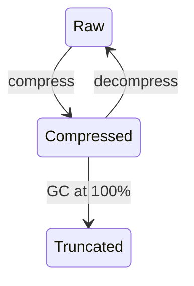

[English](./README.md) | [中文](./README.zh-CN.md)

<p align="center">
<strong>Active Context Pruning</strong> for <a href="https://opencode.ai">OpenCode</a>
<br />
The model decides <em>when</em> and <em>what</em> to compress — not a hard limit.
<br />
<strong>200K tokens is enough.</strong>
</p>

---

<p align="center">
<a href="https://www.npmjs.com/package/opencode-acp"></a>
<a href="https://github.com/ranxianglei/opencode-acp/blob/master/LICENSE"></a>
<a href="https://github.com/ranxianglei/opencode-acp"></a>
</p>

<p align="center">
<code>opencode plugin opencode-acp@latest --global</code>
</p>

---

## Why ACP

ACP hands all context-management authority to the model itself — not relying on
external models or any complex external mechanism to do context management. It
is, to date, the best context-management implementation on the market.

This brings two concrete effects:

- **200K tokens is enough.** Across 30,000+ API calls in 50 real engineering
  sessions, **97% of requests stayed under 200K tokens** — p90 at 150K, p95 at
  180K. Every API call re-bills the full context, so keeping context low directly
  reduces cost — even with a 90%+ prompt-cache hit rate, the non-cached portion
  is billed at full price.
- **It supports ultra-long sessions without losing key content** — observed at
  **3,300+ messages and 300M+ cumulative tokens** per session; architecturally
  supports up to **100,000 messages** (5-digit message-ID space).

---

## Proven at scale

Real engineering context, in practice.

**Across 6 active engineering sessions (11,000+ API calls), context p90 stays
at 150K–190K (15–19%), p95 at 160K–210K (16–21%) of the 1M window — with an
aggregate prompt-cache hit ratio of 91%.** (Why aggregate — not per-session —
matters is explained in [Impact on Prompt Caching](#impact-on-prompt-caching),
where it turns out to save far more tokens than traditional compression.)

| Session   | Duration    | Messages | API calls | Cumulative | Cache hit | Context p50 | Context p90 | Context p95 |
| --------- | ----------- | -------- | --------- | ---------- | --------- | ----------- | ----------- | ----------- |
| 0b89319b  | 230h (9.5d) | 3,344    | 2,796     | 339M       | 93%       | 108K (11%)  | 167K (17%)  | 210K (21%)  |
| 0a3be0cd  | 130h (5.4d) | 3,183    | 2,499     | 276M       | 91%       | 104K (10%)  | 145K (15%)  | 153K (15%)  |
| 0b2cd5a7  | 131h (5.4d) | 2,560    | 2,181     | 314M       | 91%       | 142K (14%)  | 191K (19%)  | 197K (20%)  |
| 08f2d501  | 37h (1.5d)  | 1,985    | 1,888     | 196M       | 95%       | 100K (10%)  | 156K (16%)  | 168K (17%)  |
| 1410c791† | 865h (36d)  | 1,279    | 1,100     | 218M       | 87%       | 132K (13%)  | 407K (41%)  | 427K (43%)  |
| 096cf8c4  | 72h (3d)    | 1,041    | 918       | 91M        | 89%       | 92K (9%)    | 148K (15%)  | 161K (16%)  |

† Bug-testing session; p95 is abnormally high. Excluding it, p95 stays ≤ 210K
across all other sessions.

(Context percentages are of the 1M window.)

---

## Installation

```bash
opencode plugin opencode-acp@latest --global
```

Or add to your opencode config:

```json
{
    "plugin": {
        "opencode-acp": "latest"
    }
}
```

---

## How It Works

ACP hands the context-compression tool directly to the model. The model is
**100% responsible** for context compression. The model's primary tools are
**compress** and **decompress**, supported by **acp_status** (context monitoring)
and **search_context** (search compressed content). A hardcoded 100% GC fallback
acts as a safety net when the context window is completely full.

### Lifecycle

Two operations: **compress** and **decompress**. Content loops between raw and
compressed. When context hits 100%, old-gen block summaries are truncated as
a last resort:



### Compression strategy

The system injects a prompt telling the model the current context ratio, the
compression ratio, whether context is idle, and compression suggestions. When the
trigger ratio is hit, content is compressed in **priority order**:

1. Agent/subagent review & consultation results (largest block of uncompressed content)
2. Verbose command output (build/test runs, git diff/log/status, directory listings)
3. Exploration that led nowhere (failed approaches, dead-end searches)
4. Redundant tool results (reading the same file repeatedly, repeated status checks)
5. Intermediate steps of completed multi-step tasks
6. Resolved discussion threads (once a decision is recorded)
7. Large file contents already used

After compression, the original content is replaced by a short **block** that
references the original (recoverable via `decompress`).

### Decompression strategy

The model decides when to decompress. When the context is large enough to
interfere with the model's self-attention, short blocks lead the model to compress
some content first, handle the urgent matter, then decompress what it needs in
later work.

### GC safety net

When context reaches 100%, the system automatically truncates old-gen block summaries to prevent overflow. This is a last-resort safety net and does not interfere with the model's normal compress/decompress operations.

---

## Impact on Prompt Caching

Historically, ACP has fixed many of the low-cache-hit-rate problems caused by
DCP. The overall cache hit rate is now **~91%**.

Compared to traditional compression — which only compresses at 80–90% and, once it
compresses, forces 100% of the context to re-hit — ACP's hit rate is effectively
higher.

Additionally, ACP keeps total context around **~10–15% most of the time** (p50
100K, p90 150K of the 1M window), versus the traditional **50–80%**. So total
token savings are far higher than traditional compression.

**Conclusion:** ACP simultaneously raises the overall cache hit rate **and**
ensures key context information is not lost.

---

## Commands

ACP provides an `/acp` slash command (also accepts `/dcp` for backward compatibility):

| Command                 | Description                                                                                                                                |
| ----------------------- | ------------------------------------------------------------------------------------------------------------------------------------------ |
| `/acp`                  | Shows available ACP commands                                                                                                               |
| `/acp context`          | Token usage breakdown by category (system, user, assistant, tools, etc.) and how much has been saved through pruning                       |
| `/acp stats`            | Cumulative pruning statistics across all sessions                                                                                          |
| `/acp sweep [n]`        | Prunes all tools since the last user message. Optional count: `/acp sweep 10` prunes the last 10 tools. Respects `commands.protectedTools` |
| `/acp manual [on\|off]` | Toggle manual mode. When on, the AI will not autonomously use context management tools                                                     |
| `/acp compress [focus]` | Trigger a single compress tool execution. Optional focus text directs what content to compress, following the active `compress.mode`       |
| `/acp decompress <n>`   | Restore a specific active compression by ID. Running without an argument shows available compression IDs, token sizes, and topics          |
| `/acp recompress <n>`   | Re-apply a user-decompressed compression by ID. Running without an argument shows recompressible IDs, token sizes, and topics              |

---

## Configuration

ACP uses its own config file, searched in order:

1. **Global:** `~/.config/opencode/acp.jsonc` (or `acp.json`), created automatically on first run
2. **Custom config directory:** `$OPENCODE_CONFIG_DIR/acp.jsonc` (or `acp.json`), if `OPENCODE_CONFIG_DIR` is set
3. **Project:** `.opencode/acp.jsonc` (or `acp.json`) in your project's `.opencode` directory

If no `acp.jsonc` is found, ACP falls back to `dcp.jsonc` / `dcp.json` (for backward compatibility with existing DCP installations) and auto-migrates on first write.

Each level overrides the previous, so project settings take priority over global. Restart OpenCode after making config changes.

> [!IMPORTANT]
> **Disable OpenCode's built-in auto-compaction.** ACP handles context management itself — OpenCode's compaction conflicts with ACP and can cause issues (re-expanded messages, lost compression state). Add to your `opencode.json`:
>
> ```jsonc
> {
>     "compaction": {
>         "auto": false,
>     },
> }
> ```
>
> Or set the environment variable: `OPENCODE_DISABLE_AUTOCOMPACT=1`

> [!NOTE]
> If you use models with smaller context windows, such as GitHub Copilot models or local models, lower `compress.minContextLimit` and `compress.maxContextLimit` in your configuration to match the available context.

<details>
<summary><strong>Default Configuration</strong> (click to expand)</summary>

```jsonc
{
    "$schema": "https://raw.githubusercontent.com/ranxianglei/opencode-acp/master/dcp.schema.json",
    // Enable or disable the plugin
    "enabled": true,
    // Automatically update npm-installed ACP when a newer npm latest is available.
    // Version-locked plugin specs are not updated.
    "autoUpdate": true,
    // Enable debug logging to ~/.config/opencode/logs/acp/
    "debug": false,
    // Notification display: "off", "minimal", or "detailed"
    "pruneNotification": "detailed",
    // Notification type: "chat" (in-conversation) or "toast" (system toast)
    "pruneNotificationType": "chat",
    // Slash commands configuration
    "commands": {
        "enabled": true,
        // Additional tools to protect from pruning via commands (e.g., /acp sweep)
        "protectedTools": [],
    },
    // Manual mode: disables autonomous context management,
    // tools only run when explicitly triggered via /acp commands
    "manualMode": {
        "enabled": false,
        // When true, automatic cleanup (deduplication, purgeErrors)
        // still runs even in manual mode
        "automaticStrategies": true,
    },
    // Protect from pruning for <turns> message turns past tool invocation
    "turnProtection": {
        "enabled": false,
        "turns": 4,
    },
    // Experimental settings
    "experimental": {
        // Allow ACP processing in subagent sessions
        "allowSubAgents": false,
        // Enable user-editable prompt overrides under dcp-prompts directories
        // When false (default), prompt override files/directories are ignored
        "customPrompts": false,
    },
    // Protect file operations from pruning via glob patterns
    // Patterns match tool parameters.filePath (e.g. read/write/edit)
    "protectedFilePatterns": [],
    // Unified context compression tool and behavior settings
    "compress": {
        // Compression mode: "range" (compress spans into block summaries)
        // or experimental "message" (compress individual raw messages)
        "mode": "range",
        // Permission mode: "allow" (no prompt), "ask" (prompt), "deny" (tool not registered)
        "permission": "allow",
        // Show compression content in a chat notification
        "showCompression": true,
        // Let active summary tokens extend the effective maxContextLimit
        "summaryBuffer": true,
        // Soft upper threshold: above this, ACP keeps injecting strong
        // compression nudges (based on nudgeFrequency), so compression is
        // much more likely. Accepts: number or "X%" of model context window.
        "maxContextLimit": "55%",
        // Soft lower threshold for reminder nudges: below this, turn/iteration
        // reminders are off (compression less likely). At/above this, reminders
        // are on. Accepts: number or "X%" of model context window.
        "minContextLimit": "45%",
        // Optional per-model override for maxContextLimit by providerID/modelID.
        // If present, this wins over the global maxContextLimit.
        // Accepts: number or "X%".
        // Example:
        // "modelMaxLimits": {
        //     "openai/gpt-5.3-codex": 120000,
        //     "anthropic/claude-sonnet-4.6": "80%"
        // },
        // Optional per-model override for minContextLimit.
        // If present, this wins over the global minContextLimit.
        // "modelMinLimits": {
        //     "openai/gpt-5.3-codex": 50000,
        //     "anthropic/claude-sonnet-4.6": "25%"
        // },
        // How often the context-limit nudge fires (1 = every fetch, 5 = every 5th)
        "nudgeFrequency": 5,
        // Start adding compression reminders after this many
        // messages have happened since the last user message
        "iterationNudgeThreshold": 15,
        // Controls how likely compression is after user messages
        // ("strong" = more likely, "soft" = less likely)
        "nudgeForce": "soft",
        // Tool names whose completed outputs are appended to the compression
        "protectedTools": [],
        // Preserve text wrapped in <protect>...</protect> when compressed
        "protectTags": false,
        // Preserve your messages during compression.
        // Warning: large copy-pasted prompts will never be compressed away
        "protectUserMessages": false,
    },
    // Automatic pruning strategies
    "strategies": {
        // Remove duplicate tool calls (same tool with same arguments)
        "deduplication": {
            "enabled": true,
            // Additional tools to protect from pruning
            "protectedTools": [],
        },
        // Prune tool inputs for errored tools after X turns
        "purgeErrors": {
            "enabled": true,
            // Number of turns before errored tool inputs are pruned
            "turns": 4,
            // Additional tools to protect from pruning
            "protectedTools": [],
        },
    },
    // Garbage collection — hardcoded 100% fallback only
    "gc": {
        "algorithm": "truncate",
        // young → old generation promotion after this many survivals
        "promotionThreshold": 5,
        // deactivate a block after this many survivals
        "maxBlockAge": 15,
        // truncate old-gen summaries exceeding this length (chars)
        "maxOldGenSummaryLength": 3000,
        // run major GC when context usage exceeds this (hardcoded, not configurable)
        "majorGcThresholdPercent": "100%",
    },
}
```

</details>

### Prompt Overrides

ACP exposes six editable prompts:

- `system`
- `compress-range`
- `compress-message`
- `context-limit-nudge`
- `turn-nudge`
- `iteration-nudge`

This feature is disabled by default. Set `experimental.customPrompts` to `true` in your ACP config to activate it.

When enabled, managed defaults are written to `~/.config/opencode/acp-prompts/defaults/` as plain-text prompt files. A single `README.md` in that directory explains each prompt and how to create overrides.

To customize behavior, add a file with the same name under an overrides directory and edit it as plain text.

To reset an override, delete the matching file from your overrides directory.

### Protected Tools

By default, these tools are always protected from pruning:
`task`, `skill`, `todowrite`, `todoread`, `compress`, `decompress`, `batch`, `plan_enter`, `plan_exit`, `write`, `edit`

The `protectedTools` arrays in `commands` and `strategies` add to this default list.

For the `compress` tool, `compress.protectedTools` ensures specific tool outputs are **hard-excluded** from compression ranges (v1.10.0+). When the model compresses a range that includes a protected tool message, that message survives intact in visible context — only the surrounding non-protected messages are compressed. By default `compress.protectedTools` includes only `skill` — this is sufficient in practice, as skill outputs are the one tool type whose content must never be lost to compression.

---

## Migrating from DCP

ACP is a drop-in replacement for DCP. To migrate:

1. Remove the old DCP plugin from your `opencode.json`
2. Install ACP: `opencode plugin install opencode-acp@latest --global`
3. Restart OpenCode

**What's preserved:**

- Session state (compression blocks, message ID mappings) -- auto-migrated from `plugin/dcp/` to `~/.local/share/opencode/storage/plugin/acp/`
- Config file `~/.config/opencode/dcp.jsonc` -- ACP auto-migrates to `acp.jsonc`
- Prompt overrides in `~/.config/opencode/dcp-prompts/` -- auto-migrates to `acp-prompts/`

**What changes:**

- Storage directory: `plugin/dcp/` to `plugin/acp/` (auto-migrated on first launch)
- Log directory: `logs/dcp/` to `logs/acp/`
- Slash command: `/dcp` to `/acp` (both work for backward compatibility)
- Notification headers: `DCP` to `ACP`
- Context usage label: `DCP threshold` to `ACP threshold`

ACP auto-migrates config from `dcp.jsonc` to `acp.jsonc` and prompts from `dcp-prompts/` to `acp-prompts/` on first launch.

---

<details>
<summary><strong>Bug Fixes (39 total)</strong> -- applied on top of DCP v3.1.11</summary>

| #      | Severity | Summary                                                                                                                                                                                                                                |
| ------ | -------- | -------------------------------------------------------------------------------------------------------------------------------------------------------------------------------------------------------------------------------------- |
| 1      | CRITICAL | State not persisted across restarts -- messageIds, block deactivation, save errors silently lost                                                                                                                                       |
| 2      | CRITICAL | resetOnCompaction() clears all compression blocks -- undoes all pruning work                                                                                                                                                           |
| 3      | CRITICAL | prune silently drops summary -- DATA LOSS when no user message precedes anchor                                                                                                                                                         |
| 4      | CRITICAL | getCurrentTokenUsage returns 0 -- prevents nudge from ever triggering                                                                                                                                                                  |
| 5      | HIGH     | loadPruneMessagesState duplicates activeBlockIds + reasoning-strip undefined guard                                                                                                                                                     |
| 6      | HIGH     | Synthetic summary messages get mNNNN refs but are invisible to boundary lookup                                                                                                                                                         |
| 7      | HIGH     | State not persisted across restarts -- messageIds, block deactivation, and save errors silently lost                                                                                                                                   |
| 8      | HIGH     | isMessageCompacted() inconsistent with compaction summary message handling                                                                                                                                                             |
| 9      | HIGH     | Compressed block summaries retain stale mNNNN message ID tags -- model copies stale IDs                                                                                                                                                |
| 10     | HIGH     | Model uses stale mNNNN IDs from nudges/summaries -- compress fails with "startId not available"                                                                                                                                        |
| 11     | HIGH     | Major GC skips legacy blocks without generation field -- oversized blocks never collected                                                                                                                                              |
| 12     | HIGH     | Percentage-based thresholds calculated against effective input context instead of full model context window                                                                                                                            |
| 13     | HIGH     | Context window leaks -- compressed messages reappear after /compact                                                                                                                                                                    |
| 14     | HIGH     | Compression notifications write full block summaries to DB -- can reach 150KB+ per notification                                                                                                                                        |
| 15     | HIGH     | npm auto-install overwrites fork with upstream package                                                                                                                                                                                 |
| 16     | HIGH     | Summary mNNNN refs in compress output -- model copies stale message IDs                                                                                                                                                                |
| 17     | HIGH     | Synthetic messages not in messageIdToBlockId -- compress fails to find them                                                                                                                                                            |
| 18     | HIGH     | Compress stops model from responding after compression completes                                                                                                                                                                       |
| 19     | HIGH     | Dynamic block guidance breaks API prefix cache                                                                                                                                                                                         |
| 20     | HIGH     | GC never deactivates old blocks -- dead-weight accumulates indefinitely                                                                                                                                                                |
| 21     | HIGH     | Logger + tokenizer 20-50s per-turn latency (268x slowdown)                                                                                                                                                                             |
| 22     | HIGH     | compress throws hard error on reversed block boundaries -- model gives up                                                                                                                                                              |
| 23--34 | MEDIUM   | Various fixes for dedup, purge errors, schema validation, hook timing, etc.                                                                                                                                                            |
| 35     | HIGH     | Aging warnings shown at low context usage (<50%) -- triggers unnecessary compress, wastes tokens                                                                                                                                       |
| 36     | HIGH     | Compression summary emitted as a standalone user message before the user's real turn -- model reads its own prior assistant output as user input, causing dialog role confusion / self-Q&A loops                                       |
| 37     | HIGH     | Message-transform pipeline runs on OpenCode's hidden title/summary/compaction agent requests -- corrupts the request and shared session state, breaking session title generation                                                       |
| 38     | CRITICAL | pruneToolOutputs/pruneToolInputs/pruneToolErrors mutate existing messages in-place -- invalidates LLM prefix cache, causing 89% of fresh input tokens to be wasted on cache-invalidating re-sends                                      |
| 39     | HIGH     | Protected tool outputs (skill/task/todowrite) only soft-protected during compression -- appended to summary then pruned from context, losing semantic authority and susceptible to GC truncation. Fixed with hard-exclusion in v1.10.0 |

For the complete list with root cause analysis, see the [bug tracker](https://github.com/ranxianglei/opencode-acp/issues).

</details>

---

## Changelog

### v1.12.11 — README Refresh (PR #164)

**Problem**: README documentation had drifted from code reality. The tagline under-emphasized ACP's core capability. The "Deletion strategy" section in the English README described a feature that no longer exists and contradicted the Chinese version. Cache hit rate and context usage statistics were stale (87%, ~30%). The `compress.protectedTools` default was documented as 5 tools (`task, skill, todowrite, todoread, decompress`) when the actual code default is only `skill`.

**Fix**: (1) Added `<strong>200K tokens is enough.</strong>` tagline alongside the existing one-liner. (2) Refreshed "Proven at scale" table with real API-level data from 6 active sessions (Duration, Messages, API calls, Cumulative tokens, Cache hit %, P50/P90/P95 context), with outlier annotated. Aggregate cache hit ~91%. (3) Replaced "Deletion strategy" section (EN) with "GC safety net" matching the Chinese version. (4) Updated "How It Works" to list `acp_status` and `search_context` as supporting tools. (5) Updated cache stats: 87% → 91%, context ~30% → ~10–15% (p50 100K, p90 150K of 1M window). (6) Corrected `compress.protectedTools` default documentation to `skill` only (matches `COMPRESS_DEFAULT_PROTECTED_TOOLS` at `lib/config.ts:121`).

Files: `README.md`, `README.zh-CN.md`. No code changes. Tests: 768 pass (unchanged).

### v1.12.10 — Batch Compress + Decompress Range Mode + GC Memory-Loss Fix + Token Classification + Nudge Quality (PRs #73, #155, #156, #157, #158, #159, #161)

**Problem**: Seven issues across compression UX, token accounting, GC safety, and nudge quality. (1) `decompress` required a per-block `acp_status` → decompress-per-block loop to restore multiple compressed blocks. (2) Since v1.12.9 (compress-as-anchor), compress tool `summary` content was misclassified as `toolTokens` instead of `summaryTokens`, inflating tool% and deflating summary% in the context breakdown. (3) The `compress` tool only accepted a single range per call — the model had to issue multiple calls to compress unrelated ranges, wasting turns. (4) The `[PROTECTED: ...]` label listed every tool in a protected message instead of only the triggering tools. (5) When all visible content was protected, the nudge still fired with an empty recommendation list. (6) When a nudge was suppressed, the next-turn check re-evaluated every turn. (7) **The GC system was silently destroying model-written summaries**: any block with `summary.length > 6000` chars was force-truncated to 3000 regardless of context pressure (0% pressure triggered truncation), and blocks with high `survivedCount` were auto-deactivated — causing irrecoverable memory loss across hundreds of sessions.

**Fix**: (1) **PR #73** — Added optional `startId`/`endId` to `decompress` schema; range mode batch-restores every active block whose `effectiveMessageIds` overlaps the resolved range. (2) **PR #155** — In `estimateContextComposition`, when `toolName === "compress"`, extract `summary` text and classify it as `summaryTokens`. (3) **PR #156** — The `compress` tool now accepts a `content` array of `{ topic, startId, endId, summary }` entries, allowing the model to compress multiple unrelated ranges in a single call with per-entry topics. (4) **PR #157** — `buildCompressibleRanges` only adds tools that actually trigger protection. (5) **PR #158** — Added `allProtected` check to suppress nudges when there's genuinely nothing to compress. (6) **PR #159** — When a nudge is suppressed, advance `lastPerMessageNudgeTokens` to `currentTokens` for discrete 5% check intervals. (7) **PR #161** — Removed the GC oversized-block override (`hasOversizedBlocks` bypass that truncated at 0% context) and the age-based deactivation loop entirely. Truncation now only fires at `majorGcThresholdPercent` (default 100%). `gc.maxBlockAge` is now a no-op. Aging warning threshold raised from 50% to 90% context to stop misleading the model.

Files: `lib/hooks.ts`, `lib/config.ts`, `lib/prompts/extensions/nudge.ts`, `lib/compress/decompress.ts`, `lib/compress/decompress-logic.ts`, `lib/messages/inject/utils.ts`, `lib/messages/inject/inject.ts`. Tests: 758 pass.

### v1.12.9 — Compress-as-Anchor (PR #153)

**Problem**: Since v1.12.1, compression summaries were injected as synthetic tool-result messages via a registered `acp_context_recap` tool, while `stripStaleCompressCalls` removed past `compress` tool calls from the API context to avoid duplication. This doubled summary overhead: each block's summary existed both as a synthetic recap message AND in the original (now-stripped) compress call's `summary` parameter. For sessions with many compressions, this "recap overhead" consumed 10–20% of context with no additional information value. The `acp_context_recap` tool description also claimed it "automatically injects" summaries, which was misleading.

**Fix**: Removed the synthetic recap injection entirely. Compression summaries now live **inside the model's own past `compress` tool calls** — the `summary` parameter of each historical `compress({ summary: "..." })` call serves as the anchor, visible to the model like any other tool call. Deleted `createSyntheticToolRecap` (prune.ts), `stripStaleCompressCalls` (prune.ts), and the automatic recap injection path. The `acp_context_recap` tool is now manual-only (model-callable for re-fetching summaries that scrolled out of context). Updated `system.ts` prompt to describe compress-as-anchor behavior and warn against reusing historical `startId`/`endId` without `acp_status` verification. Updated `RECAP_TOOL_DESCRIPTION` to reflect manual-only usage. Net effect: ~50% reduction in summary overhead for compression-heavy sessions.

Files: `lib/messages/prune.ts`, `lib/messages/utils.ts`, `lib/compress/recap.ts`, `lib/prompts/system.ts`. Tests: updated for compress-anchor behavior; 725 pass.

### v1.12.8 — Phantom Block Rejection (PR #148)

**Problem**: When the model called `compress` on a range that was already covered by an active compression block, `applyCompressionState` still created a new block with `directMessageIds: []`, `compressedTokens: 0`, and `effectiveMessageIds` inherited from the consumed block. The model saw "0 tokens removed" in the notification, retried the same range, and entered a death loop: each phantom block added ~1K of summary overhead while compressing nothing, causing context to _grow_ with every compression call (issues #93, #135). User sessions showed 9 consecutive phantom compressions (b12–b20) on the same range before the user manually intervened.

**Fix**: Added `checkPhantomBlock()` — a stateless pre-check in `lib/compress/pipeline.ts` that mirrors `applyCompressionState`'s `newlyCompressedMessageIds` computation. For each plan, it builds the effective message set (plan messages + consumed blocks' effective messages) and checks whether ANY message is "new" (i.e., has no active block covering it BEFORE mutation). If no message is new, the plan is a phantom and the entire compress call is rejected with a clear error before any state mutation occurs. Wired into both range-mode (`compress/range.ts`) and message-mode (`compress/message.ts`) after plan preparation, before snapshot. 12 tests cover: empty plans, all-new messages, consumed-block inheritance, GC'd messages (deactivated blocks count as new), and the exact `applyCompressionState` mirroring.

Files: `lib/compress/pipeline.ts`, `lib/compress/range.ts`, `lib/compress/message.ts`. Tests: `tests/phantom-block.test.ts` (NEW, 12 tests). 725 tests pass.

### v1.12.7 — Smart Recommendation Filter + Dangerous Parameter + Ref-Leak Fix + Phantom Turn Fix (PRs #142, #147, #150)

**Problem**: Four issues. (1) The recommendation filter used a hardcoded 5× growth threshold for single-message ranges (25% of context), leaked context, showed tiny ranges, and contradicted itself by recommending the last segment while blocking it. (2) Nudge text was injected even when the filter suppressed all ranges — wasting context with an empty recommendation list. (3) Compression block metadata leaked message refs (`m01309–m02150`) via `acp_context_recap` tool input, `acp_status` output, and `recap` tool output — the model copied these into compress calls on already-compressed ranges, creating phantom blocks (#93, #135). (4) `sendIgnoredMessage` during the transform hook persisted an ignored user message that resolved async after the model's response — the loop's `lastUser` detection picked it up → phantom LLM call with no new input → confusion → hallucination → feedback loop ("待命" spam).

**Fix**: (1) Rewrote `filterRecommendedRanges`: last segment excluded if < 2× growth threshold; included with `dangerous: true` flag if ≥ 2×. Stateless `dangerous?: boolean` parameter on compress tool schema replaces state-tracking soft-block. Net −70 lines. (2) Suppress nudge text injection when filter has no recommendations. (3) Stopped leaking message refs: `acp_context_recap` tool input now shows `messages: <count>` instead of `range: "(mN–mN)"`; `acp_status` and `recap` tool output show `N msgs` instead of ref ranges. (4) Debug nudge notification uses `client.tui.showToast()` (transient, non-persisting) + `logger.debug()` (file log) instead of `sendIgnoredMessage` — breaks the phantom-turn feedback loop entirely. `dev-deploy.sh` auto-bumps version above npm latest to prevent overwrite on restart.

Files: `lib/messages/inject/utils.ts`, `lib/messages/inject/inject.ts`, `lib/compress/pipeline.ts`, `lib/compress/range.ts`, `lib/compress/message.ts`, `lib/messages/prune.ts`, `lib/messages/utils.ts`, `lib/compress/recap.ts`, `lib/compress/status.ts`, `lib/ui/notification.ts`, `lib/prompts/system.ts`, `lib/hooks.ts`, `scripts/dev-deploy.sh`. Tests: 725 pass.

### v1.12.6 — Stale contextLimitAnchors Fix (PR #143)

**Problem**: `contextLimitAnchors` were populated when `overMaxLimit=true` but only cleared on a compress tool call in the current turn (`currentTurnHasCompress`). If context dropped below `maxLimit` via another mechanism (OpenCode compaction, external message deletion), the anchors stayed stale → `applyAnchoredNudges` kept injecting the "⚠️ Context limit reached" template at low context levels (as low as 10% usage).

**Fix**: Added `else` branch in `lib/messages/inject/inject.ts` that clears `contextLimitAnchors` whenever `!overMaxLimit`, establishing symmetry with the existing turn/iteration anchor cleanup at `!overMinLimit`. 3 regression tests (state-level clear, integration with prompt markers, sub-minLimit clear path). Dual-agent reviewed (Oracle + independent reviewer, both APPROVE).

Files: `lib/messages/inject/inject.ts`. Tests: `tests/inject.test.ts`. 691 tests pass.

### v1.12.5 — Bug 20 Suppression Fix + Growth Floor Gate Correction (PRs #139, #140)

**Problem**: Two bugs in the nudge suppression logic introduced after v1.12.4. (1) `isContextOverLimits` Bug 20 suppression checked `(part as any).type === "tool-invocation" && (part as any).toolInvocation?.toolName === "compress"` — a message-part format that does not exist in the SDK (all 18+ other tool-type checks in the codebase use `part.type === "tool" && part.tool === "compress"`). The suppression never matched, so `overMaxLimit` was never set to `false` after a compress call → the max-limit alert fired every turn → over-compression feedback loop. (2) The growth floor gate (PR #134) made `growthFloor` the sole gate for `nudgeAllowed`, dropping the `decision.shouldNudge` requirement — meaning nudges could fire on negative growth as long as the growth floor condition was met.

**Fix**: (1) PR #139: Changed the format check to `part.type === "tool" && part.tool === "compress"` and removed the `(part as any)` casts. Suppression now correctly detects compress tool calls in recent messages and resets `overMaxLimit`. (2) PR #140: `nudgeAllowed` now requires `decision.shouldNudge || emergencyOverride`, restoring the intended two-condition gate.

Files: `lib/messages/inject/utils.ts` (Bug 20 fix), `lib/messages/inject/inject.ts` (growth floor correction). 688 tests pass.

### v1.12.4 — Protection-Aware Stats + Nudge Ranges Fix + Growth Floor Gate (PRs #132, #133, #134)

**Problem**: Three issues since v1.12.3. (1) `buildCompressibleRanges` and `estimateContextComposition` listed ALL messages as compressible, silently including protected tool output — the model saw inflated ranges, compressed, and most content was filtered out → ineffective compression with confusing stats. (2) When nudge anchors were active (context over minLimit) but growth was below the cadence threshold, the nudge text fired but the compressible ranges list was gated by growth cadence → model saw "compress now" with no ranges. (3) After fixing #2, the model could be nudged every turn (turn anchors re-add every turn) → thrashing risk.

**Fix**: (1) PR #132: `buildCompressibleRanges`, `estimateContextComposition`, and `acp_status` now skip protected tools/files. Per-range protected detail with mixed compressible+protected display. (2) PR #134: Broadened nudge output to fire when anchors active regardless of growth cadence. (3) PR #134: Added growth floor gate — nudges suppressed unless context grew by `max(minNudgeGrowthFloor, minNudgeGrowthRatio × nudgeGrowthTokens)` tokens since last nudge, with emergency override at `emergencyThresholdPercent` (98%). Also raised `minCompressRange` default 2000→5000. PR #133: `getCurrentTokenUsage` accepts input-only token data (output=0 fix). Oracle-reviewed.

Files: `lib/messages/inject/inject.ts`, `lib/messages/inject/utils.ts`, `lib/compress/status.ts`, `lib/config.ts`, `lib/config-validation.ts`, `lib/token-utils.ts`, `dcp.schema.json`. Tests: `tests/inject.test.ts`, `tests/config-validation.test.ts`, `tests/protection-aware-stats.test.ts`, `tests/token-counting.test.ts`. 688 tests pass.

### v1.12.3 — Regex Tag Fragment Leak Fix (PR #130)

**Problem**: Three regexes in `lib/messages/utils.ts` had missing opening-tag `<` and tag-name matchers, causing ACP internal XML tag fragments and stale message IDs to leak into user-visible chat after multiple compression rounds (issue #123).

**Fix**: (1) `DCP_PAIRED_TAG_REGEX` (line 14): `]*>` matched any `>` char → fixed to `<(?:dcp|acp)[^>]*>`. (2) `DCP_BLOCK_ID_TAG_REGEX` (line 11): `(])` required literal `]` → `replaceBlockIdsWithBlocked` was a complete no-op → fixed to `(<(?:dcp|acp)-message-id[^>]*>)`. (3) `DCP_MESSAGE_REF_TAG_REGEX` (line 13): matched only `m\d+</closing>` → left `<dcp-message-id ...>` opening tag fragments → fixed to include opening tag. Supersedes PR #124.

Files: `lib/messages/utils.ts`. Tests: `tests/regex-tag-leak.test.ts` (NEW, 23 tests). 666 tests pass.

### v1.12.2 — Compress Failure Rollback + Sync Carve-out Removal (PR #126)

**Problem**: Two bugs in post-compression-failure handling (issue #125). (1) The compress tool mutated in-memory state incrementally with no try/catch — if anything threw between the first `applyCompressionState` and `finalizeSession`, "ghost blocks" (active blocks never persisted) hid messages on subsequent transforms. (2) `syncCompressionBlocks` had a carve-out that kept blocks active when the anchor was missing from messages but tracked in `byMessageId`. This carve-out was intended for ACP-hidden anchors, but sync runs on the raw message list (before filtering), so it only triggered for externally-deleted anchors → messages hidden without recap injection → empty LLM requests.

**Fix**: (1) Added `snapshotCompressionState()` / `restoreCompressionState()` to `lib/compress/pipeline.ts` using `structuredClone`. Wrapped the mutation phase in try/catch in both `lib/compress/range.ts` and `lib/compress/message.ts`. On failure, state (including `manualMode`) is restored to the pre-mutation snapshot — no ghost blocks. (2) Removed the carve-out in `lib/messages/sync.ts`. When anchor is gone from messages, always deactivate the block. Oracle-reviewed.

Files: `lib/messages/sync.ts`, `lib/compress/pipeline.ts`, `lib/compress/range.ts`, `lib/compress/message.ts`. Tests: `tests/sync.test.ts` (updated), `tests/compress-rollback.test.ts` (NEW, 4 tests). 643 tests pass.

### v1.12.1 — Compression Recap Injection Fix + Stale Compress Stripping (PR #119)

**Problem**: `acp_context_recap` was used to create synthetic tool-result recap messages but was NOT registered as a real tool — providers could strip/convert unregistered tool-results, causing the model to see compression summaries as plain text or user messages (echo/drift bugs). Additionally, compress tool-call inputs duplicated block recap content in context.

**Fix**: Register `acp_context_recap` as a real tool (`lib/compress/recap.ts`) so providers properly serialize tool-results. Add `stripStaleCompressCalls` (`lib/messages/prune.ts`) to remove compress tool-call parts from previous turns. Also fixes: KEEP/REF regex normalization (`m150` → `m00150`), `resolveKeepMarkers` in message mode, toast notification `replace()` failure, notification range display (`→ Range: b20: m00150–m00155`), proportional baseline adjustment after compress, and reverts the problematic `postCompressRangesShown` feature.

Files: `lib/compress/recap.ts` (NEW), `lib/messages/prune.ts`, `lib/compress/keep-markers.ts`, `lib/compress/message.ts`, `lib/messages/inject/inject.ts`, `lib/ui/notification.ts`. Tests: `tests/strip-stale-compress.test.ts` (NEW, 7 tests). Oracle-reviewed.

### v1.12.0 — Baseline Leak Fix + KEEP/REF Markers + Compressible Ranges (PR #115)

Comprehensive fix for issue #23 (context memory leak). 7 commits, 22 files, 851 insertions, 327 deletions.

**Baseline Leak Fix**: After compress, the model continues working in the same turn, inflating context from ~78K to ~150K. Each transform re-established the nudge baseline to the inflated value, leaking 72K of headroom. Fix: `compressBaselineSet` lock flag sets baseline only on the first post-compress transform; turn-wide compress scan (`messages.slice(currentTurnStart).some(...)`) replaces last-message-only check.

**KEEP/REF Markers**: Models over-summarize because they can't precisely retype large content. `[[KEEP:mNNNNN]]` auto-expands original message content inline (truncated to 2000 chars). `[[REF:mNNNNN|desc]]` creates compact links. Resolution runs after summary finalization, before wrapping.

**Compressible Ranges**: Replaces size-based "Largest code/text messages" listing with need-based ranges grouped by conversation turn. Shows ALL ranges with gap detection (no ranges spanning compressed holes). The nudge now says "compress ALL listed ranges" instead of recommending specific large items.

**Compression Philosophy (5 bullets)**: Need-based guidance replacing size-based recommendations — compress by need not by percentage, work from summaries not raw outputs, curate with KEEP/REF for critical content.

**Other fixes**: Removed `toolOutputReminder` (bypassed adaptive threshold, caused over-compression); `acp_status` default = compressible ranges view; debug nudge (`config.debug` → terminal output); `baselineCorrected` persistence fix; Bug 14 cap (detailed notification: 10K chars); system prompt 5 fixes; multi-block notification empty summary fix. Oracle reviewed.

Files: `lib/messages/inject/inject.ts`, `lib/compress/keep-markers.ts`, `lib/messages/inject/utils.ts`, `lib/compress/status.ts`, `lib/prompts/compression-rules.ts`, `lib/prompts/system.ts`, `lib/state/`, `lib/ui/notification.ts`, `lib/hooks.ts`. Tests: 630 pass.

---

### v1.11.4 — Baseline Persistence Fix + Unified Release Workflow (PR #112, #113)

**Bug fix (PR #112)**: After compress sets `lastPerMessageNudgeTokens = undefined`, the next transform re-establishes the baseline in memory but never persists it to disk (save condition was false). After restart, nudges break again. Fix: added `baselineReEstablished` flag to save condition. Also fixed async save race condition in `writePersistedSessionState` (file path resolved after `await`).

**CI fix (PR #113)**: Merged `auto-tag.yml` + `release.yml` into single workflow. GitHub Actions `GITHUB_TOKEN` cannot trigger chained workflows — the tag pushed by `auto-tag.yml` didn't fire `release.yml`.

Files: `lib/messages/inject/inject.ts`, `lib/state/persistence.ts`. Tests: `tests/inject.test.ts` (+94 lines, 2 new E2E tests).

---

### v1.11.3 — Auto-Tag on Release Branch Merge (PR #111)

**Problem**: After merging a release PR, the version tag (`v{VERSION}`) still had to be pushed manually — easy to forget.

**Fix**: Added `auto-tag.yml` workflow. When a `YYYY-MM-DD_release-v*` branch is merged to master, CI automatically reads `package.json` version, creates the tag, and pushes it. The tag push then triggers `release.yml` for auto-publish. Normal (non-release) branches that accidentally change the version are ignored.

Files: `.github/workflows/auto-tag.yml`. AGENTS.md Section 5.4 updated.

---

### v1.11.2 — CI Enforcement & Auto-Publish (PR #104)

Added GitHub Actions CI to automate AGENTS.md compliance enforcement:

- **PR validation** (`pr-checks.yml`): every PR to master is checked for branch name convention (`YYYY-MM-DD_short-title`), devlog existence (`devlog/{branch}/REQ.md` + `WORKLOG.md`), and changelog updates on version bumps.
- **Auto-publish** (`release.yml`): pushing a `v*` tag triggers `npm ci` → `npm run check:package` → `npm test` → `npm publish` → GitHub Release, fully automated.
- Script: `scripts/ci/check-pr.sh` — reusable PR validation logic.

Requires `NPM_TOKEN` secret in GitHub repo settings.

---

### v1.11.1 — Compress Baseline Fix (PR #99)

**Problem**: When the model called `compress`, both `lastPerMessageNudgeTokens` and `lastToolOutputNudgeTokens` were set to `currentTokens` — the token count from the compress-calling assistant message, which reflects **pre-compression** context. After compressing 100K→50K, the baseline was stuck at 100K, so `growth = 50K - 100K = -50K` and nudges never fired again.

**Fix**: Both baselines are now set to `undefined` on compress detection. The next message-transform run re-establishes the baseline from the real post-compression API token count, without triggering a nudge (`computeShouldNudge` returns `shouldNudge: false` when baseline is `undefined`).

Files: `lib/messages/inject/inject.ts` (line 98-99). Tests: `tests/inject.test.ts` — 3 updated + 2 new (621 total, 0 fail).

---

### v1.11.0 — Tool-Result Recap Injection, Context Breakdown & Fork Rebuild

This release fixes two critical compression-injection bugs (#20 echo, #78 drift), adds a visible context breakdown to `acp_status`, and introduces a fork-rebuild mechanism.

#### Tool-Result Recap Injection — Fixes #20 & #78 (PR #95)

**Problem**: Compression summaries were injected as text-based `role:assistant` or `role:user` messages. Both roles misled the model:

- `role:assistant` (Bug 37 path) → model treated summaries as its own prior output and echoed them verbatim (#20, GLM-5.2).
- `role:user` (Bug 36 merge path) → model treated summaries as user instructions and chased old topics (#78, gpt-5.5).

**Fix**: Summaries are now injected as synthetic **tool-call + tool-result** pairs via `acp_context_recap`. At the API level, the model sees `role:"tool"` — a neutral third role meaning "data from a tool", neither instruction nor own voice. This eliminates both echo (#20) and drift (#78) without breaking prefix caching (mid-stream injection, system prompt unchanged) and works across all providers (OpenAI `role:"tool"`, Anthropic `tool_result` content type).

Files: `lib/messages/utils.ts` (`createSyntheticToolRecap`), `lib/messages/prune.ts` (single-path injection), `lib/messages/query.ts` (`isSyntheticMessage` recognizes `msg_acp_recap_` prefix), `lib/prompts/system.ts` (updated tool description). Removed dead code: `prependCompressionSummary`, `MERGED_SUMMARY_HEADER/FOOTER`, `[ACP system message]` notification wrapper.

Tests: 600 total (10 updated for tool-result format + 1 new multi-block test). TypeScript: 0 errors. Dual-agent reviewed.

#### acp_status Visible Context Breakdown (PR #91)

`acp_status` now shows a per-category token breakdown (tool/code/text/summaries) with largest-item identification. Added drilldown params: `scope:"uncompressed"` with optional `tool:"bash"` filter and `sort:"size"`. The nudge injection was simplified — removed mini breakdown and Top blocks, replaced with a cleaner per-tool-type breakdown. Fixed tool-type detection to only count `type:"tool"` parts (skip step-start/step-finish). Added a dynamic drill-down hint that shows the session's actual top tool.

Files: `lib/compress/status.ts`, `lib/messages/inject/inject.ts`, `lib/messages/inject/utils.ts`, `tests/acp-status.test.ts`.

#### Fork Rebuild & Prune Tool (PR #90)

Added `lib/state/rebuild.ts` — rebuilds compression state after a session fork to prevent context overflow. Added `lib/compress/prune-tool.ts` — a standalone `prune` tool that removes old tool outputs by type (`toolType` param), separate from the `compress` tool for safety.

Files: `lib/state/rebuild.ts`, `lib/compress/prune-tool.ts`, `lib/compress/index.ts`, `index.ts`, `tests/rebuild.test.ts`.

#### Remove todowrite/todoread from compress.protectedTools defaults (PR #87)

`todowrite` and `todoread` were in the `compress.protectedTools` default list, which prevented them from being compressed. Removed so that old todowrite states can be pruned normally.

---

### v1.10.2 — Protected Tools Default Update (PR #87)

Removed `todowrite` and `todoread` from the `compress.protectedTools` default configuration. These tools' outputs accumulate over long sessions and should be eligible for compression like other tool outputs. Users who want to keep them protected can set `compress.protectedTools: ["todowrite", "todoread"]` in their config.

---

Fixes the over-compression bug reported in issue #18 and GitHub #85, where the `toolOutputReminder` nudge bypassed the adaptive 5%-of-context growth protection and fired ~10x too often on large-context models.

#### Over-Compression: toolOutputReminder Bypassed 5% Protection (issue #18, GitHub #85, PR #83)

**Problem**: ACP has two independent nudge mechanisms. The main growth nudge correctly uses an adaptive threshold (`nudgeGrowthTokens` = 5% of model context, clamped 6K–50K). But a separate `toolOutputReminder` — added in v1.9.0 to surface accumulated tool outputs — used a **hardcoded 5000-token** tool-growth threshold that fired independently of `minContextLimit` / `maxContextLimit`. On a 1M-context model, 5000 tokens is 0.5% of context, so the reminder fired ~10x more often than intended, emitting a strong "compress these ranges **now**" directive every time. This drove severe over-compression: one investigated session hit only 22.6% peak context yet ran 68 compressions across 499 LLM calls.

Additionally, the `compress.toolOutputNudgeThreshold` config key was **dead** — declared in the type but missing from the config merge, validation list, and JSON schema, so user overrides were silently dropped.

**Fix** (4 coordinated changes):

- `lib/messages/inject/inject.ts`: `toolOutputThreshold` now defaults to `nudgeGrowthTokens` (adaptive) instead of the hardcoded `5000`.
- `lib/config.ts` `mergeCompress`: `toolOutputNudgeThreshold` override now flows through the config merge.
- `lib/config-validation.ts`: `compress.toolOutputNudgeThreshold` registered as a valid config key.
- `dcp.schema.json`: `toolOutputNudgeThreshold` property added to the schema.

Tests: 3 behavior tests (no-fire on small growth, fire on large growth, override respected) + 1 config-validation test in `tests/inject.test.ts` / `tests/config-validation.test.ts`.

#### Persist modelContextLimit Across Restart (issue #18, PR #83)

**Problem**: `state.modelContextLimit` was runtime-only — set by the system-prompt hook (which runs after the message-transform hook), so on the first turn after restart it was undefined, causing the adaptive thresholds to fall back to the 6000-token floor instead of the correct value (e.g. 50K for a 1M model). This partially reintroduced the over-compression on the first turn after every restart.

**Fix**: `modelContextLimit` is now persisted to the state JSON and restored on load. A guard handles old state files without the field (backward-compatible). The system-prompt hook still refreshes it with the live model value every turn, so a stale persisted value self-corrects within one turn after a model switch.

Tests: 2 persistence tests (save+reload round-trip, backward-compat with old files) in `tests/inject.test.ts`.

#### Systemic Regression Guard (issue #18, PR #83)

A regression test that asserts the **invariant**: the same tool-token growth fires the reminder on a small-context model (200K → 10K threshold) but does NOT fire on a large-context model (400K → 20K threshold). Any future change that reverts a threshold to a fixed value fails this test immediately.

#### Increase Max Compression Candidates 5 → 15 (issue #13, PR #81)

The context breakdown and tool-output reminder only showed 5 compression candidates, causing the model to compress too narrowly (1 message per batch). Increased to 15 (`largestRanges`, `largestToolRanges`, `toolOutputReminder topRanges`) so the model sees more candidates at once and can cover larger ranges in a single compress call.

---

### v1.10.0 — Hard-Exclusion, Compression Prompt Rewrite, Suffix & Deploy Fixes

This release bundles 7 merged PRs. The headline change is **hard-exclusion of protected tool messages** from compression ranges; the rest are fixes and a prompt rewrite that shipped in the same release window.

#### Bug 39 — Hard-Exclusion of Protected Tools from Compression (issue #16, PR #75)

**Problem**: Protected tool messages (`skill`, `task`, `todowrite`, etc.) were only _soft-protected_ during compression. When the model called `compress` on a range that included a skill output, the original message was pruned from visible context and its content was appended to the summary block. This caused two problems:

1. **Semantic loss**: The skill content became historical recap metadata (`[ACP SYSTEM METADATA — recap...]`), not a live instruction. The model read it as a past artifact, not as active guidance.
2. **Data loss via GC**: When the block was promoted to old-gen and the summary exceeded `maxOldGenSummaryLength` (3000 chars), `runTruncateGC` truncated the entire summary — including the appended skill content. Skill outputs (often 2–10 KB) were silently destroyed.

**Fix**: Protected tool messages are now **hard-excluded** from compression ranges. When the model calls `compress(startId, endId)` on a range that contains protected tool outputs, those messages are filtered out of the selection _before_ `applyCompressionState` runs. The protected messages survive intact in visible context; only the surrounding non-protected messages are compressed.

The filter runs in both range mode (`lib/compress/range.ts`) and message mode (`lib/compress/message.ts`). It uses the existing `compress.protectedTools` config (default: `task`, `skill`, `todowrite`, `todoread`, `decompress`) and the same `isToolNameProtected` matcher used elsewhere.

**Verification**: Live-tested by loading the `git-master` skill, then compressing a range spanning the skill output. The skill message (m00170) survived compression; only 15 of 22 messages in the range were compressed (7 protected messages correctly excluded). Tests: 29 dedicated tests in `tests/compress-protected-exclusion.test.ts`.

**Compatibility**: No config changes, no persisted-state schema changes. The existing `appendProtectedTools` soft-protection logic is retained as a fallback for any edge case the filter misses.

#### Compression Format Prompt Rewrite (issue #13, PR #72)

The `compress` tool's summary-format guidance said "EXHAUSTIVE" in the header but then asked for "LEAN" summaries lower down — contradictory directions that left the model unsure how much detail to keep. Replaced with a clear **KEEP / DROP / PRIORITY** taxonomy that maps each rule to a concrete action, eliminating the ambiguity.

#### Drop Empty Synthetic User Message from Suffix (issue #12, PR #71)

`injectCompressNudges` sometimes forwarded an empty synthetic suffix user message (the carrier for context-status metadata) to the LLM after it had been merged into the preceding block summary. The model then saw an empty user turn with no content. Now spliced out before the forward, plus a backstop `dropEmptyUserMessages` guard.

#### Context Transition Notification Arrow Spacing (issue #68, PR #70)

`formatContextTransition` in `lib/ui/notification.ts` rendered `141.9K→111K` with no spaces around the `→`. Added explicit spacing for readability: `141.9K → 111K`.

#### Route Placeholder Diagnostic to Logger (issue #67, PR #69)

`validateSummaryPlaceholders` in `lib/compress/range-utils.ts` used `console.warn` to surface placeholder mismatches, which leaked to stderr and was rendered inline in the chat dialog. Routed the diagnostic through the plugin logger instead so it lands in the ACP debug log without polluting chat.

#### Dev-Deploy Legacy Path Sync (issue #9, PR #64)

The stale install at the legacy resolution path `~/.cache/opencode/node_modules/opencode-acp/` shadowed the `@latest` deploy at `~/.cache/opencode/packages/opencode-acp@latest/`. `scripts/dev-deploy.sh` now syncs both paths so a stale legacy copy can't override the freshly built bundle.

---

### v1.9.2 — Persist Nudge Baseline Across Restart (bug #60)

**Problem**: After a per-message nudge fired purely on token growth (no compress/decompress around it), the updated `lastPerMessageNudgeTokens` baseline was written to in-memory state but **not persisted to disk** — `saveSessionState()` only ran when `anchorsChanged` was true, and a growth nudge does not always change anchors (turn/iteration anchor sets saturate once seeded, or the last message is an assistant turn with no user turn to anchor). After an OpenCode restart, the stale baseline was reloaded, so `growth = currentTokens − staleBaseline` exceeded the threshold again → the nudge refired on **every single turn** for the rest of the session.

**Fix** (PR #61): The save guard in `lib/messages/inject/inject.ts` now persists whenever a nudge has actually fired, not just when anchors moved:

```
- if (anchorsChanged) {
+ if (anchorsChanged || decision.shouldNudge) {
      saveSessionState(state, logger).catch(() => {})
  }
```

After this, `lastPerMessageNudgeTokens` is correctly flushed to `~/.local/share/opencode/storage/plugin/acp/{sessionId}.json` on every nudge, so a restart computes growth against the real post-nudge baseline and the nudge only refires when _actual_ new growth exceeds `nudgeGrowthTokens`. Regression test added in `tests/inject.test.ts` (seeds a stale baseline to disk, fires a growth nudge with `anchorsChanged=false`, reloads, asserts the persisted baseline advanced).

**Compatibility**: No schema changes. Existing persisted state loads unchanged. Users hitting #60 should upgrade and the every-turn nudge loop stops on the first nudge after restart.

---

### v1.9.1 — Disjoint Visible-Range Segments & Nudge Wording (issue #9 root cause)

**Problem**: Even after v1.9.0, the model kept calling `compress` against IDs that a prior block had consumed. The root cause was that the suffix advertised a single contiguous span "first visible → last visible" that **straddled compression holes** — so the model's first guess for an `endId` landed inside an already-summarized range. Separately, the suffix's `(+X tokens since last nudge)` growth line was being misread as an _overflow_ warning, triggering panic compressions of large-but-still-needed ranges.

**Fix 1 — disjoint visible-id segments** (PR #57): `injectVisibleIdRange` no longer emits one "first-to-last" span. It builds the actual surviving segments in ascending ref order and truncates to the largest tool-bearing / high-token segments when the count overflows (`compress.maxVisibleSegments`, default `50`, now plumbed through config defaults + merge + validation + schema). The suffix now reads e.g. `[Visible (top 2 of 3 segments, 803 msgs): m00001–m00929, m00944–m00950 | +1 smaller segment (~1.2K tokens, 6 msgs) omitted]`, so the model sees exactly which ranges are compressible and never targets a hole. The formatting logic is extracted into pure, exported, unit-tested functions (`buildVisibleSegments`, `formatVisibleGuidance`).

**Fix 2 — nudge wording** (PR #58): The incremental-compression guidance line (`💡 Compress incrementally: target the ranges above...`) moved to _after_ the largest-ranges list and is reworded to stress that **size alone is not a reason to compress** — a large range that is still needed in full must be kept. Soft efficiency nudges (`growth` / `minLimit` variants) are now prefixed with an explicit _"This is an efficiency nudge to compress early and keep context lean — not an overflow warning. A separate, stronger alert will appear if the context is actually full."_ so the growth delta isn't mistaken for an overflow alarm. The `maxLimit` path keeps its stronger alert and is intentionally excluded from the efficiency framing.

**Compatibility**: No persisted-state schema changes. New optional config field `compress.maxVisibleSegments` (number, default `50`); old configs keep working.

---

### v1.9.0 — Visible-Range Guidance & Compression Failure Recovery

**Problem**: On large-context models (1M+) the model repeatedly called `compress(startId=m00930, endId=m00943)` against IDs that a prior block had already consumed. It had no stable view of which `mNNNNN` refs were still compressible, the failure error gave no recovery info, `acp_status` was registered but never mentioned in the prompt, and the suffix nudge reported a bare percentage with no indication of _where_ the tokens were actually spent.

**System prompt rewrite**:

- All four context tools (`compress`, `decompress`, `search_context`, `acp_status`) now listed with a one-line "when to use" hint each.
- Explicit compress / do-not-compress scenes replace the imperative "compress obvious waste promptly" wording.
- New **CONTEXT BREAKDOWN** section explains the 4-category suffix format (`tool | summaries | code | text`), the largest-range candidates, and the incremental "one large consumed range per call" strategy.
- Batch-compression guidance: aim for 20+ messages per `compress` call rather than many small summaries.
- New **task-phase-end** trigger: when a bug hunt / exploration / research sprint ends, compress the phase's redundant churn while preserving findings, file paths, and decision rationale.

**Nudge cadence**:

- Dropped the `contextPct >= 15%` floor entirely. Cadence is now pure 5%-of-limit growth with a first-turn baseline (no more forced nudge on turn 1).
- Baseline auto-resets after a significant post-compression token drop, so the next nudge fires on the post-compression level instead of waiting a full growth cycle.
- Suffix nudge gains a **3-category composition breakdown** (`tool | summaries | code | text`, no double-counting of code-bearing messages) plus the **largest ranges** in the tool and code categories — concrete compression targets, not a bare percentage.

**`acp_status` upgrade**: accepts `mode` (`summary` | `detailed`), `sort` (`recent` | `size` | `age`), and `limit`. Each block row shows `compressedTokens→summaryTokens` and the `mNNNNN` range it consumed.

**Compress failure recovery**: `resolveBoundaryIds` failures now return the current visible range (first/last ref), the active block count, and a pointer to `acp_status`. Out-of-range `endId` guesses (unregistered refs that parse higher than the last visible message) are **clamped** to the last visible message instead of failing; refs that are registered but already consumed still fail with the recovery hint (clamping them would silently recompress summarized content).

**Hardening**:

- `maxSummaryLengthHard` default raised `4000 → 8000 → 10000`; the compress-tool schema now sources its display value from config so changes propagate.
- Removed the stale `MODEL_CONTEXT_LIMITS` 38-entry fallback table — `modelContextLimit` is now sourced solely from the host SDK's `input.model.limit.context`. Providers that omit the field surface `undefined` immediately rather than getting a distorted percentage from a stale guess.
- `.catch()` added to every fire-and-forget `saveSessionState` call; removed an `anchorsChanged`-on-baseline path that triggered a concurrent-save race.
- `STORAGE_DIR` made dynamic (re-evaluates `XDG_DATA_HOME` at call time) so relocated data dirs and test harnesses work.
- Compression summaries now injected as assistant-role messages with system-metadata tags.

**Compatibility**: No persisted-state schema changes. `minNudgeContextPercent` config field preserved as a no-op for old configs.

---

### v1.8.2 — Always Inject System Prompt

**Bug fix**: System prompt gating (v1.8.1 commit `24bbb1f`) caused binge compression on large-context models. Since ACP injections are ephemeral (not persisted to conversation history), gating the system prompt made the model completely forget compression tools existed between nudges. When the nudge fired after 50K growth, the model panicked and made 95 consecutive compress calls.

**Fix**: Removed `shouldInjectThisTurn` gate from system prompt hook (`hooks.ts:108-112`). System prompt now always injects every turn. Suffix remains gated at `nudgeGrowthTokens` frequency.

**Current behavior**:

- **System prompt** (compression philosophy, tool awareness): ✅ every turn
- **Suffix** (context level, block list, Tips): gated at nudgeGrowthTokens frequency

---

### v1.8.1 — Adaptive Nudge Frequency + System Prompt Gating

**Problem**: Large-context models (1M+) over-compressed at 20-30% context because Tips fired every 6K tokens (0.6% of 1M). System prompt injected every turn added constant pressure.

**Adaptive nudgeGrowthTokens**:

- Default is now adaptive: 5% of `modelContextLimit`, clamped to [6000, 50000]
    - 128K → 6.4K, 200K → 10K, 500K → 25K, 1M → 50K, 2M+ → 50K (cap)
- Users can still set explicit `nudgeGrowthTokens` to override
- Removed hardcoded `6000` from schema defaults (was shadowing adaptive logic)

**System prompt gating**:

- SYSTEM prompt + `<dcp-system-reminder>` tags now pulse at `nudgeGrowthTokens` frequency
- Between nudges: system prompt injects **nothing** — zero compression noise
- First turn (`undefined` sentinel): always injects (establishes baseline)

**New tool: `acp_status`**:

- On-demand inspection of all compressed blocks (ID, tokens, age, topic)
- Replaces verbose block list in suffix with one-liner: `Compressed blocks: N (XK summary, last Ym ago). Use acp_status for details.`

**Compress notification improvement**:

- Header shows context before→after: `▣ ACP | Context 251.2K→249.3K`
- No percentage or limit shown (prevents model from anchoring on ceiling)

**Bug fixes**:

- `lastPerMessageNudgeTokens` reset to `0` after compress bypassed growth gate (feedback loop)
- Schema default `6000` shadowed `resolveAdaptiveNudgeGrowth()` — adaptive never activated
- `applyAnchoredNudges` + `injectContextUsage` duplicated context usage text
- `lastNudgeTokens === 0` sentinel replaced with `undefined` (explicit "never nudged")

**Tooling**:

- `scripts/dev-deploy.sh` — one-command build + deploy (auto-detects node, typecheck, build, deploy)
- Post-compress state transition integration tests (3 new)
- `acp_status` dedicated tests (7 new)

---

### v1.8.0 — Principle-Driven Prompts

**Philosophy**: Replaced verbose context-management guidance with 4 concise principles injected every turn. The model now sees _what matters_ (principles) instead of _what to do_ (rigid rules).

**Prompt changes**:

- 4 principles replace CONTEXT PRESSURE LEVELS, 7-item priority list, DO NOT RE-COMPRESS rules
- Context display simplified: absolute token count only, no percentage
- `<acp-context>` tag wrapping (backward compatible with `<dcp-context>`)

**Hybrid Tips frequency**:

- 💡 Light Tips (15-45%): Every turn — non-disruptive reminder
- ⚠️ Warning Tips (45%+): Key nodes only — first crossing or 10pp growth, prevents over-compression

**Config simplification**:

- Removed `hardNudgeContextPercent` — merged into `minContextLimit`/`maxContextLimit`
- Removed `perMessageNudgeGrowthPercent` — light Tips show every turn
- `maxSummaryLength` default: 200 → 2000
- `maxSummaryLengthHard` default: 3000 → 4000

**Bug fixes**:

- Windows path validation: `os.tmpdir()` + `path.relative()` (was hardcoded `/tmp/`)
- Compress after-detection: reset warning tracking
- Dead code cleanup: `shouldInjectPerMessageNudge`, no-op template

---

## License

AGPL-3.0-or-later -- This project is a fork of [@tarquinen/opencode-dcp](https://github.com/Tarquinen/opencode-dynamic-context-pruning). Original copyright belongs to the original author. Modifications and bug fixes by ranxianglei.
