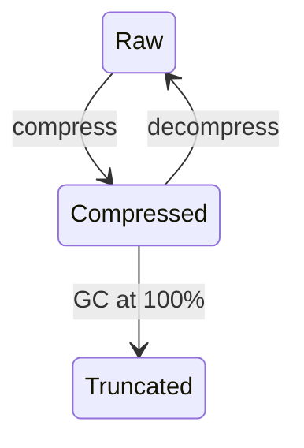

[English](./README.md) | [中文](./README.zh-CN.md)

<p align="center">
<strong>Active Context Pruning</strong> for <a href="https://opencode.ai">OpenCode</a>
<br />
The model decides <em>when</em> and <em>what</em> to compress — not a hard limit.
</p>

---

<p align="center">
<a href="https://www.npmjs.com/package/opencode-acp"></a>
<a href="https://github.com/ranxianglei/opencode-acp/blob/master/LICENSE"></a>
<a href="https://github.com/ranxianglei/opencode-acp"></a>
</p>

<p align="center">
<code>opencode plugin opencode-acp@latest --global</code>
</p>

---

## Why ACP

ACP hands all context-management authority to the model itself — not relying on
external models or any complex external mechanism to do context management. It
is, to date, the best context-management implementation on the market.

This brings two concrete effects:

- **It saves about two-thirds of tokens.** A model with a 1,000,000-token context
  window effectively runs in the **200,000–300,000 token range**.
- **It supports ultra-long sessions without losing key content** — **500M-token-level
  cumulative context, 100,000 messages per session**.

---

## Proven at scale

Real engineering context, in practice.

**Supports 500M-token-level cumulative context, with p95 context around 30% and
an average prompt-cache hit ratio above 85%.** (That average — not per-session —
is explained in [Impact on Prompt Caching](#impact-on-prompt-caching), where it
turns out to save far more tokens than traditional compression.)

| | Session 1 | Session 2 |
|---|---|---|
| **Messages** | 3,024 | 2,028 |
| **Total tokens processed** | 582 M | 463 M |
| **Prompt-cache hit ratio** | 86.2% | 89.0% |
| **Context p50 (median)** | 1.2 K (<1%) | 1.8 K (<1%) |
| **Context p75** | 2.8 K | 3.5 K |
| **Context p90** | 108 K (11%) | 58 K (6%) |
| **Context p95** | 251 K (25%) | 335 K (34%) |
| **Context p99** | 425 K (43%) | 442 K (44%) |
| **Peak** | 488 K (49%) | 769 K (77%) |

(Context percentages are of the 1M window.)

---

## Installation

```bash
opencode plugin opencode-acp@latest --global
```

Or add to your opencode config:

```json
{
  "plugin": {
    "opencode-acp": "latest"
  }
}
```

---

## How It Works

ACP hands the context-compression tool directly to the model. The model is
**100% responsible** for context compression. The model's available tools are
mainly: **compress** and **decompress**. A hardcoded 100% GC fallback acts as
a safety net when the context window is completely full.

### Lifecycle

Two operations: **compress** and **decompress**. Content loops between raw and
compressed. When context hits 100%, old-gen block summaries are truncated as
a last resort:



### Compression strategy

The system injects a prompt telling the model the current context ratio, the
compression ratio, whether context is idle, and compression suggestions. When the
trigger ratio is hit, content is compressed in **priority order**:

1. Agent/subagent review & consultation results (largest block of uncompressed content)
2. Verbose command output (build/test runs, git diff/log/status, directory listings)
3. Exploration that led nowhere (failed approaches, dead-end searches)
4. Redundant tool results (reading the same file repeatedly, repeated status checks)
5. Intermediate steps of completed multi-step tasks
6. Resolved discussion threads (once a decision is recorded)
7. Large file contents already used

After compression, the original content is replaced by a short **block** that
references the original (recoverable via `decompress`).

### Decompression strategy

The model decides when to decompress. When the context is large enough to
interfere with the model's self-attention, short blocks lead the model to compress
some content first, handle the urgent matter, then decompress what it needs in
later work.

### Deletion strategy

To handle the accumulation of many small historical blocks, the new version adds
a deletion strategy. The model decides whether to delete. **Once deleted, content
is irrecoverable.** This replaces the original forced GC, so that forced garbage
collection no longer deletes things the model considers important.

---

## Impact on Prompt Caching

Historically, ACP has fixed many of the low-cache-hit-rate problems caused by
DCP. The overall cache hit rate is now **~87%**.

Compared to traditional compression — which only compresses at 80–90% and, once it
compresses, forces 100% of the context to re-hit — ACP's hit rate is effectively
higher.

Additionally, ACP keeps total context around **~30% most of the time**, versus the
traditional **50–80%**. So total token savings are far higher than traditional
compression.

**Conclusion:** ACP simultaneously raises the overall cache hit rate **and**
ensures key context information is not lost.

---

## Commands

ACP provides an `/acp` slash command (also accepts `/dcp` for backward compatibility):

| Command | Description |
|---------|-------------|
| `/acp` | Shows available ACP commands |
| `/acp context` | Token usage breakdown by category (system, user, assistant, tools, etc.) and how much has been saved through pruning |
| `/acp stats` | Cumulative pruning statistics across all sessions |
| `/acp sweep [n]` | Prunes all tools since the last user message. Optional count: `/acp sweep 10` prunes the last 10 tools. Respects `commands.protectedTools` |
| `/acp manual [on\|off]` | Toggle manual mode. When on, the AI will not autonomously use context management tools |
| `/acp compress [focus]` | Trigger a single compress tool execution. Optional focus text directs what content to compress, following the active `compress.mode` |
| `/acp decompress <n>` | Restore a specific active compression by ID. Running without an argument shows available compression IDs, token sizes, and topics |
| `/acp recompress <n>` | Re-apply a user-decompressed compression by ID. Running without an argument shows recompressible IDs, token sizes, and topics |

---

## Configuration

ACP uses its own config file, searched in order:

1. **Global:** `~/.config/opencode/acp.jsonc` (or `acp.json`), created automatically on first run
2. **Custom config directory:** `$OPENCODE_CONFIG_DIR/acp.jsonc` (or `acp.json`), if `OPENCODE_CONFIG_DIR` is set
3. **Project:** `.opencode/acp.jsonc` (or `acp.json`) in your project's `.opencode` directory

If no `acp.jsonc` is found, ACP falls back to `dcp.jsonc` / `dcp.json` (for backward compatibility with existing DCP installations) and auto-migrates on first write.

Each level overrides the previous, so project settings take priority over global. Restart OpenCode after making config changes.

> [!IMPORTANT]
> **Disable OpenCode's built-in auto-compaction.** ACP handles context management itself — OpenCode's compaction conflicts with ACP and can cause issues (re-expanded messages, lost compression state). Add to your `opencode.json`:
>
> ```jsonc
> {
>   "compaction": {
>     "auto": false
>   }
> }
> ```
>
> Or set the environment variable: `OPENCODE_DISABLE_AUTOCOMPACT=1`

> [!NOTE]
> If you use models with smaller context windows, such as GitHub Copilot models or local models, lower `compress.minContextLimit` and `compress.maxContextLimit` in your configuration to match the available context.

<details>
<summary><strong>Default Configuration</strong> (click to expand)</summary>

```jsonc
{
    "$schema": "https://raw.githubusercontent.com/ranxianglei/opencode-acp/master/dcp.schema.json",
    // Enable or disable the plugin
    "enabled": true,
    // Automatically update npm-installed ACP when a newer npm latest is available.
    // Version-locked plugin specs are not updated.
    "autoUpdate": true,
    // Enable debug logging to ~/.config/opencode/logs/acp/
    "debug": false,
    // Notification display: "off", "minimal", or "detailed"
    "pruneNotification": "detailed",
    // Notification type: "chat" (in-conversation) or "toast" (system toast)
    "pruneNotificationType": "chat",
    // Slash commands configuration
    "commands": {
        "enabled": true,
        // Additional tools to protect from pruning via commands (e.g., /acp sweep)
        "protectedTools": [],
    },
    // Manual mode: disables autonomous context management,
    // tools only run when explicitly triggered via /acp commands
    "manualMode": {
        "enabled": false,
        // When true, automatic cleanup (deduplication, purgeErrors)
        // still runs even in manual mode
        "automaticStrategies": true,
    },
    // Protect from pruning for <turns> message turns past tool invocation
    "turnProtection": {
        "enabled": false,
        "turns": 4,
    },
    // Experimental settings
    "experimental": {
        // Allow ACP processing in subagent sessions
        "allowSubAgents": false,
        // Enable user-editable prompt overrides under dcp-prompts directories
        // When false (default), prompt override files/directories are ignored
        "customPrompts": false,
    },
    // Protect file operations from pruning via glob patterns
    // Patterns match tool parameters.filePath (e.g. read/write/edit)
    "protectedFilePatterns": [],
    // Unified context compression tool and behavior settings
    "compress": {
        // Compression mode: "range" (compress spans into block summaries)
        // or experimental "message" (compress individual raw messages)
        "mode": "range",
        // Permission mode: "allow" (no prompt), "ask" (prompt), "deny" (tool not registered)
        "permission": "allow",
        // Show compression content in a chat notification
        "showCompression": true,
        // Let active summary tokens extend the effective maxContextLimit
        "summaryBuffer": true,
        // Soft upper threshold: above this, ACP keeps injecting strong
        // compression nudges (based on nudgeFrequency), so compression is
        // much more likely. Accepts: number or "X%" of model context window.
        "maxContextLimit": "55%",
        // Soft lower threshold for reminder nudges: below this, turn/iteration
        // reminders are off (compression less likely). At/above this, reminders
        // are on. Accepts: number or "X%" of model context window.
        "minContextLimit": "45%",
        // Optional per-model override for maxContextLimit by providerID/modelID.
        // If present, this wins over the global maxContextLimit.
        // Accepts: number or "X%".
        // Example:
        // "modelMaxLimits": {
        //     "openai/gpt-5.3-codex": 120000,
        //     "anthropic/claude-sonnet-4.6": "80%"
        // },
        // Optional per-model override for minContextLimit.
        // If present, this wins over the global minContextLimit.
        // "modelMinLimits": {
        //     "openai/gpt-5.3-codex": 50000,
        //     "anthropic/claude-sonnet-4.6": "25%"
        // },
        // How often the context-limit nudge fires (1 = every fetch, 5 = every 5th)
        "nudgeFrequency": 5,
        // Start adding compression reminders after this many
        // messages have happened since the last user message
        "iterationNudgeThreshold": 15,
        // Controls how likely compression is after user messages
        // ("strong" = more likely, "soft" = less likely)
        "nudgeForce": "soft",
        // Tool names whose completed outputs are appended to the compression
        "protectedTools": [],
        // Preserve text wrapped in <protect>...</protect> when compressed
        "protectTags": false,
        // Preserve your messages during compression.
        // Warning: large copy-pasted prompts will never be compressed away
        "protectUserMessages": false,
    },
    // Automatic pruning strategies
    "strategies": {
        // Remove duplicate tool calls (same tool with same arguments)
        "deduplication": {
            "enabled": true,
            // Additional tools to protect from pruning
            "protectedTools": [],
        },
        // Prune tool inputs for errored tools after X turns
        "purgeErrors": {
            "enabled": true,
            // Number of turns before errored tool inputs are pruned
            "turns": 4,
            // Additional tools to protect from pruning
            "protectedTools": [],
        },
    },
    // Garbage collection — hardcoded 100% fallback only
    "gc": {
        "algorithm": "truncate",
        // young → old generation promotion after this many survivals
        "promotionThreshold": 5,
        // deactivate a block after this many survivals
        "maxBlockAge": 15,
        // truncate old-gen summaries exceeding this length (chars)
        "maxOldGenSummaryLength": 3000,
        // run major GC when context usage exceeds this (hardcoded, not configurable)
        "majorGcThresholdPercent": "100%",
    },
}
```

</details>

### Prompt Overrides

ACP exposes six editable prompts:

- `system`
- `compress-range`
- `compress-message`
- `context-limit-nudge`
- `turn-nudge`
- `iteration-nudge`

This feature is disabled by default. Set `experimental.customPrompts` to `true` in your ACP config to activate it.

When enabled, managed defaults are written to `~/.config/opencode/acp-prompts/defaults/` as plain-text prompt files. A single `README.md` in that directory explains each prompt and how to create overrides.

To customize behavior, add a file with the same name under an overrides directory and edit it as plain text.

To reset an override, delete the matching file from your overrides directory.

### Protected Tools

By default, these tools are always protected from pruning:
`task`, `skill`, `todowrite`, `todoread`, `compress`, `decompress`, `batch`, `plan_enter`, `plan_exit`, `write`, `edit`

The `protectedTools` arrays in `commands` and `strategies` add to this default list.

For the `compress` tool, `compress.protectedTools` ensures specific tool outputs are appended to the compressed summary. By default it includes `task`, `skill`, `todowrite`, `todoread`, and `decompress`.

---

## Migrating from DCP

ACP is a drop-in replacement for DCP. To migrate:

1. Remove the old DCP plugin from your `opencode.json`
2. Install ACP: `opencode plugin install opencode-acp@latest --global`
3. Restart OpenCode

**What's preserved:**

- Session state (compression blocks, message ID mappings) -- auto-migrated from `plugin/dcp/` to `~/.local/share/opencode/storage/plugin/acp/`
- Config file `~/.config/opencode/dcp.jsonc` -- ACP auto-migrates to `acp.jsonc`
- Prompt overrides in `~/.config/opencode/dcp-prompts/` -- auto-migrates to `acp-prompts/`

**What changes:**

- Storage directory: `plugin/dcp/` to `plugin/acp/` (auto-migrated on first launch)
- Log directory: `logs/dcp/` to `logs/acp/`
- Slash command: `/dcp` to `/acp` (both work for backward compatibility)
- Notification headers: `DCP` to `ACP`
- Context usage label: `DCP threshold` to `ACP threshold`

ACP auto-migrates config from `dcp.jsonc` to `acp.jsonc` and prompts from `dcp-prompts/` to `acp-prompts/` on first launch.

---

<details>
<summary><strong>Bug Fixes (38 total)</strong> -- applied on top of DCP v3.1.11</summary>

| # | Severity | Summary |
|---|----------|---------|
| 1 | CRITICAL | State not persisted across restarts -- messageIds, block deactivation, save errors silently lost |
| 2 | CRITICAL | resetOnCompaction() clears all compression blocks -- undoes all pruning work |
| 3 | CRITICAL | prune silently drops summary -- DATA LOSS when no user message precedes anchor |
| 4 | CRITICAL | getCurrentTokenUsage returns 0 -- prevents nudge from ever triggering |
| 5 | HIGH | loadPruneMessagesState duplicates activeBlockIds + reasoning-strip undefined guard |
| 6 | HIGH | Synthetic summary messages get mNNNN refs but are invisible to boundary lookup |
| 7 | HIGH | State not persisted across restarts -- messageIds, block deactivation, and save errors silently lost |
| 8 | HIGH | isMessageCompacted() inconsistent with compaction summary message handling |
| 9 | HIGH | Compressed block summaries retain stale mNNNN message ID tags -- model copies stale IDs |
| 10 | HIGH | Model uses stale mNNNN IDs from nudges/summaries -- compress fails with "startId not available" |
| 11 | HIGH | Major GC skips legacy blocks without generation field -- oversized blocks never collected |
| 12 | HIGH | Percentage-based thresholds calculated against effective input context instead of full model context window |
| 13 | HIGH | Context window leaks -- compressed messages reappear after /compact |
| 14 | HIGH | Compression notifications write full block summaries to DB -- can reach 150KB+ per notification |
| 15 | HIGH | npm auto-install overwrites fork with upstream package |
| 16 | HIGH | Summary mNNNN refs in compress output -- model copies stale message IDs |
| 17 | HIGH | Synthetic messages not in messageIdToBlockId -- compress fails to find them |
| 18 | HIGH | Compress stops model from responding after compression completes |
| 19 | HIGH | Dynamic block guidance breaks API prefix cache |
| 20 | HIGH | GC never deactivates old blocks -- dead-weight accumulates indefinitely |
| 21 | HIGH | Logger + tokenizer 20-50s per-turn latency (268x slowdown) |
| 22 | HIGH | compress throws hard error on reversed block boundaries -- model gives up |
| 23--34 | MEDIUM | Various fixes for dedup, purge errors, schema validation, hook timing, etc. |
| 35 | HIGH | Aging warnings shown at low context usage (<50%) -- triggers unnecessary compress, wastes tokens |
| 36 | HIGH | Compression summary emitted as a standalone user message before the user's real turn -- model reads its own prior assistant output as user input, causing dialog role confusion / self-Q&A loops |
| 37 | HIGH | Message-transform pipeline runs on OpenCode's hidden title/summary/compaction agent requests -- corrupts the request and shared session state, breaking session title generation |
| 38 | CRITICAL | pruneToolOutputs/pruneToolInputs/pruneToolErrors mutate existing messages in-place -- invalidates LLM prefix cache, causing 89% of fresh input tokens to be wasted on cache-invalidating re-sends |

For the complete list with root cause analysis, see the [bug tracker](https://github.com/ranxianglei/opencode-acp/issues).

</details>

---

## Changelog

### v1.9.1 — Disjoint Visible-Range Segments & Nudge Wording (issue #9 root cause)

**Problem**: Even after v1.9.0, the model kept calling `compress` against IDs that a prior block had consumed. The root cause was that the suffix advertised a single contiguous span "first visible → last visible" that **straddled compression holes** — so the model's first guess for an `endId` landed inside an already-summarized range. Separately, the suffix's `(+X tokens since last nudge)` growth line was being misread as an *overflow* warning, triggering panic compressions of large-but-still-needed ranges.

**Fix 1 — disjoint visible-id segments** (PR #57): `injectVisibleIdRange` no longer emits one "first-to-last" span. It builds the actual surviving segments in ascending ref order and truncates to the largest tool-bearing / high-token segments when the count overflows (`compress.maxVisibleSegments`, default `50`, now plumbed through config defaults + merge + validation + schema). The suffix now reads e.g. `[Visible (top 2 of 3 segments, 803 msgs): m00001–m00929, m00944–m00950 | +1 smaller segment (~1.2K tokens, 6 msgs) omitted]`, so the model sees exactly which ranges are compressible and never targets a hole. The formatting logic is extracted into pure, exported, unit-tested functions (`buildVisibleSegments`, `formatVisibleGuidance`).

**Fix 2 — nudge wording** (PR #58): The incremental-compression guidance line (`💡 Compress incrementally: target the ranges above...`) moved to *after* the largest-ranges list and is reworded to stress that **size alone is not a reason to compress** — a large range that is still needed in full must be kept. Soft efficiency nudges (`growth` / `minLimit` variants) are now prefixed with an explicit *"This is an efficiency nudge to compress early and keep context lean — not an overflow warning. A separate, stronger alert will appear if the context is actually full."* so the growth delta isn't mistaken for an overflow alarm. The `maxLimit` path keeps its stronger alert and is intentionally excluded from the efficiency framing.

**Compatibility**: No persisted-state schema changes. New optional config field `compress.maxVisibleSegments` (number, default `50`); old configs keep working.

---

### v1.9.0 — Visible-Range Guidance & Compression Failure Recovery

**Problem**: On large-context models (1M+) the model repeatedly called `compress(startId=m00930, endId=m00943)` against IDs that a prior block had already consumed. It had no stable view of which `mNNNNN` refs were still compressible, the failure error gave no recovery info, `acp_status` was registered but never mentioned in the prompt, and the suffix nudge reported a bare percentage with no indication of *where* the tokens were actually spent.

**System prompt rewrite**:
- All four context tools (`compress`, `decompress`, `search_context`, `acp_status`) now listed with a one-line "when to use" hint each.
- Explicit compress / do-not-compress scenes replace the imperative "compress obvious waste promptly" wording.
- New **CONTEXT BREAKDOWN** section explains the 4-category suffix format (`tool | summaries | code | text`), the largest-range candidates, and the incremental "one large consumed range per call" strategy.
- Batch-compression guidance: aim for 20+ messages per `compress` call rather than many small summaries.
- New **task-phase-end** trigger: when a bug hunt / exploration / research sprint ends, compress the phase's redundant churn while preserving findings, file paths, and decision rationale.

**Nudge cadence**:
- Dropped the `contextPct >= 15%` floor entirely. Cadence is now pure 5%-of-limit growth with a first-turn baseline (no more forced nudge on turn 1).
- Baseline auto-resets after a significant post-compression token drop, so the next nudge fires on the post-compression level instead of waiting a full growth cycle.
- Suffix nudge gains a **3-category composition breakdown** (`tool | summaries | code | text`, no double-counting of code-bearing messages) plus the **largest ranges** in the tool and code categories — concrete compression targets, not a bare percentage.

**`acp_status` upgrade**: accepts `mode` (`summary` | `detailed`), `sort` (`recent` | `size` | `age`), and `limit`. Each block row shows `compressedTokens→summaryTokens` and the `mNNNNN` range it consumed.

**Compress failure recovery**: `resolveBoundaryIds` failures now return the current visible range (first/last ref), the active block count, and a pointer to `acp_status`. Out-of-range `endId` guesses (unregistered refs that parse higher than the last visible message) are **clamped** to the last visible message instead of failing; refs that are registered but already consumed still fail with the recovery hint (clamping them would silently recompress summarized content).

**Hardening**:
- `maxSummaryLengthHard` default raised `4000 → 8000 → 10000`; the compress-tool schema now sources its display value from config so changes propagate.
- Removed the stale `MODEL_CONTEXT_LIMITS` 38-entry fallback table — `modelContextLimit` is now sourced solely from the host SDK's `input.model.limit.context`. Providers that omit the field surface `undefined` immediately rather than getting a distorted percentage from a stale guess.
- `.catch()` added to every fire-and-forget `saveSessionState` call; removed an `anchorsChanged`-on-baseline path that triggered a concurrent-save race.
- `STORAGE_DIR` made dynamic (re-evaluates `XDG_DATA_HOME` at call time) so relocated data dirs and test harnesses work.
- Compression summaries now injected as assistant-role messages with system-metadata tags.

**Compatibility**: No persisted-state schema changes. `minNudgeContextPercent` config field preserved as a no-op for old configs.

---

### v1.8.2 — Always Inject System Prompt

**Bug fix**: System prompt gating (v1.8.1 commit `24bbb1f`) caused binge compression on large-context models. Since ACP injections are ephemeral (not persisted to conversation history), gating the system prompt made the model completely forget compression tools existed between nudges. When the nudge fired after 50K growth, the model panicked and made 95 consecutive compress calls.

**Fix**: Removed `shouldInjectThisTurn` gate from system prompt hook (`hooks.ts:108-112`). System prompt now always injects every turn. Suffix remains gated at `nudgeGrowthTokens` frequency.

**Current behavior**:
- **System prompt** (compression philosophy, tool awareness): ✅ every turn
- **Suffix** (context level, block list, Tips): gated at nudgeGrowthTokens frequency

---

### v1.8.1 — Adaptive Nudge Frequency + System Prompt Gating

**Problem**: Large-context models (1M+) over-compressed at 20-30% context because Tips fired every 6K tokens (0.6% of 1M). System prompt injected every turn added constant pressure.

**Adaptive nudgeGrowthTokens**:
- Default is now adaptive: 5% of `modelContextLimit`, clamped to [6000, 50000]
  - 128K → 6.4K, 200K → 10K, 500K → 25K, 1M → 50K, 2M+ → 50K (cap)
- Users can still set explicit `nudgeGrowthTokens` to override
- Removed hardcoded `6000` from schema defaults (was shadowing adaptive logic)

**System prompt gating**:
- SYSTEM prompt + `<dcp-system-reminder>` tags now pulse at `nudgeGrowthTokens` frequency
- Between nudges: system prompt injects **nothing** — zero compression noise
- First turn (`undefined` sentinel): always injects (establishes baseline)

**New tool: `acp_status`**:
- On-demand inspection of all compressed blocks (ID, tokens, age, topic)
- Replaces verbose block list in suffix with one-liner: `Compressed blocks: N (XK summary, last Ym ago). Use acp_status for details.`

**Compress notification improvement**:
- Header shows context before→after: `▣ ACP | Context 251.2K→249.3K`
- No percentage or limit shown (prevents model from anchoring on ceiling)

**Bug fixes**:
- `lastPerMessageNudgeTokens` reset to `0` after compress bypassed growth gate (feedback loop)
- Schema default `6000` shadowed `resolveAdaptiveNudgeGrowth()` — adaptive never activated
- `applyAnchoredNudges` + `injectContextUsage` duplicated context usage text
- `lastNudgeTokens === 0` sentinel replaced with `undefined` (explicit "never nudged")

**Tooling**:
- `scripts/dev-deploy.sh` — one-command build + deploy (auto-detects node, typecheck, build, deploy)
- Post-compress state transition integration tests (3 new)
- `acp_status` dedicated tests (7 new)

---

### v1.8.0 — Principle-Driven Prompts

**Philosophy**: Replaced verbose context-management guidance with 4 concise principles injected every turn. The model now sees *what matters* (principles) instead of *what to do* (rigid rules).

**Prompt changes**:
- 4 principles replace CONTEXT PRESSURE LEVELS, 7-item priority list, DO NOT RE-COMPRESS rules
- Context display simplified: absolute token count only, no percentage
- `<acp-context>` tag wrapping (backward compatible with `<dcp-context>`)

**Hybrid Tips frequency**:
- 💡 Light Tips (15-45%): Every turn — non-disruptive reminder
- ⚠️ Warning Tips (45%+): Key nodes only — first crossing or 10pp growth, prevents over-compression

**Config simplification**:
- Removed `hardNudgeContextPercent` — merged into `minContextLimit`/`maxContextLimit`
- Removed `perMessageNudgeGrowthPercent` — light Tips show every turn
- `maxSummaryLength` default: 200 → 2000
- `maxSummaryLengthHard` default: 3000 → 4000

**Bug fixes**:
- Windows path validation: `os.tmpdir()` + `path.relative()` (was hardcoded `/tmp/`)
- Compress after-detection: reset warning tracking
- Dead code cleanup: `shouldInjectPerMessageNudge`, no-op template

---

## License

AGPL-3.0-or-later -- This project is a fork of [@tarquinen/opencode-dcp](https://github.com/Tarquinen/opencode-dynamic-context-pruning). Original copyright belongs to the original author. Modifications and bug fixes by ranxianglei.
