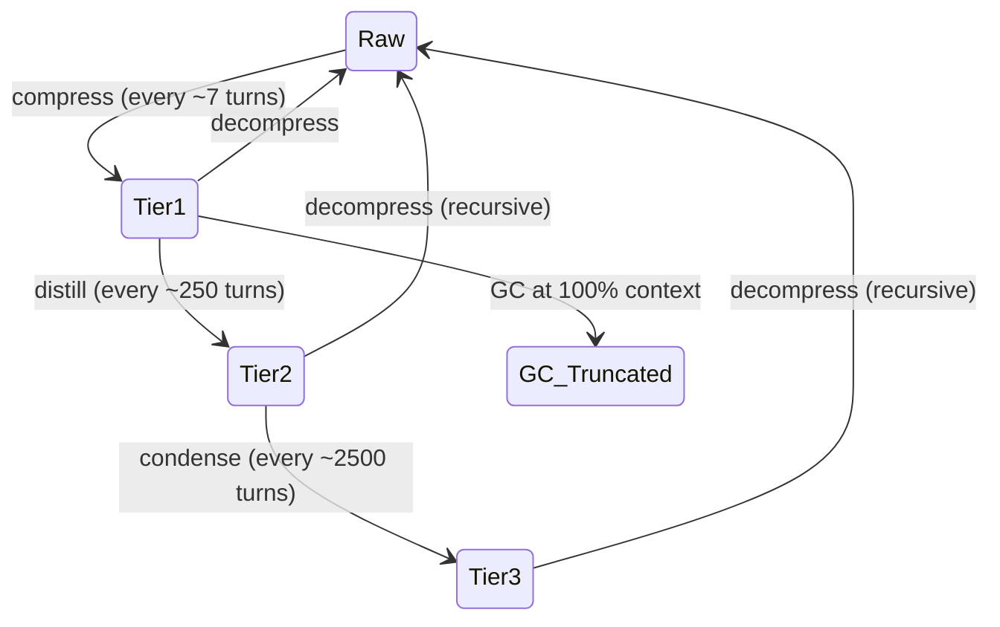

[English](./README.md) | [中文](./README.zh-CN.md)

<p align="center">
<strong>Active Context Pruning</strong> for <a href="https://opencode.ai">OpenCode</a>
<br />
The model decides <em>when</em> and <em>what</em> to compress — not a hard limit.
<br />
<strong>200K tokens is enough.</strong>
</p>

---

<p align="center">
<a href="https://www.npmjs.com/package/opencode-acp"></a>
<a href="https://github.com/ranxianglei/opencode-acp/blob/master/LICENSE"></a>
<a href="https://github.com/ranxianglei/opencode-acp"></a>
</p>

<p align="center">
<code>opencode plugin opencode-acp@stable --global</code>
</p>

---

## Why ACP

ACP hands all context-management authority to the model itself — not relying on
external models or any complex external mechanism to do context management. It
is, to date, the best context-management implementation on the market.

This brings two concrete effects:

- **200K tokens is enough.** Across 30,000+ API calls in 50 real engineering
  sessions, **97% of requests stayed under 200K tokens** — p90 at 150K, p95 at
  180K. Every API call re-bills the full context, so keeping context low directly
  reduces cost — even with a 90%+ prompt-cache hit rate, the non-cached portion
  is billed at full price.
- **It supports ultra-long sessions without losing key content** — observed at
  **3,300+ messages and 300M+ cumulative tokens** per session; architecturally
  supports up to **100,000 messages** (5-digit message-ID space).

---

## Proven at scale

Real engineering context, in practice.

**Across 6 active engineering sessions (11,000+ API calls), context p90 stays
at 150K–190K (15–19%), p95 at 160K–210K (16–21%) of the 1M window — with an
aggregate prompt-cache hit ratio of 91%.** (Why aggregate — not per-session —
matters is explained in [Impact on Prompt Caching](#impact-on-prompt-caching),
where it turns out to save far more tokens than traditional compression.)

| Session   | Duration    | Messages | API calls | Cumulative | Cache hit | Context p50 | Context p90 | Context p95 |
| --------- | ----------- | -------- | --------- | ---------- | --------- | ----------- | ----------- | ----------- |
| 0b89319b  | 230h (9.5d) | 3,344    | 2,796     | 339M       | 93%       | 108K (11%)  | 167K (17%)  | 210K (21%)  |
| 0a3be0cd  | 130h (5.4d) | 3,183    | 2,499     | 276M       | 91%       | 104K (10%)  | 145K (15%)  | 153K (15%)  |
| 0b2cd5a7  | 131h (5.4d) | 2,560    | 2,181     | 314M       | 91%       | 142K (14%)  | 191K (19%)  | 197K (20%)  |
| 08f2d501  | 37h (1.5d)  | 1,985    | 1,888     | 196M       | 95%       | 100K (10%)  | 156K (16%)  | 168K (17%)  |
| 1410c791† | 865h (36d)  | 1,279    | 1,100     | 218M       | 87%       | 132K (13%)  | 407K (41%)  | 427K (43%)  |
| 096cf8c4  | 72h (3d)    | 1,041    | 918       | 91M        | 89%       | 92K (9%)    | 148K (15%)  | 161K (16%)  |

† Bug-testing session; p95 is abnormally high. Excluding it, p95 stays ≤ 210K
across all other sessions.

(Context percentages are of the 1M window.)

---

## Installation

```bash
opencode plugin opencode-acp@stable --global
```

Or add to your opencode config:

```json
{
    "plugin": {
        "opencode-acp": "stable"
    }
}
```

---

## How It Works

ACP hands the context-compression tool directly to the model. The model is
**100% responsible** for context compression. The model's primary tools are
**compress** and **decompress**, supported by **acp_status** (context monitoring)
and **search_context** (search compressed content). Compression uses a
**three-tier LSM-tree architecture** (T1 capture → T2 distill → T3 condense)
that keeps context bounded for years. A hardcoded 100% GC fallback acts as a
safety net when the context window is completely full.

### Lifecycle — Three-Tier Compression

ACP uses a **three-tier LSM-tree compression architecture**, inspired by
database storage engines. Each tier compresses the previous tier's output,
creating progressively denser summaries with natural frequency decrease:


```mermaid
stateDiagram-v2
    Raw --> Tier1 : compress (every ~7 turns)
    Tier1 --> Tier2 : distill (every ~250 turns)
    Tier2 --> Tier3 : condense (every ~2500 turns)
    Tier1 --> Raw : decompress
    Tier2 --> Raw : decompress (recursive)
    Tier3 --> Raw : decompress (recursive)
    Tier1 --> GC_Truncated : GC at 100% context
```

| Tier | Name | Input | Output | Compression ratio | When it fires |
|------|------|-------|--------|-------------------|---------------|
| **T1** | Capture | Raw conversation | Detailed summary | ~45× | Context exceeds `maxContextLimit` |
| **T2** | Distill | T1 summaries (≥ `nudgeGrowthTokens`) | Condensed decisions/outcomes | ~10× | T1 summaries accumulate past threshold |
| **T3** | Condense | T2 summaries (≥ `nudgeGrowthTokens`) | Bare facts (1-3 per block) | ~5× | T2 summaries accumulate past threshold |

**How triggers work:**

- **T1** fires when raw context exceeds the configured limit. The model sees
  compressible ranges and writes a detailed summary preserving file paths,
  signatures, decisions, and rationale.
- **T2** fires when T1 summary tokens reach `nudgeGrowthTokens` (default 5% of
  context window). The model distills old T1 blocks — keeping decisions and
  outcomes, dropping verbose process details.
- **T3** fires when T2 summary tokens reach the same threshold. The model
  condenses to bare facts (shipped releases, key bugs, architecture decisions).

Each tier has an **independent cadence counter** — T2 firing doesn't block T3.
T1 has priority via a `!shouldInject` guard: if T1 fires, T2/T3 wait until next
turn. This ensures raw context compression happens first (it has the biggest
impact).

**Session capacity** — total tokens a single session can process from empty → T1 →
T2 → T3 → context limit (real-calibrated: 500 API calls/day, ~9.6K new tokens/call,
T1=45x/T2=10x/T3=3x):

| Context limit | 1 month | 3 months | At limit | Limit reached |
|---------------|---------|----------|----------|---------------|
| 1M | 1.9B tok | 10.5B tok | **68.9B tok** | day 259 (~8.6 mo) |
| 400K | 1.9B tok | 10.3B tok | **10.3B tok** | day 89 (~3 mo) |
| 400K (200 calls/day) | 559M tok | 2.5B tok | **9.5B tok** | day 212 (~7 mo) |

**Token savings** — without ACP, context grows unbounded and the session crashes
after ~100 API calls (~0.2 days). With ACP, context is bounded by compression:

| Metric | Without ACP | With ACP (1M model) |
|--------|-------------|---------------------|
| Session lifetime | ~0.2 days | 259 days (**1295x** longer) |
| Total tokens processed | ~52M | 68.9B (**1325x** more work) |

The core value: ACP doesn't just reduce per-call token cost — it enables a single
session to process **1000x more total work** by keeping context bounded across
the full session lifetime.

The model uses the **same `compress` tool** for all tiers. T2/T3 compressions
use block IDs as boundaries (`compress({ content: [{ startId: "b5", endId: "b20", summary: "..." }] })`). Tier is auto-detected from consumed blocks.

### Compression strategy (Tier 1)

The system injects a prompt telling the model the current context ratio, the
compression ratio, whether context is idle, and compression suggestions. When the
trigger ratio is hit, content is compressed in **priority order**:

1. Agent/subagent review & consultation results (largest block of uncompressed content)
2. Verbose command output (build/test runs, git diff/log/status, directory listings)
3. Exploration that led nowhere (failed approaches, dead-end searches)
4. Redundant tool results (reading the same file repeatedly, repeated status checks)
5. Intermediate steps of completed multi-step tasks
6. Resolved discussion threads (once a decision is recorded)
7. Large file contents already used

After compression, the original content is replaced by a short **block** that
references the original (recoverable via `decompress`).

### Decompression strategy

The model decides when to decompress. When the context is large enough to
interfere with the model's self-attention, short blocks lead the model to compress
some content first, handle the urgent matter, then decompress what it needs in
later work.

### GC safety net

When context reaches 100%, the system automatically truncates old-gen block summaries to prevent overflow. This is a last-resort safety net — with three-tier compression, the GC rarely activates because T2/T3 distillation keeps summary overhead bounded.

### Quality gate (non-blocking, off by default)

After each `compress` call, ACP can run a pluggable quality gate to detect summaries that catastrophically lost content (e.g., a 5K-token range compressed to a 147-char summary with none of the technical keywords). Failures only emit `logger.warn` — they never reject the compression (the result is already committed to state and visible to the model).

The default algorithm (`rouge-recall-v1`) is a two-layer gate calibrated against 6,913 real-world blocks:

- **L1 (length floor)**: Catches catastrophic retention failures — summaries shorter than 200 chars OR with <1% retention vs. the original. 100% recall, 0% FPR.
- **L2 (content coverage)**: Only runs on blocks that pass L1. Flags when **both** ROUGE-1 F1 < 0.05 **and** top-20 keyword recall < 0.20 (AND-combine keeps FPR at ~6.6%).

The interface is pluggable: future algorithms (e.g., LLM-as-judge via external API) can be registered through `registerQualityGate()` without touching pipeline wiring. Tokenizer uses hand-rolled word-level tokenization (English keywords + Chinese unigrams/bigrams) — not ACP's BPE tokenizer, which is too coarse for ROUGE-style matching.

Off by default for one release of burn-in. To enable:

```jsonc
{
    "qualityGate": {
        "enabled": true,
        "algorithm": "rouge-recall-v1",
    },
}
```

---

## Impact on Prompt Caching

Historically, ACP has fixed many of the low-cache-hit-rate problems caused by
DCP. The overall cache hit rate is now **~91%**.

Compared to traditional compression — which only compresses at 80–90% and, once it
compresses, forces 100% of the context to re-hit — ACP's hit rate is effectively
higher.

Additionally, ACP keeps total context around **~10–15% most of the time** (p50
100K, p90 150K of the 1M window), versus the traditional **50–80%**. So total
token savings are far higher than traditional compression.

**Conclusion:** ACP simultaneously raises the overall cache hit rate **and**
ensures key context information is not lost.

---

## Commands

ACP provides an `/acp` slash command (also accepts `/dcp` for backward compatibility):

| Command                 | Description                                                                                                                                |
| ----------------------- | ------------------------------------------------------------------------------------------------------------------------------------------ |
| `/acp`                  | Show compression status (same as `/acp stats`). Use `/acp help` for the command list                                                       |
| `/acp context`          | Token usage breakdown by category (system, user, assistant, tools, etc.) and how much has been saved through pruning                       |
| `/acp stats`            | Compression status: blocks, context usage, ranges (same report as the `acp_status` tool)                                                   |
| `/acp export`           | Export active compression blocks to a markdown file. Options: `--output <path>`, `--tier t1,t2,t3`, `--stdout`, `--append`                |

---

## Configuration

ACP uses its own config file, searched in order:

1. **Global:** `~/.config/opencode/acp.jsonc` (or `acp.json`), created automatically on first run
2. **Custom config directory:** `$OPENCODE_CONFIG_DIR/acp.jsonc` (or `acp.json`), if `OPENCODE_CONFIG_DIR` is set
3. **Project:** `.opencode/acp.jsonc` (or `acp.json`) in your project's `.opencode` directory

Each level overrides the previous, so project settings take priority over global. Restart OpenCode after making config changes.

> **📖 Full parameter reference:** See [CONFIGURATION.md](./CONFIGURATION.md) for a complete reference of every configurable parameter with type, default value, and description.

> [!IMPORTANT]
> **Disable OpenCode's built-in auto-compaction.** ACP handles context management itself — OpenCode's compaction conflicts with ACP and can cause issues (re-expanded messages, lost compression state). Add to your `opencode.json`:
>
> ```jsonc
> {
>     "compaction": {
>         "auto": false,
>     },
> }
> ```
>
> Or set the environment variable: `OPENCODE_DISABLE_AUTOCOMPACT=1`

> [!NOTE]
> If you use models with smaller context windows, such as GitHub Copilot models or local models, lower `compress.minContextLimit` and `compress.maxContextLimit` in your configuration to match the available context.

<details>
<summary><strong>Default Configuration</strong> (click to expand)</summary>

```jsonc
{
    "$schema": "https://raw.githubusercontent.com/ranxianglei/opencode-acp/master/dcp.schema.json",
    // Enable or disable the plugin
    "enabled": true,
    // Automatically update npm-installed ACP when a newer npm latest is available.
    // Version-locked plugin specs are not updated.
    "autoUpdate": true,
    // Enable INFO/DEBUG logging + per-request snapshots to ~/.config/opencode/logs/acp/
    // (WARN/ERROR are always logged to daily/<date>.log)
    "debug": false,
    // Notification display: "off", "minimal", or "detailed"
    "pruneNotification": "off",
    // Notification type: "chat" (deprecated, falls back to toast) or "toast" (system toast)
    "pruneNotificationType": "toast",
    // Slash commands configuration
    "commands": {
        "enabled": true,
        // Additional tools to protect from pruning via commands
        "protectedTools": [],
    },
    // Manual mode: disables autonomous context management,
    // tools only run when explicitly triggered via /acp commands
    // Allow ACP processing in subagent sessions (default: true)
    "allowSubAgents": true,
    // Experimental settings
    "experimental": {
        // Enable user-editable prompt overrides under dcp-prompts directories
        // When false (default), prompt override files/directories are ignored
        "customPrompts": false,
    },
    // Protect file operations from pruning via glob patterns
    // Patterns match tool parameters.filePath (e.g. read/write/edit)
    "protectedFilePatterns": [],
    // Unified context compression tool and behavior settings
    "compress": {
        // Compression mode: "range" (compress spans into block summaries)
        // or experimental "message" (compress individual raw messages)
        // Permission mode: "allow" (no prompt), "ask" (prompt), "deny" (tool not registered)
        "permission": "allow",
        // Show compression content in a chat notification
        "showCompression": true,
        // Let active summary tokens extend the effective maxContextLimit
        "summaryBuffer": true,
        // Soft upper threshold: above this, ACP keeps injecting strong
        // compression nudges (based on nudgeFrequency), so compression is
        // much more likely. Accepts: number or "X%" of model context window.
        "maxContextLimit": "55%",
        // Soft lower threshold for reminder nudges: below this, turn/iteration
        // reminders are off (compression less likely). At/above this, reminders
        // are on. Accepts: number or "X%" of model context window.
        "minContextLimit": "45%",
        // Optional per-model override for maxContextLimit by providerID/modelID.
        // If present, this wins over the global maxContextLimit.
        // Accepts: number or "X%".
        // Example:
        // "modelMaxLimits": {
        //     "openai/gpt-5.3-codex": 120000,
        //     "anthropic/claude-sonnet-4.6": "80%"
        // },
        // Optional per-model override for minContextLimit.
        // If present, this wins over the global minContextLimit.
        // "modelMinLimits": {
        //     "openai/gpt-5.3-codex": 50000,
        //     "anthropic/claude-sonnet-4.6": "25%"
        // },
        // How often the context-limit nudge fires (1 = every fetch, 5 = every 5th)
        "nudgeFrequency": 5,
        // Start adding compression reminders after this many
        // messages have happened since the last user message
        "iterationNudgeThreshold": 15,
        // Controls how likely compression is after user messages
        // ("strong" = more likely, "soft" = less likely)
        "nudgeForce": "soft",
        // Hard-excluded tool names. The root default is ["skill", "compress"]; an explicit
        // array replaces the inherited policy. Use [] to compress all tool outputs.
        // "compress" is always force-protected regardless of this setting — its summary
        // parameter is the sole record of compressed conversation and cannot be recovered
        // if lost. Use [] to compress all tool outputs except compress itself.
        "protectedTools": ["skill", "compress"],
        // Preserve text wrapped in <protect>...</protect> when compressed
        "protectTags": false,
        // Preserve your messages during compression.
        // Warning: large copy-pasted prompts will never be compressed away
        "protectUserMessages": false,
    },
    // Garbage collection — hardcoded 100% fallback only
    "gc": {
        "algorithm": "truncate",
        // young → old generation promotion after this many survivals
        "promotionThreshold": 5,
        // deactivate a block after this many survivals
        "maxBlockAge": 15,
        // truncate old-gen summaries exceeding this length (chars)
        "maxOldGenSummaryLength": 3000,
        // run major GC when context usage exceeds this (hardcoded, not configurable)
        "majorGcThresholdPercent": "100%",
    },
    // Post-compression quality gate (non-blocking; off by default)
    "qualityGate": {
        // Master switch. When false, no evaluation runs.
        "enabled": false,
        // Algorithm name. Pluggable — future algorithms (including external
        // API judges) can be registered without changing pipeline wiring.
        "algorithm": "rouge-recall-v1",
        // Per-algorithm config
        "algorithms": {
            "rouge-recall-v1": {
                // Hard floor on summary length (chars). Below this → L1 fails.
                "layer1MinChars": 200,
                // Min retention = summaryLen / (compressedTokens*4) * 100.
                // Catches catastrophic retention failures (<1%) with 0% FPR.
                "layer1MinRetentionPct": 1.0,
                // L2 fails (combined with top20Recall via AND) when below this.
                "layer2MaxRougeF1": 0.05,
                // L2 fails (combined with rougeF1 via AND) when below this.
                "layer2MaxTop20Recall": 0.20,
            },
        },
    },
}
```

</details>

### Prompt Overrides

ACP exposes six editable prompts:

- `system`
- `compress-range`
- `compress-message`
- `context-limit-nudge`
- `turn-nudge`
- `iteration-nudge`

This feature is disabled by default. Set `experimental.customPrompts` to `true` in your ACP config to activate it.

When enabled, managed defaults are written to `~/.config/opencode/acp-prompts/defaults/` as plain-text prompt files. A single `README.md` in that directory explains each prompt and how to create overrides.

To customize behavior, add a file with the same name under an overrides directory and edit it as plain text.

To reset an override, delete the matching file from your overrides directory.

### Protected Tools

By default, these tools are always protected from pruning:
`task`, `skill`, `todowrite`, `todoread`, `compress`, `decompress`, `batch`, `plan_enter`, `plan_exit`, `write`, `edit`

The `protectedTools` array in `commands` adds to this default list.

For the `compress` tool, `compress.protectedTools` ensures specific tool outputs are **hard-excluded** from compression ranges (v1.10.0+). When the model compresses a range that includes a protected tool message, that message survives intact in visible context — only the surrounding non-protected messages are compressed. The root default is `["skill", "compress"]` (the `compress` entry protects compress tool calls — which carry summaries — from being eaten by subsequent sequential compressions); an explicit array replaces the inherited policy. **`"compress"` is always force-protected regardless of user config** — its `summary` parameter is the sole record of compressed conversation and cannot be recovered if lost. Setting `[]` protects only `compress`; setting `["task"]` protects `task` and `compress`.

---

## Migrating from DCP

ACP is a drop-in replacement for DCP. To migrate:

1. Remove the old DCP plugin from your `opencode.json`
2. Install ACP: `opencode plugin opencode-acp@stable --global`
3. Copy your config: `cp ~/.config/opencode/dcp.jsonc ~/.config/opencode/acp.jsonc`
4. Copy prompt overrides (if any): `cp -r ~/.config/opencode/dcp-prompts ~/.config/opencode/acp-prompts`
5. Copy session state (optional, preserves compression blocks): `cp -r ~/.local/share/opencode/storage/plugin/dcp ~/.local/share/opencode/storage/plugin/acp`
6. Restart OpenCode

**What changes:**

- Log directory: `logs/dcp/` to `logs/acp/`
- Slash command: `/dcp` to `/acp` (both work for backward compatibility)
- Notification headers: `DCP` to `ACP`
- Context usage label: `DCP threshold` to `ACP threshold`

---

<details>
<summary><strong>Bug Fixes (39 total)</strong> -- applied on top of DCP v3.1.11</summary>

| #      | Severity | Summary                                                                                                                                                                                                                                |
| ------ | -------- | -------------------------------------------------------------------------------------------------------------------------------------------------------------------------------------------------------------------------------------- |
| 1      | CRITICAL | State not persisted across restarts -- messageIds, block deactivation, save errors silently lost                                                                                                                                       |
| 2      | CRITICAL | resetOnCompaction() clears all compression blocks -- undoes all pruning work                                                                                                                                                           |
| 3      | CRITICAL | prune silently drops summary -- DATA LOSS when no user message precedes anchor                                                                                                                                                         |
| 4      | CRITICAL | getCurrentTokenUsage returns 0 -- prevents nudge from ever triggering                                                                                                                                                                  |
| 5      | HIGH     | loadPruneMessagesState duplicates activeBlockIds + reasoning-strip undefined guard                                                                                                                                                     |
| 6      | HIGH     | Synthetic summary messages get mNNNN refs but are invisible to boundary lookup                                                                                                                                                         |
| 7      | HIGH     | State not persisted across restarts -- messageIds, block deactivation, and save errors silently lost                                                                                                                                   |
| 8      | HIGH     | isMessageCompacted() inconsistent with compaction summary message handling                                                                                                                                                             |
| 9      | HIGH     | Compressed block summaries retain stale mNNNN message ID tags -- model copies stale IDs                                                                                                                                                |
| 10     | HIGH     | Model uses stale mNNNN IDs from nudges/summaries -- compress fails with "startId not available"                                                                                                                                        |
| 11     | HIGH     | Major GC skips legacy blocks without generation field -- oversized blocks never collected                                                                                                                                              |
| 12     | HIGH     | Percentage-based thresholds calculated against effective input context instead of full model context window                                                                                                                            |
| 13     | HIGH     | Context window leaks -- compressed messages reappear after /compact                                                                                                                                                                    |
| 14     | HIGH     | Compression notifications write full block summaries to DB -- can reach 150KB+ per notification                                                                                                                                        |
| 15     | HIGH     | npm auto-install overwrites fork with upstream package                                                                                                                                                                                 |
| 16     | HIGH     | Summary mNNNN refs in compress output -- model copies stale message IDs                                                                                                                                                                |
| 17     | HIGH     | Synthetic messages not in messageIdToBlockId -- compress fails to find them                                                                                                                                                            |
| 18     | HIGH     | Compress stops model from responding after compression completes                                                                                                                                                                       |
| 19     | HIGH     | Dynamic block guidance breaks API prefix cache                                                                                                                                                                                         |
| 20     | HIGH     | GC never deactivates old blocks -- dead-weight accumulates indefinitely                                                                                                                                                                |
| 21     | HIGH     | Logger + tokenizer 20-50s per-turn latency (268x slowdown)                                                                                                                                                                             |
| 22     | HIGH     | compress throws hard error on reversed block boundaries -- model gives up                                                                                                                                                              |
| 23--34 | MEDIUM   | Various fixes for dedup, purge errors, schema validation, hook timing, etc.                                                                                                                                                            |
| 35     | HIGH     | Aging warnings shown at low context usage (<50%) -- triggers unnecessary compress, wastes tokens                                                                                                                                       |
| 36     | HIGH     | Compression summary emitted as a standalone user message before the user's real turn -- model reads its own prior assistant output as user input, causing dialog role confusion / self-Q&A loops                                       |
| 37     | HIGH     | Message-transform pipeline runs on OpenCode's hidden title/summary/compaction agent requests -- corrupts the request and shared session state, breaking session title generation                                                       |
| 38     | CRITICAL | pruneToolOutputs/pruneToolInputs/pruneToolErrors mutate existing messages in-place -- invalidates LLM prefix cache, causing 89% of fresh input tokens to be wasted on cache-invalidating re-sends                                      |
| 39     | HIGH     | Protected tool outputs (skill/task/todowrite) only soft-protected during compression -- appended to summary then pruned from context, losing semantic authority and susceptible to GC truncation. Fixed with hard-exclusion in v1.10.0 |

For the complete list with root cause analysis, see the [bug tracker](https://github.com/ranxianglei/opencode-acp/issues).

</details>

---

## Changelog

Full release history moved to [CHANGELOG.md](./CHANGELOG.md).

---

## License

AGPL-3.0-or-later -- This project is a fork of [@tarquinen/opencode-dcp](https://github.com/Tarquinen/opencode-dynamic-context-pruning). Original copyright belongs to the original author. Modifications and bug fixes by ranxianglei.
