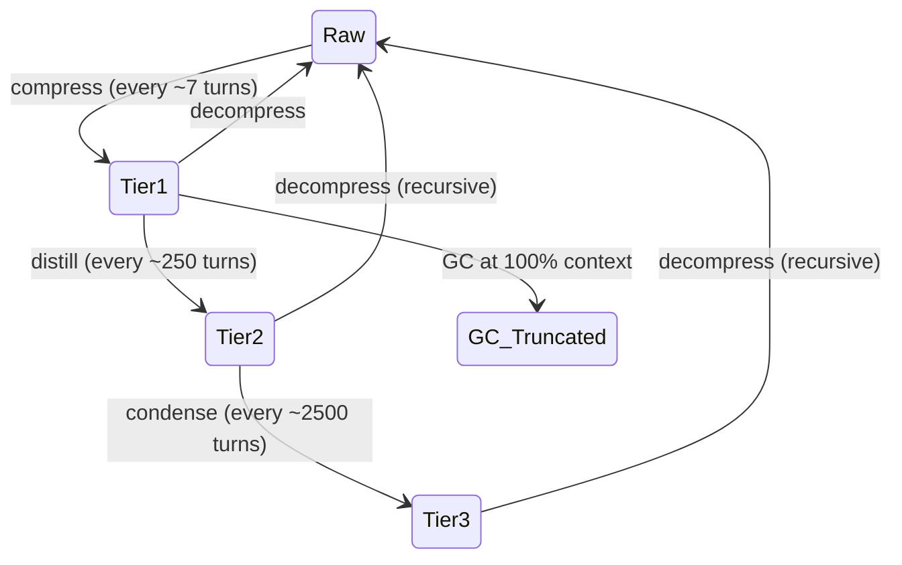

[English](./README.md) | [中文](./README.zh-CN.md)

<p align="center">
<strong>Active Context Pruning</strong> for <a href="https://opencode.ai">OpenCode</a>
<br />
The model decides <em>when</em> and <em>what</em> to compress — not a hard limit.
<br />
<strong>200K tokens is enough.</strong>
</p>

---

<p align="center">
<a href="https://www.npmjs.com/package/opencode-acp"></a>
<a href="https://github.com/ranxianglei/opencode-acp/blob/master/LICENSE"></a>
<a href="https://github.com/ranxianglei/opencode-acp"></a>
</p>

<p align="center">
<code>opencode plugin opencode-acp@stable --global</code>
</p>

---

## Why ACP

ACP hands all context-management authority to the model itself — not relying on
external models or any complex external mechanism to do context management. It
is, to date, the best context-management implementation on the market.

This brings two concrete effects:

- **200K tokens is enough.** Across 30,000+ API calls in 50 real engineering
  sessions, **97% of requests stayed under 200K tokens** — p90 at 150K, p95 at
  180K. Every API call re-bills the full context, so keeping context low directly
  reduces cost — even with a 90%+ prompt-cache hit rate, the non-cached portion
  is billed at full price.
- **It supports ultra-long sessions without losing key content** — observed at
  **3,300+ messages and 300M+ cumulative tokens** per session; architecturally
  supports up to **100,000 messages** (5-digit message-ID space).

---

## Proven at scale

Real engineering context, in practice.

**Across 6 active engineering sessions (11,000+ API calls), context p90 stays
at 150K–190K (15–19%), p95 at 160K–210K (16–21%) of the 1M window — with an
aggregate prompt-cache hit ratio of 91%.** (Why aggregate — not per-session —
matters is explained in [Impact on Prompt Caching](#impact-on-prompt-caching),
where it turns out to save far more tokens than traditional compression.)

| Session   | Duration    | Messages | API calls | Cumulative | Cache hit | Context p50 | Context p90 | Context p95 |
| --------- | ----------- | -------- | --------- | ---------- | --------- | ----------- | ----------- | ----------- |
| 0b89319b  | 230h (9.5d) | 3,344    | 2,796     | 339M       | 93%       | 108K (11%)  | 167K (17%)  | 210K (21%)  |
| 0a3be0cd  | 130h (5.4d) | 3,183    | 2,499     | 276M       | 91%       | 104K (10%)  | 145K (15%)  | 153K (15%)  |
| 0b2cd5a7  | 131h (5.4d) | 2,560    | 2,181     | 314M       | 91%       | 142K (14%)  | 191K (19%)  | 197K (20%)  |
| 08f2d501  | 37h (1.5d)  | 1,985    | 1,888     | 196M       | 95%       | 100K (10%)  | 156K (16%)  | 168K (17%)  |
| 1410c791† | 865h (36d)  | 1,279    | 1,100     | 218M       | 87%       | 132K (13%)  | 407K (41%)  | 427K (43%)  |
| 096cf8c4  | 72h (3d)    | 1,041    | 918       | 91M        | 89%       | 92K (9%)    | 148K (15%)  | 161K (16%)  |

† Bug-testing session; p95 is abnormally high. Excluding it, p95 stays ≤ 210K
across all other sessions.

(Context percentages are of the 1M window.)

---

## Installation

```bash
opencode plugin opencode-acp@stable --global
```

Or add to your opencode config:

```json
{
    "plugin": {
        "opencode-acp": "stable"
    }
}
```

---

## How It Works

ACP hands the context-compression tool directly to the model. The model is
**100% responsible** for context compression. The model's primary tools are
**compress** and **decompress**, supported by **acp_status** (context monitoring)
and **search_context** (search compressed content). Compression uses a
**three-tier LSM-tree architecture** (T1 capture → T2 distill → T3 condense)
that keeps context bounded for years. A hardcoded 100% GC fallback acts as a
safety net when the context window is completely full.

### Lifecycle — Three-Tier Compression

ACP uses a **three-tier LSM-tree compression architecture**, inspired by
database storage engines. Each tier compresses the previous tier's output,
creating progressively denser summaries with natural frequency decrease:


```mermaid
stateDiagram-v2
    Raw --> Tier1 : compress (every ~7 turns)
    Tier1 --> Tier2 : distill (every ~250 turns)
    Tier2 --> Tier3 : condense (every ~2500 turns)
    Tier1 --> Raw : decompress
    Tier2 --> Raw : decompress (recursive)
    Tier3 --> Raw : decompress (recursive)
    Tier1 --> GC_Truncated : GC at 100% context
```

| Tier | Name | Input | Output | Compression ratio | When it fires |
|------|------|-------|--------|-------------------|---------------|
| **T1** | Capture | Raw conversation | Detailed summary | ~45× | Context exceeds `maxContextLimit` |
| **T2** | Distill | T1 summaries (≥ `nudgeGrowthTokens`) | Condensed decisions/outcomes | ~10× | T1 summaries accumulate past threshold |
| **T3** | Condense | T2 summaries (≥ `nudgeGrowthTokens`) | Bare facts (1-3 per block) | ~5× | T2 summaries accumulate past threshold |

**How triggers work:**

- **T1** fires when raw context exceeds the configured limit. The model sees
  compressible ranges and writes a detailed summary preserving file paths,
  signatures, decisions, and rationale.
- **T2** fires when T1 summary tokens reach `nudgeGrowthTokens` (default 5% of
  context window). The model distills old T1 blocks — keeping decisions and
  outcomes, dropping verbose process details.
- **T3** fires when T2 summary tokens reach the same threshold. The model
  condenses to bare facts (shipped releases, key bugs, architecture decisions).

Each tier has an **independent cadence counter** — T2 firing doesn't block T3.
T1 has priority via a `!shouldInject` guard: if T1 fires, T2/T3 wait until next
turn. This ensures raw context compression happens first (it has the biggest
impact).

**Session capacity** — total tokens a single session can process from empty → T1 →
T2 → T3 → context limit (real-calibrated: 500 API calls/day, ~9.6K new tokens/call,
T1=45x/T2=10x/T3=3x):

| Context limit | 1 month | 3 months | At limit | Limit reached |
|---------------|---------|----------|----------|---------------|
| 1M | 1.9B tok | 10.5B tok | **68.9B tok** | day 259 (~8.6 mo) |
| 400K | 1.9B tok | 10.3B tok | **10.3B tok** | day 89 (~3 mo) |
| 400K (200 calls/day) | 559M tok | 2.5B tok | **9.5B tok** | day 212 (~7 mo) |

**Token savings** — without ACP, context grows unbounded and the session crashes
after ~100 API calls (~0.2 days). With ACP, context is bounded by compression:

| Metric | Without ACP | With ACP (1M model) |
|--------|-------------|---------------------|
| Session lifetime | ~0.2 days | 259 days (**1295x** longer) |
| Total tokens processed | ~52M | 68.9B (**1325x** more work) |

The core value: ACP doesn't just reduce per-call token cost — it enables a single
session to process **1000x more total work** by keeping context bounded across
the full session lifetime.

The model uses the **same `compress` tool** for all tiers. T2/T3 compressions
use block IDs as boundaries (`compress({ content: [{ startId: "b5", endId: "b20", summary: "..." }] })`). Tier is auto-detected from consumed blocks.

### Compression strategy (Tier 1)

The system injects a prompt telling the model the current context ratio, the
compression ratio, whether context is idle, and compression suggestions. When the
trigger ratio is hit, content is compressed in **priority order**:

1. Agent/subagent review & consultation results (largest block of uncompressed content)
2. Verbose command output (build/test runs, git diff/log/status, directory listings)
3. Exploration that led nowhere (failed approaches, dead-end searches)
4. Redundant tool results (reading the same file repeatedly, repeated status checks)
5. Intermediate steps of completed multi-step tasks
6. Resolved discussion threads (once a decision is recorded)
7. Large file contents already used

After compression, the original content is replaced by a short **block** that
references the original (recoverable via `decompress`).

### Decompression strategy

The model decides when to decompress. When the context is large enough to
interfere with the model's self-attention, short blocks lead the model to compress
some content first, handle the urgent matter, then decompress what it needs in
later work.

### GC safety net

When context reaches 100%, the system automatically truncates old-gen block summaries to prevent overflow. This is a last-resort safety net — with three-tier compression, the GC rarely activates because T2/T3 distillation keeps summary overhead bounded.

### Quality gate (non-blocking, off by default)

After each `compress` call, ACP can run a pluggable quality gate to detect summaries that catastrophically lost content (e.g., a 5K-token range compressed to a 147-char summary with none of the technical keywords). Failures only emit `logger.warn` — they never reject the compression (the result is already committed to state and visible to the model).

The default algorithm (`rouge-recall-v1`) is a two-layer gate calibrated against 6,913 real-world blocks:

- **L1 (length floor)**: Catches catastrophic retention failures — summaries shorter than 200 chars OR with <1% retention vs. the original. 100% recall, 0% FPR.
- **L2 (content coverage)**: Only runs on blocks that pass L1. Flags when **both** ROUGE-1 F1 < 0.05 **and** top-20 keyword recall < 0.20 (AND-combine keeps FPR at ~6.6%).

The interface is pluggable: future algorithms (e.g., LLM-as-judge via external API) can be registered through `registerQualityGate()` without touching pipeline wiring. Tokenizer uses hand-rolled word-level tokenization (English keywords + Chinese unigrams/bigrams) — not ACP's BPE tokenizer, which is too coarse for ROUGE-style matching.

Off by default for one release of burn-in. To enable:

```jsonc
{
    "qualityGate": {
        "enabled": true,
        "algorithm": "rouge-recall-v1",
    },
}
```

---

## Impact on Prompt Caching

Historically, ACP has fixed many of the low-cache-hit-rate problems caused by
DCP. The overall cache hit rate is now **~91%**.

Compared to traditional compression — which only compresses at 80–90% and, once it
compresses, forces 100% of the context to re-hit — ACP's hit rate is effectively
higher.

Additionally, ACP keeps total context around **~10–15% most of the time** (p50
100K, p90 150K of the 1M window), versus the traditional **50–80%**. So total
token savings are far higher than traditional compression.

**Conclusion:** ACP simultaneously raises the overall cache hit rate **and**
ensures key context information is not lost.

---

## Commands

ACP provides an `/acp` slash command (also accepts `/dcp` for backward compatibility):

| Command                 | Description                                                                                                                                |
| ----------------------- | ------------------------------------------------------------------------------------------------------------------------------------------ |
| `/acp`                  | Shows available ACP commands                                                                                                               |
| `/acp context`          | Token usage breakdown by category (system, user, assistant, tools, etc.) and how much has been saved through pruning                       |
| `/acp stats`            | Cumulative pruning statistics across all sessions                                                                                          |
| `/acp manual [on\|off]` | Toggle manual mode. When on, the AI will not autonomously use context management tools                                                     |
| `/acp compress [focus]` | Trigger a single compress tool execution. Optional focus text directs what content to compress, following the active `compress.mode`       |
| `/acp decompress <n>`   | Restore a specific active compression by ID. Running without an argument shows available compression IDs, token sizes, and topics          |
| `/acp recompress <n>`   | Re-apply a user-decompressed compression by ID. Running without an argument shows recompressible IDs, token sizes, and topics              |

---

## Configuration

ACP uses its own config file, searched in order:

1. **Global:** `~/.config/opencode/acp.jsonc` (or `acp.json`), created automatically on first run
2. **Custom config directory:** `$OPENCODE_CONFIG_DIR/acp.jsonc` (or `acp.json`), if `OPENCODE_CONFIG_DIR` is set
3. **Project:** `.opencode/acp.jsonc` (or `acp.json`) in your project's `.opencode` directory

Each level overrides the previous, so project settings take priority over global. Restart OpenCode after making config changes.

> **📖 Full parameter reference:** See [CONFIGURATION.md](./CONFIGURATION.md) for a complete reference of every configurable parameter with type, default value, and description.

> [!IMPORTANT]
> **Disable OpenCode's built-in auto-compaction.** ACP handles context management itself — OpenCode's compaction conflicts with ACP and can cause issues (re-expanded messages, lost compression state). Add to your `opencode.json`:
>
> ```jsonc
> {
>     "compaction": {
>         "auto": false,
>     },
> }
> ```
>
> Or set the environment variable: `OPENCODE_DISABLE_AUTOCOMPACT=1`

> [!NOTE]
> If you use models with smaller context windows, such as GitHub Copilot models or local models, lower `compress.minContextLimit` and `compress.maxContextLimit` in your configuration to match the available context.

<details>
<summary><strong>Default Configuration</strong> (click to expand)</summary>

```jsonc
{
    "$schema": "https://raw.githubusercontent.com/ranxianglei/opencode-acp/master/dcp.schema.json",
    // Enable or disable the plugin
    "enabled": true,
    // Automatically update npm-installed ACP when a newer npm latest is available.
    // Version-locked plugin specs are not updated.
    "autoUpdate": true,
    // Enable debug logging to ~/.config/opencode/logs/acp/
    "debug": false,
    // Notification display: "off", "minimal", or "detailed"
    "pruneNotification": "off",
    // Notification type: "chat" (deprecated, falls back to toast) or "toast" (system toast)
    "pruneNotificationType": "toast",
    // Slash commands configuration
    "commands": {
        "enabled": true,
        // Additional tools to protect from pruning via commands
        "protectedTools": [],
    },
    // Manual mode: disables autonomous context management,
    // tools only run when explicitly triggered via /acp commands
    // Allow ACP processing in subagent sessions (default: true)
    "allowSubAgents": true,
    // Experimental settings
    "experimental": {
        // Enable user-editable prompt overrides under dcp-prompts directories
        // When false (default), prompt override files/directories are ignored
        "customPrompts": false,
    },
    // Protect file operations from pruning via glob patterns
    // Patterns match tool parameters.filePath (e.g. read/write/edit)
    "protectedFilePatterns": [],
    // Unified context compression tool and behavior settings
    "compress": {
        // Compression mode: "range" (compress spans into block summaries)
        // or experimental "message" (compress individual raw messages)
        // Permission mode: "allow" (no prompt), "ask" (prompt), "deny" (tool not registered)
        "permission": "allow",
        // Show compression content in a chat notification
        "showCompression": true,
        // Let active summary tokens extend the effective maxContextLimit
        "summaryBuffer": true,
        // Soft upper threshold: above this, ACP keeps injecting strong
        // compression nudges (based on nudgeFrequency), so compression is
        // much more likely. Accepts: number or "X%" of model context window.
        "maxContextLimit": "55%",
        // Soft lower threshold for reminder nudges: below this, turn/iteration
        // reminders are off (compression less likely). At/above this, reminders
        // are on. Accepts: number or "X%" of model context window.
        "minContextLimit": "45%",
        // Optional per-model override for maxContextLimit by providerID/modelID.
        // If present, this wins over the global maxContextLimit.
        // Accepts: number or "X%".
        // Example:
        // "modelMaxLimits": {
        //     "openai/gpt-5.3-codex": 120000,
        //     "anthropic/claude-sonnet-4.6": "80%"
        // },
        // Optional per-model override for minContextLimit.
        // If present, this wins over the global minContextLimit.
        // "modelMinLimits": {
        //     "openai/gpt-5.3-codex": 50000,
        //     "anthropic/claude-sonnet-4.6": "25%"
        // },
        // How often the context-limit nudge fires (1 = every fetch, 5 = every 5th)
        "nudgeFrequency": 5,
        // Start adding compression reminders after this many
        // messages have happened since the last user message
        "iterationNudgeThreshold": 15,
        // Controls how likely compression is after user messages
        // ("strong" = more likely, "soft" = less likely)
        "nudgeForce": "soft",
        // Hard-excluded tool names. The root default is ["skill", "compress"]; an explicit
        // array replaces the inherited policy. Use [] to compress all tool outputs.
        // "compress" is always force-protected regardless of this setting — its summary
        // parameter is the sole record of compressed conversation and cannot be recovered
        // if lost. Use [] to compress all tool outputs except compress itself.
        "protectedTools": ["skill", "compress"],
        // Preserve text wrapped in <protect>...</protect> when compressed
        "protectTags": false,
        // Preserve your messages during compression.
        // Warning: large copy-pasted prompts will never be compressed away
        "protectUserMessages": false,
    },
    // Garbage collection — hardcoded 100% fallback only
    "gc": {
        "algorithm": "truncate",
        // young → old generation promotion after this many survivals
        "promotionThreshold": 5,
        // deactivate a block after this many survivals
        "maxBlockAge": 15,
        // truncate old-gen summaries exceeding this length (chars)
        "maxOldGenSummaryLength": 3000,
        // run major GC when context usage exceeds this (hardcoded, not configurable)
        "majorGcThresholdPercent": "100%",
    },
    // Post-compression quality gate (non-blocking; off by default)
    "qualityGate": {
        // Master switch. When false, no evaluation runs.
        "enabled": false,
        // Algorithm name. Pluggable — future algorithms (including external
        // API judges) can be registered without changing pipeline wiring.
        "algorithm": "rouge-recall-v1",
        // Per-algorithm config
        "algorithms": {
            "rouge-recall-v1": {
                // Hard floor on summary length (chars). Below this → L1 fails.
                "layer1MinChars": 200,
                // Min retention = summaryLen / (compressedTokens*4) * 100.
                // Catches catastrophic retention failures (<1%) with 0% FPR.
                "layer1MinRetentionPct": 1.0,
                // L2 fails (combined with top20Recall via AND) when below this.
                "layer2MaxRougeF1": 0.05,
                // L2 fails (combined with rougeF1 via AND) when below this.
                "layer2MaxTop20Recall": 0.20,
            },
        },
    },
}
```

</details>

### Prompt Overrides

ACP exposes six editable prompts:

- `system`
- `compress-range`
- `compress-message`
- `context-limit-nudge`
- `turn-nudge`
- `iteration-nudge`

This feature is disabled by default. Set `experimental.customPrompts` to `true` in your ACP config to activate it.

When enabled, managed defaults are written to `~/.config/opencode/acp-prompts/defaults/` as plain-text prompt files. A single `README.md` in that directory explains each prompt and how to create overrides.

To customize behavior, add a file with the same name under an overrides directory and edit it as plain text.

To reset an override, delete the matching file from your overrides directory.

### Protected Tools

By default, these tools are always protected from pruning:
`task`, `skill`, `todowrite`, `todoread`, `compress`, `decompress`, `batch`, `plan_enter`, `plan_exit`, `write`, `edit`

The `protectedTools` array in `commands` adds to this default list.

For the `compress` tool, `compress.protectedTools` ensures specific tool outputs are **hard-excluded** from compression ranges (v1.10.0+). When the model compresses a range that includes a protected tool message, that message survives intact in visible context — only the surrounding non-protected messages are compressed. The root default is `["skill", "compress"]` (the `compress` entry protects compress tool calls — which carry summaries — from being eaten by subsequent sequential compressions); an explicit array replaces the inherited policy. **`"compress"` is always force-protected regardless of user config** — its `summary` parameter is the sole record of compressed conversation and cannot be recovered if lost. Setting `[]` protects only `compress`; setting `["task"]` protects `task` and `compress`.

---

## Migrating from DCP

ACP is a drop-in replacement for DCP. To migrate:

1. Remove the old DCP plugin from your `opencode.json`
2. Install ACP: `opencode plugin opencode-acp@stable --global`
3. Copy your config: `cp ~/.config/opencode/dcp.jsonc ~/.config/opencode/acp.jsonc`
4. Copy prompt overrides (if any): `cp -r ~/.config/opencode/dcp-prompts ~/.config/opencode/acp-prompts`
5. Copy session state (optional, preserves compression blocks): `cp -r ~/.local/share/opencode/storage/plugin/dcp ~/.local/share/opencode/storage/plugin/acp`
6. Restart OpenCode

**What changes:**

- Log directory: `logs/dcp/` to `logs/acp/`
- Slash command: `/dcp` to `/acp` (both work for backward compatibility)
- Notification headers: `DCP` to `ACP`
- Context usage label: `DCP threshold` to `ACP threshold`

---

<details>
<summary><strong>Bug Fixes (39 total)</strong> -- applied on top of DCP v3.1.11</summary>

| #      | Severity | Summary                                                                                                                                                                                                                                |
| ------ | -------- | -------------------------------------------------------------------------------------------------------------------------------------------------------------------------------------------------------------------------------------- |
| 1      | CRITICAL | State not persisted across restarts -- messageIds, block deactivation, save errors silently lost                                                                                                                                       |
| 2      | CRITICAL | resetOnCompaction() clears all compression blocks -- undoes all pruning work                                                                                                                                                           |
| 3      | CRITICAL | prune silently drops summary -- DATA LOSS when no user message precedes anchor                                                                                                                                                         |
| 4      | CRITICAL | getCurrentTokenUsage returns 0 -- prevents nudge from ever triggering                                                                                                                                                                  |
| 5      | HIGH     | loadPruneMessagesState duplicates activeBlockIds + reasoning-strip undefined guard                                                                                                                                                     |
| 6      | HIGH     | Synthetic summary messages get mNNNN refs but are invisible to boundary lookup                                                                                                                                                         |
| 7      | HIGH     | State not persisted across restarts -- messageIds, block deactivation, and save errors silently lost                                                                                                                                   |
| 8      | HIGH     | isMessageCompacted() inconsistent with compaction summary message handling                                                                                                                                                             |
| 9      | HIGH     | Compressed block summaries retain stale mNNNN message ID tags -- model copies stale IDs                                                                                                                                                |
| 10     | HIGH     | Model uses stale mNNNN IDs from nudges/summaries -- compress fails with "startId not available"                                                                                                                                        |
| 11     | HIGH     | Major GC skips legacy blocks without generation field -- oversized blocks never collected                                                                                                                                              |
| 12     | HIGH     | Percentage-based thresholds calculated against effective input context instead of full model context window                                                                                                                            |
| 13     | HIGH     | Context window leaks -- compressed messages reappear after /compact                                                                                                                                                                    |
| 14     | HIGH     | Compression notifications write full block summaries to DB -- can reach 150KB+ per notification                                                                                                                                        |
| 15     | HIGH     | npm auto-install overwrites fork with upstream package                                                                                                                                                                                 |
| 16     | HIGH     | Summary mNNNN refs in compress output -- model copies stale message IDs                                                                                                                                                                |
| 17     | HIGH     | Synthetic messages not in messageIdToBlockId -- compress fails to find them                                                                                                                                                            |
| 18     | HIGH     | Compress stops model from responding after compression completes                                                                                                                                                                       |
| 19     | HIGH     | Dynamic block guidance breaks API prefix cache                                                                                                                                                                                         |
| 20     | HIGH     | GC never deactivates old blocks -- dead-weight accumulates indefinitely                                                                                                                                                                |
| 21     | HIGH     | Logger + tokenizer 20-50s per-turn latency (268x slowdown)                                                                                                                                                                             |
| 22     | HIGH     | compress throws hard error on reversed block boundaries -- model gives up                                                                                                                                                              |
| 23--34 | MEDIUM   | Various fixes for dedup, purge errors, schema validation, hook timing, etc.                                                                                                                                                            |
| 35     | HIGH     | Aging warnings shown at low context usage (<50%) -- triggers unnecessary compress, wastes tokens                                                                                                                                       |
| 36     | HIGH     | Compression summary emitted as a standalone user message before the user's real turn -- model reads its own prior assistant output as user input, causing dialog role confusion / self-Q&A loops                                       |
| 37     | HIGH     | Message-transform pipeline runs on OpenCode's hidden title/summary/compaction agent requests -- corrupts the request and shared session state, breaking session title generation                                                       |
| 38     | CRITICAL | pruneToolOutputs/pruneToolInputs/pruneToolErrors mutate existing messages in-place -- invalidates LLM prefix cache, causing 89% of fresh input tokens to be wasted on cache-invalidating re-sends                                      |
| 39     | HIGH     | Protected tool outputs (skill/task/todowrite) only soft-protected during compression -- appended to summary then pruned from context, losing semantic authority and susceptible to GC truncation. Fixed with hard-exclusion in v1.10.0 |

For the complete list with root cause analysis, see the [bug tracker](https://github.com/ranxianglei/opencode-acp/issues).

</details>

---

## Changelog

### v1.14.16 — Raise context limits to 80%

**Problem**: The compression thresholds were `maxContextLimit: 55%` / `minContextLimit: 45%`. The strong "over-limit" nudge fired as soon as context exceeded 55% of the model window. Combined with the fixed 50K growth threshold (v1.14.15), this still engaged compression relatively early, leaving usable context unused.

**Fix**: Raise **both** `compress.maxContextLimit` (`"55%"` → `"80%"`) and `compress.minContextLimit` (`"45%"` → `"80%"`) in `lib/config.ts`. Compression now waits until context exceeds 80% before firing the strong "over-limit" nudge. Setting `minContextLimit` equal to `maxContextLimit` removes the legacy 45% early-engagement band entirely — `minContextLimit` only affects the nudge tip *tone* (`tipsVariant`), never whether a nudge fires; the actual nudge decision is `growthSinceLastNudge >= nudgeGrowthTokens || overMaxLimit`, so aligning both at 80% makes behavior uniform and drops the meaningless early tip tone. The `emergencyThresholdPercent: "98%"` backstop is unchanged. Users can override via `compress.maxContextLimit` / `compress.minContextLimit` in their config.

Files: `lib/config.ts`. Tests: 976 pass.

**Install**: `opencode plugin opencode-acp@latest --global`

### v1.14.15 — Pin nudge growth to fixed 50,000 tokens

**Problem**: The T2/T3 nudge growth threshold was computed as 5% of the model context window (clamped 20K–50K via `resolveAdaptiveNudgeGrowth` from `context-compress-algorithms`). For sub-1M-context models this produced smaller thresholds (e.g. 10K at 200K, 20K at 400K), causing nudges to fire too eagerly and over-compress.

**Fix**: Set a fixed default `compress.nudgeGrowthTokens: 50000` in the default config (`lib/config.ts`), overriding the adaptive value through the existing `config.compress?.nudgeGrowthTokens ?? resolveAdaptiveNudgeGrowth(...)` hook at `lib/messages/inject/inject.ts`. Aligns opencode-acp with the parallel `acp-kernel` change (v0.0.19). The `emergencyThresholdPercent: "98%"` backstop still fires regardless of growth threshold. Users can override via `compress.nudgeGrowthTokens` in their config.

Files: `lib/config.ts`. Tests: 976 pass (no test asserts the default value).

**Install**: `opencode plugin opencode-acp@latest --global`

### v1.14.14 — Stable Release (2 PRs since v1.14.13)

Stable release covering two compress-subsystem fixes: the batched-call summary leak (#288) and the batch-compress all-or-nothing abort (#290). Published to the `latest` npm tag.

**PRs included**:
- **#288** (via #289) — `hideConsumedCompressCalls` keyed its keep-set on `compressCallId`, which is 1:N under batched compress (one tool call, multiple `content[]` entries share one callId). When a T2 distillation consumed only some siblings, a surviving sibling rescued the whole tool part, permanently leaking the consumed summaries — unreclaimable because compress is a default protected tool. Fix: key visibility per-block (on `startId::endId`) instead of per-callId; for kept batches with mixed liveness, rewrite the surviving tool part's `state.input.content` to drop consumed entries' summaries. All-consumed batches still fully removed. Files: `lib/compress/hide-consumed.ts`. Tests: +3 in `tests/hide-consumed.test.ts` (core regression verified to FAIL pre-fix).
- **#290** (via #291) — Batch `compress` aborted entirely when any single `content[]` entry contained only already-compressed messages (`Compression range N contains only already-compressed messages`), leaving valid entries unexecuted; the error also omitted which entry/IDs/blocks conflicted, forcing trial-and-error retries. Fix: (A) partial-failure batches — new `identifyPhantomPlans` drops phantom entries and compresses the rest, returning a concise skip notice; (C) detailed diagnostics on the all-phantom throw (entry index + consumed IDs + owning block); (B) a clamp warning when `clampMessageRef` silently shifts a boundary. Extracted `partitionPhantomPlans` + `buildPhantomSkipNotice` pure helpers for testable batch decision logic. `checkPhantomBlock` keeps its exact legacy contract. Files: `lib/compress/{pipeline,range,search,range-utils}.ts`. Tests: +19. Dual-agent reviewed (Oracle + General, both APPROVE).

**Install**: `opencode plugin opencode-acp@latest --global`

### v1.14.14-dev.1 — Dev Prerelease (2 PRs since v1.14.13)

Dev prerelease covering two compress-subsystem fixes: the batched-call summary leak (#288) and the batch-compress all-or-nothing abort (#290). Published to the `dev` npm tag for early testing.

**PRs included**:
- **#288** (via #289) — `hideConsumedCompressCalls` keyed its keep-set on `compressCallId`, which is 1:N under batched compress (one tool call, multiple `content[]` entries share one callId). When a T2 distillation consumed only some siblings, a surviving sibling rescued the whole tool part, permanently leaking the consumed summaries — unreclaimable because compress is a default protected tool. Fix: key visibility per-block (on `startId::endId`) instead of per-callId; for kept batches with mixed liveness, rewrite the surviving tool part's `state.input.content` to drop consumed entries' summaries. All-consumed batches still fully removed. Files: `lib/compress/hide-consumed.ts`. Tests: +3 in `tests/hide-consumed.test.ts` (core regression verified to FAIL pre-fix).
- **#290** (via #291) — Batch `compress` aborted entirely when any single `content[]` entry contained only already-compressed messages (`Compression range N contains only already-compressed messages`), leaving valid entries unexecuted; the error also omitted which entry/IDs/blocks conflicted, forcing trial-and-error retries. Fix: (A) partial-failure batches — new `identifyPhantomPlans` drops phantom entries and compresses the rest, returning a concise skip notice; (C) detailed diagnostics on the all-phantom throw (entry index + consumed IDs + owning block); (B) a clamp warning when `clampMessageRef` silently shifts a boundary. Extracted `partitionPhantomPlans` + `buildPhantomSkipNotice` pure helpers for testable batch decision logic. `checkPhantomBlock` keeps its exact legacy contract. Files: `lib/compress/{pipeline,range,search,range-utils}.ts`. Tests: +19. Dual-agent reviewed (Oracle + General, both APPROVE).

**Install**: `opencode plugin opencode-acp@dev --global`

### v1.14.13 — Stable Release (3 PRs since v1.14.12)

Stable release with `allowSubAgents` promoted to a top-level config field (default: `true`), plus config documentation updates.

**PRs included**:
- **#276** — Promote `allowSubAgents` from `experimental` to top-level config field, change default from `false` to `true`. Subagent sessions now get compression by default. Fully backward compatible: old `experimental.allowSubAgents` configs still work (top-level takes priority). Updated all 4 hook sites, schema, config validation, and 6 documentation files. Dual-agent reviewed (Oracle + Explore, both APPROVE).
- **#280, #281** — Update recommended config in documentation: `maxContextLimit: 70%`, `minContextLimit: 70%`, simplified `protectedTools`.

**Install**: `opencode plugin opencode-acp@stable --global`

### v1.14.13-dev.1 — Dev Prerelease (1 PR since v1.14.12)

Dev prerelease covering PR #276. Published to `dev` npm tag for early testing.

**PRs included**:
- **#276** — Promote `allowSubAgents` from experimental to top-level config field, change default from `false` to `true`. Subagent sessions now get compression by default. Fully backward compatible: old `experimental.allowSubAgents` configs still work (top-level takes priority). Updated all 4 hook sites, schema, config validation, and 6 documentation files. Dual-agent reviewed (Oracle + Explore, both APPROVE).

**Install**: `opencode plugin opencode-acp@dev --global`

### v1.14.12 — Stable Release (1 PR since v1.14.11)

Stable release with the omo-system-reminder filter fix that preserves user content when stripping `<system-reminder>` blocks.

**PRs included**:
- **#271** — Fix (follow-up to #268): `omo-system-reminder` filter v1.2.0 returned `{ action: "drop" }` for ANY user message containing `<system-reminder>`, losing user text when OMO prepends system-reminder blocks to user messages. Rewrote to v1.3.0: strips `<system-reminder>` blocks + OMO markers, preserves remaining user content via `modify`. Pure OMO messages still return `drop`. Phase 2 `keepLastOnly` now applies the filter's actual decision (drop or modify) to older matches instead of unconditional drop. Recent N matches kept fully untouched (semantically correct). Backward compatible with other 3 `keepLastOnly` filters (they only return `drop`). Dual-agent reviewed (Oracle + Explore, both APPROVE).

**Install**: `opencode plugin opencode-acp@stable --global`

### v1.14.11 — Stable Release (1 PR since v1.14.10)

Stable release with the omo-system-reminder filter fix and configurable `keepLast`.

**PRs included**:
- **#268** — Fix (issue #267): `omo-system-reminder` filter was stripping ALL `<system-reminder>` blocks from messages, deleting background task notifications and preventing the main session from recovering subagent results. Rewrote to v1.2.0: `keepLastOnly: true, keepLast: 2` — keeps the 2 most recent matches, drops older duplicates. Also adds framework-level configurable `keepLast` field so users can override how many recent matches to keep per `keepLastOnly` filter (default 1, clamped to minimum 1).

**Install**: `opencode plugin opencode-acp@stable --global`

### v1.14.10 — Stable Release (1 PR since v1.14.9)

Stable release with the omo-mode-injection filter fix.

**PRs included**:
- **#263** — Fix: `omo-mode-injection` filter was dropping entire user messages when OMO mode injections (`<ultrawork-mode>`, `[search-mode]`, etc.) were prepended to user content. Mode injections are prepended via `UserPromptSubmit.additionalContext`, not standalone — the old filter (v1.0.0) matched the injection and returned `drop`, clearing the entire message including the user's actual request. Rewrote to v1.1.0: strips injection blocks and preserves user content via `modify`. Also fixes config validation (messageFilters.filters dynamic key skip) and adds messageFilters to dcp.schema.json.

**Install**: `opencode plugin opencode-acp@stable --global`

### v1.14.9 — Stable Release (3 PRs since v1.14.8)

Stable release with nudge loop fix, holistic T2/T3 compression prompts, and multi-entry compress format documentation.

**PRs included**:
- **#252** — Two fixes: (1) **Issue #251**: `filterRecommendedRanges` suppressed ALL recommendations when compressible content was below 5% of modelContextLimit. Rewrote to always show all ranges. (2) **Nudge loop fix**: `lastNudgeShownTokens` reset to `undefined` on `nothingToCompress` caused nudges firing every turn.
- **#257** — Bump `context-compress-algorithms` 1.2.1 → 1.3.0. Holistic TIER2/TIER3 prompts — summarize by theme instead of per-block, fixing length overflow with 70+ T1 blocks (issue #256).
- **#259** — Document multi-entry compress format in system prompt and T2/T3 nudge. The compress tool already supported `content` arrays (PR #156), but only single-entry was shown for block-based compression.

**Install**: `opencode plugin opencode-acp@stable --global`

### v1.14.9-dev.2 — Dev Prerelease (1 PR since v1.14.9-dev.1)

Dev prerelease covering PR #263. Published to `dev` npm tag for early testing.

**PRs included**:
- **#263** — Fix: `omo-mode-injection` filter was dropping entire user messages when OMO mode injections (`<ultrawork-mode>`, `[search-mode]`, etc.) were prepended to user content. Mode injections are prepended via `UserPromptSubmit.additionalContext`, not standalone — the old filter (v1.0.0) matched the injection and returned `drop`, clearing the entire message including the user's actual request. Rewrote to v1.1.0: strips injection blocks and preserves user content via `modify`. Also fixes config validation (messageFilters.filters dynamic key skip) and adds messageFilters to dcp.schema.json.

**Install**: `opencode plugin opencode-acp@dev --global`

### v1.14.9-dev.1 — Dev Prerelease (1 PR since v1.14.8-dev.5)

Dev prerelease covering PR #259. Published to `dev` npm tag for early testing.

**PRs included**:
- **#259** — Document multi-entry compress format in system prompt and T2/T3 nudge. The compress tool already supported `content` arrays (PR #156), but only single-entry was shown for block-based compression. Now both formats are documented neutrally.

**Install**: `opencode plugin opencode-acp@dev --global`

### v1.14.8-dev.5 — Dev Prerelease (1 PR since v1.14.8-dev.4)

Dev prerelease covering PR #257. Published to `dev` npm tag for early testing.

**PRs included**:
- **#257** — Bump `context-compress-algorithms` from 1.2.1 to 1.3.0. cc-alg 1.3.0 ships holistic TIER2/TIER3 compression prompts — summarize by theme instead of per-block. The old per-block format (Source header + 3-5 bullets + 50-150 tokens per block) caused length overflow when compressing 70+ T1 blocks (~30K chars exceeding `maxSummaryLengthHard`). No source code changes needed (prompts consumed from dependency).

**Install**: `opencode plugin opencode-acp@dev --global`

### v1.14.8-dev.4 — Dev Prerelease (1 PR since v1.14.8-dev.3)

Dev prerelease covering PR #252. Published to `dev` npm tag for early testing.

**PRs included**:
- **#252** — Two fixes: (1) **Issue #251**: `filterRecommendedRanges` suppressed ALL recommendations when compressible content was below 5% of modelContextLimit (50K at 1M context). Rewrote to always show all ranges with `dangerous: true` on the last segment. Simplified `RangeFilterOptions`. (2) **Nudge loop fix**: `lastNudgeShownTokens` was reset to `undefined` on `nothingToCompress`, causing `growthReference` to fall back to stale session-start baseline → nudges firing every turn. Removed the reset. Also fixed growth display to use `lastNudgeShownTokens ?? lastPerMessageNudgeTokens` matching the actual decision logic. Oracle + Explore review: both APPROVE.

**Install**: `opencode plugin opencode-acp@dev --global`

### v1.14.8 — Stable Release (10 PRs since v1.14.7)

Stable release promoted from dev prereleases v1.14.8-dev.1 through v1.14.8-dev.3. Includes all fixes tested in the dev channel.

**Highlights**:

- **System token visibility** (#241): `acp_status` and nudge breakdown now show system prompt token proportion (5-15% of context). Consolidated 4 duplicate estimation algorithms into 1 shared `estimateSystemPromptTokens()` using the real Anthropic tokenizer.
- **HOW_TO_COMPRESS_RULES re-added to nudge** (#245): v1.14.7 over-removed the compression rules from all nudge locations. In long sessions (8,000+ messages), the rules in the system prompt degrade due to "lost in the middle" effect — re-added to nudge for high-attention guidance when compression triggers.
- **Tool pair integrity** (#248): Compression ranges that split tool_use/tool_result pairs caused API rejections. New `adjustBoundariesForToolPairs` auto-extends boundaries by callID matching.
- **Pluggable message filters** (#239, #242): `keepLastOnly` dedup mechanism + 4 OMO builtin filters for cleaning up third-party (e.g. OMO) injected messages that accumulate duplicates.
- **Orphan message splicing** (#240): When `hideConsumedCompressCalls` leaves only structural parts (step-finish, reasoning), the message is now spliced out instead of surviving as a 500-2000 token orphan.
- **E2E hardening** (#238): Observation recording, T2 cadence regression scenario, consumed-call hiding scenario, auxiliary call filtering. 12 E2E scenarios (was 8).
- **acp_status consumed compress hiding** (#244): Hides consumed compress calls from the PROTECTED list.

**All PRs included**: #238 (E2E hardening), #232 (remove dead turnProtection/DCP migration), #234 (re-add /acp stats), #239 (pluggable message filter), #240 (orphan splice), #241 (system tokens), #242 (keepLastOnly + OMO filters), #244 (acp_status consumed compress), #245 (HOW_TO_COMPRESS_RULES re-add), #248 (tool pair integrity).

**Install**: `opencode plugin opencode-acp@stable --global`

### v1.14.8-dev.3 — Dev Prerelease (1 PR since v1.14.8-dev.2)

Dev prerelease covering PR #248. Published to `dev` npm tag for early testing.

**PRs included**:
- **#248** — Fix: auto-extend compression ranges to prevent splitting tool_use/tool_result pairs. When the model selects a compression boundary that falls between a tool call and its result, the orphaned tool_result references a non-existent tool_use_id → API rejection. New `adjustBoundariesForToolPairs` in `compress/search.ts` scans forward/backward (up to 20 messages) to include the matching pair. Excludes `compress` tool (force-protected) and only extends message boundaries (never block boundaries) to avoid tier misclassification. 11 tests.

**Install**: `opencode plugin opencode-acp@dev --global`

### v1.14.8-dev.2 — Dev Prerelease (2 PRs since v1.14.8-dev.1)

Dev prerelease covering PRs #244–#245. Published to `dev` npm tag for early testing.

**PRs included**:
- **#245** — Fix: re-add HOW_TO_COMPRESS_RULES to nudge injection for high-attention summary guidance. v1.14.7 over-removed the rules from all 4 nudge locations (breakdown + 3 templates), leaving them only in system prompt. In long sessions, system prompt rules degrade due to "lost in the middle" effect — model needs rules at high attention (end of context) when nudge fires.
- **#244** — Fix: acp_status hides consumed compress calls from PROTECTED list.

**Install**: `opencode plugin opencode-acp@dev --global`

### v1.14.8-dev.1 — Dev Prerelease (7 PRs since v1.14.7)

Dev prerelease covering PRs #238–#242. Published to `dev` npm tag for early testing.

**PRs included**:
- **#238** — E2E hardening: observation recording, T2 cadence regression scenario, consumed-call hiding scenario, auxiliary call filtering. 12 E2E scenarios (was 8).
- **#232** — Refactor: remove dead `turnProtection` config + DCP migration code.
- **#234** — Re-add `/acp stats` as `acp_status` wrapper.
- **#239** — Pluggable message filter for third-party injection cleanup.
- **#240** — Fix: splice orphan messages (only structural parts remain after consumed compress removal).
- **#241** — System token breakdown in `acp_status` + nudge; hide context fill percentage from model; consolidate 4 duplicate estimations into 1 shared `estimateSystemPromptTokens()`.
- **#242** — `keepLastOnly` dedup mechanism + 4 OMO builtin filters.

**Install**: `opencode plugin opencode-acp@dev --global`

### v1.14.7 — Deduplicate HOW_TO_COMPRESS_RULES (PR #228)

**Problem**: `HOW_TO_COMPRESS_RULES` (~1.2K tokens) was injected 3-4 times per nudge turn — once in the system prompt, 1-2 times in nudge templates (turn/iteration/context-limit), and again in the breakdown block. In non-maxLimit scenarios the suffix message alone contained the rules 2-3 times. This wasted 2.4-3.6K tokens per nudge turn. The duplication became visible in v1.14.6 which persists debug nudge text to chat UI.

**Fix**: Removed `HOW_TO_COMPRESS_RULES` from the breakdown block (`inject.ts:535-537`) and all 3 nudge templates (`turn-nudge.ts`, `iteration-nudge.ts`, `context-limit-nudge.ts`). Kept in `system.ts` (single source of truth — injected every turn per v1.8.2 invariant) and `quality-gate/rejection.ts` (retry guidance). Oracle-verified: no scenario loses compression guidance.

Files: `lib/messages/inject/inject.ts`, `lib/prompts/{turn,iteration,context-limit}-nudge.ts`. 917 tests pass.

### v1.14.6 — Debug Nudge Chat Visibility (PR #226)

**Problem**: With `debug: true`, ACP nudge injections (compression suggestions, context breakdown, tier triggers) were only visible via a 5-second toast and log files. The nudge suffix message is ephemeral — injected by the message-transform hook but never persisted to the conversation DB — so users could not see what the model was actually seeing in the chat UI. This made debugging nudge behavior very difficult.

**Fix**: When `config.debug` is on, the `debugNotify` callback in `hooks.ts` now also calls `sendIgnoredMessage()` to persist the full nudge text to the conversation DB as an `ignored: true` user message (user-visible, model-invisible). The message is prefixed with `[ACP Debug Nudge]` for easy identification. Toast notification still shown alongside for backward compat. Debug OFF: behavior unchanged (no persisted messages).

Files: `lib/hooks.ts`. No source logic changes. No config changes. No persisted-state schema changes. 937 tests pass.

### v1.14.5 — GC Module Removal + Property-Based Tests + Issue #176 Fix + Config Docs (PRs #222, #206, #221, #223, #224)

**Problem**: Five issues bundled. (1) **GC data-loss bugs** (PR #222): The `gc/truncate.ts` module had 4 confirmed bugs that could silently lose summaries — single-line truncation exceeded maxLength by 19 chars, barely-over-maxLength silently failed (longer than input), long-header output overrun, and off-by-one marker reservation. GC only triggered at 100% context (default), so it was rarely reached but catastrophic when it did. (2) **Dead code** (PR #206): Prune tool, sweep command, and strategies (~2309 lines) were never used — `prune` tool was replaced by `compress` tool, `sweep` was superseded by batch cleanup, strategies were vestigial. (3) **No property-based tests** (PR #221): All tests were targeted/unit tests — invariant violations across edge cases were undetectable. (4) **Missing config docs** (PR #223): No comprehensive config reference — users had to read source to discover parameters. (5) **Nudge permanently stops after compress** (PR #224, Issue #176): In autonomous sessions (single user message + many assistant/tool turns), `injectCompressNudges` had an unconditional early return when any compress was detected in the current turn. Since the entire session IS one turn, once compress happened, `currentTurnHasCompress` was always true → function always returned early → nudges never fired again → unbounded context growth.

**Fix**: (1) PR #222 — Removed `gc/truncate.ts` entirely. Added `lib/messages/truncate-tools.ts`: emergency tool output truncation at `majorGcThresholdPercent` that truncates largest tool outputs (keeps prefix+suffix, skips summaries/text/messages, protects last 3 messages, skips already-truncated outputs). Never touches model-written summaries. Removed aging warning from nudge extension. `config.gc` fields kept for backward compat. (2) PR #206 — Removed dead prune tool, sweep command, dedup/purge strategies. ~2309 lines deleted. (3) PR #221 — Added `tests/property-invariants.test.ts`: 10 property-based tests using fast-check covering range exclusion invariants, compressible group construction, protected ref computation, nudge decision properties, pipeline consistency, and idempotency. ~1,400 random inputs per run. (4) PR #223 — Added `CONFIGURATION.md` + `CONFIGURATION.zh-CN.md`: comprehensive parameter reference documenting all 60+ config parameters with type, default, status (ACTIVE/DEPRECATED/EXPERIMENTAL), and description. (5) PR #224 — Added `lastProcessedCompressMessageId` to `Nudges` state (transient, not persisted). In `injectCompressNudges`, the early-return block now tracks which compress message was already processed. If the same compress ID is seen again, the early return is skipped and normal nudge evaluation proceeds. First-time compress still processes (clears anchors, adjusts baseline) and returns early. Failed/repeated compress calls are handled correctly.

Files: `lib/gc/truncate.ts` (DELETED), `lib/messages/truncate-tools.ts` (NEW), `lib/hooks.ts`, `lib/prompts/extensions/nudge.ts`, `lib/compress/{prune-tool,status,decompress-logic,decompress,index}.ts` (DELETED), `lib/strategies/` (DELETED), `lib/commands/{sweep,stats,manual}.ts` (modified), `tests/property-invariants.test.ts` (NEW), `tests/property-bughunt.test.ts` (NEW), `CONFIGURATION.md` (NEW), `CONFIGURATION.zh-CN.md` (NEW), `lib/state/types.ts`, `lib/state/{state,utils}.ts`, `lib/messages/inject/inject.ts`. Tests: 937+ tests, 0 failures. E2E: 10 scenarios (added 09 + 10).

### v1.14.4 — Tier Detection + E2E Tests + Debug Notification + Nudge Loop Fix (PRs #215, #214, #217, #218)

**Problem**: Four issues accumulated since v1.14.3. (1) **Tier misclassification** (PR #215): `applyCompressionState` determined the compression tier from `consumedBlockIds` — any consumed block bumped the tier up. This misclassified T1 compressions that incidentally overlapped existing T1 blocks as T2 (6 of 18 T2-labeled blocks in a real session were misclassified). (2) **E2E test gaps** (PR #214): E2E tests disabled all protection (`preserveRecentMessages: 0`), CI ran only 4/6 scenarios, and `verify.ts` only checked `blockCount` — the protection mechanism fixed 3× in v1.14.x was completely untested in E2E. (3) **Debug notifications invisible** (PR #217): With `debug: true`, compression notifications went to toast only — users couldn't see them in the chat session for debugging. (4) **Nudge injection loop** (PR #218, issue #216): `applyAnchoredNudges` fired before `nothingToCompress` was computed, so the nudge text ("compress now") was injected even when there was nothing to compress — the model saw a nudge with an empty recommendation list, tried random compressions, failed, and looped. Additionally, `messageHasCompress` only recognized `status === "completed"`, so failed compressions never reset the halved nudge threshold, keeping the loop alive.

**Fix**: (1) PR #215 — Tier is now determined by `selection.startReference.kind` / `endReference.kind`: message boundaries → T1, block boundaries → T2+ (max consumed tier + 1). When T1 consumes an old T1 block, the old block is still deactivated (superseded), but the new block correctly gets `tier=1`. 7 new regression tests. (2) PR #214 — Added per-scenario config override in `run-e2e.sh`, deepened `verify.ts` with `compressedCount`/`minCompressedCount`/`maxCompressedCount` checks, added 2 new scenarios (07: protection-filtered, 08: nudge-with-protection) using production config (`preserveRecentMessages: 5`, `preserveLastUserMessage: true`), and added scenarios 05/06/07/08 to CI (was 4, now 8). (3) PR #217 — When `config.debug` is on, `sendCompressNotification` now calls `sendIgnoredMessage()` to inject the notification into the chat session (user-visible, model-invisible via `ignored: true`) in addition to the toast. `dropEmptyMessages` (FIX #20) strips ignored-only messages before the next LLM call as defense-in-depth. Debug OFF: toast only (unchanged). (4) PR #218 — Moved `applyAnchoredNudges` after `shouldInject` computation and gated it by `if (shouldInject)`, so no nudge text is injected when there's nothing to compress. Added `messageHasCompressAttempt` (recognizes any compress call regardless of status) and uses it for the early-return / nudge-state clearing, while baseline adjustment still requires `messageHasCompress` (completed only). Failed compressions now clear the halved threshold without falsely adjusting the baseline.

Files: `lib/compress/state.ts` (PR #215), `scripts/e2e/{run-e2e.sh,verify.ts}` + `scripts/e2e/scenarios/{07-protection-filtered,08-nudge-with-protection}.json` + `.github/workflows/ci.yml` (PR #214), `lib/ui/notification.ts` (PR #217), `lib/messages/{query,inject/inject}.ts` (PR #218). Tests: `tests/e2e-tier-compression.test.ts`, `tests/query-pure.test.ts`, `tests/inject.test.ts`. 936 tests pass.

### v1.14.3 — Soften Protected Zone + Reduce Defaults (PR #212)

**Problem**: `checkProtectedRange` hard-rejected any compress call covering protected recent messages (last N messages + last N tokens). The model got an error and had to retry with a different range or use `dangerous: true`. Additionally, the default `preserveRecentMessages: 20` and `preserveRecentTokens: 20000` (≈40 messages) were too aggressive — protecting nearly half the conversation in autonomous sessions.

**Fix**: (1) Converted `checkProtectedRange` hard-reject to `filterProtectedRecentMessages` soft-filter — protected messages are filtered from the compress plan (same pattern as `filterLastUserMessage` and `filterProtectedToolMessages`), non-protected messages compress normally. Compress always succeeds unless ALL messages are protected. (2) Reduced `preserveRecentMessages` default 20 → 5 and `preserveRecentTokens` default 20000 → 5000. (3) `dangerous` parameter is now a no-op (no hard-reject to bypass; stays in schema for backward compat). 922 tests pass.

Files: `lib/config.ts`, `lib/compress/{protected-content,pipeline,range,message}.ts`, `lib/messages/inject/utils.ts`. Tests: `tests/soft-block.test.ts`. No persisted-state schema changes. Config defaults changed; existing configs with explicit values are unaffected.

### v1.14.2 — Split Protected Ranges + Soften Last-User-Message (PR #210)

**Problem**: In autonomous agentic sessions (1 user message + many assistant/tool messages), `buildCompressibleRanges` created one giant compressible group because grouping only breaks on user messages — and tool results are `assistant` role in OpenCode. The giant group's endRef fell in the protected zone → `excludeProtectedRanges` removed the entire range → zero recommendations → nudge suppressed → model could never compress. Additionally, `preserveLastUserMessage` hard-rejected any compress call covering the last user message, blocking deliberate compressions of surrounding tool output.

**Fix**: (1) `buildCompressibleRanges` now accepts `protectedZoneRefs` and splits groups at the protected-zone boundary — the unprotected head survives as a recommended range while the protected tail is excluded. (2) `preserveLastUserMessage` moved from hard-reject (`checkProtectedRange` throw) to soft-filter (`filterLastUserMessage` excludes from compress plan, following Bug 39's `filterProtectedToolMessages` pattern). The last user message survives in visible context; surrounding tool output compresses normally. (3) Added `allInProtectedZone` condition to `nothingToCompress` to cover the case where all messages are in the protected zone. (4) Fixed stale error messages and added empty-plan guard in both range and message modes. Dual-agent reviewed (both APPROVE with minor fixes; all WARNINGs addressed in follow-up commit). 922 tests pass.

Files: `lib/messages/inject/{utils,inject}.ts`, `lib/compress/{pipeline,protected-content,range,message,status}.ts`. Tests: `tests/{preserve-recent,soft-block,protected-tool-exclusion}.test.ts`. No persisted-state schema changes. `preserveLastUserMessage` config semantics changed from hard-reject to soft-filter (intentional fix; `lastSegmentSoftBlock: false` disables all protection including the new soft filter).

### v1.14.1 — Log Version Info + Growth Baseline Fix (PRs #205, #207)

**Problem**: Two issues since v1.14.0. (1) **Unidentifiable logs** (PR #205): ACP daily logs and per-request context logs carried no version marker, so when users shared debug logs it was impossible to tell which ACP version produced them — making regression triage across versions guesswork. (2) **Growth-baseline feedback loop in short sessions** (PR #207): When the growth threshold was met (`nudgeAllowed`) but every compressible range was filtered out (`nothingToCompress`, e.g. all ranges inside the protected zone in a short session or subagent), the code reset `state.nudges.lastPerMessageNudgeTokens = currentTokens`. This ate the accumulated growth every cycle, so the baseline chased the current context and the model never saw a nudge even though context had grown well past the threshold.

**Fix**: (1) PR #205 — `lib/logger.ts` now appends `| v={version}` to every daily-log line and writes a one-shot `_version` file under each per-request context-log directory. The version is injected at build time via a new `tsup.config.ts` `define: { ACP_VERSION: JSON.stringify(pkg.version) }` (read from `package.json`), with a `declare const ACP_VERSION` ambient declaration in `logger.ts`. Falls back to `"dev"` when the define is absent (e.g. tsx-run tests). (2) PR #207 — Removed the `lastPerMessageNudgeTokens = currentTokens` reset in the `nothingToCompress` branch of `lib/messages/inject/inject.ts`; only `lastNudgeShownTokens` is cleared now. Growth now accumulates across `nothingToCompress` turns until there genuinely is something to compress, at which point the nudge fires. Coverage: 3 tautological baseline-reset tests (which never called `injectCompressNudges`, violating AGENTS.md §5.6) were removed; a real E2E growth scenario in `tests/inject.test.ts` verifies baseline preservation through `nothingToCompress` turns and nudge firing once content exits the protected zone. Dual-authored with Sisyphus (co-authored-by trailer).

Files: `lib/logger.ts`, `tsup.config.ts`, `lib/messages/inject/inject.ts`. Tests: `tests/inject.test.ts` (E2E growth scenario added, 3 tautological tests removed from `tests/baseline-reset.test.ts`). No persisted-state schema changes. No config changes.

### v1.14.0 — Three-Tier Compression + Preserve-Recent + Summary Visibility Fix (PRs #200, #201, #202)

**Problem**: Three critical issues for long-session stability. (1) **Summary accumulation** (PR #200): Summary blocks accumulated indefinitely (v1.13.5+ force-protection). At ~7.3K tokens/day growth rate, sessions hit the 100K summary ceiling in ~3 days. 92.5% of ancient blocks were shipped/historical work with zero actionable value. (2) **Active task loss** (PR #201): `lastSegmentSoftBlock` only protected the very last 1 message from compression. When the model compressed a range that included the current task context, the active work was lost — the recommendation list itself could point at messages that should have been protected. (3) **summaryBuffer over-counting** (PR #202): `getActiveSummaryTokenUsage()` counted ALL active blocks (e.g., 448 = 151K tokens), but only ~26 blocks had their compress calls in the visible context window. The inflated count caused false T2/T3 triggers and misleading `acp stats` output ("摘要 146%").

**Fix**: (1) PR #200 — Implemented a **3-tier LSM-tree compression architecture** (T1 capture → T2 distill → T3 condense). Each tier compresses the previous tier's output with decreasing detail. Independent triggers: each tier fires when its input summaries reach `nudgeGrowthTokens`. T1 has priority via `!shouldInject` guard. Tier auto-detection from consumed blocks. Tier-aware decompress (default = one level up, `full:true` = recursive to raw). New `block.tier` field, `getTierTokenUsage()`, `hideConsumedCompressCalls()`, `effectiveCompressedTokens`, `deactivatedByUserDeep` flag. Also fixed `syncCompressionBlocks` to stop deactivating blocks when their anchor message scrolled out of context (1137 blocks across 21 sessions incorrectly deactivated). 919 tests pass. cc-alg v1.2.1 (pinned exact). Session capacity: 1M model processes 68.9B tokens over 259 days; 400K model 10.3B over 89 days. 6 rounds of dual-agent review (all findings fixed). (2) PR #201 — Added `preserveRecentMessages` (default 20), `preserveRecentTokens` (default 20000), `preserveLastUserMessage` (default true) to `compress` config. `computeProtectedRawIds` / `computeProtectedRefs` compute the protected zone; `excludeProtectedRanges` filters recommendation list; `checkProtectedRange` rejects compression attempts on protected messages. Nudge auto-suppressed when all ranges fall in protected zone. 880 tests pass. (3) PR #202 — `getActiveSummaryTokenUsage(state, visibleMessageIds?)` now accepts an optional filter. `isContextOverLimits` and `handleStatsCommand` pass `new Set(messages.map(m => m.info.id))` so only blocks whose `compressMessageId` is in the visible window are counted. Same fix applied to `collectVisibleMessages` in `lib/compress/status.ts`. 880 tests pass.

Files: `lib/state/{types,utils,state}.ts`, `lib/compress/{state,pipeline,decompress-logic,decompress,hide-consumed,status}.ts`, `lib/messages/inject/{inject,utils}.ts`, `lib/messages/sync.ts`, `lib/messages/prune.ts`, `lib/commands/{recompress,stats}.ts`, `lib/config.ts`, `lib/config-validation.ts`, `lib/prompts/system.ts`, `dcp.schema.json`. Tests: `tests/e2e-tier-{compression,simulation}.test.ts`, `tests/preserve-recent.test.ts`, `tests/summary-buffer-visibility.test.ts`, `tests/acp-status.test.ts`, `tests/decompress-logic.test.ts`, `tests/soft-block.test.ts`.

### v1.13.9-dev.1 — Remove Subagent History Rewriting (PR #180)

**Problem**: `injectExtendedSubAgentResults` rewrote historical `<task_result>` tool outputs in the parent agent's message history on every transform run when `experimental.allowSubAgents: true`. The `subAgentResultCache` was cleared on every parent↔child session switch and was never persisted, so each transform run re-fetched the subagent session and produced a new historical message body — invalidating the provider prefix cache (observed: ~56% hit rate vs healthy 96–98%, prefix frozen at ~22K tokens).

**Fix**: PR #180 — Removed `injectExtendedSubAgentResults` from the message-transform pipeline and `appendProtectedTools`. Deleted `lib/messages/inject/subagent-results.ts` (82 lines) and `lib/subagents/subagent-results.ts` (74 lines). Dropped `subAgentResultCache` field from `SessionState`. The rewrite was redundant: OpenCode natively appends a `state="completed"` message with the full subagent result immediately after the `task` call completes. `experimental.allowSubAgents` still controls whether ACP runs inside subagent sessions — only the parent-history rewriting is gone. Dual-agent reviewed (both APPROVE).

Files: `lib/hooks.ts`, `lib/compress/protected-content.ts`, `lib/compress/{message,range}.ts`, `lib/state/{state,types}.ts`, `lib/messages/index.ts`, `AGENTS.md`. 851 tests pass.

### v1.13.8-dev.1 — Dev Prerelease Sync (master @ v1.13.7)

**Purpose**: Sync the `dev` npm tag with v1.13.7 stable. Content is identical to v1.13.7 — no new code changes. This brings `opencode-acp@dev` up to parity with `opencode-acp@latest` (1.13.7).

Files: `package.json`, `README.md`, `README.zh-CN.md`. 851 tests pass (no source changes).

### v1.13.7 — Per-Session State + Inactive Block Fixes + Preserve First User Message (PRs #184, #193, #196)

**Problem**: Three bugs since v1.13.6. (1) **Subagent state isolation failure** (PR #184): ACP stored a single global `SessionState` per plugin instance. When subagent (child) sessions ran interleaved with the parent, the child's state overwrote the parent's `modelContextLimit` — losing the 1M context window and falling back to the 6K adaptive floor, causing over-aggressive nudging in the parent. The `compressionTiming` tracker was also shared across sessions, risking cross-session collision. (2) **Inactive block opacity** (PR #193): `decompress` rejected inactive blocks with "not active — may have already been decompressed", and `acp_status` hid consumed/inactive blocks entirely. Users could not decompress blocks that were GC'd or consumed by secondary compression, and could not see them in status output. (3) **Zero-user session freeze** (PR #196): When compression pruned all user-role messages (all fell inside compressed ranges), zhipuai-lb rejected the request with HTTP 400 code 1214 (`"messages 参数非法"`, `isRetryable: false`), freezing the session. The v1.13.2 `preserve-last-user` fix searched the messages array for a pruned user to restore — but after OpenCode compaction removes pruned messages from the array, the search finds nothing and zero-user requests slip through.

**Fix**: (1) PR #184 — Introduced `SessionStateRegistry` in `lib/state/state.ts`: a `Map<sessionID, SessionState>` with a shared `compressionTiming` tracker and soft-cap eviction (32 sessions). Each session now resolves its own state via `registry.getOrCreate(sessionID)`, isolating subagent state from the parent. The system-prompt hook gracefully handles missing state (returns early). Also reverted the over-aggressive `baseline = 0` change back to `baseline = currentTokens` (system prompt is not growth). 851 tests pass. (2) PR #193 — Removed the "not active" rejection from `lib/compress/decompress.ts` and the `/acp decompress` slash command; standalone inactive blocks (user-decompressed, GC'd, orphaned) now decompress successfully. `acp_status` compressed scope now lists ALL blocks (active + inactive) with an `[inactive]` marker and "N active, M inactive/consumed" summary line. Fixed `toFile` fallback to use `targets[0].blocks[0].summary` instead of the undefined `activeBlocks[0].summary`. 859 tests pass after 3 rounds of dual-agent review. (3) PR #196 — Replaced `preserve-last-user` with `preserve-first-user` in `lib/messages/prune.ts`: the first user message (session's original task, always present in the array) is unconditionally force-preserved (`survive[firstUserIdx] = true`) regardless of prune state. Simpler and more reliable — does not depend on pruned messages remaining in the array after OpenCode compaction. Trade-off: may produce two adjacent user messages (first user + a later surviving user), which all major providers accept. Dual-agent reviewed (Oracle + General, both APPROVE). 846 tests pass.

Files: `lib/state/state.ts`, `lib/hooks.ts`, `lib/compress/types.ts`, `lib/compress/decompress.ts`, `lib/compress/status.ts`, `lib/commands/decompress.ts`, `lib/messages/prune.ts`, `lib/messages/inject/inject.ts`. Tests: `tests/registry.test.ts`, `tests/inactive-block-decompress.test.ts`, `tests/acp-status.test.ts`, `tests/decompress-logic.test.ts`, `tests/prune.test.ts`, `tests/e2e-message-transform.test.ts`.

### v1.13.7-dev.1 — Dev Prerelease Sync (master @ v1.13.6)

**Purpose**: Sync the `dev` npm tag (stuck at `1.12.10-dev.1`) with current master. The `dev` tag had fallen far behind `latest` (1.13.6), making it impossible for early adopters to test the latest fixes via `opencode-acp@dev`.

**Content**: Identical to v1.13.6 stable (master HEAD `5d67b84`). No new code changes. This is a dev-tag-only release to bring `opencode-acp@dev` up to parity with `opencode-acp@latest`.

Files: `package.json`, `README.md`, `README.zh-CN.md`. 846 tests pass (no source changes).

### v1.13.6 — Force-Protect Compress Tool Regardless of User Config (PR #188)

**Problem**: `compress.protectedTools` uses a replace merge policy (PR #177): a user setting `protectedTools: ["skill"]` or `protectedTools: []` silently removed `"compress"` from the protected list. This made compress summaries — the sole record of compressed conversation — vulnerable to being pruned by subsequent sequential compressions, causing irreversible data loss.

**Fix**: Added `FORCE_COMPRESS_PROTECTED = ["compress"]` constant in `lib/config.ts`. In `mergeCompress()`, when a user provides an explicit `protectedTools` array, the constant is spread into the Set to guarantee `"compress"` survives any override. Even `protectedTools: []` now resolves to `["compress"]`. Dual-agent reviewed (Oracle + General, both APPROVE).

Files: `lib/config.ts`, `tests/config-protected-tools.test.ts`, `README.md`, `README.zh-CN.md`. 846 tests pass.

### v1.13.5 — Fix Release CI for Squash Merges (PR #187)

**Problem**: The release detection regex in `.github/workflows/release.yml` only matched standard merge commits (`Merge pull request #N from .../YYYY-MM-DD_release-v...`), not squash merges. PRs #182 (v1.13.3) and #186 (v1.13.4) were squash-merged, so the release workflow silently skipped — no tag, no npm publish, no GitHub Release. npm was stuck at 1.13.2 while master had already moved to 1.13.4.

**Fix**: Added a second pattern to the detection logic: `^release: v[0-9]+\.[0-9]+\.[0-9]+` matches squash merge commit titles that start with the release PR title convention (`release: vVERSION ...`). Both standard and squash merges are now detected. Also bumps version to 1.13.5 to publish all accumulated changes (v1.13.3 quality gate + v1.13.4 compress protection + this CI fix).

Files: `.github/workflows/release.yml`, `package.json`, `README.md`, `README.zh-CN.md`. 843 tests pass (no source code changes).

### v1.13.4 — Protect Compress Tool Calls from Being Compressed (PR #185)

**Problem**: Sequential compressions ate previous summaries. Each compress tool call (which carries the summary in its `summary` parameter) lives a few messages after the range it compressed. When the model issued a new compress whose range started right after the previous one's end, the previous compress call fell inside the new range and was pruned — destroying the accumulated summary chain. Evidence from `ses_07562b88`: 113 messages → 6 messages in one compress call because all previous compress call anchors (b5–b10) were inside the new range.

**Fix**: Added `"compress"` to `COMPRESS_DEFAULT_PROTECTED_TOOLS` in `lib/config.ts`. This makes `filterProtectedToolMessages` hard-exclude compress tool call messages from compression ranges (Bug 39 mechanism). The compress call survives intact in visible context; only surrounding non-protected messages are compressed. Also synced stale `["skill"]` defaults in `dcp.schema.json`, `README.md`, and `README.zh-CN.md` to `["skill", "compress"]`. Users can opt out with `compress.protectedTools: ["skill"]`.

Files: `lib/config.ts`, `dcp.schema.json`, `README.md`, `README.zh-CN.md`. Tests: `tests/protect-compress-calls.test.ts` (6 new tests). 843 pass.

### v1.13.3 — Quality Gate Enforcement + E2E Test Framework + protectedTools Fix (PRs #173, #174, #175, #177, #179)

**Problem**: (1) Compressions with extremely low retention (<1%) or near-zero keyword recall passed silently, causing severe context loss. (2) No end-to-end test infrastructure existed to verify ACP compression through the real opencode→LLM pipeline. (3) `compress.protectedTools` merged with inherited defaults instead of replacing them — an explicit `[]` still protected the inherited set.

**Fix**: (1) PR #173 — New opt-in `qualityGate` config (`enabled: false` by default). Pre-commit evaluation via ROUGE-1 recall + L1 length floor. Rejected compressions return a structured error with recovery guidance (split range or write denser summary). `qualityGateRetryPending` flag tracks rejection state. (2) PR #174 — `scripts/e2e/` framework: fake LLM server (OpenAI-compatible SSE), scripted JSON scenarios, state verifier. 4 baseline scenarios. (3) PR #175 — 18 new proportional baseline adjustment tests. (4) PR #177 — `compress.protectedTools` now replaces inherited defaults; explicit `[]` protects nothing. (5) PR #179 — AGENTS.md §5.1.1.2: absolute prohibition on Agent merging PRs.

Files: `lib/compress/quality-gate/`, `lib/compress/{range,message}.ts`, `lib/config.ts`, `scripts/e2e/`, `tests/proportional-baseline.test.ts`, `tests/quality-gate-enforcement.test.ts`, `AGENTS.md`. Tests: 837 pass.

### v1.13.2 — Preserve Last User Msg + Config Defaults Tuning (PR #169)

**Problem**: Two issues remained after v1.13.1's notification freeze fix. (1) When the model compressed a range that covered all visible user messages, the next API call had zero user-role messages — zhipuai-lb rejected this with the same HTTP 400 code 1214 (`isRetryable: false`), freezing the session. This was the second path to the same freeze that v1.13.1's empty-notification fix addressed. (2) The default `pruneNotification: "detailed"` fired a toast on every compress call (10–30 per session is typical), which was over-intrusive for a routine background operation. Additionally, `compress.maxSummaryLengthHard: 10000` rejected ~25% of information-dense useful summaries in real sessions.

**Fix**: (1) `lib/messages/prune.ts` — `filterCompressedRanges` rewritten as a two-pass filter: pass 1 computes survivors, pass 2 builds the result; if no user-role message would survive, the most recent pruned user message is restored to keep the API request shape valid. The restore is transform-time only — `byMessageId` still records the message as compressed. (2) `lib/config.ts` — default `pruneNotification` changed `"detailed"` → `"off"`; compression events still log to `~/.config/opencode/logs/acp/` via a new always-log path in `lib/ui/notification.ts` (lossless observability without UI noise). (3) `lib/config.ts` — default `compress.maxSummaryLengthHard` raised `10000` → `20000` (aligns with observed good-summary lengths). (4) `dcp.schema.json` — 4 stale defaults synced. Files: `lib/messages/prune.ts`, `lib/config.ts`, `lib/ui/notification.ts`, `dcp.schema.json`, `README.md`. Tests: 803 pass (5 new regression tests for the preserve-last-user fix).

### v1.13.1 — cc-alg Extraction + Compress Notification Freeze Fix (PRs #167, #168)

**Problem (compress notification freeze, #167)**: After every successful `compress` tool call, ACP injected a user-role notification message with a single `ignored: true` text part. opencode strips `ignored` parts before sending to the LLM, leaving an empty user message. The provider (zhipuai-lb / glm-5.2) rejects this with HTTP 400 code 1214 (`"messages 参数非法"`), `isRetryable: false` — opencode does not retry, and the session freezes until external recovery. 113 total occurrences across active sessions (8 in a single 3,156-message session).

**Fix (compress notification freeze, #167)**: (1) `lib/ui/notification.ts:280-298` — `sendCompressNotification` now always uses `client.tui.showToast`; the prior `chat` branch (which called `sendIgnoredMessage`) is removed. A warn log fires once per compress when the user explicitly set `pruneNotificationType: "chat"` so the behavior change is discoverable. (2) `lib/messages/utils.ts:232-269` — `dropEmptyMessages` now treats text parts carrying `ignored: true` as contributing to emptiness, so any future ignored-only user message is dropped before reaching the provider (defense in depth). (3) `lib/config.ts:175` — default `pruneNotificationType` changed from `"chat"` to `"toast"` so default-configured users see no deprecation warning.

**Problem (cc-alg extraction, #168)**: Reusable compression algorithms (ROUGE-1 quality gate, hand-rolled tokenizer, trigger policy, compression-rules prompt) were locked inside ACP's AGPL codebase, preventing MIT-licensed reuse by other projects. Internal coupling between algorithm modules and ACP plumbing made independent testing and reuse difficult.

**Fix (cc-alg extraction, #168)**: 4 modules extracted to external MIT package `context-compress-algorithms@1.0.0` (npm: https://www.npmjs.com/package/context-compress-algorithms, GitHub: https://github.com/ranxianglei/context-compress-algorithms). ACP imports via `^1.0.0` and inline-bundles into `dist/index.js` via tsup `noExternal`, so hosts install no extra dependency. NOTICE file added for MIT attribution of bundled code. New trigger policy registry at `lib/messages/inject/policy/` enables host-side customization of nudge trigger behavior (default policy comes from cc-alg's `defaultTriggerPolicy`). Provenance audit confirmed zero derivation from DCP upstream (AGPL-3.0) — search for `rouge` / `qualityGate` / `computeShouldNudge` / `HOW_TO_COMPRESS_RULES` against DCP repo all returned 0 hits, so MIT extraction is legally safe. AGENTS.md updated with new Git Safety Rule forbidding `version` field bumps on non-release branches to prevent future version-number drift.

Files (compress notification): `lib/ui/notification.ts`, `lib/messages/utils.ts`, `lib/config.ts`, `tests/drop-empty-messages.test.ts`.
Files (cc-alg extraction): `lib/compress/quality-gate/tokenizer.ts` (deleted), `lib/compress/quality-gate/algorithms/rouge-recall-v1.ts` (deleted), `lib/prompts/compression-rules.ts` (deleted), `lib/compress/quality-gate/{index,algorithms/index}.ts` (re-export from cc-alg for backward compat), `lib/messages/inject/{inject,utils}.ts`, `lib/messages/inject/policy/{types,registry,index}.ts` (new), `lib/prompts/{system,context-limit-nudge,turn-nudge,iteration-nudge}.ts`, `package.json`, `tsup.config.ts`, `NOTICE` (new), `AGENTS.md`. Tests: `tests/quality-gate-tokenizer.test.ts` (deleted, moved to cc-alg), `tests/quality-gate-rouge-recall-v1.test.ts` (deleted, moved to cc-alg — 55 tests migrated), `tests/quality-gate-pipeline-integration.test.ts` (uses inline stub gate), `tests/trigger-policy-integration.test.ts` (new). 794 tests pass (cc-alg has its own 95 tests in its own repo).

### v1.13.0 — Pluggable Quality Gate (Issue #20)

**Problem**: ACP had no mechanism to detect summaries that catastrophically lost content. The model could compress a 5K-token range into a 147-char summary missing every technical keyword, and the system would silently accept it. Issue #20 (calibrated against 6,913 real-world blocks from real sessions) identified two distinct failure modes: (1) length-floor failures — summaries <1% the size of the original (caught with 100% recall, 0% FPR via simple char count), and (2) content-coverage failures — summaries long enough to pass the length floor but capturing none of the original's keywords (e.g., a 996-char summary of a 5K-token original that recovers 0.6% of content words).

**Fix**: Added a pluggable `qualityGate` subsystem under `lib/compress/quality-gate/` with a `QualityGate` interface (`name`, `version`, `description`, `evaluate(ctx, config)`). The pipeline calls `evaluateBatchQuality()` in `finalizeSession()` after state is saved — failures only emit `logger.warn` (non-blocking: the compression result is already committed). The default algorithm `rouge-recall-v1` is a two-layer gate: L1 is a length/retention floor (200 chars AND 1% retention), L2 is an AND-combine of ROUGE-1 F1 < 0.05 AND top-20 keyword recall < 0.20 (AND keeps FPR at ~6.6% while still catching the long-but-empty failure mode). Tokenizer is hand-rolled word-level (English keywords ≥4 chars + Chinese unigrams/bigrams) — separate from ACP's BPE tokenizer, which is too coarse for ROUGE matching. Config defaults `enabled: false` for one release of burn-in. Interface leaves room for future algorithms including external API judges (sync signature today; future async gates need either type widening or internal wait+timeout wrap, registry/config unchanged).

Files: `lib/compress/quality-gate/{types,registry,tokenizer,evaluate,index}.ts`, `lib/compress/quality-gate/algorithms/{rouge-recall-v1,index}.ts`, `lib/compress/pipeline.ts`, `lib/config.ts`, `lib/config-validation.ts`, `dcp.schema.json`. Tests: `tests/quality-gate-{tokenizer,registry,rouge-recall-v1,pipeline-integration}.test.ts` (NEW, 74 tests). 842 tests pass.

### v1.12.11 — README Refresh (PR #164)

**Problem**: README documentation had drifted from code reality. The tagline under-emphasized ACP's core capability. The "Deletion strategy" section in the English README described a feature that no longer exists and contradicted the Chinese version. Cache hit rate and context usage statistics were stale (87%, ~30%). The `compress.protectedTools` default was documented as 5 tools (`task, skill, todowrite, todoread, decompress`) when the actual code default is only `skill`.

**Fix**: (1) Added `<strong>200K tokens is enough.</strong>` tagline alongside the existing one-liner. (2) Refreshed "Proven at scale" table with real API-level data from 6 active sessions (Duration, Messages, API calls, Cumulative tokens, Cache hit %, P50/P90/P95 context), with outlier annotated. Aggregate cache hit ~91%. (3) Replaced "Deletion strategy" section (EN) with "GC safety net" matching the Chinese version. (4) Updated "How It Works" to list `acp_status` and `search_context` as supporting tools. (5) Updated cache stats: 87% → 91%, context ~30% → ~10–15% (p50 100K, p90 150K of 1M window). (6) Corrected `compress.protectedTools` default documentation to `skill` only (matches `COMPRESS_DEFAULT_PROTECTED_TOOLS` at `lib/config.ts:121`).

Files: `README.md`, `README.zh-CN.md`. No code changes. Tests: 768 pass (unchanged).

### v1.12.10 — Batch Compress + Decompress Range Mode + GC Memory-Loss Fix + Token Classification + Nudge Quality (PRs #73, #155, #156, #157, #158, #159, #161)

**Problem**: Seven issues across compression UX, token accounting, GC safety, and nudge quality. (1) `decompress` required a per-block `acp_status` → decompress-per-block loop to restore multiple compressed blocks. (2) Since v1.12.9 (compress-as-anchor), compress tool `summary` content was misclassified as `toolTokens` instead of `summaryTokens`, inflating tool% and deflating summary% in the context breakdown. (3) The `compress` tool only accepted a single range per call — the model had to issue multiple calls to compress unrelated ranges, wasting turns. (4) The `[PROTECTED: ...]` label listed every tool in a protected message instead of only the triggering tools. (5) When all visible content was protected, the nudge still fired with an empty recommendation list. (6) When a nudge was suppressed, the next-turn check re-evaluated every turn. (7) **The GC system was silently destroying model-written summaries**: any block with `summary.length > 6000` chars was force-truncated to 3000 regardless of context pressure (0% pressure triggered truncation), and blocks with high `survivedCount` were auto-deactivated — causing irrecoverable memory loss across hundreds of sessions.

**Fix**: (1) **PR #73** — Added optional `startId`/`endId` to `decompress` schema; range mode batch-restores every active block whose `effectiveMessageIds` overlaps the resolved range. (2) **PR #155** — In `estimateContextComposition`, when `toolName === "compress"`, extract `summary` text and classify it as `summaryTokens`. (3) **PR #156** — The `compress` tool now accepts a `content` array of `{ topic, startId, endId, summary }` entries, allowing the model to compress multiple unrelated ranges in a single call with per-entry topics. (4) **PR #157** — `buildCompressibleRanges` only adds tools that actually trigger protection. (5) **PR #158** — Added `allProtected` check to suppress nudges when there's genuinely nothing to compress. (6) **PR #159** — When a nudge is suppressed, advance `lastPerMessageNudgeTokens` to `currentTokens` for discrete 5% check intervals. (7) **PR #161** — Removed the GC oversized-block override (`hasOversizedBlocks` bypass that truncated at 0% context) and the age-based deactivation loop entirely. Truncation now only fires at `majorGcThresholdPercent` (default 100%). `gc.maxBlockAge` is now a no-op. Aging warning threshold raised from 50% to 90% context to stop misleading the model.

Files: `lib/hooks.ts`, `lib/config.ts`, `lib/prompts/extensions/nudge.ts`, `lib/compress/decompress.ts`, `lib/compress/decompress-logic.ts`, `lib/messages/inject/utils.ts`, `lib/messages/inject/inject.ts`. Tests: 758 pass.

### v1.12.9 — Compress-as-Anchor (PR #153)

**Problem**: Since v1.12.1, compression summaries were injected as synthetic tool-result messages via a registered `acp_context_recap` tool, while `stripStaleCompressCalls` removed past `compress` tool calls from the API context to avoid duplication. This doubled summary overhead: each block's summary existed both as a synthetic recap message AND in the original (now-stripped) compress call's `summary` parameter. For sessions with many compressions, this "recap overhead" consumed 10–20% of context with no additional information value. The `acp_context_recap` tool description also claimed it "automatically injects" summaries, which was misleading.

**Fix**: Removed the synthetic recap injection entirely. Compression summaries now live **inside the model's own past `compress` tool calls** — the `summary` parameter of each historical `compress({ summary: "..." })` call serves as the anchor, visible to the model like any other tool call. Deleted `createSyntheticToolRecap` (prune.ts), `stripStaleCompressCalls` (prune.ts), and the automatic recap injection path. The `acp_context_recap` tool is now manual-only (model-callable for re-fetching summaries that scrolled out of context). Updated `system.ts` prompt to describe compress-as-anchor behavior and warn against reusing historical `startId`/`endId` without `acp_status` verification. Updated `RECAP_TOOL_DESCRIPTION` to reflect manual-only usage. Net effect: ~50% reduction in summary overhead for compression-heavy sessions.

Files: `lib/messages/prune.ts`, `lib/messages/utils.ts`, `lib/compress/recap.ts`, `lib/prompts/system.ts`. Tests: updated for compress-anchor behavior; 725 pass.

### v1.12.8 — Phantom Block Rejection (PR #148)

**Problem**: When the model called `compress` on a range that was already covered by an active compression block, `applyCompressionState` still created a new block with `directMessageIds: []`, `compressedTokens: 0`, and `effectiveMessageIds` inherited from the consumed block. The model saw "0 tokens removed" in the notification, retried the same range, and entered a death loop: each phantom block added ~1K of summary overhead while compressing nothing, causing context to _grow_ with every compression call (issues #93, #135). User sessions showed 9 consecutive phantom compressions (b12–b20) on the same range before the user manually intervened.

**Fix**: Added `checkPhantomBlock()` — a stateless pre-check in `lib/compress/pipeline.ts` that mirrors `applyCompressionState`'s `newlyCompressedMessageIds` computation. For each plan, it builds the effective message set (plan messages + consumed blocks' effective messages) and checks whether ANY message is "new" (i.e., has no active block covering it BEFORE mutation). If no message is new, the plan is a phantom and the entire compress call is rejected with a clear error before any state mutation occurs. Wired into both range-mode (`compress/range.ts`) and message-mode (`compress/message.ts`) after plan preparation, before snapshot. 12 tests cover: empty plans, all-new messages, consumed-block inheritance, GC'd messages (deactivated blocks count as new), and the exact `applyCompressionState` mirroring.

Files: `lib/compress/pipeline.ts`, `lib/compress/range.ts`, `lib/compress/message.ts`. Tests: `tests/phantom-block.test.ts` (NEW, 12 tests). 725 tests pass.

### v1.12.7 — Smart Recommendation Filter + Dangerous Parameter + Ref-Leak Fix + Phantom Turn Fix (PRs #142, #147, #150)

**Problem**: Four issues. (1) The recommendation filter used a hardcoded 5× growth threshold for single-message ranges (25% of context), leaked context, showed tiny ranges, and contradicted itself by recommending the last segment while blocking it. (2) Nudge text was injected even when the filter suppressed all ranges — wasting context with an empty recommendation list. (3) Compression block metadata leaked message refs (`m01309–m02150`) via `acp_context_recap` tool input, `acp_status` output, and `recap` tool output — the model copied these into compress calls on already-compressed ranges, creating phantom blocks (#93, #135). (4) `sendIgnoredMessage` during the transform hook persisted an ignored user message that resolved async after the model's response — the loop's `lastUser` detection picked it up → phantom LLM call with no new input → confusion → hallucination → feedback loop ("待命" spam).

**Fix**: (1) Rewrote `filterRecommendedRanges`: last segment excluded if < 2× growth threshold; included with `dangerous: true` flag if ≥ 2×. Stateless `dangerous?: boolean` parameter on compress tool schema replaces state-tracking soft-block. Net −70 lines. (2) Suppress nudge text injection when filter has no recommendations. (3) Stopped leaking message refs: `acp_context_recap` tool input now shows `messages: <count>` instead of `range: "(mN–mN)"`; `acp_status` and `recap` tool output show `N msgs` instead of ref ranges. (4) Debug nudge notification uses `client.tui.showToast()` (transient, non-persisting) + `logger.debug()` (file log) instead of `sendIgnoredMessage` — breaks the phantom-turn feedback loop entirely. `dev-deploy.sh` auto-bumps version above npm latest to prevent overwrite on restart.

Files: `lib/messages/inject/utils.ts`, `lib/messages/inject/inject.ts`, `lib/compress/pipeline.ts`, `lib/compress/range.ts`, `lib/compress/message.ts`, `lib/messages/prune.ts`, `lib/messages/utils.ts`, `lib/compress/recap.ts`, `lib/compress/status.ts`, `lib/ui/notification.ts`, `lib/prompts/system.ts`, `lib/hooks.ts`, `scripts/dev-deploy.sh`. Tests: 725 pass.

### v1.12.6 — Stale contextLimitAnchors Fix (PR #143)

**Problem**: `contextLimitAnchors` were populated when `overMaxLimit=true` but only cleared on a compress tool call in the current turn (`currentTurnHasCompress`). If context dropped below `maxLimit` via another mechanism (OpenCode compaction, external message deletion), the anchors stayed stale → `applyAnchoredNudges` kept injecting the "⚠️ Context limit reached" template at low context levels (as low as 10% usage).

**Fix**: Added `else` branch in `lib/messages/inject/inject.ts` that clears `contextLimitAnchors` whenever `!overMaxLimit`, establishing symmetry with the existing turn/iteration anchor cleanup at `!overMinLimit`. 3 regression tests (state-level clear, integration with prompt markers, sub-minLimit clear path). Dual-agent reviewed (Oracle + independent reviewer, both APPROVE).

Files: `lib/messages/inject/inject.ts`. Tests: `tests/inject.test.ts`. 691 tests pass.

### v1.12.5 — Bug 20 Suppression Fix + Growth Floor Gate Correction (PRs #139, #140)

**Problem**: Two bugs in the nudge suppression logic introduced after v1.12.4. (1) `isContextOverLimits` Bug 20 suppression checked `(part as any).type === "tool-invocation" && (part as any).toolInvocation?.toolName === "compress"` — a message-part format that does not exist in the SDK (all 18+ other tool-type checks in the codebase use `part.type === "tool" && part.tool === "compress"`). The suppression never matched, so `overMaxLimit` was never set to `false` after a compress call → the max-limit alert fired every turn → over-compression feedback loop. (2) The growth floor gate (PR #134) made `growthFloor` the sole gate for `nudgeAllowed`, dropping the `decision.shouldNudge` requirement — meaning nudges could fire on negative growth as long as the growth floor condition was met.

**Fix**: (1) PR #139: Changed the format check to `part.type === "tool" && part.tool === "compress"` and removed the `(part as any)` casts. Suppression now correctly detects compress tool calls in recent messages and resets `overMaxLimit`. (2) PR #140: `nudgeAllowed` now requires `decision.shouldNudge || emergencyOverride`, restoring the intended two-condition gate.

Files: `lib/messages/inject/utils.ts` (Bug 20 fix), `lib/messages/inject/inject.ts` (growth floor correction). 688 tests pass.

### v1.12.4 — Protection-Aware Stats + Nudge Ranges Fix + Growth Floor Gate (PRs #132, #133, #134)

**Problem**: Three issues since v1.12.3. (1) `buildCompressibleRanges` and `estimateContextComposition` listed ALL messages as compressible, silently including protected tool output — the model saw inflated ranges, compressed, and most content was filtered out → ineffective compression with confusing stats. (2) When nudge anchors were active (context over minLimit) but growth was below the cadence threshold, the nudge text fired but the compressible ranges list was gated by growth cadence → model saw "compress now" with no ranges. (3) After fixing #2, the model could be nudged every turn (turn anchors re-add every turn) → thrashing risk.

**Fix**: (1) PR #132: `buildCompressibleRanges`, `estimateContextComposition`, and `acp_status` now skip protected tools/files. Per-range protected detail with mixed compressible+protected display. (2) PR #134: Broadened nudge output to fire when anchors active regardless of growth cadence. (3) PR #134: Added growth floor gate — nudges suppressed unless context grew by `max(minNudgeGrowthFloor, minNudgeGrowthRatio × nudgeGrowthTokens)` tokens since last nudge, with emergency override at `emergencyThresholdPercent` (98%). Also raised `minCompressRange` default 2000→5000. PR #133: `getCurrentTokenUsage` accepts input-only token data (output=0 fix). Oracle-reviewed.

Files: `lib/messages/inject/inject.ts`, `lib/messages/inject/utils.ts`, `lib/compress/status.ts`, `lib/config.ts`, `lib/config-validation.ts`, `lib/token-utils.ts`, `dcp.schema.json`. Tests: `tests/inject.test.ts`, `tests/config-validation.test.ts`, `tests/protection-aware-stats.test.ts`, `tests/token-counting.test.ts`. 688 tests pass.

### v1.12.3 — Regex Tag Fragment Leak Fix (PR #130)

**Problem**: Three regexes in `lib/messages/utils.ts` had missing opening-tag `<` and tag-name matchers, causing ACP internal XML tag fragments and stale message IDs to leak into user-visible chat after multiple compression rounds (issue #123).

**Fix**: (1) `DCP_PAIRED_TAG_REGEX` (line 14): `]*>` matched any `>` char → fixed to `<(?:dcp|acp)[^>]*>`. (2) `DCP_BLOCK_ID_TAG_REGEX` (line 11): `(])` required literal `]` → `replaceBlockIdsWithBlocked` was a complete no-op → fixed to `(<(?:dcp|acp)-message-id[^>]*>)`. (3) `DCP_MESSAGE_REF_TAG_REGEX` (line 13): matched only `m\d+</closing>` → left `<dcp-message-id ...>` opening tag fragments → fixed to include opening tag. Supersedes PR #124.

Files: `lib/messages/utils.ts`. Tests: `tests/regex-tag-leak.test.ts` (NEW, 23 tests). 666 tests pass.

### v1.12.2 — Compress Failure Rollback + Sync Carve-out Removal (PR #126)

**Problem**: Two bugs in post-compression-failure handling (issue #125). (1) The compress tool mutated in-memory state incrementally with no try/catch — if anything threw between the first `applyCompressionState` and `finalizeSession`, "ghost blocks" (active blocks never persisted) hid messages on subsequent transforms. (2) `syncCompressionBlocks` had a carve-out that kept blocks active when the anchor was missing from messages but tracked in `byMessageId`. This carve-out was intended for ACP-hidden anchors, but sync runs on the raw message list (before filtering), so it only triggered for externally-deleted anchors → messages hidden without recap injection → empty LLM requests.

**Fix**: (1) Added `snapshotCompressionState()` / `restoreCompressionState()` to `lib/compress/pipeline.ts` using `structuredClone`. Wrapped the mutation phase in try/catch in both `lib/compress/range.ts` and `lib/compress/message.ts`. On failure, state (including `manualMode`) is restored to the pre-mutation snapshot — no ghost blocks. (2) Removed the carve-out in `lib/messages/sync.ts`. When anchor is gone from messages, always deactivate the block. Oracle-reviewed.

Files: `lib/messages/sync.ts`, `lib/compress/pipeline.ts`, `lib/compress/range.ts`, `lib/compress/message.ts`. Tests: `tests/sync.test.ts` (updated), `tests/compress-rollback.test.ts` (NEW, 4 tests). 643 tests pass.

### v1.12.1 — Compression Recap Injection Fix + Stale Compress Stripping (PR #119)

**Problem**: `acp_context_recap` was used to create synthetic tool-result recap messages but was NOT registered as a real tool — providers could strip/convert unregistered tool-results, causing the model to see compression summaries as plain text or user messages (echo/drift bugs). Additionally, compress tool-call inputs duplicated block recap content in context.

**Fix**: Register `acp_context_recap` as a real tool (`lib/compress/recap.ts`) so providers properly serialize tool-results. Add `stripStaleCompressCalls` (`lib/messages/prune.ts`) to remove compress tool-call parts from previous turns. Also fixes: KEEP/REF regex normalization (`m150` → `m00150`), `resolveKeepMarkers` in message mode, toast notification `replace()` failure, notification range display (`→ Range: b20: m00150–m00155`), proportional baseline adjustment after compress, and reverts the problematic `postCompressRangesShown` feature.

Files: `lib/compress/recap.ts` (NEW), `lib/messages/prune.ts`, `lib/compress/keep-markers.ts`, `lib/compress/message.ts`, `lib/messages/inject/inject.ts`, `lib/ui/notification.ts`. Tests: `tests/strip-stale-compress.test.ts` (NEW, 7 tests). Oracle-reviewed.

### v1.12.0 — Baseline Leak Fix + KEEP/REF Markers + Compressible Ranges (PR #115)

Comprehensive fix for issue #23 (context memory leak). 7 commits, 22 files, 851 insertions, 327 deletions.

**Baseline Leak Fix**: After compress, the model continues working in the same turn, inflating context from ~78K to ~150K. Each transform re-established the nudge baseline to the inflated value, leaking 72K of headroom. Fix: `compressBaselineSet` lock flag sets baseline only on the first post-compress transform; turn-wide compress scan (`messages.slice(currentTurnStart).some(...)`) replaces last-message-only check.

**KEEP/REF Markers**: Models over-summarize because they can't precisely retype large content. `[[KEEP:mNNNNN]]` auto-expands original message content inline (truncated to 2000 chars). `[[REF:mNNNNN|desc]]` creates compact links. Resolution runs after summary finalization, before wrapping.

**Compressible Ranges**: Replaces size-based "Largest code/text messages" listing with need-based ranges grouped by conversation turn. Shows ALL ranges with gap detection (no ranges spanning compressed holes). The nudge now says "compress ALL listed ranges" instead of recommending specific large items.

**Compression Philosophy (5 bullets)**: Need-based guidance replacing size-based recommendations — compress by need not by percentage, work from summaries not raw outputs, curate with KEEP/REF for critical content.

**Other fixes**: Removed `toolOutputReminder` (bypassed adaptive threshold, caused over-compression); `acp_status` default = compressible ranges view; debug nudge (`config.debug` → terminal output); `baselineCorrected` persistence fix; Bug 14 cap (detailed notification: 10K chars); system prompt 5 fixes; multi-block notification empty summary fix. Oracle reviewed.

Files: `lib/messages/inject/inject.ts`, `lib/compress/keep-markers.ts`, `lib/messages/inject/utils.ts`, `lib/compress/status.ts`, `lib/prompts/compression-rules.ts`, `lib/prompts/system.ts`, `lib/state/`, `lib/ui/notification.ts`, `lib/hooks.ts`. Tests: 630 pass.

---

### v1.11.4 — Baseline Persistence Fix + Unified Release Workflow (PR #112, #113)

**Bug fix (PR #112)**: After compress sets `lastPerMessageNudgeTokens = undefined`, the next transform re-establishes the baseline in memory but never persists it to disk (save condition was false). After restart, nudges break again. Fix: added `baselineReEstablished` flag to save condition. Also fixed async save race condition in `writePersistedSessionState` (file path resolved after `await`).

**CI fix (PR #113)**: Merged `auto-tag.yml` + `release.yml` into single workflow. GitHub Actions `GITHUB_TOKEN` cannot trigger chained workflows — the tag pushed by `auto-tag.yml` didn't fire `release.yml`.

Files: `lib/messages/inject/inject.ts`, `lib/state/persistence.ts`. Tests: `tests/inject.test.ts` (+94 lines, 2 new E2E tests).

---

### v1.11.3 — Auto-Tag on Release Branch Merge (PR #111)

**Problem**: After merging a release PR, the version tag (`v{VERSION}`) still had to be pushed manually — easy to forget.

**Fix**: Added `auto-tag.yml` workflow. When a `YYYY-MM-DD_release-v*` branch is merged to master, CI automatically reads `package.json` version, creates the tag, and pushes it. The tag push then triggers `release.yml` for auto-publish. Normal (non-release) branches that accidentally change the version are ignored.

Files: `.github/workflows/auto-tag.yml`. AGENTS.md Section 5.4 updated.

---

### v1.11.2 — CI Enforcement & Auto-Publish (PR #104)

Added GitHub Actions CI to automate AGENTS.md compliance enforcement:

- **PR validation** (`pr-checks.yml`): every PR to master is checked for branch name convention (`YYYY-MM-DD_short-title`), devlog existence (`devlog/{branch}/REQ.md` + `WORKLOG.md`), and changelog updates on version bumps.
- **Auto-publish** (`release.yml`): pushing a `v*` tag triggers `npm ci` → `npm run check:package` → `npm test` → `npm publish` → GitHub Release, fully automated.
- Script: `scripts/ci/check-pr.sh` — reusable PR validation logic.

Requires `NPM_TOKEN` secret in GitHub repo settings.

---

### v1.11.1 — Compress Baseline Fix (PR #99)

**Problem**: When the model called `compress`, both `lastPerMessageNudgeTokens` and `lastToolOutputNudgeTokens` were set to `currentTokens` — the token count from the compress-calling assistant message, which reflects **pre-compression** context. After compressing 100K→50K, the baseline was stuck at 100K, so `growth = 50K - 100K = -50K` and nudges never fired again.

**Fix**: Both baselines are now set to `undefined` on compress detection. The next message-transform run re-establishes the baseline from the real post-compression API token count, without triggering a nudge (`computeShouldNudge` returns `shouldNudge: false` when baseline is `undefined`).

Files: `lib/messages/inject/inject.ts` (line 98-99). Tests: `tests/inject.test.ts` — 3 updated + 2 new (621 total, 0 fail).

---

### v1.11.0 — Tool-Result Recap Injection, Context Breakdown & Fork Rebuild

This release fixes two critical compression-injection bugs (#20 echo, #78 drift), adds a visible context breakdown to `acp_status`, and introduces a fork-rebuild mechanism.

#### Tool-Result Recap Injection — Fixes #20 & #78 (PR #95)

**Problem**: Compression summaries were injected as text-based `role:assistant` or `role:user` messages. Both roles misled the model:

- `role:assistant` (Bug 37 path) → model treated summaries as its own prior output and echoed them verbatim (#20, GLM-5.2).
- `role:user` (Bug 36 merge path) → model treated summaries as user instructions and chased old topics (#78, gpt-5.5).

**Fix**: Summaries are now injected as synthetic **tool-call + tool-result** pairs via `acp_context_recap`. At the API level, the model sees `role:"tool"` — a neutral third role meaning "data from a tool", neither instruction nor own voice. This eliminates both echo (#20) and drift (#78) without breaking prefix caching (mid-stream injection, system prompt unchanged) and works across all providers (OpenAI `role:"tool"`, Anthropic `tool_result` content type).

Files: `lib/messages/utils.ts` (`createSyntheticToolRecap`), `lib/messages/prune.ts` (single-path injection), `lib/messages/query.ts` (`isSyntheticMessage` recognizes `msg_acp_recap_` prefix), `lib/prompts/system.ts` (updated tool description). Removed dead code: `prependCompressionSummary`, `MERGED_SUMMARY_HEADER/FOOTER`, `[ACP system message]` notification wrapper.

Tests: 600 total (10 updated for tool-result format + 1 new multi-block test). TypeScript: 0 errors. Dual-agent reviewed.

#### acp_status Visible Context Breakdown (PR #91)

`acp_status` now shows a per-category token breakdown (tool/code/text/summaries) with largest-item identification. Added drilldown params: `scope:"uncompressed"` with optional `tool:"bash"` filter and `sort:"size"`. The nudge injection was simplified — removed mini breakdown and Top blocks, replaced with a cleaner per-tool-type breakdown. Fixed tool-type detection to only count `type:"tool"` parts (skip step-start/step-finish). Added a dynamic drill-down hint that shows the session's actual top tool.

Files: `lib/compress/status.ts`, `lib/messages/inject/inject.ts`, `lib/messages/inject/utils.ts`, `tests/acp-status.test.ts`.

#### Fork Rebuild & Prune Tool (PR #90)

Added `lib/state/rebuild.ts` — rebuilds compression state after a session fork to prevent context overflow. Added `lib/compress/prune-tool.ts` — a standalone `prune` tool that removes old tool outputs by type (`toolType` param), separate from the `compress` tool for safety.

Files: `lib/state/rebuild.ts`, `lib/compress/prune-tool.ts`, `lib/compress/index.ts`, `index.ts`, `tests/rebuild.test.ts`.

#### Remove todowrite/todoread from compress.protectedTools defaults (PR #87)

`todowrite` and `todoread` were in the `compress.protectedTools` default list, which prevented them from being compressed. Removed so that old todowrite states can be pruned normally.

---

### v1.10.2 — Protected Tools Default Update (PR #87)

Removed `todowrite` and `todoread` from the `compress.protectedTools` default configuration. These tools' outputs accumulate over long sessions and should be eligible for compression like other tool outputs. Users who want to keep them protected can set `compress.protectedTools: ["todowrite", "todoread"]` in their config.

---

Fixes the over-compression bug reported in issue #18 and GitHub #85, where the `toolOutputReminder` nudge bypassed the adaptive 5%-of-context growth protection and fired ~10x too often on large-context models.

#### Over-Compression: toolOutputReminder Bypassed 5% Protection (issue #18, GitHub #85, PR #83)

**Problem**: ACP has two independent nudge mechanisms. The main growth nudge correctly uses an adaptive threshold (`nudgeGrowthTokens` = 5% of model context, clamped 6K–50K). But a separate `toolOutputReminder` — added in v1.9.0 to surface accumulated tool outputs — used a **hardcoded 5000-token** tool-growth threshold that fired independently of `minContextLimit` / `maxContextLimit`. On a 1M-context model, 5000 tokens is 0.5% of context, so the reminder fired ~10x more often than intended, emitting a strong "compress these ranges **now**" directive every time. This drove severe over-compression: one investigated session hit only 22.6% peak context yet ran 68 compressions across 499 LLM calls.

Additionally, the `compress.toolOutputNudgeThreshold` config key was **dead** — declared in the type but missing from the config merge, validation list, and JSON schema, so user overrides were silently dropped.

**Fix** (4 coordinated changes):

- `lib/messages/inject/inject.ts`: `toolOutputThreshold` now defaults to `nudgeGrowthTokens` (adaptive) instead of the hardcoded `5000`.
- `lib/config.ts` `mergeCompress`: `toolOutputNudgeThreshold` override now flows through the config merge.
- `lib/config-validation.ts`: `compress.toolOutputNudgeThreshold` registered as a valid config key.
- `dcp.schema.json`: `toolOutputNudgeThreshold` property added to the schema.

Tests: 3 behavior tests (no-fire on small growth, fire on large growth, override respected) + 1 config-validation test in `tests/inject.test.ts` / `tests/config-validation.test.ts`.

#### Persist modelContextLimit Across Restart (issue #18, PR #83)

**Problem**: `state.modelContextLimit` was runtime-only — set by the system-prompt hook (which runs after the message-transform hook), so on the first turn after restart it was undefined, causing the adaptive thresholds to fall back to the 6000-token floor instead of the correct value (e.g. 50K for a 1M model). This partially reintroduced the over-compression on the first turn after every restart.

**Fix**: `modelContextLimit` is now persisted to the state JSON and restored on load. A guard handles old state files without the field (backward-compatible). The system-prompt hook still refreshes it with the live model value every turn, so a stale persisted value self-corrects within one turn after a model switch.

Tests: 2 persistence tests (save+reload round-trip, backward-compat with old files) in `tests/inject.test.ts`.

#### Systemic Regression Guard (issue #18, PR #83)

A regression test that asserts the **invariant**: the same tool-token growth fires the reminder on a small-context model (200K → 10K threshold) but does NOT fire on a large-context model (400K → 20K threshold). Any future change that reverts a threshold to a fixed value fails this test immediately.

#### Increase Max Compression Candidates 5 → 15 (issue #13, PR #81)

The context breakdown and tool-output reminder only showed 5 compression candidates, causing the model to compress too narrowly (1 message per batch). Increased to 15 (`largestRanges`, `largestToolRanges`, `toolOutputReminder topRanges`) so the model sees more candidates at once and can cover larger ranges in a single compress call.

---

### v1.10.0 — Hard-Exclusion, Compression Prompt Rewrite, Suffix & Deploy Fixes

This release bundles 7 merged PRs. The headline change is **hard-exclusion of protected tool messages** from compression ranges; the rest are fixes and a prompt rewrite that shipped in the same release window.

#### Bug 39 — Hard-Exclusion of Protected Tools from Compression (issue #16, PR #75)

**Problem**: Protected tool messages (`skill`, `task`, `todowrite`, etc.) were only _soft-protected_ during compression. When the model called `compress` on a range that included a skill output, the original message was pruned from visible context and its content was appended to the summary block. This caused two problems:

1. **Semantic loss**: The skill content became historical recap metadata (`[ACP SYSTEM METADATA — recap...]`), not a live instruction. The model read it as a past artifact, not as active guidance.
2. **Data loss via GC**: When the block was promoted to old-gen and the summary exceeded `maxOldGenSummaryLength` (3000 chars), `runTruncateGC` truncated the entire summary — including the appended skill content. Skill outputs (often 2–10 KB) were silently destroyed.

**Fix**: Protected tool messages are now **hard-excluded** from compression ranges. When the model calls `compress(startId, endId)` on a range that contains protected tool outputs, those messages are filtered out of the selection _before_ `applyCompressionState` runs. The protected messages survive intact in visible context; only the surrounding non-protected messages are compressed.

The filter runs in both range mode (`lib/compress/range.ts`) and message mode (`lib/compress/message.ts`). It uses the existing `compress.protectedTools` config (default: `task`, `skill`, `todowrite`, `todoread`, `decompress`) and the same `isToolNameProtected` matcher used elsewhere.

**Verification**: Live-tested by loading the `git-master` skill, then compressing a range spanning the skill output. The skill message (m00170) survived compression; only 15 of 22 messages in the range were compressed (7 protected messages correctly excluded). Tests: 29 dedicated tests in `tests/compress-protected-exclusion.test.ts`.

**Compatibility**: No config changes, no persisted-state schema changes. The existing `appendProtectedTools` soft-protection logic is retained as a fallback for any edge case the filter misses.

#### Compression Format Prompt Rewrite (issue #13, PR #72)

The `compress` tool's summary-format guidance said "EXHAUSTIVE" in the header but then asked for "LEAN" summaries lower down — contradictory directions that left the model unsure how much detail to keep. Replaced with a clear **KEEP / DROP / PRIORITY** taxonomy that maps each rule to a concrete action, eliminating the ambiguity.

#### Drop Empty Synthetic User Message from Suffix (issue #12, PR #71)

`injectCompressNudges` sometimes forwarded an empty synthetic suffix user message (the carrier for context-status metadata) to the LLM after it had been merged into the preceding block summary. The model then saw an empty user turn with no content. Now spliced out before the forward, plus a backstop `dropEmptyUserMessages` guard.

#### Context Transition Notification Arrow Spacing (issue #68, PR #70)

`formatContextTransition` in `lib/ui/notification.ts` rendered `141.9K→111K` with no spaces around the `→`. Added explicit spacing for readability: `141.9K → 111K`.

#### Route Placeholder Diagnostic to Logger (issue #67, PR #69)

`validateSummaryPlaceholders` in `lib/compress/range-utils.ts` used `console.warn` to surface placeholder mismatches, which leaked to stderr and was rendered inline in the chat dialog. Routed the diagnostic through the plugin logger instead so it lands in the ACP debug log without polluting chat.

#### Dev-Deploy Legacy Path Sync (issue #9, PR #64)

The stale install at the legacy resolution path `~/.cache/opencode/node_modules/opencode-acp/` shadowed the `@latest` deploy at `~/.cache/opencode/packages/opencode-acp@latest/`. `scripts/dev-deploy.sh` now syncs both paths so a stale legacy copy can't override the freshly built bundle.

---

### v1.9.2 — Persist Nudge Baseline Across Restart (bug #60)

**Problem**: After a per-message nudge fired purely on token growth (no compress/decompress around it), the updated `lastPerMessageNudgeTokens` baseline was written to in-memory state but **not persisted to disk** — `saveSessionState()` only ran when `anchorsChanged` was true, and a growth nudge does not always change anchors (turn/iteration anchor sets saturate once seeded, or the last message is an assistant turn with no user turn to anchor). After an OpenCode restart, the stale baseline was reloaded, so `growth = currentTokens − staleBaseline` exceeded the threshold again → the nudge refired on **every single turn** for the rest of the session.

**Fix** (PR #61): The save guard in `lib/messages/inject/inject.ts` now persists whenever a nudge has actually fired, not just when anchors moved:

```
- if (anchorsChanged) {
+ if (anchorsChanged || decision.shouldNudge) {
      saveSessionState(state, logger).catch(() => {})
  }
```

After this, `lastPerMessageNudgeTokens` is correctly flushed to `~/.local/share/opencode/storage/plugin/acp/{sessionId}.json` on every nudge, so a restart computes growth against the real post-nudge baseline and the nudge only refires when _actual_ new growth exceeds `nudgeGrowthTokens`. Regression test added in `tests/inject.test.ts` (seeds a stale baseline to disk, fires a growth nudge with `anchorsChanged=false`, reloads, asserts the persisted baseline advanced).

**Compatibility**: No schema changes. Existing persisted state loads unchanged. Users hitting #60 should upgrade and the every-turn nudge loop stops on the first nudge after restart.

---

### v1.9.1 — Disjoint Visible-Range Segments & Nudge Wording (issue #9 root cause)

**Problem**: Even after v1.9.0, the model kept calling `compress` against IDs that a prior block had consumed. The root cause was that the suffix advertised a single contiguous span "first visible → last visible" that **straddled compression holes** — so the model's first guess for an `endId` landed inside an already-summarized range. Separately, the suffix's `(+X tokens since last nudge)` growth line was being misread as an _overflow_ warning, triggering panic compressions of large-but-still-needed ranges.

**Fix 1 — disjoint visible-id segments** (PR #57): `injectVisibleIdRange` no longer emits one "first-to-last" span. It builds the actual surviving segments in ascending ref order and truncates to the largest tool-bearing / high-token segments when the count overflows (`compress.maxVisibleSegments`, default `50`, now plumbed through config defaults + merge + validation + schema). The suffix now reads e.g. `[Visible (top 2 of 3 segments, 803 msgs): m00001–m00929, m00944–m00950 | +1 smaller segment (~1.2K tokens, 6 msgs) omitted]`, so the model sees exactly which ranges are compressible and never targets a hole. The formatting logic is extracted into pure, exported, unit-tested functions (`buildVisibleSegments`, `formatVisibleGuidance`).

**Fix 2 — nudge wording** (PR #58): The incremental-compression guidance line (`💡 Compress incrementally: target the ranges above...`) moved to _after_ the largest-ranges list and is reworded to stress that **size alone is not a reason to compress** — a large range that is still needed in full must be kept. Soft efficiency nudges (`growth` / `minLimit` variants) are now prefixed with an explicit _"This is an efficiency nudge to compress early and keep context lean — not an overflow warning. A separate, stronger alert will appear if the context is actually full."_ so the growth delta isn't mistaken for an overflow alarm. The `maxLimit` path keeps its stronger alert and is intentionally excluded from the efficiency framing.

**Compatibility**: No persisted-state schema changes. New optional config field `compress.maxVisibleSegments` (number, default `50`); old configs keep working.

---

### v1.9.0 — Visible-Range Guidance & Compression Failure Recovery

**Problem**: On large-context models (1M+) the model repeatedly called `compress(startId=m00930, endId=m00943)` against IDs that a prior block had already consumed. It had no stable view of which `mNNNNN` refs were still compressible, the failure error gave no recovery info, `acp_status` was registered but never mentioned in the prompt, and the suffix nudge reported a bare percentage with no indication of _where_ the tokens were actually spent.

**System prompt rewrite**:

- All four context tools (`compress`, `decompress`, `search_context`, `acp_status`) now listed with a one-line "when to use" hint each.
- Explicit compress / do-not-compress scenes replace the imperative "compress obvious waste promptly" wording.
- New **CONTEXT BREAKDOWN** section explains the 4-category suffix format (`tool | summaries | code | text`), the largest-range candidates, and the incremental "one large consumed range per call" strategy.
- Batch-compression guidance: aim for 20+ messages per `compress` call rather than many small summaries.
- New **task-phase-end** trigger: when a bug hunt / exploration / research sprint ends, compress the phase's redundant churn while preserving findings, file paths, and decision rationale.

**Nudge cadence**:

- Dropped the `contextPct >= 15%` floor entirely. Cadence is now pure 5%-of-limit growth with a first-turn baseline (no more forced nudge on turn 1).
- Baseline auto-resets after a significant post-compression token drop, so the next nudge fires on the post-compression level instead of waiting a full growth cycle.
- Suffix nudge gains a **3-category composition breakdown** (`tool | summaries | code | text`, no double-counting of code-bearing messages) plus the **largest ranges** in the tool and code categories — concrete compression targets, not a bare percentage.

**`acp_status` upgrade**: accepts `mode` (`summary` | `detailed`), `sort` (`recent` | `size` | `age`), and `limit`. Each block row shows `compressedTokens→summaryTokens` and the `mNNNNN` range it consumed.

**Compress failure recovery**: `resolveBoundaryIds` failures now return the current visible range (first/last ref), the active block count, and a pointer to `acp_status`. Out-of-range `endId` guesses (unregistered refs that parse higher than the last visible message) are **clamped** to the last visible message instead of failing; refs that are registered but already consumed still fail with the recovery hint (clamping them would silently recompress summarized content).

**Hardening**:

- `maxSummaryLengthHard` default raised `4000 → 8000 → 10000`; the compress-tool schema now sources its display value from config so changes propagate.
- Removed the stale `MODEL_CONTEXT_LIMITS` 38-entry fallback table — `modelContextLimit` is now sourced solely from the host SDK's `input.model.limit.context`. Providers that omit the field surface `undefined` immediately rather than getting a distorted percentage from a stale guess.
- `.catch()` added to every fire-and-forget `saveSessionState` call; removed an `anchorsChanged`-on-baseline path that triggered a concurrent-save race.
- `STORAGE_DIR` made dynamic (re-evaluates `XDG_DATA_HOME` at call time) so relocated data dirs and test harnesses work.
- Compression summaries now injected as assistant-role messages with system-metadata tags.

**Compatibility**: No persisted-state schema changes. `minNudgeContextPercent` config field preserved as a no-op for old configs.

---

### v1.8.2 — Always Inject System Prompt

**Bug fix**: System prompt gating (v1.8.1 commit `24bbb1f`) caused binge compression on large-context models. Since ACP injections are ephemeral (not persisted to conversation history), gating the system prompt made the model completely forget compression tools existed between nudges. When the nudge fired after 50K growth, the model panicked and made 95 consecutive compress calls.

**Fix**: Removed `shouldInjectThisTurn` gate from system prompt hook (`hooks.ts:108-112`). System prompt now always injects every turn. Suffix remains gated at `nudgeGrowthTokens` frequency.

**Current behavior**:

- **System prompt** (compression philosophy, tool awareness): ✅ every turn
- **Suffix** (context level, block list, Tips): gated at nudgeGrowthTokens frequency

---

### v1.8.1 — Adaptive Nudge Frequency + System Prompt Gating

**Problem**: Large-context models (1M+) over-compressed at 20-30% context because Tips fired every 6K tokens (0.6% of 1M). System prompt injected every turn added constant pressure.

**Adaptive nudgeGrowthTokens**:

- Default is now adaptive: 5% of `modelContextLimit`, clamped to [6000, 50000]
    - 128K → 6.4K, 200K → 10K, 500K → 25K, 1M → 50K, 2M+ → 50K (cap)
- Users can still set explicit `nudgeGrowthTokens` to override
- Removed hardcoded `6000` from schema defaults (was shadowing adaptive logic)

**System prompt gating**:

- SYSTEM prompt + `<dcp-system-reminder>` tags now pulse at `nudgeGrowthTokens` frequency
- Between nudges: system prompt injects **nothing** — zero compression noise
- First turn (`undefined` sentinel): always injects (establishes baseline)

**New tool: `acp_status`**:

- On-demand inspection of all compressed blocks (ID, tokens, age, topic)
- Replaces verbose block list in suffix with one-liner: `Compressed blocks: N (XK summary, last Ym ago). Use acp_status for details.`

**Compress notification improvement**:

- Header shows context before→after: `▣ ACP | Context 251.2K→249.3K`
- No percentage or limit shown (prevents model from anchoring on ceiling)

**Bug fixes**:

- `lastPerMessageNudgeTokens` reset to `0` after compress bypassed growth gate (feedback loop)
- Schema default `6000` shadowed `resolveAdaptiveNudgeGrowth()` — adaptive never activated
- `applyAnchoredNudges` + `injectContextUsage` duplicated context usage text
- `lastNudgeTokens === 0` sentinel replaced with `undefined` (explicit "never nudged")

**Tooling**:

- `scripts/dev-deploy.sh` — one-command build + deploy (auto-detects node, typecheck, build, deploy)
- Post-compress state transition integration tests (3 new)
- `acp_status` dedicated tests (7 new)

---

### v1.8.0 — Principle-Driven Prompts

**Philosophy**: Replaced verbose context-management guidance with 4 concise principles injected every turn. The model now sees _what matters_ (principles) instead of _what to do_ (rigid rules).

**Prompt changes**:

- 4 principles replace CONTEXT PRESSURE LEVELS, 7-item priority list, DO NOT RE-COMPRESS rules
- Context display simplified: absolute token count only, no percentage
- `<acp-context>` tag wrapping (backward compatible with `<dcp-context>`)

**Hybrid Tips frequency**:

- 💡 Light Tips (15-45%): Every turn — non-disruptive reminder
- ⚠️ Warning Tips (45%+): Key nodes only — first crossing or 10pp growth, prevents over-compression

**Config simplification**:

- Removed `hardNudgeContextPercent` — merged into `minContextLimit`/`maxContextLimit`
- Removed `perMessageNudgeGrowthPercent` — light Tips show every turn
- `maxSummaryLength` default: 200 → 2000
- `maxSummaryLengthHard` default: 3000 → 4000

**Bug fixes**:

- Windows path validation: `os.tmpdir()` + `path.relative()` (was hardcoded `/tmp/`)
- Compress after-detection: reset warning tracking
- Dead code cleanup: `shouldInjectPerMessageNudge`, no-op template

---

## License

AGPL-3.0-or-later -- This project is a fork of [@tarquinen/opencode-dcp](https://github.com/Tarquinen/opencode-dynamic-context-pruning). Original copyright belongs to the original author. Modifications and bug fixes by ranxianglei.
