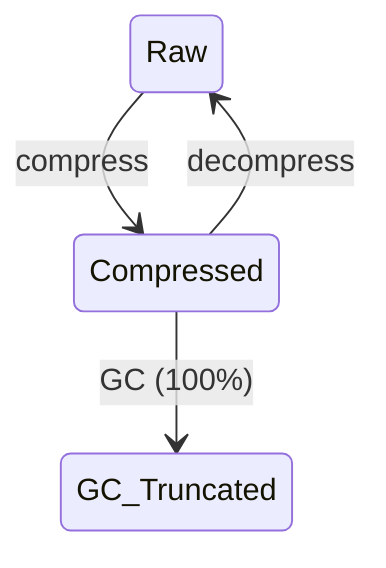

[English](./README.md) | [中文](./README.zh-CN.md)

<p align="center">
<strong>Active Context Pruning</strong> — <a href="https://opencode.ai">OpenCode</a> 的主动上下文剪枝插件
<br />
由模型决定<em>何时</em>压缩、压缩<em>什么</em> — 而非硬性截断。
</p>

---

<p align="center">
<a href="https://www.npmjs.com/package/opencode-acp"></a>
<a href="https://github.com/ranxianglei/opencode-acp/blob/master/LICENSE"></a>
<a href="https://github.com/ranxianglei/opencode-acp"></a>
</p>

<p align="center">
<code>opencode plugin opencode-acp@latest --global</code>
</p>

---

## 为什么选择 ACP

ACP 将上下文管理的所有权限全部交给模型自己，而不依靠外部模型或各种复杂的机制去做上下文管理。它是迄今为止，市面上对上下文管理最好的实现。

这带来两个影响：

- **省 token（约三分之二）。** 一个 100 万 token 上下文窗口的模型，实际只在 **20 万–30 万 token** 区间运行。
- **超长上下文不丢关键内容** —— 支持 **5 亿级别上下文、单会话 10 万条消息**。

---

## 实战验证

真实工程中的上下文情况。

**支持 5 亿级别 token，p95 上下文比例在 30% 左右，平均缓存命中率 85% 以上。**（注意这是平均缓存命中率，不是单会话命中率——后面[对 Prompt 缓存的影响](#对-prompt-缓存的影响)会解释，这实际上比传统压缩算法大幅度节省了 token。）

| | 会话一 | 会话二 |
|---|---|---|
| **消息总条数** | 3,024 | 2,028 |
| **累计处理 token** | 5.82 亿 | 4.63 亿 |
| **prompt-cache 命中率** | 86.2% | 89.0% |
| **上下文 p50（中位）** | 1.2 K（<1%） | 1.8 K（<1%） |
| **上下文 p75** | 2.8 K | 3.5 K |
| **上下文 p90** | 10.8 万（11%） | 5.8 万（6%） |
| **上下文 p95** | 25.1 万（25%） | 33.5 万（34%） |
| **上下文 p99** | 42.5 万（43%） | 44.2 万（44%） |
| **峰值** | 48.8 万（49%） | 76.9 万（77%） |

（上下文百分比均以 1M 窗口计。）

---

## 安装

```bash
opencode plugin opencode-acp@latest --global
```

或者添加到你的 opencode 配置中：

```json
{
  "plugin": {
    "opencode-acp": "latest"
  }
}
```

---

## 工作原理

ACP 把上下文压缩工具直接交给模型。模型对上下文压缩**负全责**。模型可用的工具主要是：**compress** 和 **decompress**。当上下文达到 100% 时，系统自动触发 GC 截断作为兜底。

### 生命周期

两个操作：**压缩**、**解压缩**。内容在原始与压缩之间循环。当上下文达到 100% 时，GC 自动截断老年代 block 作为兜底：



### 压缩策略

系统会注入一段 prompt，告诉模型当前的上下文比例、压缩比例、上下文是否空闲，以及压缩建议。当触发比例被命中时，内容按**优先级顺序**被压缩：

1. Agent/子代理的评审与咨询结果（最大一块未压缩内容）
2. 冗长的命令输出（构建/测试运行、git diff/log/status、目录列表）
3. 无结果的探索（失败的方法、死胡同式的搜索）
4. 冗余的工具结果（反复读同一个文件、重复的状态检查）
5. 已完成多步任务的中间步骤
6. 已尘埃落定的讨论（一旦决策被记录）
7. 已经用过的大段文件内容

压缩完成后，原始内容被一个简短的 **block** 替换，该 block 引用原始内容（可通过 `decompress` 恢复）。

### 解压策略

由模型决定何时解压。当上下文大到足以干扰模型的 self-attention 时，简短的 block 会让模型先压缩一部分内容，处理完紧急事务，再在后续工作中按需解压。

### GC 兜底

当上下文达到 100% 时，系统自动截断老年代 block 摘要，防止上下文溢出。这是最后的兜底机制，不影响模型的正常压缩/解压操作。

---

## 对 Prompt 缓存的影响

历史上 ACP 修复了大量由 DCP 导致的低缓存命中率问题。目前整体缓存命中率约为 **87%**。

相比传统压缩——只在 80–90% 时才压缩，一旦压缩就强制 100% 的上下文重新命中——ACP 的命中率实际上更高。

此外：ACP 大部分时间将总上下文维持在 **~30%** 左右，而传统方案是 50–80%。因此总 token 节省远高于传统压缩。

**结论：** ACP 在提高整体缓存命中率的同时，确保关键上下文信息不丢失。

---

## 命令

ACP 提供 `/acp` 斜杠命令（为向后兼容也接受 `/dcp`）：

| 命令 | 说明 |
|---------|------|
| `/acp` | 显示可用的 ACP 命令 |
| `/acp context` | 按类别（system、user、assistant、tools 等）显示 token 用量明细，以及通过剪枝节省的量 |
| `/acp stats` | 跨所有会话的累计剪枝统计 |
| `/acp sweep [n]` | 剪除自上次用户消息以来的所有工具。可选数量：`/acp sweep 10` 剪除最近 10 个工具。遵循 `commands.protectedTools` 设置 |
| `/acp manual [on\|off]` | 切换手动模式。开启后，AI 不会自动使用上下文管理工具 |
| `/acp compress [focus]` | 触发一次 `compress` 工具执行。可选的焦点文本指示要压缩的内容，遵循当前 `compress.mode` |
| `/acp decompress <n>` | 按 ID 恢复特定的活动压缩。不带参数运行时显示可用的压缩 ID、token 大小和主题 |
| `/acp recompress <n>` | 按 ID 重新应用用户解压的压缩。不带参数运行时显示可重新压缩的 ID、token 大小和主题 |

---

## 配置

ACP 使用自己的配置文件，按以下顺序搜索：

1. **全局：** `~/.config/opencode/acp.jsonc`（或 `acp.json`），首次运行时自动创建
2. **自定义配置目录：** `$OPENCODE_CONFIG_DIR/acp.jsonc`（或 `acp.json`），当设置了 `OPENCODE_CONFIG_DIR` 时
3. **项目级：** 项目 `.opencode` 目录下的 `.opencode/acp.jsonc`（或 `acp.json`）

如果未找到 `acp.jsonc`，ACP 会回退到 `dcp.jsonc` / `dcp.json`（用于与现有 DCP 安装向后兼容），并在首次写入时自动迁移。

每一层覆盖前一层，因此项目设置优先于全局设置。修改配置后请重启 OpenCode。

> [!IMPORTANT]
> **禁用 OpenCode 的内置自动压缩。** ACP 自行处理上下文管理 — OpenCode 的压缩与 ACP 冲突，可能导致问题（消息重新展开、压缩状态丢失）。请在 `opencode.json` 中添加：
>
> ```jsonc
> {
>   "compaction": {
>     "auto": false
>   }
> }
> ```
>
> 或设置环境变量：`OPENCODE_DISABLE_AUTOCOMPACT=1`

> [!NOTE]
> 如果你使用上下文窗口较小的模型（如 GitHub Copilot 模型或本地模型），请在配置中降低 `compress.minContextLimit` 和 `compress.maxContextLimit` 以匹配可用上下文。

<details>
<summary><strong>默认配置</strong>（点击展开）</summary>

```jsonc
{
    "$schema": "https://raw.githubusercontent.com/ranxianglei/opencode-acp/master/dcp.schema.json",
    // Enable or disable the plugin
    "enabled": true,
    // Automatically update npm-installed ACP when a newer npm latest is available.
    // Version-locked plugin specs are not updated.
    "autoUpdate": true,
    // Enable debug logging to ~/.config/opencode/logs/acp/
    "debug": false,
    // Notification display: "off", "minimal", or "detailed"
    "pruneNotification": "detailed",
    // Notification type: "chat" (in-conversation) or "toast" (system toast)
    "pruneNotificationType": "chat",
    // Slash commands configuration
    "commands": {
        "enabled": true,
        // Additional tools to protect from pruning via commands (e.g., /acp sweep)
        "protectedTools": [],
    },
    // Manual mode: disables autonomous context management,
    // tools only run when explicitly triggered via /acp commands
    "manualMode": {
        "enabled": false,
        // When true, automatic cleanup (deduplication, purgeErrors)
        // still runs even in manual mode
        "automaticStrategies": true,
    },
    // Protect from pruning for <turns> message turns past tool invocation
    "turnProtection": {
        "enabled": false,
        "turns": 4,
    },
    // Experimental settings
    "experimental": {
        // Allow ACP processing in subagent sessions
        "allowSubAgents": false,
        // Enable user-editable prompt overrides under dcp-prompts directories
        // When false (default), prompt override files/directories are ignored
        "customPrompts": false,
    },
    // Protect file operations from pruning via glob patterns
    // Patterns match tool parameters.filePath (e.g. read/write/edit)
    "protectedFilePatterns": [],
    // Unified context compression tool and behavior settings
    "compress": {
        // Compression mode: "range" (compress spans into block summaries)
        // or experimental "message" (compress individual raw messages)
        "mode": "range",
        // Permission mode: "allow" (no prompt), "ask" (prompt), "deny" (tool not registered)
        "permission": "allow",
        // Show compression content in a chat notification
        "showCompression": true,
        // Let active summary tokens extend the effective maxContextLimit
        "summaryBuffer": true,
        // Soft upper threshold: above this, ACP keeps injecting strong
        // compression nudges (based on nudgeFrequency), so compression is
        // much more likely. Accepts: number or "X%" of model context window.
        "maxContextLimit": "55%",
        // Soft lower threshold for reminder nudges: below this, turn/iteration
        // reminders are off (compression less likely). At/above this, reminders
        // are on. Accepts: number or "X%" of model context window.
        "minContextLimit": "45%",
        // Optional per-model override for maxContextLimit by providerID/modelID.
        // If present, this wins over the global maxContextLimit.
        // Accepts: number or "X%".
        // Example:
        // "modelMaxLimits": {
        //     "openai/gpt-5.3-codex": 120000,
        //     "anthropic/claude-sonnet-4.6": "80%"
        // },
        // Optional per-model override for minContextLimit.
        // If present, this wins over the global minContextLimit.
        // "modelMinLimits": {
        //     "openai/gpt-5.3-codex": 50000,
        //     "anthropic/claude-sonnet-4.6": "25%"
        // },
        // How often the context-limit nudge fires (1 = every fetch, 5 = every 5th)
        "nudgeFrequency": 5,
        // Start adding compression reminders after this many
        // messages have happened since the last user message
        "iterationNudgeThreshold": 15,
        // Controls how likely compression is after user messages
        // ("strong" = more likely, "soft" = less likely)
        "nudgeForce": "soft",
        // Tool names whose completed outputs are appended to the compression
        "protectedTools": [],
        // Preserve text wrapped in <protect>...</protect> when compressed
        "protectTags": false,
        // Preserve your messages during compression.
        // Warning: large copy-pasted prompts will never be compressed away
        "protectUserMessages": false,
    },
    // Automatic pruning strategies
    "strategies": {
        // Remove duplicate tool calls (same tool with same arguments)
        "deduplication": {
            "enabled": true,
            // Additional tools to protect from pruning
            "protectedTools": [],
        },
        // Prune tool inputs for errored tools after X turns
        "purgeErrors": {
            "enabled": true,
            // Number of turns before errored tool inputs are pruned
            "turns": 4,
            // Additional tools to protect from pruning
            "protectedTools": [],
        },
    },
    // 垃圾回收与批量清理
    "gc": {
        "algorithm": "truncate",
        // 存活此次数后从新生代晋升为老年代
        "promotionThreshold": 5,
        // 存活此次数后停用该块
        "maxBlockAge": 15,
        // 截断超过此长度（字符）的老年代摘要
        "maxOldGenSummaryLength": 3000,
        // 上下文使用率超过此值时执行主 GC（兜底，硬编码为 100%）
        "majorGcThresholdPercent": "100%",
    },
}
```

</details>

### Prompt 覆盖

ACP 暴露六个可编辑的 prompt：

- `system`
- `compress-range`
- `compress-message`
- `context-limit-nudge`
- `turn-nudge`
- `iteration-nudge`

此功能默认禁用。在 ACP 配置中将 `experimental.customPrompts` 设为 `true` 以激活。

启用后，托管的默认值会作为纯文本 prompt 文件写入 `~/.config/opencode/acp-prompts/defaults/`。该目录中的 `README.md` 解释了每个 prompt 以及如何创建覆盖。

要自定义行为，在覆盖目录下添加同名文件并作为纯文本编辑。

要重置覆盖，从覆盖目录中删除对应文件。

### 受保护工具

默认情况下，以下工具始终受保护不被剪枝：
`task`、`skill`、`todowrite`、`todoread`、`compress`、`decompress`、`batch`、`plan_enter`、`plan_exit`、`write`、`edit`

`commands` 和 `strategies` 中的 `protectedTools` 数组会添加到此默认列表。

对于 `compress` 工具，`compress.protectedTools` 确保特定工具的输出会被附加到压缩摘要中。默认包含 `task`、`skill`、`todowrite`、`todoread` 和 `decompress`。

---

## 从 DCP 迁移

ACP 是 DCP 的直接替代品。迁移步骤：

1. 从 `opencode.json` 中移除旧的 DCP 插件
2. 安装 ACP：`opencode plugin install opencode-acp@latest --global`
3. 重启 OpenCode

**保留的内容：**

- 会话状态（压缩块、消息 ID 映射） — 自动从 `plugin/dcp/` 迁移到 `~/.local/share/opencode/storage/plugin/acp/`
- 配置文件 `~/.config/opencode/dcp.jsonc` — ACP 自动迁移到 `acp.jsonc`
- `~/.config/opencode/dcp-prompts/` 中的 prompt 覆盖 — 自动迁移到 `acp-prompts/`

**变更的内容：**

- 存储目录：`plugin/dcp/` → `plugin/acp/`（首次启动时自动迁移）
- 日志目录：`logs/dcp/` → `logs/acp/`
- 斜杠命令：`/dcp` → `/acp`（两者均可用于向后兼容）
- 通知标题：`DCP` → `ACP`
- 上下文用量标签：`DCP threshold` → `ACP threshold`

ACP 在首次启动时自动将配置从 `dcp.jsonc` 迁移到 `acp.jsonc`，将 prompt 从 `dcp-prompts/` 迁移到 `acp-prompts/`。

---

<details>
<summary><strong>错误修复（共 37 项）</strong> — 基于 DCP v3.1.11</summary>

| # | 严重程度 | 摘要 |
|---|----------|------|
| 1 | 严重 | 状态在重启后未持久化 — messageIds、块停用、保存错误均静默丢失 |
| 2 | 严重 | resetOnCompaction() 清除所有压缩块 — 撤销所有剪枝工作 |
| 3 | 严重 | prune 静默丢弃摘要 — 当锚点前无用户消息时导致数据丢失 |
| 4 | 严重 | getCurrentTokenUsage 返回 0 — 导致 nudge 永远无法触发 |
| 5 | 高 | loadPruneMessagesState 重复 activeBlockIds + reasoning-strip 未定义保护缺失 |
| 6 | 高 | 合成摘要消息获得 mNNNN 引用但对边界查找不可见 |
| 7 | 高 | 状态在重启后未持久化 — messageIds、块停用和保存错误均静默丢失 |
| 8 | 高 | isMessageCompacted() 与压缩摘要消息处理不一致 |
| 9 | 高 | 已压缩的块摘要保留过时的 mNNNN 消息 ID 标签 — 模型复制过时 ID |
| 10 | 高 | 模型使用 nudge/摘要中的过时 mNNNN ID — compress 因 "startId not available" 失败 |
| 11 | 高 | 主 GC 跳过没有 generation 字段的旧块 — 过大的块永远不会被回收 |
| 12 | 高 | 基于百分比的阈值基于有效输入上下文而非完整模型上下文窗口计算 |
| 13 | 高 | 上下文窗口泄漏 — 压缩后的消息在 /compact 后重新出现 |
| 14 | 高 | 压缩通知将完整块摘要写入数据库 — 每条通知可达 150KB+ |
| 15 | 高 | npm 自动安装用上游包覆盖分支 |
| 16 | 高 | compress 输出中的摘要 mNNNN 引用 — 模型复制过时的消息 ID |
| 17 | 高 | 合成消息不在 messageIdToBlockId 中 — compress 无法找到它们 |
| 18 | 高 | compress 在压缩完成后阻止模型响应 |
| 19 | 高 | 动态块引导破坏 API 前缀缓存 |
| 20 | 高 | GC 从不停用旧块 — 死重无限累积 |
| 21 | 高 | Logger + tokenizer 每轮延迟 20-50 秒（268 倍减速） |
| 22 | 高 | compress 在块边界反转时抛出硬错误 — 模型放弃 |
| 23--34 | 中 | 去重、错误清除、schema 验证、hook 时序等方面的多项修复 |
| 35 | 高 | 在低上下文使用率（<50%）时显示老化警告 — 触发不必要的 compress，浪费 token |
| 36 | 高 | 压缩摘要作为独立的 user 消息插入在用户真实发言之前 — 模型把自己先前的 assistant 输出误读为用户输入，导致对话角色混乱 / 自问自答循环 |
| 37 | 高 | 消息转换管线对 OpenCode 隐藏的 title/summary/compaction agent 请求也运行 — 污染请求并破坏共享会话状态，导致会话标题生成失效 |

完整列表及根因分析，请参见 [Bug Tracker](https://github.com/ranxianglei/opencode-acp/issues)。

</details>

---

## 更新日志

### v1.8.2 — 始终注入系统提示词

**Bug 修复**：系统提示词门控（v1.8.1 commit `24bbb1f`）导致大上下文模型 binge 压缩。由于 ACP 注入是临时的（不持久化到对话历史），gate 掉系统提示词会让模型在两次 nudge 之间完全忘记压缩工具的存在。当 50K 增长后 nudge 触发时，模型恐慌性连续调用 95 次压缩。

**修复**：移除系统提示词 hook 的 `shouldInjectThisTurn` gate（`hooks.ts:108-112`）。系统提示词现在每轮都注入。Suffix 仍按 `nudgeGrowthTokens` 频率 gate。

**当前行为**：
- **系统提示词**（压缩哲学、工具意识）：✅ 每轮
- **Suffix**（上下文水平、块列表、Tips）：按 nudgeGrowthTokens 频率

---

### v1.8.1 — 自适应提醒频率 + 系统提示门控

**问题**：大上下文模型（1M+）在 20-30% 上下文时过度压缩，因为 Tips 每 6K tokens（1M 的 0.6%）就触发一次。系统提示每轮注入增加了持续压力。

**自适应 nudgeGrowthTokens**：
- 默认值现在自适应：`modelContextLimit` 的 5%，限制在 [6000, 50000]
  - 128K → 6.4K，200K → 10K，500K → 25K，1M → 50K，2M+ → 50K（上限）
- 用户仍可显式设置 `nudgeGrowthTokens` 覆盖
- 移除了 schema 默认值中的硬编码 `6000`（之前覆盖了自适应逻辑）

**系统提示门控**：
- SYSTEM 提示 + `<dcp-system-reminder>` 标签现在按 `nudgeGrowthTokens` 频率脉冲
- 两次提醒之间：系统提示**不注入任何内容** —— 零压缩噪音
- 第一轮（`undefined` 哨兵值）：始终注入（建立基线）

**新工具：`acp_status`**：
- 按需查看所有压缩块（ID、token 数、年龄、主题）
- 用一行摘要替代 suffix 中的冗长块列表：`Compressed blocks: N (XK summary, last Ym ago). Use acp_status for details.`

**压缩通知改进**：
- 头部显示上下文前后水平：`▣ ACP | Context 251.2K→249.3K`
- 不显示百分比或上限（防止模型锚定天花板）

**Bug 修复**：
- `lastPerMessageNudgeTokens` 压缩后重置为 `0` 绕过了增长检查（反馈循环）
- Schema 默认值 `6000` 覆盖了 `resolveAdaptiveNudgeGrowth()` —— 自适应从未生效
- `applyAnchoredNudges` + `injectContextUsage` 重复注入上下文使用文本
- `lastNudgeTokens === 0` 哨兵值替换为 `undefined`（明确的"从未触发"）

**工具链**：
- `scripts/dev-deploy.sh` —— 一键构建 + 部署（自动检测 node、类型检查、构建、部署）
- 压缩后状态转换集成测试（新增 3 个）
- `acp_status` 独立测试（新增 7 个）

---

### v1.8.0 — 原则驱动提示

**理念**：用 4 条简洁原则替代冗长的上下文管理指导。模型现在看到的是*重要原则*而非*死板规则*。

**提示变更**：
- 4 条原则替代 CONTEXT PRESSURE LEVELS、7 项优先级列表、DO NOT RE-COMPRESS 规则
- 上下文显示简化：仅显示绝对 token 数，不显示百分比
- `<acp-context>` 标签包裹（向后兼容 `<dcp-context>`）

**混合 Tips 频率**：
- 💡 轻量提示（15-45%）：每轮显示 — 不打扰
- ⚠️ 警告提示（45%+）：仅关键节点 — 首次跨越或增长 10pp，防止过度压缩

**配置简化**：
- 移除 `hardNudgeContextPercent` — 合并到 `minContextLimit`/`maxContextLimit`
- 移除 `perMessageNudgeGrowthPercent` — 轻量提示每轮显示
- `maxSummaryLength` 默认值：200 → 2000
- `maxSummaryLengthHard` 默认值：3000 → 4000

**Bug 修复**：
- Windows 路径校验：`os.tmpdir()` + `path.relative()`（原硬编码 `/tmp/`）
- 压缩检测后：重置警告追踪
- 死代码清理：`shouldInjectPerMessageNudge`、空操作模板

---

## 许可证

AGPL-3.0-or-later — 本项目是 [@tarquinen/opencode-dcp](https://github.com/Tarquinen/opencode-dynamic-context-pruning) 的分支。原始版权归原始作者所有。修改和错误修复由 ranxianglei 完成。
