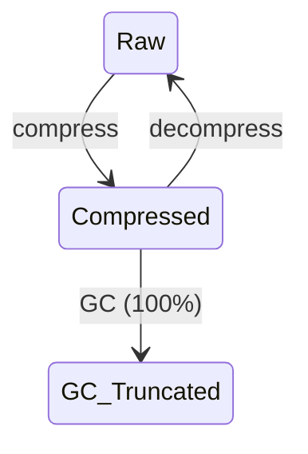

[English](./README.md) | [中文](./README.zh-CN.md)

<p align="center">
<strong>Active Context Pruning</strong> — <a href="https://opencode.ai">OpenCode</a> 的主动上下文剪枝插件
<br />
由模型决定<em>何时</em>压缩、压缩<em>什么</em> — 而非硬性截断。
</p>

---

<p align="center">
<a href="https://www.npmjs.com/package/opencode-acp"></a>
<a href="https://github.com/ranxianglei/opencode-acp/blob/master/LICENSE"></a>
<a href="https://github.com/ranxianglei/opencode-acp"></a>
</p>

<p align="center">
<code>opencode plugin opencode-acp@latest --global</code>
</p>

---

## 为什么选择 ACP

ACP 将上下文管理的所有权限全部交给模型自己，而不依靠外部模型或各种复杂的机制去做上下文管理。它是迄今为止，市面上对上下文管理最好的实现。

这带来两个影响：

- **省 token（约三分之二）。** 一个 100 万 token 上下文窗口的模型，实际只在 **20 万–30 万 token** 区间运行。
- **超长上下文不丢关键内容** —— 支持 **5 亿级别上下文、单会话 10 万条消息**。

---

## 实战验证

真实工程中的上下文情况。

**支持 5 亿级别 token，p95 上下文比例在 30% 左右，平均缓存命中率 85% 以上。**（注意这是平均缓存命中率，不是单会话命中率——后面[对 Prompt 缓存的影响](#对-prompt-缓存的影响)会解释，这实际上比传统压缩算法大幅度节省了 token。）

|                         | 会话一         | 会话二         |
| ----------------------- | -------------- | -------------- |
| **消息总条数**          | 3,024          | 2,028          |
| **累计处理 token**      | 5.82 亿        | 4.63 亿        |
| **prompt-cache 命中率** | 86.2%          | 89.0%          |
| **上下文 p50（中位）**  | 1.2 K（<1%）   | 1.8 K（<1%）   |
| **上下文 p75**          | 2.8 K          | 3.5 K          |
| **上下文 p90**          | 10.8 万（11%） | 5.8 万（6%）   |
| **上下文 p95**          | 25.1 万（25%） | 33.5 万（34%） |
| **上下文 p99**          | 42.5 万（43%） | 44.2 万（44%） |
| **峰值**                | 48.8 万（49%） | 76.9 万（77%） |

（上下文百分比均以 1M 窗口计。）

---

## 安装

```bash
opencode plugin opencode-acp@latest --global
```

或者添加到你的 opencode 配置中：

```json
{
    "plugin": {
        "opencode-acp": "latest"
    }
}
```

---

## 工作原理

ACP 把上下文压缩工具直接交给模型。模型对上下文压缩**负全责**。模型可用的工具主要是：**compress** 和 **decompress**。当上下文达到 100% 时，系统自动触发 GC 截断作为兜底。

### 生命周期

两个操作：**压缩**、**解压缩**。内容在原始与压缩之间循环。当上下文达到 100% 时，GC 自动截断老年代 block 作为兜底：



### 压缩策略

系统会注入一段 prompt，告诉模型当前的上下文比例、压缩比例、上下文是否空闲，以及压缩建议。当触发比例被命中时，内容按**优先级顺序**被压缩：

1. Agent/子代理的评审与咨询结果（最大一块未压缩内容）
2. 冗长的命令输出（构建/测试运行、git diff/log/status、目录列表）
3. 无结果的探索（失败的方法、死胡同式的搜索）
4. 冗余的工具结果（反复读同一个文件、重复的状态检查）
5. 已完成多步任务的中间步骤
6. 已尘埃落定的讨论（一旦决策被记录）
7. 已经用过的大段文件内容

压缩完成后，原始内容被一个简短的 **block** 替换，该 block 引用原始内容（可通过 `decompress` 恢复）。

### 解压策略

由模型决定何时解压。当上下文大到足以干扰模型的 self-attention 时，简短的 block 会让模型先压缩一部分内容，处理完紧急事务，再在后续工作中按需解压。

### GC 兜底

当上下文达到 100% 时，系统自动截断老年代 block 摘要，防止上下文溢出。这是最后的兜底机制，不影响模型的正常压缩/解压操作。

---

## 对 Prompt 缓存的影响

历史上 ACP 修复了大量由 DCP 导致的低缓存命中率问题。目前整体缓存命中率约为 **87%**。

相比传统压缩——只在 80–90% 时才压缩，一旦压缩就强制 100% 的上下文重新命中——ACP 的命中率实际上更高。

此外：ACP 大部分时间将总上下文维持在 **~30%** 左右，而传统方案是 50–80%。因此总 token 节省远高于传统压缩。

**结论：** ACP 在提高整体缓存命中率的同时，确保关键上下文信息不丢失。

---

## 命令

ACP 提供 `/acp` 斜杠命令（为向后兼容也接受 `/dcp`）：

| 命令                    | 说明                                                                                                                |
| ----------------------- | ------------------------------------------------------------------------------------------------------------------- |
| `/acp`                  | 显示可用的 ACP 命令                                                                                                 |
| `/acp context`          | 按类别（system、user、assistant、tools 等）显示 token 用量明细，以及通过剪枝节省的量                                |
| `/acp stats`            | 跨所有会话的累计剪枝统计                                                                                            |
| `/acp sweep [n]`        | 剪除自上次用户消息以来的所有工具。可选数量：`/acp sweep 10` 剪除最近 10 个工具。遵循 `commands.protectedTools` 设置 |
| `/acp manual [on\|off]` | 切换手动模式。开启后，AI 不会自动使用上下文管理工具                                                                 |
| `/acp compress [focus]` | 触发一次 `compress` 工具执行。可选的焦点文本指示要压缩的内容，遵循当前 `compress.mode`                              |
| `/acp decompress <n>`   | 按 ID 恢复特定的活动压缩。不带参数运行时显示可用的压缩 ID、token 大小和主题                                         |
| `/acp recompress <n>`   | 按 ID 重新应用用户解压的压缩。不带参数运行时显示可重新压缩的 ID、token 大小和主题                                   |

---

## 配置

ACP 使用自己的配置文件，按以下顺序搜索：

1. **全局：** `~/.config/opencode/acp.jsonc`（或 `acp.json`），首次运行时自动创建
2. **自定义配置目录：** `$OPENCODE_CONFIG_DIR/acp.jsonc`（或 `acp.json`），当设置了 `OPENCODE_CONFIG_DIR` 时
3. **项目级：** 项目 `.opencode` 目录下的 `.opencode/acp.jsonc`（或 `acp.json`）

如果未找到 `acp.jsonc`，ACP 会回退到 `dcp.jsonc` / `dcp.json`（用于与现有 DCP 安装向后兼容），并在首次写入时自动迁移。

每一层覆盖前一层，因此项目设置优先于全局设置。修改配置后请重启 OpenCode。

> [!IMPORTANT]
> **禁用 OpenCode 的内置自动压缩。** ACP 自行处理上下文管理 — OpenCode 的压缩与 ACP 冲突，可能导致问题（消息重新展开、压缩状态丢失）。请在 `opencode.json` 中添加：
>
> ```jsonc
> {
>     "compaction": {
>         "auto": false,
>     },
> }
> ```
>
> 或设置环境变量：`OPENCODE_DISABLE_AUTOCOMPACT=1`

> [!NOTE]
> 如果你使用上下文窗口较小的模型（如 GitHub Copilot 模型或本地模型），请在配置中降低 `compress.minContextLimit` 和 `compress.maxContextLimit` 以匹配可用上下文。

<details>
<summary><strong>默认配置</strong>（点击展开）</summary>

```jsonc
{
    "$schema": "https://raw.githubusercontent.com/ranxianglei/opencode-acp/master/dcp.schema.json",
    // Enable or disable the plugin
    "enabled": true,
    // Automatically update npm-installed ACP when a newer npm latest is available.
    // Version-locked plugin specs are not updated.
    "autoUpdate": true,
    // Enable debug logging to ~/.config/opencode/logs/acp/
    "debug": false,
    // Notification display: "off", "minimal", or "detailed"
    "pruneNotification": "detailed",
    // Notification type: "chat" (in-conversation) or "toast" (system toast)
    "pruneNotificationType": "chat",
    // Slash commands configuration
    "commands": {
        "enabled": true,
        // Additional tools to protect from pruning via commands (e.g., /acp sweep)
        "protectedTools": [],
    },
    // Manual mode: disables autonomous context management,
    // tools only run when explicitly triggered via /acp commands
    "manualMode": {
        "enabled": false,
        // When true, automatic cleanup (deduplication, purgeErrors)
        // still runs even in manual mode
        "automaticStrategies": true,
    },
    // Protect from pruning for <turns> message turns past tool invocation
    "turnProtection": {
        "enabled": false,
        "turns": 4,
    },
    // Experimental settings
    "experimental": {
        // Allow ACP processing in subagent sessions
        "allowSubAgents": false,
        // Enable user-editable prompt overrides under dcp-prompts directories
        // When false (default), prompt override files/directories are ignored
        "customPrompts": false,
    },
    // Protect file operations from pruning via glob patterns
    // Patterns match tool parameters.filePath (e.g. read/write/edit)
    "protectedFilePatterns": [],
    // Unified context compression tool and behavior settings
    "compress": {
        // Compression mode: "range" (compress spans into block summaries)
        // or experimental "message" (compress individual raw messages)
        "mode": "range",
        // Permission mode: "allow" (no prompt), "ask" (prompt), "deny" (tool not registered)
        "permission": "allow",
        // Show compression content in a chat notification
        "showCompression": true,
        // Let active summary tokens extend the effective maxContextLimit
        "summaryBuffer": true,
        // Soft upper threshold: above this, ACP keeps injecting strong
        // compression nudges (based on nudgeFrequency), so compression is
        // much more likely. Accepts: number or "X%" of model context window.
        "maxContextLimit": "55%",
        // Soft lower threshold for reminder nudges: below this, turn/iteration
        // reminders are off (compression less likely). At/above this, reminders
        // are on. Accepts: number or "X%" of model context window.
        "minContextLimit": "45%",
        // Optional per-model override for maxContextLimit by providerID/modelID.
        // If present, this wins over the global maxContextLimit.
        // Accepts: number or "X%".
        // Example:
        // "modelMaxLimits": {
        //     "openai/gpt-5.3-codex": 120000,
        //     "anthropic/claude-sonnet-4.6": "80%"
        // },
        // Optional per-model override for minContextLimit.
        // If present, this wins over the global minContextLimit.
        // "modelMinLimits": {
        //     "openai/gpt-5.3-codex": 50000,
        //     "anthropic/claude-sonnet-4.6": "25%"
        // },
        // How often the context-limit nudge fires (1 = every fetch, 5 = every 5th)
        "nudgeFrequency": 5,
        // Start adding compression reminders after this many
        // messages have happened since the last user message
        "iterationNudgeThreshold": 15,
        // Controls how likely compression is after user messages
        // ("strong" = more likely, "soft" = less likely)
        "nudgeForce": "soft",
        // Tool names whose completed outputs are appended to the compression
        "protectedTools": [],
        // Preserve text wrapped in <protect>...</protect> when compressed
        "protectTags": false,
        // Preserve your messages during compression.
        // Warning: large copy-pasted prompts will never be compressed away
        "protectUserMessages": false,
    },
    // Automatic pruning strategies
    "strategies": {
        // Remove duplicate tool calls (same tool with same arguments)
        "deduplication": {
            "enabled": true,
            // Additional tools to protect from pruning
            "protectedTools": [],
        },
        // Prune tool inputs for errored tools after X turns
        "purgeErrors": {
            "enabled": true,
            // Number of turns before errored tool inputs are pruned
            "turns": 4,
            // Additional tools to protect from pruning
            "protectedTools": [],
        },
    },
    // 垃圾回收与批量清理
    "gc": {
        "algorithm": "truncate",
        // 存活此次数后从新生代晋升为老年代
        "promotionThreshold": 5,
        // 存活此次数后停用该块
        "maxBlockAge": 15,
        // 截断超过此长度（字符）的老年代摘要
        "maxOldGenSummaryLength": 3000,
        // 上下文使用率超过此值时执行主 GC（兜底，硬编码为 100%）
        "majorGcThresholdPercent": "100%",
    },
}
```

</details>

### Prompt 覆盖

ACP 暴露六个可编辑的 prompt：

- `system`
- `compress-range`
- `compress-message`
- `context-limit-nudge`
- `turn-nudge`
- `iteration-nudge`

此功能默认禁用。在 ACP 配置中将 `experimental.customPrompts` 设为 `true` 以激活。

启用后，托管的默认值会作为纯文本 prompt 文件写入 `~/.config/opencode/acp-prompts/defaults/`。该目录中的 `README.md` 解释了每个 prompt 以及如何创建覆盖。

要自定义行为，在覆盖目录下添加同名文件并作为纯文本编辑。

要重置覆盖，从覆盖目录中删除对应文件。

### 受保护工具

默认情况下，以下工具始终受保护不被剪枝：
`task`、`skill`、`todowrite`、`todoread`、`compress`、`decompress`、`batch`、`plan_enter`、`plan_exit`、`write`、`edit`

`commands` 和 `strategies` 中的 `protectedTools` 数组会添加到此默认列表。

对于 `compress` 工具，`compress.protectedTools` 确保特定工具的输出被**硬排除**在压缩范围之外（v1.10.0+）。当模型压缩包含受保护工具消息的范围时，该消息完整保留在可见上下文中 — 只有周围的非受保护消息被压缩。默认包含 `task`、`skill`、`todowrite`、`todoread` 和 `decompress`。

---

## 从 DCP 迁移

ACP 是 DCP 的直接替代品。迁移步骤：

1. 从 `opencode.json` 中移除旧的 DCP 插件
2. 安装 ACP：`opencode plugin install opencode-acp@latest --global`
3. 重启 OpenCode

**保留的内容：**

- 会话状态（压缩块、消息 ID 映射） — 自动从 `plugin/dcp/` 迁移到 `~/.local/share/opencode/storage/plugin/acp/`
- 配置文件 `~/.config/opencode/dcp.jsonc` — ACP 自动迁移到 `acp.jsonc`
- `~/.config/opencode/dcp-prompts/` 中的 prompt 覆盖 — 自动迁移到 `acp-prompts/`

**变更的内容：**

- 存储目录：`plugin/dcp/` → `plugin/acp/`（首次启动时自动迁移）
- 日志目录：`logs/dcp/` → `logs/acp/`
- 斜杠命令：`/dcp` → `/acp`（两者均可用于向后兼容）
- 通知标题：`DCP` → `ACP`
- 上下文用量标签：`DCP threshold` → `ACP threshold`

ACP 在首次启动时自动将配置从 `dcp.jsonc` 迁移到 `acp.jsonc`，将 prompt 从 `dcp-prompts/` 迁移到 `acp-prompts/`。

---

<details>
<summary><strong>错误修复（共 39 项）</strong> — 基于 DCP v3.1.11</summary>

| #      | 严重程度 | 摘要                                                                                                                                    |
| ------ | -------- | --------------------------------------------------------------------------------------------------------------------------------------- |
| 1      | 严重     | 状态在重启后未持久化 — messageIds、块停用、保存错误均静默丢失                                                                           |
| 2      | 严重     | resetOnCompaction() 清除所有压缩块 — 撤销所有剪枝工作                                                                                   |
| 3      | 严重     | prune 静默丢弃摘要 — 当锚点前无用户消息时导致数据丢失                                                                                   |
| 4      | 严重     | getCurrentTokenUsage 返回 0 — 导致 nudge 永远无法触发                                                                                   |
| 5      | 高       | loadPruneMessagesState 重复 activeBlockIds + reasoning-strip 未定义保护缺失                                                             |
| 6      | 高       | 合成摘要消息获得 mNNNN 引用但对边界查找不可见                                                                                           |
| 7      | 高       | 状态在重启后未持久化 — messageIds、块停用和保存错误均静默丢失                                                                           |
| 8      | 高       | isMessageCompacted() 与压缩摘要消息处理不一致                                                                                           |
| 9      | 高       | 已压缩的块摘要保留过时的 mNNNN 消息 ID 标签 — 模型复制过时 ID                                                                           |
| 10     | 高       | 模型使用 nudge/摘要中的过时 mNNNN ID — compress 因 "startId not available" 失败                                                         |
| 11     | 高       | 主 GC 跳过没有 generation 字段的旧块 — 过大的块永远不会被回收                                                                           |
| 12     | 高       | 基于百分比的阈值基于有效输入上下文而非完整模型上下文窗口计算                                                                            |
| 13     | 高       | 上下文窗口泄漏 — 压缩后的消息在 /compact 后重新出现                                                                                     |
| 14     | 高       | 压缩通知将完整块摘要写入数据库 — 每条通知可达 150KB+                                                                                    |
| 15     | 高       | npm 自动安装用上游包覆盖分支                                                                                                            |
| 16     | 高       | compress 输出中的摘要 mNNNN 引用 — 模型复制过时的消息 ID                                                                                |
| 17     | 高       | 合成消息不在 messageIdToBlockId 中 — compress 无法找到它们                                                                              |
| 18     | 高       | compress 在压缩完成后阻止模型响应                                                                                                       |
| 19     | 高       | 动态块引导破坏 API 前缀缓存                                                                                                             |
| 20     | 高       | GC 从不停用旧块 — 死重无限累积                                                                                                          |
| 21     | 高       | Logger + tokenizer 每轮延迟 20-50 秒（268 倍减速）                                                                                      |
| 22     | 高       | compress 在块边界反转时抛出硬错误 — 模型放弃                                                                                            |
| 23--34 | 中       | 去重、错误清除、schema 验证、hook 时序等方面的多项修复                                                                                  |
| 35     | 高       | 在低上下文使用率（<50%）时显示老化警告 — 触发不必要的 compress，浪费 token                                                              |
| 36     | 高       | 压缩摘要作为独立的 user 消息插入在用户真实发言之前 — 模型把自己先前的 assistant 输出误读为用户输入，导致对话角色混乱 / 自问自答循环     |
| 37     | 高       | 消息转换管线对 OpenCode 隐藏的 title/summary/compaction agent 请求也运行 — 污染请求并破坏共享会话状态，导致会话标题生成失效             |
| 38     | 严重     | pruneToolOutputs/pruneToolInputs/pruneToolErrors 原地修改现有消息 — 破坏 LLM 前缀缓存，导致 89% 的新鲜输入 token 浪费在缓存失效的重发上 |
| 39     | 高       | 受保护工具输出（skill/task/todowrite）在压缩时仅软保护 — 追加到摘要后从上下文中剪枝，丧失语义权威且易被 GC 截断。v1.10.0 用硬排除修复   |

完整列表及根因分析，请参见 [Bug Tracker](https://github.com/ranxianglei/opencode-acp/issues)。

</details>

---

## 更新日志

### v1.13.0 — 批量压缩 + Decompress 范围模式 + GC 记忆丢失修复 + Token 分类 + Nudge 质量（PR #73, #155, #156, #157, #158, #159, #161）

**问题**：七个问题，涉及压缩 UX、token 统计、GC 安全和 nudge 质量。（1）`decompress` 需要先 `acp_status` 再逐块 decompress 的循环才能恢复多个压缩块。（2）自 v1.12.9 起，compress 工具的 `summary` 内容被错误分类为 `toolTokens` 而非 `summaryTokens`，导致上下文分布中 tool% 虚高、summary% 虚低。（3）`compress` 工具每次调用只能压缩一个范围 —— 模型需要多次调用才能压缩不相关的范围，浪费轮次。（4）`[PROTECTED: ...]` 标签列出受保护消息中的所有工具而非仅触发保护的工具。（5）当所有可见内容都是受保护内容时，nudge 仍然以空推荐列表注入。（6）当 nudge 被抑制时，下一轮检查每轮都重新评估。（7）**GC 系统在静默销毁模型编写的 summary**：任何 `summary.length > 6000` 字符的块在零上下文压力下被强制截断到 3000，且 `survivedCount` 过高的块被自动 deactivate —— 导致数百个会话的不可恢复记忆丢失。

**修复**：（1）**PR #73** —— 为 `decompress` schema 新增可选 `startId`/`endId`；范围模式批量恢复所有 `effectiveMessageIds` 与解析范围重叠的活跃块。（2）**PR #155** —— 在 `estimateContextComposition` 中，当 `toolName === "compress"` 时，提取 `summary` 文本并分类为 `summaryTokens`。（3）**PR #156** —— `compress` 工具现在接受 `content` 数组（`{ topic, startId, endId, summary }`），允许模型在单次调用中压缩多个不相关范围，每个范围有独立 topic。（4）**PR #157** —— `buildCompressibleRanges` 只添加实际触发保护的工具。（5）**PR #158** —— 新增 `allProtected` 检查，当确实没有可压缩内容时抑制 nudge。（6）**PR #159** —— 当 nudge 被抑制时，将 `lastPerMessageNudgeTokens` 前进到 `currentTokens`，创建离散 5% 检查间隔。（7）**PR #161** —— 删除 GC oversized-block 旁路（`hasOversizedBlocks`，在 0% 上下文压力下截断）和 age-based 自动 deactivate 循环。截断现在只在 `majorGcThresholdPercent`（默认 100%）时触发。`gc.maxBlockAge` 变为 no-op。aging warning 门槛从 50% 提高到 90%，不再误导模型。

文件：`lib/hooks.ts`、`lib/config.ts`、`lib/prompts/extensions/nudge.ts`、`lib/compress/decompress.ts`、`lib/compress/decompress-logic.ts`、`lib/messages/inject/utils.ts`、`lib/messages/inject/inject.ts`。测试：758 通过。

### v1.12.9 — Compress-as-Anchor（PR #153）

**问题**：自 v1.12.1 起，压缩摘要通过注册的 `acp_context_recap` 工具以 synthetic tool-result 消息注入，同时 `stripStaleCompressCalls` 从 API 上下文中移除历史 `compress` 工具调用以避免重复。这导致摘要开销翻倍：每个块的摘要同时存在于 synthetic recap 消息和原始（已移除的）compress 调用的 `summary` 参数中。对于压缩频繁的会话，这个 "recap 开销" 占用 10–20% 上下文却没有额外信息价值。`acp_context_recap` 工具描述也声称它"自动注入"摘要，具有误导性。

**修复**：完全移除 synthetic recap 注入。压缩摘要现在保留在**模型自己的历史 `compress` 工具调用中** —— 每个历史 `compress({ summary: "..." })` 调用的 `summary` 参数作为锚点，像其他工具调用一样对模型可见。删除了 `createSyntheticToolRecap`（prune.ts）、`stripStaleCompressCalls`（prune.ts）和自动 recap 注入路径。`acp_context_recap` 工具改为手动调用（模型可调用以重新获取滚动出上下文的摘要）。更新 `system.ts` 提示描述 compress-as-anchor 行为，警告不要不经 `acp_status` 验证就重用历史 `startId`/`endId`。更新 `RECAP_TOOL_DESCRIPTION` 反映手动调用语义。净效果：压缩频繁会话的摘要开销减少约 50%。

文件：`lib/messages/prune.ts`、`lib/messages/utils.ts`、`lib/compress/recap.ts`、`lib/prompts/system.ts`。测试：更新为 compress-anchor 行为；725 通过。

### v1.12.8 — 幽灵块拒绝（PR #148）

**问题**：当模型对已被活跃压缩块覆盖的范围调用 `compress` 时，`applyCompressionState` 仍然创建新块，`directMessageIds: []`、`compressedTokens: 0`、`effectiveMessageIds` 从被消费的块继承。模型在通知中看到"移除 0 tokens"，重试同一范围，进入死亡循环：每个幽灵块增加约 1K 摘要开销却什么都不压缩，导致上下文随每次压缩调用*增长*（issues #93, #135）。用户会话显示同一范围连续 9 次幽灵压缩（b12–b20），直到用户手动干预。

**修复**：新增 `checkPhantomBlock()` —— `lib/compress/pipeline.ts` 中的无状态前置检查，镜像 `applyCompressionState` 的 `newlyCompressedMessageIds` 计算。对每个计划，构建有效消息集（计划消息 + 被消费块的有效消息），检查是否有任何消息是"新的"（即变异前没有活跃块覆盖它）。如果没有新消息，该计划是幽灵的，整个 compress 调用在任何状态变异前以清晰错误被拒绝。接入 range 模式（`compress/range.ts`）和 message 模式（`compress/message.ts`）的计划准备之后、快照之前。12 个测试覆盖：空计划、全新消息、被消费块继承、GC'd 消息（已停用块算新）、以及与 `applyCompressionState` 的精确镜像。

文件：`lib/compress/pipeline.ts`、`lib/compress/range.ts`、`lib/compress/message.ts`。测试：`tests/phantom-block.test.ts`（新增，12 个测试）。725 测试通过。

### v1.12.7 — 智能推荐过滤 + Dangerous 参数 + Ref 泄漏修复 + Phantom Turn 修复（PR #142, #147, #150）

**问题**：四个问题。（1）推荐过滤器使用硬编码的 5× 增长阈值（上下文的 25%），太大且容易泄露上下文；推荐最后一段的同时又阻止它，自相矛盾。（2）过滤器抑制所有 range 后仍然注入 nudge 文本——用空推荐列表浪费上下文。（3）压缩块元数据通过 `acp_context_recap` 工具输入、`acp_status` 输出和 `recap` 工具输出泄漏消息 ref（`m01309–m02150`）——模型复制这些 ref 到已压缩范围的 compress 调用中，产生幽灵块（#93, #135）。（4）`sendIgnoredMessage` 在 transform hook 中持久化 ignored 用户消息，异步在模型回复后完成——loop 的 `lastUser` 检测拾取它 → 无新输入的 phantom LLM 调用 → 困惑 → 幻觉 → 反馈循环（"待命" 刷屏）。

**修复**：（1）重写 `filterRecommendedRanges`：最后一段 < 2× 增长阈值 → 剔除；≥ 2× → 保留并标记 `dangerous: true`。无状态 `dangerous?: boolean` 参数替代状态追踪 soft-block。净减 70 行。（2）过滤器无推荐时抑制 nudge 文本注入。（3）停止泄漏消息 ref：`acp_context_recap` 工具输入改为 `messages: <数量>`；`acp_status` 和 `recap` 工具输出改为 `N msgs`。（4）Debug nudge 通知改用 `client.tui.showToast()`（瞬态，不持久化）+ `logger.debug()`（文件日志），彻底打破 phantom-turn 反馈循环。`dev-deploy.sh` 自动 bump 版本到 npm 最新之上防止重启覆盖。

文件：`lib/messages/inject/utils.ts`、`lib/messages/inject/inject.ts`、`lib/compress/pipeline.ts`、`lib/compress/range.ts`、`lib/compress/message.ts`、`lib/messages/prune.ts`、`lib/messages/utils.ts`、`lib/compress/recap.ts`、`lib/compress/status.ts`、`lib/ui/notification.ts`、`lib/prompts/system.ts`、`lib/hooks.ts`、`scripts/dev-deploy.sh`。测试：725 通过。

### v1.12.6 — Stale contextLimitAnchors 修复（PR #143）

**问题**：`contextLimitAnchors` 仅在 `overMaxLimit=true` 时添加，但只在当前 turn 有 compress 调用时 (`currentTurnHasCompress`) 才清除。如果上下文通过其他机制（OpenCode compaction、外部消息删除）降到 `maxLimit` 以下，anchors 保持 stale → `applyAnchoredNudges` 持续注入 "⚠️ Context limit reached" 模板，即使实际上下文很低（低至 10%）。

**修复**：在 `lib/messages/inject/inject.ts` 添加 `else` 分支，当 `!overMaxLimit` 时清除 `contextLimitAnchors`，与已有的 `!overMinLimit` 清除 turn/iteration anchors 逻辑对称。3 个回归测试（state 级、prompt marker 集成、sub-minLimit 清除）。双 agent review（Oracle + 独立 reviewer，均 APPROVE）。

文件：`lib/messages/inject/inject.ts`。测试：`tests/inject.test.ts`。691 测试通过。

### v1.12.5 — Bug 20 抑制修复 + 增长下限门控修正（PR #139, #140）

**问题**：v1.12.4 后引入的两个 nudge 抑制逻辑 bug。（1）`isContextOverLimits` 的 Bug 20 抑制检查 `(part as any).type === "tool-invocation" && (part as any).toolInvocation?.toolName === "compress"` —— 这个消息部件格式在 SDK 中根本不存在（代码库中其他 18+ 处工具类型检查全部使用 `part.type === "tool" && part.tool === "compress"`）。抑制逻辑永不匹配，所以压缩后 `overMaxLimit` 从不置 false → max-limit 告警每轮触发 → 过度压缩正反馈循环。（2）增长下限门控（PR #134）使 `growthFloor` 成为 `nudgeAllowed` 的唯一 gate，丢弃了 `decision.shouldNudge` 要求 —— 意味着即使增长为负，只要满足增长下限条件 nudge 就会触发。

**修复**：（1）PR #139：将格式检查改为 `part.type === "tool" && part.tool === "compress"`，移除了 `(part as any)` 类型断言。抑制现在正确检测最近消息中的 compress 工具调用并重置 `overMaxLimit`。（2）PR #140：`nudgeAllowed` 现在要求 `decision.shouldNudge || emergencyOverride`，恢复预期的双条件门控。

文件：`lib/messages/inject/utils.ts`（Bug 20 修复）、`lib/messages/inject/inject.ts`（增长下限修正）。688 测试通过。

### v1.12.4 — 保护感知统计 + Nudge 范围修复 + 增长下限门控（PR #132, #133, #134）

**问题**：v1.12.3 以来三个问题。（1）`buildCompressibleRanges` 和 `estimateContextComposition` 将所有消息列为可压缩，静默包含受保护工具输出 → 模型看到虚高的范围，压缩后大部分被过滤 → 无效压缩和混乱统计。（2）当 nudge anchors 激活（context 超过 minLimit）但增长低于节奏阈值时，nudge 文本触发但可压缩范围列表被增长节奏门控 → 模型看到"立即压缩"但没有范围。（3）修复 #2 后，模型可能每轮被 nudge（turn anchors 每轮重新添加）→ thrashing 风险。

**修复**：（1）PR #132：`buildCompressibleRanges`、`estimateContextComposition`、`acp_status` 现在跳过受保护工具/文件。逐范围保护详情，混合可压缩+受保护显示。（2）PR #134：放宽 nudge 输出，当 anchors 激活时无论增长节奏都触发。（3）PR #134：新增增长下限门控 — 除非 context 自上次 nudge 增长了 `max(minNudgeGrowthFloor, minNudgeGrowthRatio × nudgeGrowthTokens)` tokens，否则 nudge 被抑制，紧急覆盖在 `emergencyThresholdPercent`（98%）。同时将 `minCompressRange` 默认值 2000→5000。PR #133：`getCurrentTokenUsage` 接受仅输入 token 数据（output=0 修复）。Oracle 审查通过。

文件：`lib/messages/inject/inject.ts`、`lib/messages/inject/utils.ts`、`lib/compress/status.ts`、`lib/config.ts`、`lib/config-validation.ts`、`lib/token-utils.ts`、`dcp.schema.json`。测试：`tests/inject.test.ts`、`tests/config-validation.test.ts`、`tests/protection-aware-stats.test.ts`、`tests/token-counting.test.ts`。688 个测试通过。

### v1.12.3 — 正则标签碎片泄漏修复（PR #130）

**问题**：`lib/messages/utils.ts` 中三个正则表达式缺少开标签 `<` 和标签名匹配，导致 ACP 内部 XML 标签碎片和过期消息 ID 在多轮压缩后泄漏到用户可见的对话框中（issue #123）。

**修复**：（1）`DCP_PAIRED_TAG_REGEX`（第 14 行）：`]*>` 匹配任意 `>` 字符 → 修正为 `<(?:dcp|acp)[^>]*>`。（2）`DCP_BLOCK_ID_TAG_REGEX`（第 11 行）：`(])` 要求字面量 `]` → `replaceBlockIdsWithBlocked` 完全失效 → 修正为 `(<(?:dcp|acp)-message-id[^>]*>)`。（3）`DCP_MESSAGE_REF_TAG_REGEX`（第 13 行）：只匹配 `m\d+</closing>` → 残留 `<dcp-message-id ...>` 开标签碎片 → 补上开标签匹配。取代 PR #124。

文件：`lib/messages/utils.ts`。测试：`tests/regex-tag-leak.test.ts`（新增，23 个测试）。666 个测试通过。

### v1.12.2 — 压缩失败回滚 + Sync carve-out 移除（PR #126）

**问题**：压缩失败后的处理存在两个 bug（issue #125）。（1）compress 工具在内存中增量修改状态，没有 try/catch——如果在 `applyCompressionState` 和 `finalizeSession` 之间抛出异常，"幽灵块"（未持久化的活跃块）会在后续 transform 中隐藏消息。（2）`syncCompressionBlocks` 有一个 carve-out：当块的锚点从消息中缺失但在 `byMessageId` 中有记录时，块保持活跃。这个 carve-out 本意是保护 ACP 隐藏的锚点，但 sync 运行在原始消息列表上（在过滤之前），所以它只在外部删除的锚点场景触发 → 块保持活跃但无法注入摘要 → 隐藏消息无替换 → **LLM 请求为空**。

**修复**：（1）在 `lib/compress/pipeline.ts` 中新增 `snapshotCompressionState()` / `restoreCompressionState()`（使用 `structuredClone`）。在 `lib/compress/range.ts` 和 `lib/compress/message.ts` 中用 try/catch 包裹变更阶段。失败时，状态（包括 `manualMode`）恢复到变更前的快照——不会有幽灵块。（2）移除 `lib/messages/sync.ts` 中的 carve-out。锚点从消息中缺失时，总是停用块。经 Oracle 审查。

文件：`lib/messages/sync.ts`、`lib/compress/pipeline.ts`、`lib/compress/range.ts`、`lib/compress/message.ts`。测试：`tests/sync.test.ts`（更新）、`tests/compress-rollback.test.ts`（新增，4 个测试）。643 个测试通过。

### v1.12.1 — 压缩摘要注入修复 + 历史压缩调用剥离（PR #119）

**问题**：`acp_context_recap` 用于创建合成的 tool-result 摘要消息，但未注册为真实工具——provider 可能剥离/转换未注册的 tool-result，导致模型将压缩摘要视为纯文本或用户消息（回声/漂移 bug）。此外，compress 工具调用的输入与 block recap 内容重复占用上下文。

**修复**：将 `acp_context_recap` 注册为真实工具（`lib/compress/recap.ts`），使 provider 正确序列化 tool-result。新增 `stripStaleCompressCalls`（`lib/messages/prune.ts`），剥离历史轮次的 compress 工具调用部分。同时修复：KEEP/REF 正则归一化（`m150` → `m00150`）、message 模式下 `resolveKeepMarkers` 调用、toast 通知 `replace()` 失败、通知范围显示（`→ Range: b20: m00150–m00155`）、压缩后比例基线调整，并回退了有问题的 `postCompressRangesShown` 功能。

文件：`lib/compress/recap.ts`（新增）、`lib/messages/prune.ts`、`lib/compress/keep-markers.ts`、`lib/compress/message.ts`、`lib/messages/inject/inject.ts`、`lib/ui/notification.ts`。测试：`tests/strip-stale-compress.test.ts`（新增，7 个测试）。经 Oracle 审查。

### v1.12.0 — 基线泄露修复 + KEEP/REF 标记 + 可压缩范围（PR #115）

Issue #23（上下文内存泄露）的综合修复。7 个 commit，22 个文件，851 行新增，327 行删除。

**基线泄露修复**：压缩后模型在同一轮继续工作，上下文从 ~78K 膨胀到 ~150K。每次 transform 重新建立 nudge 基线到膨胀后的值，泄露 72K 余量。修复：`compressBaselineSet` 锁标志只在首次 post-compress transform 设基线；全轮扫描（`messages.slice(currentTurnStart).some(...)`）替换仅检查最后一条 assistant 消息。

**KEEP/REF 标记**：模型过度摘要因为无法精确重打大段内容。`[[KEEP:mNNNNN]]` 自动展开原始消息内容（截断到 2000 字符）。`[[REF:mNNNNN|描述]]` 生成紧凑链接。解析在摘要定稿后、包装前执行。

**可压缩范围**：用按需分组范围替换基于大小的"最大代码/文本消息"列表。显示所有范围，带间隔检测（不会跨越压缩洞）。nudge 现在说"压缩所有列出的范围"而不是推荐特定大项。

**压缩哲学（5 条）**：基于需要的指导替换基于大小的推荐——按需压缩而非按百分比，基于摘要工作而非原始输出，用 KEEP/REF 策展关键内容。

**其他修复**：移除 `toolOutputReminder`（绕过自适应阈值，导致过度压缩）；`acp_status` 默认 = 可压缩范围视图；调试 nudge（`config.debug` → 终端输出）；`baselineCorrected` 持久化修复；Bug 14 截断（detailed 通知：10K 字符）；系统提示 5 处修复；多块通知空摘要修复。经 Oracle 审查。

文件：`lib/messages/inject/inject.ts`、`lib/compress/keep-markers.ts`、`lib/messages/inject/utils.ts`、`lib/compress/status.ts`、`lib/prompts/compression-rules.ts`、`lib/prompts/system.ts`、`lib/state/`、`lib/ui/notification.ts`、`lib/hooks.ts`。测试：630 通过。

---

### v1.11.4 — 基线持久化修复 + 统一发布工作流（PR #112, #113）

**Bug 修复（PR #112）**：压缩后 baseline 设为 `undefined`，下一轮重建为真实值但**不写盘**（save 条件为 false）。重启后 nudge 失效。修复：新增 `baselineReEstablished` flag 加入 save 条件。同时修复 `writePersistedSessionState` 异步竞态（文件路径在 `await` 之后解析）。

**CI 修复（PR #113）**：合并 `auto-tag.yml` + `release.yml` 为单一工作流。GitHub Actions `GITHUB_TOKEN` 无法链式触发 workflow——auto-tag push 的 tag 不会触发 release.yml。

文件：`lib/messages/inject/inject.ts`、`lib/state/persistence.ts`。测试：`tests/inject.test.ts`（+94 行，2 个新 E2E 测试）。

---

### v1.11.3 — 发布分支合并自动打 Tag（PR #111）

**问题**：合并发布 PR 后，仍需手动 push 版本 tag（`v{VERSION}`）——容易遗忘。

**修复**：新增 `auto-tag.yml` 工作流。当 `YYYY-MM-DD_release-v*` 分支合并到 master 时，CI 自动读取 `package.json` 版本号，创建并 push tag。Tag push 随即触发 `release.yml` 自动发布。普通分支误改版本号不会触发。

文件：`.github/workflows/auto-tag.yml`。AGENTS.md Section 5.4 已更新。

---

### v1.11.2 — CI 自动校验 & 自动发布（PR #104）

新增 GitHub Actions CI 自动执行 AGENTS.md 规范：

- **PR 校验**（`pr-checks.yml`）：每个到 master 的 PR 自动检查分支名规范（`YYYY-MM-DD_short-title`）、devlog 是否存在（`devlog/{分支}/REQ.md` + `WORKLOG.md`）、版本号变更时 changelog 是否更新。
- **自动发布**（`release.yml`）：push `v*` tag 后自动执行 `npm ci` → `npm run check:package` → `npm test` → `npm publish` → GitHub Release，全自动。
- 脚本：`scripts/ci/check-pr.sh` — 可复用的 PR 校验逻辑。

需要在 GitHub Secrets 中配置 `NPM_TOKEN`。

---

### v1.11.1 — 压缩基线修复（PR #99）

**问题**：当模型调用 `compress` 时，`lastPerMessageNudgeTokens` 和 `lastToolOutputNudgeTokens` 都被设为 `currentTokens` —— 这是调用 compress 的 assistant 消息的 token 计数，反映的是**压缩前**的上下文。压缩 100K→50K 后，基线卡在 100K，导致 `growth = 50K - 100K = -50K`，nudge 永远不再触发。

**修复**：压缩时将两个基线都设为 `undefined`。下一次 message-transform 运行时从真实的压缩后 API token 计数重建基线，不会误触发 nudge（`computeShouldNudge` 在基线为 `undefined` 时返回 `shouldNudge: false`）。

文件：`lib/messages/inject/inject.ts`（第 98-99 行）。测试：`tests/inject.test.ts` — 3 个更新 + 2 个新增（共 621 个测试，0 失败）。

---

### v1.11.0 — 工具结果注入、上下文分解 & Fork 重建

本次发布修复了两个关键压缩注入 bug（#20 复读、#78 漂移），为 `acp_status` 添加了可见上下文分解，并引入了 fork 重建机制。

#### 工具结果注入 — 修复 #20 & #78（PR #95）

**问题**：压缩摘要以文本形式的 `role:assistant` 或 `role:user` 消息注入。两种角色都会误导模型：
- `role:assistant`（Bug 37 路径）→ 模型将摘要当作自己的前文，逐字复读（#20，GLM-5.2）。
- `role:user`（Bug 36 合并路径）→ 模型将摘要当作用户指令，去执行旧话题（#78，gpt-5.5）。

**修复**：摘要现在以合成的 **tool-call + tool-result** 对注入（`acp_context_recap`）。在 API 层面，模型看到的是 `role:"tool"` —— 一个中立角色，表示「工具返回的数据」，既不是指令也不是自己的前文。这同时消除了复读（#20）和漂移（#78），不破坏前缀缓存（mid-stream 注入，system prompt 不变），且跨所有 provider 兼容。

#### acp_status 可见上下文分解（PR #91）

`acp_status` 现在显示按类别（tool/code/text/summaries）的 token 分解，并标识最大项。新增下钻参数：`scope:"uncompressed"` + 可选 `tool:"bash"` 过滤和 `sort:"size"`。简化了 nudge 注入 —— 移除了 mini breakdown 和 Top blocks，替换为更清晰的按工具类型分解。

#### Fork 重建 & Prune 工具（PR #90）

新增 `lib/state/rebuild.ts` —— 在 session fork 后重建压缩状态以防止上下文溢出。新增 `lib/compress/prune-tool.ts` —— 独立的 `prune` 工具，按类型（`toolType` 参数）移除旧工具输出，与 `compress` 工具分离以提高安全性。

#### 移除 todowrite/todoread 的默认保护（PR #87）

从 `compress.protectedTools` 默认配置中移除了 `todowrite` 和 `todoread`，使旧 todowrite 状态可以正常被压缩。

---

### v1.10.2 — 受保护工具默认配置更新（PR #87）

从 `compress.protectedTools` 默认配置中移除了 `todowrite` 和 `todoread`。这些工具的输出在长会话中累积，应像其他工具输出一样可被压缩。如需保持保护，可在配置中设置 `compress.protectedTools: ["todowrite", "todoread"]`。

---

本次发布合并了 7 个 PR。核心变更是**受保护工具消息硬排除**；其余为同期合入的修复和提示词重写。

#### Bug 39 — 受保护工具硬排除（issue #16, PR #75）

**问题**：受保护工具消息（`skill`、`task`、`todowrite` 等）在压缩时只有*软保护*。当模型对包含 skill 输出的范围调用 `compress` 时，原始消息从可见上下文中被剪枝，其内容被追加到摘要块中。这导致两个问题：

1. **语义丢失**：skill 内容变成历史回顾元数据（`[ACP SYSTEM METADATA — recap...]`），不再是活跃指令。模型将其视为过去的产物，而非当前的指导。
2. **GC 数据丢失**：当块晋升为 old-gen 且摘要超过 `maxOldGenSummaryLength`（3000 字符）时，`runTruncateGC` 截断整个摘要 — 包括追加的 skill 内容。skill 输出（通常 2–10 KB）被静默销毁。

**修复**：受保护工具消息现在被**硬排除**在压缩范围之外。当模型对包含受保护工具输出的范围调用 `compress(startId, endId)` 时，这些消息在 `applyCompressionState` 运行*之前*就从选择中被过滤掉。受保护消息完整保留在可见上下文中；只有周围的非受保护消息被压缩。

过滤器在 range 模式（`lib/compress/range.ts`）和 message 模式（`lib/compress/message.ts`）中均生效。使用现有的 `compress.protectedTools` 配置（默认：`task`、`skill`、`todowrite`、`todoread`、`decompress`）和通用的 `isToolNameProtected` 匹配器。

**验证**：实时测试 — 加载 `git-master` skill，然后压缩覆盖 skill 输出的范围。skill 消息（m00170）在压缩后存活；范围内 22 条消息中只有 15 条被压缩（7 条受保护消息正确排除）。测试：`tests/compress-protected-exclusion.test.ts` 中 29 个专用测试。

**兼容性**：无配置变更，无持久化 state schema 变更。现有的 `appendProtectedTools` 软保护逻辑作为兜底保留。

#### 压缩格式提示词重写（issue #13, PR #72）

`compress` 工具的摘要格式指引在标题处说 "EXHAUSTIVE"，下方又要求 "LEAN"——自相矛盾，让模型不确定该保留多少细节。替换为清晰的 **KEEP / DROP / PRIORITY** 分类法，每条规则映射到具体操作，消除歧义。

#### 丢弃后缀中的空合成用户消息（issue #12, PR #71）

`injectCompressNudges` 有时在空合成后缀用户消息（上下文状态元数据的载体）被合并到前一个块摘要后，仍将其转发给 LLM。模型因此看到一个没有内容的空 user 轮。现在在转发前将其拼出，并增加 `dropEmptyUserMessages` 兜底守卫。

#### 上下文过渡通知箭头间距（issue #68, PR #70）

`lib/ui/notification.ts` 中的 `formatContextTransition` 渲染 `141.9K→111K` 时箭头两侧没有空格。已添加间距：`141.9K → 111K`。

#### 占位符诊断路由到 logger（issue #67, PR #69）

`lib/compress/range-utils.ts` 中的 `validateSummaryPlaceholders` 使用 `console.warn` 输出占位符不匹配警告，泄漏到 stderr 并在聊天对话框中内联渲染。改为通过插件 logger 输出，仅记录到 ACP 调试日志。

#### Dev-Deploy 旧路径同步（issue #9, PR #64）

旧解析路径 `~/.cache/opencode/node_modules/opencode-acp/` 下的陈旧安装会遮蔽 `@latest` 部署路径 `~/.cache/opencode/packages/opencode-acp@latest/`。`scripts/dev-deploy.sh` 现在同时同步两个路径，防止陈旧的旧路径副本覆盖新构建的 bundle。

---

### v1.9.2 — 重启后正确持久化提醒基线（bug #60）

**问题**：当每条消息的提醒纯粹因为 token 增长而触发（周围没有 compress/decompress 操作）时，更新后的 `lastPerMessageNudgeTokens` 基线只写进了内存、**没有落盘** —— `saveSessionState()` 仅在 `anchorsChanged` 为 true 时执行，而增长提醒并不总是改变 anchor（turn/iteration anchor 集合一经播种就会饱和，或最后一轮是 assistant、没有可锚定的 user 轮）。OpenCode 重启后读到的还是陈旧基线，于是 `growth = currentTokens − 陈旧基线` 又超过阈值 → 提醒在**之后每一轮**都会重新触发，直到会话结束。

**修复**（PR #61）：`lib/messages/inject/inject.ts` 的保存守卫现在在「提醒确实触发」时就落盘，而不只是 anchor 变动时：

```
- if (anchorsChanged) {
+ if (anchorsChanged || decision.shouldNudge) {
      saveSessionState(state, logger).catch(() => {})
  }
```

修复后，`lastPerMessageNudgeTokens` 在每次提醒时都会被正确写入 `~/.local/share/opencode/storage/plugin/acp/{sessionId}.json`，重启后基于真实的提醒后基线计算增长，只有当*实际新增长*超过 `nudgeGrowthTokens` 时才会再次触发提醒。回归测试已加入 `tests/inject.test.ts`（先向磁盘写入陈旧基线，在 `anchorsChanged=false` 下触发增长提醒，重载后断言持久化基线已推进）。

**兼容性**：无 schema 变更，现有持久化 state 正常加载。遇到 #60 的用户升级后，重启后第一轮提醒即会落盘，每轮重复触发的循环随之停止。

---

### v1.9.1 — 不相交可见范围段 & 提醒措辞修正（issue #9 根因）

**问题**：即便有了 v1.9.0，模型仍反复对已被先前块消费的 ID 调用 `compress`。根因是 suffix 一直广播一条"从首条可见到最后一条可见"的**跨越压缩空洞的连续 span** —— 模型对 `endId` 的第一反应往往是落在已经被摘要的范围里。此外，suffix 的 `(+X tokens since last nudge)` 增长行被误读为**溢出警告**，触发对"大但仍然需要"范围的恐慌性压缩。

**修复 1 — 不连续可见 ID 段**（PR #57）：`injectVisibleIdRange` 不再输出一条"首到尾"span。改为按引用升序构建真正存活的不相交段，并在段数溢出时截断到最大的含工具 / 高 token 段（`compress.maxVisibleSegments`，默认 `50`，已通过 config defaults + merge + validation + schema 全链路接入）。suffix 现在形如 `[Visible (top 2 of 3 segments, 803 msgs): m00001–m00929, m00944–m00950 | +1 smaller segment (~1.2K tokens, 6 msgs) omitted]`，模型能精确看到哪些范围可压缩、绝不会被引导去打空洞。格式化逻辑抽取为纯函数并导出、可单测（`buildVisibleSegments`、`formatVisibleGuidance`）。

**修复 2 — 提醒措辞**（PR #58）：增量压缩指引行（`💡 Compress incrementally: target the ranges above...`）移到 largest-ranges 列表**之后**，并改写以强调**仅凭大小不是压缩理由** —— 仍然需要完整保留的大范围必须保留。软性效率提醒（`growth` / `minLimit` 变体）现在前置一条明确说明 _"This is an efficiency nudge to compress early and keep context lean — not an overflow warning. A separate, stronger alert will appear if the context is actually full."_，使增长量不被误读为溢出警报。`maxLimit` 路径保留更强的告警，并有意排除在效率措辞之外。

**兼容性**：无持久化 state schema 变更。新增可选配置字段 `compress.maxVisibleSegments`（数字，默认 `50`）；旧配置继续工作。

---

### v1.9.0 — 可见范围引导 & 压缩失败恢复

**问题**：在大上下文模型（1M+）上，模型反复调用 `compress(startId=m00930, endId=m00943)`，而这些 ID 已被之前的块消费。模型对哪些 `mNNNNN` 引用仍可压缩没有稳定视图，失败错误不提供恢复信息，`acp_status` 工具已注册但从未在提示中提及，suffix nudge 只报告一个裸百分比，完全不说明 token 实际花在了哪里。

**系统提示重写**：

- 四个上下文工具（`compress`、`decompress`、`search_context`、`acp_status`）现在每个都带一行"何时使用"提示。
- 显式的"压缩 / 不压缩"场景替代了命令式的"promptly 压缩明显垃圾"措辞。
- 新增 **CONTEXT BREAKDOWN** 章节，解释 4 类后缀格式（`tool | summaries | code | text`）、最大范围候选项，以及"每次调用针对一个已消费的大范围"的增量策略。
- 批量压缩引导：每次 `compress` 调用尽量覆盖 20+ 条消息，而不是产生许多小摘要。
- 新增 **task-phase-end** 触发器：当一次 bug 排查 / 探索 / 研究冲刺结束时，主动压缩该阶段的冗余翻腾，同时保留关键发现、文件路径、决策依据。

**Nudge 频率**：

- 彻底移除 `contextPct >= 15%` 下限。频率现在纯粹是 5%-of-limit 增长，首轮建立基线（不再在第 1 轮强制触发）。
- 基线在压缩后 token 显著下降时自动重置，使下一次 nudge 在压缩后的水平触发，而不是等满一个完整增长周期。
- suffix nudge 新增 **3 类组成分解**（`tool | summaries | code | text`，不再对含 code 的消息双重计数），加上 tool 和 code 类别的**最大范围**列表 —— 具体的压缩目标，而不是裸百分比。

**`acp_status` 升级**：接受 `mode`（`summary` | `detailed`）、`sort`（`recent` | `size` | `age`）、`limit`。每个块行显示 `compressedTokens→summaryTokens` 以及它消费的 `mNNNNN` 范围。

**压缩失败恢复**：`resolveBoundaryIds` 失败现在返回当前可见范围（首/尾引用）、活跃块数，以及指向 `acp_status` 的指引。超出范围的 `endId` 猜测（未注册但解析值高于最后一条可见消息的引用）会被**钳制**到最后一条可见消息，而不是失败；已注册但已被消费的引用仍然失败并附恢复提示（钳制它们会静默重新压缩已摘要的内容）。

**加固**：

- `maxSummaryLengthHard` 默认值提升 `4000 → 8000 → 10000`；compress 工具 schema 现在从 config 取显示值，配置变更能传播。
- 移除陈旧的 `MODEL_CONTEXT_LIMITS` 38 项回退表 —— `modelContextLimit` 现在仅来自 host SDK 的 `input.model.limit.context`。省略该字段的 provider 会立即暴露 `undefined`，而不是从陈旧猜测中得到扭曲的百分比。
- 所有 fire-and-forget `saveSessionState` 调用添加 `.catch()`；移除了触发并发保存竞态的 baseline `anchorsChanged` 路径。
- `STORAGE_DIR` 改为动态（在调用时重新求值 `XDG_DATA_HOME`），使重定位的数据目录和测试 harness 能正常工作。
- 压缩摘要现在以 assistant 角色 + system-metadata 标签注入。

**兼容性**：无持久化 state schema 变更。`minNudgeContextPercent` 配置字段作为 no-op 保留以兼容旧配置。

---

### v1.8.2 — 始终注入系统提示词

**Bug 修复**：系统提示词门控（v1.8.1 commit `24bbb1f`）导致大上下文模型 binge 压缩。由于 ACP 注入是临时的（不持久化到对话历史），gate 掉系统提示词会让模型在两次 nudge 之间完全忘记压缩工具的存在。当 50K 增长后 nudge 触发时，模型恐慌性连续调用 95 次压缩。

**修复**：移除系统提示词 hook 的 `shouldInjectThisTurn` gate（`hooks.ts:108-112`）。系统提示词现在每轮都注入。Suffix 仍按 `nudgeGrowthTokens` 频率 gate。

**当前行为**：

- **系统提示词**（压缩哲学、工具意识）：✅ 每轮
- **Suffix**（上下文水平、块列表、Tips）：按 nudgeGrowthTokens 频率

---

### v1.8.1 — 自适应提醒频率 + 系统提示门控

**问题**：大上下文模型（1M+）在 20-30% 上下文时过度压缩，因为 Tips 每 6K tokens（1M 的 0.6%）就触发一次。系统提示每轮注入增加了持续压力。

**自适应 nudgeGrowthTokens**：

- 默认值现在自适应：`modelContextLimit` 的 5%，限制在 [6000, 50000]
    - 128K → 6.4K，200K → 10K，500K → 25K，1M → 50K，2M+ → 50K（上限）
- 用户仍可显式设置 `nudgeGrowthTokens` 覆盖
- 移除了 schema 默认值中的硬编码 `6000`（之前覆盖了自适应逻辑）

**系统提示门控**：

- SYSTEM 提示 + `<dcp-system-reminder>` 标签现在按 `nudgeGrowthTokens` 频率脉冲
- 两次提醒之间：系统提示**不注入任何内容** —— 零压缩噪音
- 第一轮（`undefined` 哨兵值）：始终注入（建立基线）

**新工具：`acp_status`**：

- 按需查看所有压缩块（ID、token 数、年龄、主题）
- 用一行摘要替代 suffix 中的冗长块列表：`Compressed blocks: N (XK summary, last Ym ago). Use acp_status for details.`

**压缩通知改进**：

- 头部显示上下文前后水平：`▣ ACP | Context 251.2K→249.3K`
- 不显示百分比或上限（防止模型锚定天花板）

**Bug 修复**：

- `lastPerMessageNudgeTokens` 压缩后重置为 `0` 绕过了增长检查（反馈循环）
- Schema 默认值 `6000` 覆盖了 `resolveAdaptiveNudgeGrowth()` —— 自适应从未生效
- `applyAnchoredNudges` + `injectContextUsage` 重复注入上下文使用文本
- `lastNudgeTokens === 0` 哨兵值替换为 `undefined`（明确的"从未触发"）

**工具链**：

- `scripts/dev-deploy.sh` —— 一键构建 + 部署（自动检测 node、类型检查、构建、部署）
- 压缩后状态转换集成测试（新增 3 个）
- `acp_status` 独立测试（新增 7 个）

---

### v1.8.0 — 原则驱动提示

**理念**：用 4 条简洁原则替代冗长的上下文管理指导。模型现在看到的是*重要原则*而非*死板规则*。

**提示变更**：

- 4 条原则替代 CONTEXT PRESSURE LEVELS、7 项优先级列表、DO NOT RE-COMPRESS 规则
- 上下文显示简化：仅显示绝对 token 数，不显示百分比
- `<acp-context>` 标签包裹（向后兼容 `<dcp-context>`）

**混合 Tips 频率**：

- 💡 轻量提示（15-45%）：每轮显示 — 不打扰
- ⚠️ 警告提示（45%+）：仅关键节点 — 首次跨越或增长 10pp，防止过度压缩

**配置简化**：

- 移除 `hardNudgeContextPercent` — 合并到 `minContextLimit`/`maxContextLimit`
- 移除 `perMessageNudgeGrowthPercent` — 轻量提示每轮显示
- `maxSummaryLength` 默认值：200 → 2000
- `maxSummaryLengthHard` 默认值：3000 → 4000

**Bug 修复**：

- Windows 路径校验：`os.tmpdir()` + `path.relative()`（原硬编码 `/tmp/`）
- 压缩检测后：重置警告追踪
- 死代码清理：`shouldInjectPerMessageNudge`、空操作模板

---

## 许可证

AGPL-3.0-or-later — 本项目是 [@tarquinen/opencode-dcp](https://github.com/Tarquinen/opencode-dynamic-context-pruning) 的分支。原始版权归原始作者所有。修改和错误修复由 ranxianglei 完成。
