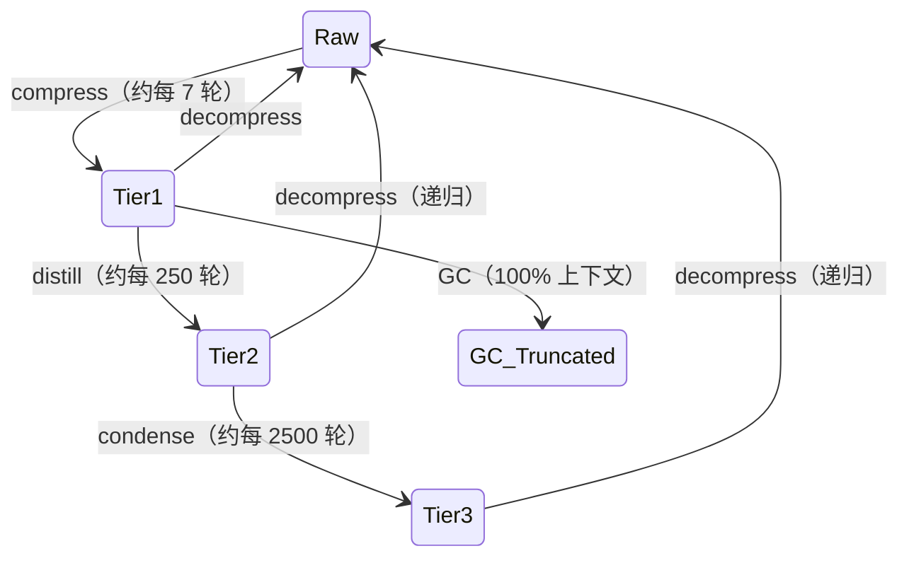

[English](./README.md) | [中文](./README.zh-CN.md)

<p align="center">
<strong>Active Context Pruning</strong> — <a href="https://opencode.ai">OpenCode</a> 的主动上下文剪枝插件
<br />
由模型决定<em>何时</em>压缩、压缩<em>什么</em> — 而非硬性截断。
<br />
<strong>20 万 token 足矣。</strong>
</p>

---

<p align="center">
<a href="https://www.npmjs.com/package/opencode-acp"></a>
<a href="https://github.com/ranxianglei/opencode-acp/blob/master/LICENSE"></a>
<a href="https://github.com/ranxianglei/opencode-acp"></a>
</p>

<p align="center">
<code>opencode plugin opencode-acp@stable --global</code>
</p>

---

## 为什么选择 ACP

ACP 将上下文管理的所有权限全部交给模型自己，而不依靠外部模型或各种复杂的机制去做上下文管理。它是迄今为止，市面上对上下文管理最好的实现。

这带来两个影响：

- **20 万 token 足矣。** 在 50 个真实工程会话、3 万余次 API 调用中，**97% 的请求低于 20 万 token** —— p90 约 15 万，p95 约 18 万。每次 API 调用都会对完整上下文重新计费，因此上下文越低越省钱 —— 即使缓存命中率达 90%+，未缓存部分仍按全价计费。
- **超长上下文不丢关键内容** —— 实测单会话 **3,300+ 条消息、3 亿+ 累计 token**；架构上支持单会话 **10 万条消息**（5 位消息 ID 空间）。

---

## 实战验证

真实工程中的上下文情况。

**在 6 个活跃工程会话（11,000+ 次 API 调用）中，上下文 p90 稳定在 15 万–19 万（15–19%），p95 在 16 万–21 万（16–21%）—— 聚合缓存命中率达 91%。**（注意这是平均缓存命中率，不是单会话命中率——后面[对 Prompt 缓存的影响](#对-prompt-缓存的影响)会解释，这实际上比传统压缩算法大幅度节省了 token。）

| 会话      | 时长        | 消息数 | API 调用 | 累计 token | 缓存命中率 | 上下文 p50  | 上下文 p90  | 上下文 p95  |
| --------- | ----------- | ------ | -------- | ---------- | ---------- | ----------- | ----------- | ----------- |
| 0b89319b  | 230h (9.5d) | 3,344  | 2,796    | 3.39 亿    | 93%        | 10.8万(11%) | 16.7万(17%) | 21.0万(21%) |
| 0a3be0cd  | 130h (5.4d) | 3,183  | 2,499    | 2.76 亿    | 91%        | 10.4万(10%) | 14.5万(15%) | 15.3万(15%) |
| 0b2cd5a7  | 131h (5.4d) | 2,560  | 2,181    | 3.14 亿    | 91%        | 14.2万(14%) | 19.1万(19%) | 19.7万(20%) |
| 08f2d501  | 37h (1.5d)  | 1,985  | 1,888    | 1.96 亿    | 95%        | 10.0万(10%) | 15.6万(16%) | 16.8万(17%) |
| 1410c791† | 865h (36d)  | 1,279  | 1,100    | 2.18 亿    | 87%        | 13.2万(13%) | 40.7万(41%) | 42.7万(43%) |
| 096cf8c4  | 72h (3d)    | 1,041  | 918      | 0.91 亿    | 89%        | 9.2万(9%)   | 14.8万(15%) | 16.1万(16%) |

† Bug 测试会话，p95 异常偏高。排除该会话后，其余会话 p95 均 ≤ 21 万。

（上下文百分比均以 1M 窗口计。）

---

## 安装

```bash
opencode plugin opencode-acp@stable --global
```

或者添加到你的 opencode 配置中：

```json
{
    "plugin": {
        "opencode-acp": "stable"
    }
}
```

---

## 工作原理

ACP 把上下文压缩工具直接交给模型。模型对上下文压缩**负全责**。模型的主要工具是 **compress** 和 **decompress**，辅以 **acp_status**（上下文监控）和 **search_context**（搜索已压缩内容）。压缩采用**三级 LSM-tree 架构**（T1 捕获 → T2 蒸馏 → T3 浓缩），使上下文在数年内保持有界。当上下文达到 100% 时，系统自动触发 GC 截断作为兜底。

### 生命周期 — 三级压缩

ACP 采用**三级 LSM-tree 压缩架构**，灵感来自数据库存储引擎。每一级压缩上一级的输出，产生逐渐精炼的摘要，频率自然递减：


```mermaid
stateDiagram-v2
    Raw --> Tier1 : compress（约每 7 轮）
    Tier1 --> Tier2 : distill（约每 250 轮）
    Tier2 --> Tier3 : condense（约每 2500 轮）
    Tier1 --> Raw : decompress
    Tier2 --> Raw : decompress（递归）
    Tier3 --> Raw : decompress（递归）
    Tier1 --> GC_Truncated : GC（100% 上下文）
```

| 层级 | 名称 | 输入 | 输出 | 压缩比 | 触发时机 |
|------|------|------|------|--------|----------|
| **T1** | 捕获 | 原始对话 | 详细摘要 | ~45× | 上下文超过 `maxContextLimit` |
| **T2** | 蒸馏 | T1 摘要（≥ `nudgeGrowthTokens`） | 精炼的决策/结果 | ~10× | T1 摘要累积超过阈值 |
| **T3** | 浓缩 | T2 摘要（≥ `nudgeGrowthTokens`） | 纯事实（每块 1-3 条） | ~5× | T2 摘要累积超过阈值 |

**触发机制：**

- **T1** 在原始上下文超过配置限制时触发。模型看到可压缩范围，编写详细摘要，保留文件路径、函数签名、决策和理由。
- **T2** 在 T1 摘要 token 达到 `nudgeGrowthTokens`（固定默认 50000）时触发。模型蒸馏旧的 T1 块 — 保留决策和结果，丢弃冗长的过程细节。
- **T3** 在 T2 摘要 token 达到同样阈值时触发。模型浓缩为纯事实（已发布的版本、关键 bug、架构决策）。

每层有**独立的节奏计数器** — T2 触发不阻塞 T3。T1 通过 `!shouldInject` 守卫获得优先级：如果 T1 触发了，T2/T3 等到下一轮。这确保原始上下文压缩优先发生（影响最大）。

模型对所有层级使用**同一个 `compress` 工具**。T2/T3 压缩使用块 ID 作为边界（`compress({ content: [{ startId: "b5", endId: "b20", summary: "..." }] })`）。层级根据被消费的块自动检测。

**会话容量** — 一个会话从空 → T1 → T2 → T3 → 上下文极限，总共可以处理多少 token（真实校准：500 次 API 调用/天，~9.6K 新 token/调用，T1=45x/T2=10x/T3=3x）：

| 上下文上限 | 1 个月 | 3 个月 | 到极限 | 极限时间 |
|-----------|--------|--------|--------|---------|
| 1M | 19 亿 tok | 105 亿 tok | **689 亿 tok** | 第 259 天（~8.6 月） |
| 400K | 19 亿 tok | 103 亿 tok | **103 亿 tok** | 第 89 天（~3 月） |
| 400K（200 调用/天） | 5.6 亿 tok | 25 亿 tok | **95 亿 tok** | 第 212 天（~7 月） |

**Token 节省** — 无 ACP 时上下文无限增长，约 100 次 API 调用后崩溃（~0.2 天）。有 ACP 时上下文被压缩在有界范围：

| 指标 | 无 ACP | 有 ACP（1M 模型） |
|------|--------|-----------------|
| 会话寿命 | ~0.2 天 | 259 天（**长 1295 倍**） |
| 总 token 产出 | ~5200 万 | 689 亿（**多 1325 倍**） |

核心价值：ACP 不是减少每次调用的 token 成本，而是**让一个会话能处理 1000 倍以上的工作量**。

模型对所有层级使用**同一个 `compress` 工具**。T2/T3 压缩使用块 ID 作为边界（`compress({ content: [{ startId: "b5", endId: "b20", summary: "..." }] })`）。层级根据被消费的块自动检测。

### 压缩策略（一级压缩 / Tier 1）

系统会注入一段 prompt，告诉模型当前的上下文比例、压缩比例、上下文是否空闲，以及压缩建议。当触发比例被命中时，内容按**优先级顺序**被压缩：

1. Agent/子代理的评审与咨询结果（最大一块未压缩内容）
2. 冗长的命令输出（构建/测试运行、git diff/log/status、目录列表）
3. 无结果的探索（失败的方法、死胡同式的搜索）
4. 冗余的工具结果（反复读同一个文件、重复的状态检查）
5. 已完成多步任务的中间步骤
6. 已尘埃落定的讨论（一旦决策被记录）
7. 已经用过的大段文件内容

压缩完成后，原始内容被一个简短的 **block** 替换，该 block 引用原始内容（可通过 `decompress` 恢复）。

### 解压策略

由模型决定何时解压。当上下文大到足以干扰模型的 self-attention 时，简短的 block 会让模型先压缩一部分内容，处理完紧急事务，再在后续工作中按需解压。

### GC 兜底

当上下文达到 100% 时，系统自动截断老年代 block 摘要，防止上下文溢出。这是最后的兜底机制 — 有了三级压缩，GC 极少激活，因为 T2/T3 蒸馏将摘要开销控制在有界范围内。

### 质量门控（非阻塞，默认关闭）

每次 `compress` 调用之后，ACP 可以运行一个可拔插的质量门控，检测摘要是否灾难性丢失了内容（例如：5K token 的范围被压缩成 147 字符、且不含任何技术关键词的摘要）。失败只发出 `logger.warn`——绝不拒绝压缩（结果已经提交到状态、对模型可见）。

默认算法 `rouge-recall-v1` 是基于 6,913 个真实块校准的两层门控：

- **L1（长度下限）**：捕获灾难性留存失败——摘要短于 200 字符 OR 留存率低于原始的 1%。100% 召回，0% 误报。
- **L2（内容覆盖）**：只在通过 L1 的块上运行。当 **同时** ROUGE-1 F1 < 0.05 **且** top-20 关键词召回 < 0.20 时触发（AND 合并使误报率维持在 ~6.6%）。

接口可拔插：未来算法（例如通过外部 API 的 LLM-as-judge）可通过 `registerQualityGate()` 注册，无需改动 pipeline 接线。分词器使用手写的词级分词（英文关键词 + 中文 unigram/bigram），不使用 ACP 的 BPE 分词器——后者对 ROUGE 风格的匹配粒度过粗。

默认关闭，发布一个版本的烧入期后再开启。启用方式：

```jsonc
{
    "qualityGate": {
        "enabled": true,
        "algorithm": "rouge-recall-v1",
    },
}
```

---

## 对 Prompt 缓存的影响

历史上 ACP 修复了大量由 DCP 导致的低缓存命中率问题。目前整体缓存命中率约为 **91%**。

相比传统压缩——只在 80–90% 时才压缩，一旦压缩就强制 100% 的上下文重新命中——ACP 的命中率实际上更高。

此外：ACP 大部分时间将总上下文维持在 **~10–15%**（p50 10 万、p90 15 万，以 1M 窗口计），而传统方案是 50–80%。因此总 token 节省远高于传统压缩。

**结论：** ACP 在提高整体缓存命中率的同时，确保关键上下文信息不丢失。

---

## 命令

ACP 提供 `/acp` 斜杠命令（为向后兼容也接受 `/dcp`）：

| 命令                    | 说明                                                                                                                |
| ----------------------- | ------------------------------------------------------------------------------------------------------------------- |
| `/acp`                  | 显示压缩状态（同 `/acp stats`）；`/acp help` 查看命令列表                                                                            |
| `/acp context`          | 按类别（system、user、assistant、tools 等）显示 token 用量明细，以及通过剪枝节省的量                                |
| `/acp stats`            | 压缩状态：压缩块、上下文用量、推荐范围（与 `acp_status` 工具同一报告）                                                          |
| `/acp export`           | 导出活动压缩块到 markdown 文件。选项：`--output <path>`、`--tier t1,t2,t3`、`--stdout`、`--append`                   |

---

## 配置

ACP 使用自己的配置文件，按以下顺序搜索：

1. **全局：** `~/.config/opencode/acp.jsonc`（或 `acp.json`），首次运行时自动创建
2. **自定义配置目录：** `$OPENCODE_CONFIG_DIR/acp.jsonc`（或 `acp.json`），当设置了 `OPENCODE_CONFIG_DIR` 时
3. **项目级：** 项目 `.opencode` 目录下的 `.opencode/acp.jsonc`（或 `acp.json`）

每一层覆盖前一层，因此项目设置优先于全局设置。修改配置后请重启 OpenCode。

> **📖 完整参数参考：** 请查看 [CONFIGURATION.zh-CN.md](./CONFIGURATION.zh-CN.md)（中文）或 [CONFIGURATION.md](./CONFIGURATION.md)（英文），包含每个可配置参数的类型、默认值和详细说明。

> [!IMPORTANT]
> **禁用 OpenCode 的内置自动压缩。** ACP 自行处理上下文管理 — OpenCode 的压缩与 ACP 冲突，可能导致问题（消息重新展开、压缩状态丢失）。请在 `opencode.json` 中添加：
>
> ```jsonc
> {
>     "compaction": {
>         "auto": false,
>     },
> }
> ```
>
> 或设置环境变量：`OPENCODE_DISABLE_AUTOCOMPACT=1`

> [!NOTE]
> 如果你使用上下文窗口较小的模型（如 GitHub Copilot 模型或本地模型），请在配置中降低 `compress.minContextLimit` 和 `compress.maxContextLimit` 以匹配可用上下文。

<details>
<summary><strong>默认配置</strong>（点击展开）</summary>

```jsonc
{
    "$schema": "https://raw.githubusercontent.com/ranxianglei/opencode-acp/master/dcp.schema.json",
    // Enable or disable the plugin
    "enabled": true,
    // 自动更新 npm 安装的 ACP：跟踪安装所用 dist-tag/规范（@stable 跟随 stable，@latest 跟随 latest）。
    // 版本锁定的规范不会被更新。
    "autoUpdate": true,
    // 文件日志级别: "debug" | "info" | "warn" | "error" | "silent"
    // 默认 "info"：决策级事件（压缩提示、转换摘要、更新检查）落盘到
    // ~/.config/opencode/logs/acp/daily/<日期>.log
    "logLevel": "info",
    // 启用完整 DEBUG 日志 + 按请求快照（优先于 logLevel）
    "debug": false,
    // Notification display: "off", "minimal", or "detailed"
    "pruneNotification": "detailed",
    // Notification type: "chat" (deprecated, falls back to toast) or "toast" (system toast)
    "pruneNotificationType": "toast",
    // Slash commands configuration
    "commands": {
        "enabled": true,
        // Additional tools to protect from pruning via commands
        "protectedTools": [],
    },
    // Manual mode: disables autonomous context management,
    // tools only run when explicitly triggered via /acp commands
    // 允许在子代理会话中运行 ACP（默认：开启）
    "allowSubAgents": true,
    // Experimental settings
    "experimental": {
        // Enable user-editable prompt overrides under dcp-prompts directories
        // When false (default), prompt override files/directories are ignored
        "customPrompts": false,
    },
    // Protect file operations from pruning via glob patterns
    // Patterns match tool parameters.filePath (e.g. read/write/edit)
    "protectedFilePatterns": [],
    // Unified context compression tool and behavior settings
    "compress": {
        // Compression mode: "range" (compress spans into block summaries)
        // or experimental "message" (compress individual raw messages)
        // Permission mode: "allow" (no prompt), "ask" (prompt), "deny" (tool not registered)
        "permission": "allow",
        // Show compression content in a chat notification
        "showCompression": true,
        // Let active summary tokens extend the effective maxContextLimit
        "summaryBuffer": true,
        // Soft upper threshold: above this, ACP keeps injecting strong
        // compression nudges (based on nudgeFrequency), so compression is
        // much more likely. Accepts: number or "X%" of model context window.
        "maxContextLimit": "55%",
        // Soft lower threshold for turn/iteration reminder nudges: below this,
        // those reminders are off (compression less likely). At/above this, they
        // are on. Growth nudges have their own floor: minNudgeContextPercent.
        // Accepts: number or "X%" of model context window.
        "minContextLimit": "45%",
        // Optional per-model override for maxContextLimit by providerID/modelID.
        // If present, this wins over the global maxContextLimit.
        // Accepts: number or "X%".
        // Example:
        // "modelMaxLimits": {
        //     "openai/gpt-5.3-codex": 120000,
        //     "anthropic/claude-sonnet-4.6": "80%"
        // },
        // Optional per-model override for minContextLimit.
        // If present, this wins over the global minContextLimit.
        // "modelMinLimits": {
        //     "openai/gpt-5.3-codex": 50000,
        //     "anthropic/claude-sonnet-4.6": "25%"
        // },
        // Optional per-model override for the growth-nudge floor
        // (minNudgeContextPercent). Keyed by providerID/modelID; accepts a
        // token count or "X%" of that model's context window. If present,
        // this wins over the global minNudgeContextPercent for that model.
        // "modelMinNudgeLimits": {
        //     "openai/gpt-5.6": 150000,
        //     "openrouter/z-ai/glm-5.3": "20%"
        // },
        // How often the context-limit nudge fires (1 = every fetch, 5 = every 5th)
        "nudgeFrequency": 5,
        // Start adding compression reminders after this many
        // messages have happened since the last user message
        "iterationNudgeThreshold": 15,
        // Controls how likely compression is after user messages
        // ("strong" = more likely, "soft" = less likely)
        "nudgeForce": "soft",
        // Hard-excluded tool names. The root default is ["skill", "compress"]; an explicit
        // array replaces the inherited policy. Use [] to compress all tool outputs.
        // "compress" is always force-protected regardless of this setting — its summary
        // parameter is the sole record of compressed conversation and cannot be recovered
        // if lost. Use [] to compress all tool outputs except compress itself.
        "protectedTools": ["skill", "compress"],
        // Preserve text wrapped in <protect>...</protect> when compressed
        "protectTags": false,
        // Preserve your messages during compression.
        // Warning: large copy-pasted prompts will never be compressed away
        "protectUserMessages": false,
    },
    // 垃圾回收与批量清理
    "gc": {
        "algorithm": "truncate",
        // 存活此次数后从新生代晋升为老年代
        "promotionThreshold": 5,
        // 存活此次数后停用该块
        "maxBlockAge": 15,
        // 截断超过此长度（字符）的老年代摘要
        "maxOldGenSummaryLength": 3000,
        // 上下文使用率超过此值时执行主 GC（兜底，硬编码为 100%）
        "majorGcThresholdPercent": "100%",
    },
    // 压缩后质量门控（非阻塞；默认关闭）
    "qualityGate": {
        // 主开关。false 时不执行任何评估
        "enabled": false,
        // 算法名。可拔插——未来算法（包括外部 API 评审）可以注册而无需改 pipeline
        "algorithm": "rouge-recall-v1",
        // 各算法的独立配置
        "algorithms": {
            "rouge-recall-v1": {
                // 摘要长度硬下限（字符）。低于此值 → L1 失败
                "layer1MinChars": 200,
                // 最小留存率 = summaryLen / (compressedTokens*4) * 100
                // 捕获灾难性留存失败（<1%），0% 误报
                "layer1MinRetentionPct": 1.0,
                // 当 ROUGE-1 F1 低于此值时（与 top20Recall 经 AND 合并）L2 失败
                "layer2MaxRougeF1": 0.05,
                // 当 top-20 关键词召回低于此值时（与 rougeF1 经 AND 合并）L2 失败
                "layer2MaxTop20Recall": 0.20,
            },
        },
    },
}
```

</details>

### Prompt 覆盖

ACP 暴露六个可编辑的 prompt：

- `system`
- `compress-range`
- `compress-message`
- `context-limit-nudge`
- `turn-nudge`
- `iteration-nudge`

此功能默认禁用。在 ACP 配置中将 `experimental.customPrompts` 设为 `true` 以激活。

启用后，托管的默认值会作为纯文本 prompt 文件写入 `~/.config/opencode/acp-prompts/defaults/`。该目录中的 `README.md` 解释了每个 prompt 以及如何创建覆盖。

要自定义行为，在覆盖目录下添加同名文件并作为纯文本编辑。

要重置覆盖，从覆盖目录中删除对应文件。

### 受保护工具

默认情况下，以下工具始终受保护不被剪枝：
`task`、`skill`、`todowrite`、`todoread`、`compress`、`decompress`、`batch`、`plan_enter`、`plan_exit`、`write`、`edit`

`commands` 中的 `protectedTools` 数组会添加到此默认列表。

对于 `compress` 工具，`compress.protectedTools` 确保特定工具的输出被**硬排除**在压缩范围之外（v1.10.0+）。当模型压缩包含受保护工具消息的范围时，该消息完整保留在可见上下文中 — 只有周围的非受保护消息被压缩。根默认值为 `["skill", "compress"]`（`compress` 条目保护携带 summary 的 compress 工具调用，防止被后续顺序压缩吞噬）；显式数组会替换继承的策略。**`"compress"` 无论用户如何配置都会被强制保护** — 其 `summary` 参数是已压缩对话的唯一记录，一旦丢失无法恢复。设置 `[]` 仅保护 `compress`；设置 `["task"]` 保护 `task` 和 `compress`。

---

## 从 DCP 迁移

ACP 是 DCP 的直接替代品。迁移步骤：

1. 从 `opencode.json` 中移除旧的 DCP 插件
2. 安装 ACP：`opencode plugin opencode-acp@stable --global`
3. 复制配置：`cp ~/.config/opencode/dcp.jsonc ~/.config/opencode/acp.jsonc`
4. 复制 prompt 覆盖（如有）：`cp -r ~/.config/opencode/dcp-prompts ~/.config/opencode/acp-prompts`
5. 复制会话状态（可选，保留压缩块）：`cp -r ~/.local/share/opencode/storage/plugin/dcp ~/.local/share/opencode/storage/plugin/acp`
6. 重启 OpenCode

**变更的内容：**

- 日志目录：`logs/dcp/` → `logs/acp/`
- 斜杠命令：`/dcp` → `/acp`（两者均可用于向后兼容）
- 通知标题：`DCP` → `ACP`
- 上下文用量标签：`DCP threshold` → `ACP threshold`

---

<details>
<summary><strong>错误修复（共 39 项）</strong> — 基于 DCP v3.1.11</summary>

| #      | 严重程度 | 摘要                                                                                                                                    |
| ------ | -------- | --------------------------------------------------------------------------------------------------------------------------------------- |
| 1      | 严重     | 状态在重启后未持久化 — messageIds、块停用、保存错误均静默丢失                                                                           |
| 2      | 严重     | resetOnCompaction() 清除所有压缩块 — 撤销所有剪枝工作                                                                                   |
| 3      | 严重     | prune 静默丢弃摘要 — 当锚点前无用户消息时导致数据丢失                                                                                   |
| 4      | 严重     | getCurrentTokenUsage 返回 0 — 导致 nudge 永远无法触发                                                                                   |
| 5      | 高       | loadPruneMessagesState 重复 activeBlockIds + reasoning-strip 未定义保护缺失                                                             |
| 6      | 高       | 合成摘要消息获得 mNNNN 引用但对边界查找不可见                                                                                           |
| 7      | 高       | 状态在重启后未持久化 — messageIds、块停用和保存错误均静默丢失                                                                           |
| 8      | 高       | isMessageCompacted() 与压缩摘要消息处理不一致                                                                                           |
| 9      | 高       | 已压缩的块摘要保留过时的 mNNNN 消息 ID 标签 — 模型复制过时 ID                                                                           |
| 10     | 高       | 模型使用 nudge/摘要中的过时 mNNNN ID — compress 因 "startId not available" 失败                                                         |
| 11     | 高       | 主 GC 跳过没有 generation 字段的旧块 — 过大的块永远不会被回收                                                                           |
| 12     | 高       | 基于百分比的阈值基于有效输入上下文而非完整模型上下文窗口计算                                                                            |
| 13     | 高       | 上下文窗口泄漏 — 压缩后的消息在 /compact 后重新出现                                                                                     |
| 14     | 高       | 压缩通知将完整块摘要写入数据库 — 每条通知可达 150KB+                                                                                    |
| 15     | 高       | npm 自动安装用上游包覆盖分支                                                                                                            |
| 16     | 高       | compress 输出中的摘要 mNNNN 引用 — 模型复制过时的消息 ID                                                                                |
| 17     | 高       | 合成消息不在 messageIdToBlockId 中 — compress 无法找到它们                                                                              |
| 18     | 高       | compress 在压缩完成后阻止模型响应                                                                                                       |
| 19     | 高       | 动态块引导破坏 API 前缀缓存                                                                                                             |
| 20     | 高       | GC 从不停用旧块 — 死重无限累积                                                                                                          |
| 21     | 高       | Logger + tokenizer 每轮延迟 20-50 秒（268 倍减速）                                                                                      |
| 22     | 高       | compress 在块边界反转时抛出硬错误 — 模型放弃                                                                                            |
| 23--34 | 中       | 去重、错误清除、schema 验证、hook 时序等方面的多项修复                                                                                  |
| 35     | 高       | 在低上下文使用率（<50%）时显示老化警告 — 触发不必要的 compress，浪费 token                                                              |
| 36     | 高       | 压缩摘要作为独立的 user 消息插入在用户真实发言之前 — 模型把自己先前的 assistant 输出误读为用户输入，导致对话角色混乱 / 自问自答循环     |
| 37     | 高       | 消息转换管线对 OpenCode 隐藏的 title/summary/compaction agent 请求也运行 — 污染请求并破坏共享会话状态，导致会话标题生成失效             |
| 38     | 严重     | pruneToolOutputs/pruneToolInputs/pruneToolErrors 原地修改现有消息 — 破坏 LLM 前缀缓存，导致 89% 的新鲜输入 token 浪费在缓存失效的重发上 |
| 39     | 高       | 受保护工具输出（skill/task/todowrite）在压缩时仅软保护 — 追加到摘要后从上下文中剪枝，丧失语义权威且易被 GC 截断。v1.10.0 用硬排除修复   |

完整列表及根因分析，请参见 [Bug Tracker](https://github.com/ranxianglei/opencode-acp/issues)。

</details>

---

## 更新日志

完整版本历史见 [CHANGELOG.zh-CN.md](./CHANGELOG.zh-CN.md)。

---

## 许可证

AGPL-3.0-or-later — 本项目是 [@tarquinen/opencode-dcp](https://github.com/Tarquinen/opencode-dynamic-context-pruning) 的分支。原始版权归原始作者所有。修改和错误修复由 ranxianglei 完成。
