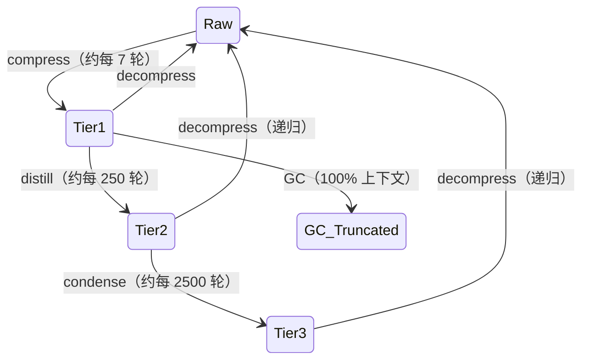

[English](./README.md) | [中文](./README.zh-CN.md)

<p align="center">
<strong>Active Context Pruning</strong> — <a href="https://opencode.ai">OpenCode</a> 的主动上下文剪枝插件
<br />
由模型决定<em>何时</em>压缩、压缩<em>什么</em> — 而非硬性截断。
<br />
<strong>20 万 token 足矣。</strong>
</p>

---

<p align="center">
<a href="https://www.npmjs.com/package/opencode-acp"></a>
<a href="https://github.com/ranxianglei/opencode-acp/blob/master/LICENSE"></a>
<a href="https://github.com/ranxianglei/opencode-acp"></a>
</p>

<p align="center">
<code>opencode plugin opencode-acp@stable --global</code>
</p>

---

## 为什么选择 ACP

ACP 将上下文管理的所有权限全部交给模型自己，而不依靠外部模型或各种复杂的机制去做上下文管理。它是迄今为止，市面上对上下文管理最好的实现。

这带来两个影响：

- **20 万 token 足矣。** 在 50 个真实工程会话、3 万余次 API 调用中，**97% 的请求低于 20 万 token** —— p90 约 15 万，p95 约 18 万。每次 API 调用都会对完整上下文重新计费，因此上下文越低越省钱 —— 即使缓存命中率达 90%+，未缓存部分仍按全价计费。
- **超长上下文不丢关键内容** —— 实测单会话 **3,300+ 条消息、3 亿+ 累计 token**；架构上支持单会话 **10 万条消息**（5 位消息 ID 空间）。

---

## 实战验证

真实工程中的上下文情况。

**在 6 个活跃工程会话（11,000+ 次 API 调用）中，上下文 p90 稳定在 15 万–19 万（15–19%），p95 在 16 万–21 万（16–21%）—— 聚合缓存命中率达 91%。**（注意这是平均缓存命中率，不是单会话命中率——后面[对 Prompt 缓存的影响](#对-prompt-缓存的影响)会解释，这实际上比传统压缩算法大幅度节省了 token。）

| 会话      | 时长        | 消息数 | API 调用 | 累计 token | 缓存命中率 | 上下文 p50  | 上下文 p90  | 上下文 p95  |
| --------- | ----------- | ------ | -------- | ---------- | ---------- | ----------- | ----------- | ----------- |
| 0b89319b  | 230h (9.5d) | 3,344  | 2,796    | 3.39 亿    | 93%        | 10.8万(11%) | 16.7万(17%) | 21.0万(21%) |
| 0a3be0cd  | 130h (5.4d) | 3,183  | 2,499    | 2.76 亿    | 91%        | 10.4万(10%) | 14.5万(15%) | 15.3万(15%) |
| 0b2cd5a7  | 131h (5.4d) | 2,560  | 2,181    | 3.14 亿    | 91%        | 14.2万(14%) | 19.1万(19%) | 19.7万(20%) |
| 08f2d501  | 37h (1.5d)  | 1,985  | 1,888    | 1.96 亿    | 95%        | 10.0万(10%) | 15.6万(16%) | 16.8万(17%) |
| 1410c791† | 865h (36d)  | 1,279  | 1,100    | 2.18 亿    | 87%        | 13.2万(13%) | 40.7万(41%) | 42.7万(43%) |
| 096cf8c4  | 72h (3d)    | 1,041  | 918      | 0.91 亿    | 89%        | 9.2万(9%)   | 14.8万(15%) | 16.1万(16%) |

† Bug 测试会话，p95 异常偏高。排除该会话后，其余会话 p95 均 ≤ 21 万。

（上下文百分比均以 1M 窗口计。）

---

## 安装

```bash
opencode plugin opencode-acp@stable --global
```

或者添加到你的 opencode 配置中：

```json
{
    "plugin": {
        "opencode-acp": "stable"
    }
}
```

---

## 工作原理

ACP 把上下文压缩工具直接交给模型。模型对上下文压缩**负全责**。模型的主要工具是 **compress** 和 **decompress**，辅以 **acp_status**（上下文监控）和 **search_context**（搜索已压缩内容）。压缩采用**三级 LSM-tree 架构**（T1 捕获 → T2 蒸馏 → T3 浓缩），使上下文在数年内保持有界。当上下文达到 100% 时，系统自动触发 GC 截断作为兜底。

### 生命周期 — 三级压缩

ACP 采用**三级 LSM-tree 压缩架构**，灵感来自数据库存储引擎。每一级压缩上一级的输出，产生逐渐精炼的摘要，频率自然递减：


```mermaid
stateDiagram-v2
    Raw --> Tier1 : compress（约每 7 轮）
    Tier1 --> Tier2 : distill（约每 250 轮）
    Tier2 --> Tier3 : condense（约每 2500 轮）
    Tier1 --> Raw : decompress
    Tier2 --> Raw : decompress（递归）
    Tier3 --> Raw : decompress（递归）
    Tier1 --> GC_Truncated : GC（100% 上下文）
```

| 层级 | 名称 | 输入 | 输出 | 压缩比 | 触发时机 |
|------|------|------|------|--------|----------|
| **T1** | 捕获 | 原始对话 | 详细摘要 | ~45× | 上下文超过 `maxContextLimit` |
| **T2** | 蒸馏 | T1 摘要（≥ `nudgeGrowthTokens`） | 精炼的决策/结果 | ~10× | T1 摘要累积超过阈值 |
| **T3** | 浓缩 | T2 摘要（≥ `nudgeGrowthTokens`） | 纯事实（每块 1-3 条） | ~5× | T2 摘要累积超过阈值 |

**触发机制：**

- **T1** 在原始上下文超过配置限制时触发。模型看到可压缩范围，编写详细摘要，保留文件路径、函数签名、决策和理由。
- **T2** 在 T1 摘要 token 达到 `nudgeGrowthTokens`（默认上下文窗口的 5%）时触发。模型蒸馏旧的 T1 块 — 保留决策和结果，丢弃冗长的过程细节。
- **T3** 在 T2 摘要 token 达到同样阈值时触发。模型浓缩为纯事实（已发布的版本、关键 bug、架构决策）。

每层有**独立的节奏计数器** — T2 触发不阻塞 T3。T1 通过 `!shouldInject` 守卫获得优先级：如果 T1 触发了，T2/T3 等到下一轮。这确保原始上下文压缩优先发生（影响最大）。

模型对所有层级使用**同一个 `compress` 工具**。T2/T3 压缩使用块 ID 作为边界（`compress({ content: [{ startId: "b5", endId: "b20", summary: "..." }] })`）。层级根据被消费的块自动检测。

**会话容量** — 一个会话从空 → T1 → T2 → T3 → 上下文极限，总共可以处理多少 token（真实校准：500 次 API 调用/天，~9.6K 新 token/调用，T1=45x/T2=10x/T3=3x）：

| 上下文上限 | 1 个月 | 3 个月 | 到极限 | 极限时间 |
|-----------|--------|--------|--------|---------|
| 1M | 19 亿 tok | 105 亿 tok | **689 亿 tok** | 第 259 天（~8.6 月） |
| 400K | 19 亿 tok | 103 亿 tok | **103 亿 tok** | 第 89 天（~3 月） |
| 400K（200 调用/天） | 5.6 亿 tok | 25 亿 tok | **95 亿 tok** | 第 212 天（~7 月） |

**Token 节省** — 无 ACP 时上下文无限增长，约 100 次 API 调用后崩溃（~0.2 天）。有 ACP 时上下文被压缩在有界范围：

| 指标 | 无 ACP | 有 ACP（1M 模型） |
|------|--------|-----------------|
| 会话寿命 | ~0.2 天 | 259 天（**长 1295 倍**） |
| 总 token 产出 | ~5200 万 | 689 亿（**多 1325 倍**） |

核心价值：ACP 不是减少每次调用的 token 成本，而是**让一个会话能处理 1000 倍以上的工作量**。

模型对所有层级使用**同一个 `compress` 工具**。T2/T3 压缩使用块 ID 作为边界（`compress({ content: [{ startId: "b5", endId: "b20", summary: "..." }] })`）。层级根据被消费的块自动检测。

### 压缩策略（一级压缩 / Tier 1）

系统会注入一段 prompt，告诉模型当前的上下文比例、压缩比例、上下文是否空闲，以及压缩建议。当触发比例被命中时，内容按**优先级顺序**被压缩：

1. Agent/子代理的评审与咨询结果（最大一块未压缩内容）
2. 冗长的命令输出（构建/测试运行、git diff/log/status、目录列表）
3. 无结果的探索（失败的方法、死胡同式的搜索）
4. 冗余的工具结果（反复读同一个文件、重复的状态检查）
5. 已完成多步任务的中间步骤
6. 已尘埃落定的讨论（一旦决策被记录）
7. 已经用过的大段文件内容

压缩完成后，原始内容被一个简短的 **block** 替换，该 block 引用原始内容（可通过 `decompress` 恢复）。

### 解压策略

由模型决定何时解压。当上下文大到足以干扰模型的 self-attention 时，简短的 block 会让模型先压缩一部分内容，处理完紧急事务，再在后续工作中按需解压。

### GC 兜底

当上下文达到 100% 时，系统自动截断老年代 block 摘要，防止上下文溢出。这是最后的兜底机制 — 有了三级压缩，GC 极少激活，因为 T2/T3 蒸馏将摘要开销控制在有界范围内。

### 质量门控（非阻塞，默认关闭）

每次 `compress` 调用之后，ACP 可以运行一个可拔插的质量门控，检测摘要是否灾难性丢失了内容（例如：5K token 的范围被压缩成 147 字符、且不含任何技术关键词的摘要）。失败只发出 `logger.warn`——绝不拒绝压缩（结果已经提交到状态、对模型可见）。

默认算法 `rouge-recall-v1` 是基于 6,913 个真实块校准的两层门控：

- **L1（长度下限）**：捕获灾难性留存失败——摘要短于 200 字符 OR 留存率低于原始的 1%。100% 召回，0% 误报。
- **L2（内容覆盖）**：只在通过 L1 的块上运行。当 **同时** ROUGE-1 F1 < 0.05 **且** top-20 关键词召回 < 0.20 时触发（AND 合并使误报率维持在 ~6.6%）。

接口可拔插：未来算法（例如通过外部 API 的 LLM-as-judge）可通过 `registerQualityGate()` 注册，无需改动 pipeline 接线。分词器使用手写的词级分词（英文关键词 + 中文 unigram/bigram），不使用 ACP 的 BPE 分词器——后者对 ROUGE 风格的匹配粒度过粗。

默认关闭，发布一个版本的烧入期后再开启。启用方式：

```jsonc
{
    "qualityGate": {
        "enabled": true,
        "algorithm": "rouge-recall-v1",
    },
}
```

---

## 对 Prompt 缓存的影响

历史上 ACP 修复了大量由 DCP 导致的低缓存命中率问题。目前整体缓存命中率约为 **91%**。

相比传统压缩——只在 80–90% 时才压缩，一旦压缩就强制 100% 的上下文重新命中——ACP 的命中率实际上更高。

此外：ACP 大部分时间将总上下文维持在 **~10–15%**（p50 10 万、p90 15 万，以 1M 窗口计），而传统方案是 50–80%。因此总 token 节省远高于传统压缩。

**结论：** ACP 在提高整体缓存命中率的同时，确保关键上下文信息不丢失。

---

## 命令

ACP 提供 `/acp` 斜杠命令（为向后兼容也接受 `/dcp`）：

| 命令                    | 说明                                                                                                                |
| ----------------------- | ------------------------------------------------------------------------------------------------------------------- |
| `/acp`                  | 显示可用的 ACP 命令                                                                                                 |
| `/acp context`          | 按类别（system、user、assistant、tools 等）显示 token 用量明细，以及通过剪枝节省的量                                |
| `/acp stats`            | 跨所有会话的累计剪枝统计                                                                                            |
| `/acp manual [on\|off]` | 切换手动模式。开启后，AI 不会自动使用上下文管理工具                                                                 |
| `/acp compress [focus]` | 触发一次 `compress` 工具执行。可选的焦点文本指示要压缩的内容，遵循当前 `compress.mode`                              |
| `/acp decompress <n>`   | 按 ID 恢复特定的活动压缩。不带参数运行时显示可用的压缩 ID、token 大小和主题                                         |
| `/acp recompress <n>`   | 按 ID 重新应用用户解压的压缩。不带参数运行时显示可重新压缩的 ID、token 大小和主题                                   |

---

## 配置

ACP 使用自己的配置文件，按以下顺序搜索：

1. **全局：** `~/.config/opencode/acp.jsonc`（或 `acp.json`），首次运行时自动创建
2. **自定义配置目录：** `$OPENCODE_CONFIG_DIR/acp.jsonc`（或 `acp.json`），当设置了 `OPENCODE_CONFIG_DIR` 时
3. **项目级：** 项目 `.opencode` 目录下的 `.opencode/acp.jsonc`（或 `acp.json`）

每一层覆盖前一层，因此项目设置优先于全局设置。修改配置后请重启 OpenCode。

> **📖 完整参数参考：** 请查看 [CONFIGURATION.zh-CN.md](./CONFIGURATION.zh-CN.md)（中文）或 [CONFIGURATION.md](./CONFIGURATION.md)（英文），包含每个可配置参数的类型、默认值和详细说明。

> [!IMPORTANT]
> **禁用 OpenCode 的内置自动压缩。** ACP 自行处理上下文管理 — OpenCode 的压缩与 ACP 冲突，可能导致问题（消息重新展开、压缩状态丢失）。请在 `opencode.json` 中添加：
>
> ```jsonc
> {
>     "compaction": {
>         "auto": false,
>     },
> }
> ```
>
> 或设置环境变量：`OPENCODE_DISABLE_AUTOCOMPACT=1`

> [!NOTE]
> 如果你使用上下文窗口较小的模型（如 GitHub Copilot 模型或本地模型），请在配置中降低 `compress.minContextLimit` 和 `compress.maxContextLimit` 以匹配可用上下文。

<details>
<summary><strong>默认配置</strong>（点击展开）</summary>

```jsonc
{
    "$schema": "https://raw.githubusercontent.com/ranxianglei/opencode-acp/master/dcp.schema.json",
    // Enable or disable the plugin
    "enabled": true,
    // Automatically update npm-installed ACP when a newer npm latest is available.
    // Version-locked plugin specs are not updated.
    "autoUpdate": true,
    // Enable debug logging to ~/.config/opencode/logs/acp/
    "debug": false,
    // Notification display: "off", "minimal", or "detailed"
    "pruneNotification": "detailed",
    // Notification type: "chat" (deprecated, falls back to toast) or "toast" (system toast)
    "pruneNotificationType": "toast",
    // Slash commands configuration
    "commands": {
        "enabled": true,
        // Additional tools to protect from pruning via commands
        "protectedTools": [],
    },
    // Manual mode: disables autonomous context management,
    // tools only run when explicitly triggered via /acp commands
    // 允许在子代理会话中运行 ACP（默认：开启）
    "allowSubAgents": true,
    // Experimental settings
    "experimental": {
        // Enable user-editable prompt overrides under dcp-prompts directories
        // When false (default), prompt override files/directories are ignored
        "customPrompts": false,
    },
    // Protect file operations from pruning via glob patterns
    // Patterns match tool parameters.filePath (e.g. read/write/edit)
    "protectedFilePatterns": [],
    // Unified context compression tool and behavior settings
    "compress": {
        // Compression mode: "range" (compress spans into block summaries)
        // or experimental "message" (compress individual raw messages)
        // Permission mode: "allow" (no prompt), "ask" (prompt), "deny" (tool not registered)
        "permission": "allow",
        // Show compression content in a chat notification
        "showCompression": true,
        // Let active summary tokens extend the effective maxContextLimit
        "summaryBuffer": true,
        // Soft upper threshold: above this, ACP keeps injecting strong
        // compression nudges (based on nudgeFrequency), so compression is
        // much more likely. Accepts: number or "X%" of model context window.
        "maxContextLimit": "55%",
        // Soft lower threshold for reminder nudges: below this, turn/iteration
        // reminders are off (compression less likely). At/above this, reminders
        // are on. Accepts: number or "X%" of model context window.
        "minContextLimit": "45%",
        // Optional per-model override for maxContextLimit by providerID/modelID.
        // If present, this wins over the global maxContextLimit.
        // Accepts: number or "X%".
        // Example:
        // "modelMaxLimits": {
        //     "openai/gpt-5.3-codex": 120000,
        //     "anthropic/claude-sonnet-4.6": "80%"
        // },
        // Optional per-model override for minContextLimit.
        // If present, this wins over the global minContextLimit.
        // "modelMinLimits": {
        //     "openai/gpt-5.3-codex": 50000,
        //     "anthropic/claude-sonnet-4.6": "25%"
        // },
        // How often the context-limit nudge fires (1 = every fetch, 5 = every 5th)
        "nudgeFrequency": 5,
        // Start adding compression reminders after this many
        // messages have happened since the last user message
        "iterationNudgeThreshold": 15,
        // Controls how likely compression is after user messages
        // ("strong" = more likely, "soft" = less likely)
        "nudgeForce": "soft",
        // Hard-excluded tool names. The root default is ["skill", "compress"]; an explicit
        // array replaces the inherited policy. Use [] to compress all tool outputs.
        // "compress" is always force-protected regardless of this setting — its summary
        // parameter is the sole record of compressed conversation and cannot be recovered
        // if lost. Use [] to compress all tool outputs except compress itself.
        "protectedTools": ["skill", "compress"],
        // Preserve text wrapped in <protect>...</protect> when compressed
        "protectTags": false,
        // Preserve your messages during compression.
        // Warning: large copy-pasted prompts will never be compressed away
        "protectUserMessages": false,
    },
    // 垃圾回收与批量清理
    "gc": {
        "algorithm": "truncate",
        // 存活此次数后从新生代晋升为老年代
        "promotionThreshold": 5,
        // 存活此次数后停用该块
        "maxBlockAge": 15,
        // 截断超过此长度（字符）的老年代摘要
        "maxOldGenSummaryLength": 3000,
        // 上下文使用率超过此值时执行主 GC（兜底，硬编码为 100%）
        "majorGcThresholdPercent": "100%",
    },
    // 压缩后质量门控（非阻塞；默认关闭）
    "qualityGate": {
        // 主开关。false 时不执行任何评估
        "enabled": false,
        // 算法名。可拔插——未来算法（包括外部 API 评审）可以注册而无需改 pipeline
        "algorithm": "rouge-recall-v1",
        // 各算法的独立配置
        "algorithms": {
            "rouge-recall-v1": {
                // 摘要长度硬下限（字符）。低于此值 → L1 失败
                "layer1MinChars": 200,
                // 最小留存率 = summaryLen / (compressedTokens*4) * 100
                // 捕获灾难性留存失败（<1%），0% 误报
                "layer1MinRetentionPct": 1.0,
                // 当 ROUGE-1 F1 低于此值时（与 top20Recall 经 AND 合并）L2 失败
                "layer2MaxRougeF1": 0.05,
                // 当 top-20 关键词召回低于此值时（与 rougeF1 经 AND 合并）L2 失败
                "layer2MaxTop20Recall": 0.20,
            },
        },
    },
}
```

</details>

### Prompt 覆盖

ACP 暴露六个可编辑的 prompt：

- `system`
- `compress-range`
- `compress-message`
- `context-limit-nudge`
- `turn-nudge`
- `iteration-nudge`

此功能默认禁用。在 ACP 配置中将 `experimental.customPrompts` 设为 `true` 以激活。

启用后，托管的默认值会作为纯文本 prompt 文件写入 `~/.config/opencode/acp-prompts/defaults/`。该目录中的 `README.md` 解释了每个 prompt 以及如何创建覆盖。

要自定义行为，在覆盖目录下添加同名文件并作为纯文本编辑。

要重置覆盖，从覆盖目录中删除对应文件。

### 受保护工具

默认情况下，以下工具始终受保护不被剪枝：
`task`、`skill`、`todowrite`、`todoread`、`compress`、`decompress`、`batch`、`plan_enter`、`plan_exit`、`write`、`edit`

`commands` 中的 `protectedTools` 数组会添加到此默认列表。

对于 `compress` 工具，`compress.protectedTools` 确保特定工具的输出被**硬排除**在压缩范围之外（v1.10.0+）。当模型压缩包含受保护工具消息的范围时，该消息完整保留在可见上下文中 — 只有周围的非受保护消息被压缩。根默认值为 `["skill", "compress"]`（`compress` 条目保护携带 summary 的 compress 工具调用，防止被后续顺序压缩吞噬）；显式数组会替换继承的策略。**`"compress"` 无论用户如何配置都会被强制保护** — 其 `summary` 参数是已压缩对话的唯一记录，一旦丢失无法恢复。设置 `[]` 仅保护 `compress`；设置 `["task"]` 保护 `task` 和 `compress`。

---

## 从 DCP 迁移

ACP 是 DCP 的直接替代品。迁移步骤：

1. 从 `opencode.json` 中移除旧的 DCP 插件
2. 安装 ACP：`opencode plugin opencode-acp@stable --global`
3. 复制配置：`cp ~/.config/opencode/dcp.jsonc ~/.config/opencode/acp.jsonc`
4. 复制 prompt 覆盖（如有）：`cp -r ~/.config/opencode/dcp-prompts ~/.config/opencode/acp-prompts`
5. 复制会话状态（可选，保留压缩块）：`cp -r ~/.local/share/opencode/storage/plugin/dcp ~/.local/share/opencode/storage/plugin/acp`
6. 重启 OpenCode

**变更的内容：**

- 日志目录：`logs/dcp/` → `logs/acp/`
- 斜杠命令：`/dcp` → `/acp`（两者均可用于向后兼容）
- 通知标题：`DCP` → `ACP`
- 上下文用量标签：`DCP threshold` → `ACP threshold`

---

<details>
<summary><strong>错误修复（共 39 项）</strong> — 基于 DCP v3.1.11</summary>

| #      | 严重程度 | 摘要                                                                                                                                    |
| ------ | -------- | --------------------------------------------------------------------------------------------------------------------------------------- |
| 1      | 严重     | 状态在重启后未持久化 — messageIds、块停用、保存错误均静默丢失                                                                           |
| 2      | 严重     | resetOnCompaction() 清除所有压缩块 — 撤销所有剪枝工作                                                                                   |
| 3      | 严重     | prune 静默丢弃摘要 — 当锚点前无用户消息时导致数据丢失                                                                                   |
| 4      | 严重     | getCurrentTokenUsage 返回 0 — 导致 nudge 永远无法触发                                                                                   |
| 5      | 高       | loadPruneMessagesState 重复 activeBlockIds + reasoning-strip 未定义保护缺失                                                             |
| 6      | 高       | 合成摘要消息获得 mNNNN 引用但对边界查找不可见                                                                                           |
| 7      | 高       | 状态在重启后未持久化 — messageIds、块停用和保存错误均静默丢失                                                                           |
| 8      | 高       | isMessageCompacted() 与压缩摘要消息处理不一致                                                                                           |
| 9      | 高       | 已压缩的块摘要保留过时的 mNNNN 消息 ID 标签 — 模型复制过时 ID                                                                           |
| 10     | 高       | 模型使用 nudge/摘要中的过时 mNNNN ID — compress 因 "startId not available" 失败                                                         |
| 11     | 高       | 主 GC 跳过没有 generation 字段的旧块 — 过大的块永远不会被回收                                                                           |
| 12     | 高       | 基于百分比的阈值基于有效输入上下文而非完整模型上下文窗口计算                                                                            |
| 13     | 高       | 上下文窗口泄漏 — 压缩后的消息在 /compact 后重新出现                                                                                     |
| 14     | 高       | 压缩通知将完整块摘要写入数据库 — 每条通知可达 150KB+                                                                                    |
| 15     | 高       | npm 自动安装用上游包覆盖分支                                                                                                            |
| 16     | 高       | compress 输出中的摘要 mNNNN 引用 — 模型复制过时的消息 ID                                                                                |
| 17     | 高       | 合成消息不在 messageIdToBlockId 中 — compress 无法找到它们                                                                              |
| 18     | 高       | compress 在压缩完成后阻止模型响应                                                                                                       |
| 19     | 高       | 动态块引导破坏 API 前缀缓存                                                                                                             |
| 20     | 高       | GC 从不停用旧块 — 死重无限累积                                                                                                          |
| 21     | 高       | Logger + tokenizer 每轮延迟 20-50 秒（268 倍减速）                                                                                      |
| 22     | 高       | compress 在块边界反转时抛出硬错误 — 模型放弃                                                                                            |
| 23--34 | 中       | 去重、错误清除、schema 验证、hook 时序等方面的多项修复                                                                                  |
| 35     | 高       | 在低上下文使用率（<50%）时显示老化警告 — 触发不必要的 compress，浪费 token                                                              |
| 36     | 高       | 压缩摘要作为独立的 user 消息插入在用户真实发言之前 — 模型把自己先前的 assistant 输出误读为用户输入，导致对话角色混乱 / 自问自答循环     |
| 37     | 高       | 消息转换管线对 OpenCode 隐藏的 title/summary/compaction agent 请求也运行 — 污染请求并破坏共享会话状态，导致会话标题生成失效             |
| 38     | 严重     | pruneToolOutputs/pruneToolInputs/pruneToolErrors 原地修改现有消息 — 破坏 LLM 前缀缓存，导致 89% 的新鲜输入 token 浪费在缓存失效的重发上 |
| 39     | 高       | 受保护工具输出（skill/task/todowrite）在压缩时仅软保护 — 追加到摘要后从上下文中剪枝，丧失语义权威且易被 GC 截断。v1.10.0 用硬排除修复   |

完整列表及根因分析，请参见 [Bug Tracker](https://github.com/ranxianglei/opencode-acp/issues)。

</details>

---

## 更新日志

### v1.14.14 — 正式版（v1.14.13 以来 2 个 PR）

正式版，包含两个压缩子系统修复：批量调用的 summary 泄漏（#288）和批量压缩的全有或全无中断（#290）。发布到 `latest` npm tag。

**包含的 PR**：
- **#288**（经 #289）— `hideConsumedCompressCalls` 的 keep-set 以 `compressCallId` 为键，在批量压缩下是 1:N 关系（一次工具调用，多个 `content[]` 条目共享一个 callId）。当 T2 蒸馏只消费了部分兄弟块时，存活的兄弟块会救下整个工具 part，永久泄漏已消费的 summary——且因 compress 是默认受保护工具而无法回收。修复：改为按块（`startId::endId`）标记可见性；对混合存活状态的保留批次，重写存活工具 part 的 `state.input.content` 以丢弃已消费条目的 summary。全部消费的批次仍整体移除。文件：`lib/compress/hide-consumed.ts`。测试：`tests/hide-consumed.test.ts` +3（核心回归测试已验证修复前会失败）。
- **#290**（经 #291）— 批量 `compress` 在任一 `content[]` 条目只含已压缩消息时整体中断（`Compression range N contains only already-compressed messages`），导致有效条目未执行；错误也未说明哪个条目/ID/块冲突，迫使反复试错重试。修复：(A) 部分失败批次——新增 `identifyPhantomPlans` 丢弃 phantom 条目并压缩其余，返回简洁的跳过提示；(C) 全 phantom 抛错时附详细诊断（条目序号 + 已消费 ID + 所属块）；(B) `clampMessageRef` 静默平移边界时发出警告。抽出 `partitionPhantomPlans` + `buildPhantomSkipNotice` 纯函数使批量决策逻辑可测试。`checkPhantomBlock` 保持原有契约不变。文件：`lib/compress/{pipeline,range,search,range-utils}.ts`。测试：+19。双 agent review（Oracle + General，均 APPROVE）。

**安装**：`opencode plugin opencode-acp@latest --global`

### v1.14.14-dev.1 — Dev 预发布版（v1.14.13 以来 2 个 PR）

Dev 预发布版，包含两个压缩子系统修复：批量调用的 summary 泄漏（#288）和批量压缩的全有或全无中断（#290）。发布到 `dev` npm tag 供早期测试。

**包含的 PR**：
- **#288**（经 #289）— `hideConsumedCompressCalls` 的 keep-set 以 `compressCallId` 为键，在批量压缩下是 1:N 关系（一次工具调用，多个 `content[]` 条目共享一个 callId）。当 T2 蒸馏只消费了部分兄弟块时，存活的兄弟块会救下整个工具 part，永久泄漏已消费的 summary——且因 compress 是默认受保护工具而无法回收。修复：改为按块（`startId::endId`）标记可见性；对混合存活状态的保留批次，重写存活工具 part 的 `state.input.content` 以丢弃已消费条目的 summary。全部消费的批次仍整体移除。文件：`lib/compress/hide-consumed.ts`。测试：`tests/hide-consumed.test.ts` +3（核心回归测试已验证修复前会失败）。
- **#290**（经 #291）— 批量 `compress` 在任一 `content[]` 条目只含已压缩消息时整体中断（`Compression range N contains only already-compressed messages`），导致有效条目未执行；错误也未说明哪个条目/ID/块冲突，迫使反复试错重试。修复：(A) 部分失败批次——新增 `identifyPhantomPlans` 丢弃 phantom 条目并压缩其余，返回简洁的跳过提示；(C) 全 phantom 抛错时附详细诊断（条目序号 + 已消费 ID + 所属块）；(B) `clampMessageRef` 静默平移边界时发出警告。抽出 `partitionPhantomPlans` + `buildPhantomSkipNotice` 纯函数使批量决策逻辑可测试。`checkPhantomBlock` 保持原有契约不变。文件：`lib/compress/{pipeline,range,search,range-utils}.ts`。测试：+19。双 agent review（Oracle + General，均 APPROVE）。

**安装**：`opencode plugin opencode-acp@dev --global`

### v1.14.13 — 正式版（v1.14.12 以来 3 个 PR）

正式版发布，`allowSubAgents` 从实验性参数提升为正式参数（默认：`true`），并更新了配置文档的推荐设置。

**包含的 PR**：
- **#276** — 将 `allowSubAgents` 从 `experimental` 提升为顶层配置字段，默认值从 `false` 改为 `true`。子 Agent 会话现在默认启用压缩。完全向后兼容：旧的 `experimental.allowSubAgents` 配置仍然有效（顶层优先级更高）。更新了全部 4 个 hook 调用点、schema、配置验证和 6 个文档文件。双 Agent 审查通过（Oracle + Explore，均 APPROVE）。
- **#280, #281** — 更新文档中的推荐配置：`maxContextLimit: 70%`、`minContextLimit: 70%`，简化 `protectedTools`。

**安装**：`opencode plugin opencode-acp@stable --global`

### v1.14.13-dev.1 — Dev 预发布版（v1.14.12 以来 1 个 PR）

Dev 预发布版，包含 PR #276。发布到 `dev` npm tag 供早期测试。

**包含的 PR**：
- **#276** — 将 `allowSubAgents` 从实验性参数提升为顶级配置字段，默认值从 `false` 改为 `true`。子 Agent 会话默认开启压缩。完全向后兼容：旧的 `experimental.allowSubAgents` 配置仍然有效（顶级优先）。更新了 4 个 hook 调用点、schema、配置校验和 6 个文档文件。双 Agent Review（Oracle + Explore，均 APPROVE）。

**安装**：`opencode plugin opencode-acp@dev --global`

### v1.14.12 — 正式版（v1.14.11 以来 1 个 PR）

正式版发布，包含 omo-system-reminder 过滤器修复——剥离 `<system-reminder>` 块时保留用户正文。

**包含的 PR**：
- **#271** — 修复（#268 后续）：`omo-system-reminder` 过滤器 v1.2.0 对任何含 `<system-reminder>` 的用户消息直接返回 `drop`，当 OMO 将 system-reminder 块注入到用户消息前面时丢失用户正文。改为 v1.3.0：剥离 `<system-reminder>` 块 + OMO 标记，保留剩余用户内容（`modify`）。纯 OMO 消息仍返回 `drop`。Phase 2 `keepLastOnly` 现在对较旧的匹配应用过滤器实际决策（drop 或 modify），不再无条件丢弃。最近 N 条保持不动（语义正确）。与其他 3 个 `keepLastOnly` 过滤器向后兼容（它们只返回 `drop`）。双 Agent Review（Oracle + Explore，全部 APPROVE）。

**安装**：`opencode plugin opencode-acp@stable --global`

### v1.14.11 — 正式版（v1.14.10 以来 1 个 PR）

正式版发布，包含 omo-system-reminder 过滤器修复和可配置 `keepLast`。

**包含的 PR**：
- **#268** — 修复（issue #267）：`omo-system-reminder` 过滤器删除所有 `<system-reminder>` 块，导致后台任务通知丢失、主会话无法恢复子代理结果。改为 v1.2.0：`keepLastOnly: true, keepLast: 2` — 保留最近 2 条匹配，丢弃更早的重复。同时添加框架级可配置 `keepLast` 字段，用户可覆盖每个 `keepLastOnly` 过滤器保留最近几条（默认 1，最小 1）。

**安装**：`opencode plugin opencode-acp@stable --global`

### v1.14.10 — 正式版（v1.14.9 以来 1 个 PR）

正式版发布，包含 omo-mode-injection 过滤器修复。

**包含的 PR**：
- **#263** — 修复：`omo-mode-injection` 过滤器在 OMO 模式注入（`<ultrawork-mode>`、`[search-mode]` 等）被前置到用户消息时，会丢弃整个用户消息。模式注入通过 `UserPromptSubmit.additionalContext` 前置，不是独立消息——旧过滤器（v1.0.0）匹配到注入就返回 `drop`，清空了整个消息包括用户的实际请求。重写为 v1.1.0：剥离注入块、通过 `modify` 保留用户内容。同时修复配置校验（messageFilters.filters 动态键跳过）并补充 dcp.schema.json。

**安装**：`opencode plugin opencode-acp@stable --global`

### v1.14.9 — 正式版（v1.14.8 以来 3 个 PR）

正式版发布，包含 nudge 循环修复、整体式 T2/T3 压缩提示词、多条目 compress 格式文档。

**包含的 PR**：
- **#252** — 两个修复：(1) **Issue #251**：`filterRecommendedRanges` 在可压缩内容低于 modelContextLimit 的 5% 时抑制所有推荐。重写为始终显示所有范围。(2) **Nudge 循环修复**：`lastNudgeShownTokens` 在 `nothingToCompress` 时被重置为 `undefined`，导致每轮都触发 nudge。
- **#257** — 升级 `context-compress-algorithms` 1.2.1 → 1.3.0。整体式 TIER2/TIER3 提示词 — 按主题综述而非逐块处理，修复 70+ T1 块时的长度溢出问题（issue #256）。
- **#259** — 在系统提示词和 T2/T3 nudge 中文档化多条目 compress 格式。compress 工具已支持 `content` 数组（PR #156），但块压缩只展示了单条目格式。

**安装**：`opencode plugin opencode-acp@stable --global`

### v1.14.9-dev.2 — Dev 预发布（v1.14.9-dev.1 以来 1 个 PR）

Dev 预发布，覆盖 PR #263。已发布到 `dev` npm 标签供早期测试。

**包含的 PR**：
- **#263** — 修复：`omo-mode-injection` 过滤器在 OMO 模式注入（`<ultrawork-mode>`、`[search-mode]` 等）被前置到用户消息时，会丢弃整个用户消息。模式注入通过 `UserPromptSubmit.additionalContext` 前置，不是独立消息——旧过滤器（v1.0.0）匹配到注入就返回 `drop`，清空了整个消息包括用户的实际请求。重写为 v1.1.0：剥离注入块、通过 `modify` 保留用户内容。同时修复配置校验（messageFilters.filters 动态键跳过）并补充 dcp.schema.json。

**安装**：`opencode plugin opencode-acp@dev --global`

### v1.14.9-dev.1 — Dev 预发布（v1.14.8-dev.5 以来 1 个 PR）

Dev 预发布，涵盖 PR #259。发布到 `dev` npm tag 供早期测试。

**包含的 PR**：
- **#259** — 在系统提示词和 T2/T3 nudge 中文档化多条目 compress 格式。compress 工具已支持 `content` 数组（PR #156），但块压缩只展示了单条目格式。现在两种格式都被中立地文档化。

**安装**：`opencode plugin opencode-acp@dev --global`

### v1.14.8-dev.5 — Dev 预发布（v1.14.8-dev.4 以来 1 个 PR）

Dev 预发布，涵盖 PR #257。发布到 `dev` npm tag 供早期测试。

**包含的 PR**：
- **#257** — 升级 `context-compress-algorithms` 从 1.2.1 到 1.3.0。cc-alg 1.3.0 提供整体式 TIER2/TIER3 压缩提示——按主题综合而非逐块处理。旧的逐块格式（Source 头 + 每块 3-5 条 + 每块 50-150 tokens）在压缩 70+ 个 T1 块时导致长度溢出（~30K 字符超过 `maxSummaryLengthHard`）。无需源码修改（提示从依赖中获取）。

**安装**: `opencode plugin opencode-acp@dev --global`

### v1.14.8-dev.4 — Dev 预发布（v1.14.8-dev.3 以来 1 个 PR）

Dev 预发布，涵盖 PR #252。发布到 `dev` npm tag 供早期测试。

**包含的 PR**：
- **#252** — 两个修复：(1) **Issue #251**：`filterRecommendedRanges` 在可压缩内容低于 modelContextLimit 的 5%（1M 上下文为 50K）时抑制所有推荐。重写为始终显示所有范围，最后一段标记 `dangerous: true`。简化 `RangeFilterOptions`。(2) **Nudge 循环修复**：`nothingToCompress` 时 `lastNudgeShownTokens` 被重置为 `undefined`，导致 `growthReference` 回退到 session 开始时的 stale baseline → 每轮都触发 nudge。移除该重置。同时修复增长显示使用 `lastNudgeShownTokens ?? lastPerMessageNudgeTokens`，与实际决策逻辑一致。Oracle + Explore Review：均通过。

**安装**：`opencode plugin opencode-acp@dev --global`

### v1.14.8-dev.3 — Dev 预发布（v1.14.8-dev.2 以来 1 个 PR）

Dev 预发布，涵盖 PR #248。发布到 `dev` npm tag 供早期测试。

**包含的 PR**：
- **#248** — 修复：自动扩展压缩范围以防止拆分 tool_use/tool_result 配对。当模型选择的压缩边界落在 tool 调用与其结果之间时，孤立的 tool_result 引用不存在的 tool_use_id → API 拒绝。新增 `adjustBoundariesForToolPairs`（`compress/search.ts`）向前/向后扫描（最多 20 条消息）以包含匹配的配对。排除 `compress` 工具（强制保护）并仅扩展消息边界（从不扩展 block 边界）以避免层级错误分类。11 个测试。

**安装**：`opencode plugin opencode-acp@dev --global`

### v1.14.8-dev.2 — Dev 预发布（v1.14.8-dev.1 以来 2 个 PR）

Dev 预发布，涵盖 PR #244–#245。发布到 `dev` npm tag 供早期测试。

**包含的 PR**：
- **#245** — 修复：重新将 HOW_TO_COMPRESS_RULES 加入 nudge 注入。v1.14.7 过度删除了所有 4 处 nudge 位置的规则（breakdown + 3 个模板），只保留在 system prompt。在长 session 中，system prompt 的规则因"lost in the middle"效应衰减——模型在 nudge 触发时需要规则在高注意力区（上下文末尾）。
- **#244** — 修复：acp_status 隐藏 PROTECTED 列表中已消耗的 compress 调用。

**安装**：`opencode plugin opencode-acp@dev --global`

### v1.14.8-dev.1 — Dev 预发布（v1.14.7 以来 7 个 PR）

Dev 预发布，涵盖 PR #238–#242。发布到 `dev` npm tag 供早期测试。

**包含的 PR**：
- **#238** — E2E 强化：观察记录、T2 节奏回归场景、consumed-call 隐藏场景、辅助调用过滤。E2E 场景 8→12 个。
- **#232** — 重构：移除死代码 `turnProtection` 配置 + DCP 迁移代码。
- **#234** — 重新添加 `/acp stats` 作为 `acp_status` 的封装。
- **#239** — 可插拔消息过滤器，用于第三方注入清理。
- **#240** — 修复：splice 孤儿消息（consumed compress 移除后仅剩结构化部分）。
- **#241** — `acp_status` + nudge 中的系统 token 分类；隐藏上下文填充百分比；4 处重复估算整合为 1 个共享 `estimateSystemPromptTokens()`。
- **#242** — `keepLastOnly` 去重机制 + 4 个 OMO 内置过滤器。

**安装**：`opencode plugin opencode-acp@dev --global`

### v1.14.8 — 正式版（v1.14.7 以来 10 个 PR）

正式版，从 dev 预发布 v1.14.8-dev.1 至 v1.14.8-dev.3 提升而来。包含所有在 dev 通道测试过的修复。

**亮点**：

- **系统 token 可见性**（#241）：`acp_status` 和 nudge breakdown 现在显示系统 prompt token 占比（上下文的 5-15%）。将 4 处重复的估算算法整合为 1 个共享 `estimateSystemPromptTokens()`，使用真正的 Anthropic 分词器。
- **HOW_TO_COMPRESS_RULES 重新加入 nudge**（#245）：v1.14.7 过度删除了所有 nudge 位置的压缩规则。在长 session（8000+ 消息）中，system prompt 中的规则因"lost in the middle"效应衰减——重新加入 nudge 以在压缩触发时提供高注意力区指导。
- **工具配对完整性**（#248）：压缩范围拆分 tool_use/tool_result 配对会导致 API 拒绝。新增 `adjustBoundariesForToolPairs` 按 callID 匹配自动扩展边界。
- **可插拔消息过滤器**（#239, #242）：`keepLastOnly` 去重机制 + 4 个 OMO 内置过滤器，用于清理第三方注入消息的重复累积。
- **孤儿消息清理**（#240）：`hideConsumedCompressCalls` 仅剩结构化部分时（step-finish、reasoning），消息现在被 splice 掉，不再作为 500-2000 token 孤儿存活。
- **E2E 强化**（#238）：观察记录、T2 节奏回归场景、consumed-call 隐藏场景、辅助调用过滤。E2E 场景 8→12 个。
- **acp_status 隐藏已消耗 compress**（#244）：从 PROTECTED 列表中隐藏已消耗的 compress 调用。

**包含的所有 PR**：#238（E2E 强化）、#232（移除死代码 turnProtection/DCP 迁移）、#234（重新添加 /acp stats）、#239（可插拔消息过滤器）、#240（孤儿消息清理）、#241（系统 token）、#242（keepLastOnly + OMO 过滤器）、#244（acp_status 已消耗 compress）、#245（HOW_TO_COMPRESS_RULES 重新加入）、#248（工具配对完整性）。

**安装**：`opencode plugin opencode-acp@stable --global`

### v1.14.7 — 去重 HOW_TO_COMPRESS_RULES（PR #228）

**问题**：`HOW_TO_COMPRESS_RULES`（~1.2K tokens）每次 nudge 注入重复 3-4 次——系统提示词 1 次、nudge 模板 1-2 次、breakdown 块 1 次。非 maxLimit 场景下 suffix 消息单独就包含 2-3 份规则。每次 nudge 浪费 2.4-3.6K tokens。v1.14.6 让 debug 模式持久化 nudge 文本到聊天界面后，重复变得可见。

**修复**：从 breakdown 块（`inject.ts:535-537`）和全部 3 个 nudge 模板（`turn-nudge.ts`、`iteration-nudge.ts`、`context-limit-nudge.ts`）移除 `HOW_TO_COMPRESS_RULES`。保留在 `system.ts`（单一可信源——每轮注入，v1.8.2 不变量）和 `quality-gate/rejection.ts`（重试指导）。Oracle 验证：无任何场景丢失压缩指导。

文件：`lib/messages/inject/inject.ts`、`lib/prompts/{turn,iteration,context-limit}-nudge.ts`。917 项测试通过。

### v1.14.6 — Debug Nudge 聊天界面可见性（PR #226）

**问题**：开启 `debug: true` 时，ACP nudge 注入（压缩建议、上下文分类、分层触发器）只能通过 5 秒 toast 和日志文件查看。nudge 后缀消息是临时的——由消息变换 hook 注入但从未持久化到会话数据库——因此用户无法在聊天界面看到模型实际看到的内容。这使得调试 nudge 行为非常困难。

**修复**：当 `config.debug` 开启时，`hooks.ts` 中的 `debugNotify` 回调现在额外调用 `sendIgnoredMessage()`，将完整 nudge 文本以 `ignored: true` 用户消息形式持久化到会话数据库（用户可见，模型不可见）。消息前缀为 `[ACP Debug Nudge]` 便于识别。Toast 通知仍同时显示以保持向后兼容。Debug 关闭：行为不变（无持久化消息）。

文件：`lib/hooks.ts`。无源逻辑变更。无配置变更。无持久化状态架构变更。937 项测试通过。

### v1.14.5 — GC 模块移除 + 属性测试 + Issue #176 修复 + 配置文档（PRs #222, #206, #221, #223, #224）

**问题**：打包修复 5 个问题。(1) **GC 数据丢失 Bug**（PR #222）：`gc/truncate.ts` 有 4 个已确认的 bug，可能静默丢失摘要——单行截断超过 maxLength 19 字符、刚好超过 maxLength 时静默失败（输出比输入更长）、长 header 输出溢出、标记预留 off-by-one。GC 默认只在 100% 上下文时触发，所以很少触发但触发时是灾难性的。(2) **死代码**（PR #206）：prune 工具、sweep 命令和策略（约 2309 行）从未被使用。(3) **无属性测试**（PR #221）：所有测试都是针对性/单元测试——不变量违反在边界情况下无法检测。(4) **缺少配置文档**（PR #223）：没有完整的配置参考——用户必须读源码才能发现参数。(5) **压缩后 nudge 永久停止**（PR #224，Issue #176）：在自治会话（单条用户消息 + 大量助手/工具消息）中，`injectCompressNudges` 在检测到当前 turn 有压缩时无条件 early return。由于整个会话就是一个 turn，一旦发生压缩，`currentTurnHasCompress` 永远为 true → 函数永远 early return → nudge 不再触发 → 上下文无限增长。

**修复**：(1) PR #222——完全移除 `gc/truncate.ts`。新增 `lib/messages/truncate-tools.ts`：在 `majorGcThresholdPercent` 时紧急截断最大的工具输出（保留前后缀，跳过摘要/文本/消息，保护最后 3 条消息，跳过已截断的输出）。从不触碰模型写的摘要。从 nudge 扩展中移除老化警告。`config.gc` 字段保留以兼容旧配置。(2) PR #206——移除死掉的 prune 工具、sweep 命令、去重/清除策略。约 2309 行删除。(3) PR #221——新增 `tests/property-invariants.test.ts`：10 个基于 fast-check 的属性测试，覆盖范围排除不变量、可压缩分组构造、保护 ref 计算、nudge 决策属性、管线一致性和幂等性。每次运行约 1,400 个随机输入。(4) PR #223——新增 `CONFIGURATION.md` + `CONFIGURATION.zh-CN.md`：完整参数参考文档，记录所有 60+ 配置参数的类型、默认值、状态（活跃/废弃/实验性）和描述。(5) PR #224——在 `Nudges` 状态中新增 `lastProcessedCompressMessageId`（瞬态，不持久化）。在 `injectCompressNudges` 中，early-return 块现在跟踪已处理的 compress 消息 ID。如果再次看到同一个 compress ID，跳过 early return，进入正常 nudge 评估。首次 compress 仍然处理（清除锚点、调整基线）并 early return。

文件：`lib/gc/truncate.ts`（删除）、`lib/messages/truncate-tools.ts`（新增）、`lib/hooks.ts`、`lib/prompts/extensions/nudge.ts`、`lib/compress/{prune-tool,status,decompress-logic,decompress,index}.ts`（删除）、`lib/strategies/`（删除）、`tests/property-invariants.test.ts`（新增）、`tests/property-bughunt.test.ts`（新增）、`CONFIGURATION.md`（新增）、`CONFIGURATION.zh-CN.md`（新增）、`lib/state/types.ts`、`lib/state/{state,utils}.ts`、`lib/messages/inject/inject.ts`。测试：937+ 通过，0 失败。E2E：10 个场景（新增 09 + 10）。

### v1.14.4 — Tier 检测 + E2E 测试 + Debug 通知 + Nudge 循环修复（PRs #215, #214, #217, #218）

**问题**：自 v1.14.3 以来积累的 4 个问题。(1) **Tier 误分类**（PR #215）：`applyCompressionState` 从 `consumedBlockIds` 判断压缩层级——只要消费了任何已有 block 就会提升层级。这导致那些恰好覆盖了已有 T1 block 的 T1 压缩被错误分类为 T2（在一个真实 session 中，18 个标记为 T2 的 block 里有 6 个被误分类）。(2) **E2E 测试缺口**（PR #214）：E2E 测试禁用了所有保护（`preserveRecentMessages: 0`），CI 只运行 4/6 个场景，`verify.ts` 只检查 `blockCount`——v1.14.x 修了 3 次的保护机制在 E2E 里完全没有覆盖。(3) **Debug 通知不可见**（PR #217）：开启 `debug: true` 时，压缩通知只发到 toast——用户无法在 chat session 里看到用于调试的通知。(4) **Nudge 注入循环**（PR #218，issue #216）：`applyAnchoredNudges` 在 `nothingToCompress` 计算之前就触发，导致即使没有可压缩内容，nudge 文本（"compress now"）也被注入——模型看到 nudge 但推荐列表为空，尝试随机压缩、失败、循环。此外 `messageHasCompress` 只识别 `status === "completed"`，失败的压缩不会重置被减半的 nudge 阈值，循环持续。

**修复**：(1) PR #215——层级改由 `selection.startReference.kind` / `endReference.kind` 判断：消息边界 → T1，block 边界 → T2+（消费的最高层级 + 1）。T1 消费旧 T1 block 时，旧 block 仍会被停用（被取代），但新 block 正确得到 `tier=1`。新增 7 个回归测试。(2) PR #214——在 `run-e2e.sh` 中增加按场景的配置覆盖，`verify.ts` 增加 `compressedCount`/`minCompressedCount`/`maxCompressedCount` 检查，新增 2 个场景（07: protection-filtered、08: nudge-with-protection）使用生产配置（`preserveRecentMessages: 5`、`preserveLastUserMessage: true`），CI 场景从 4 个增加到 8 个。(3) PR #217——当 `config.debug` 开启时，`sendCompressNotification` 在 toast 之外额外调用 `sendIgnoredMessage()` 把通知注入到 chat session（用户可见、模型不可见，通过 `ignored: true`）。`dropEmptyMessages`（FIX #20）作为纵深防御在下次 LLM 调用前剥离 ignored-only 消息。Debug 关闭：仅 toast（不变）。(4) PR #218——把 `applyAnchoredNudges` 移到 `shouldInject` 计算之后并用 `if (shouldInject)` 守卫，没有可压缩内容时不注入 nudge 文本。新增 `messageHasCompressAttempt`（识别任何状态的 compress 调用）用于提前返回 / nudge 状态清理，而 baseline 调整仍要求 `messageHasCompress`（仅 completed）。失败的压缩现在会清除被减半的阈值，但不会错误地调整 baseline。

文件：`lib/compress/state.ts`（PR #215），`scripts/e2e/{run-e2e.sh,verify.ts}` + `scripts/e2e/scenarios/{07-protection-filtered,08-nudge-with-protection}.json` + `.github/workflows/ci.yml`（PR #214），`lib/ui/notification.ts`（PR #217），`lib/messages/{query,inject/inject}.ts`（PR #218）。测试：`tests/e2e-tier-compression.test.ts`、`tests/query-pure.test.ts`、`tests/inject.test.ts`。936 个测试通过。

### v1.14.3 — 软化保护区 + 减小默认值（PR #212）

**问题**：`checkProtectedRange` 硬拒绝任何覆盖保护区最近消息的压缩调用（最后 N 条消息 + 最后 N tokens）。模型收到错误后必须换范围重试或使用 `dangerous: true`。此外，默认 `preserveRecentMessages: 20` 和 `preserveRecentTokens: 20000`（约 40 条消息）过于激进 —— 在自主会话中保护了近一半的对话。

**修复**：(1) 将 `checkProtectedRange` 硬拒绝转为 `filterProtectedRecentMessages` 软过滤 —— 保护区消息从压缩计划中过滤掉（与 `filterLastUserMessage` 和 `filterProtectedToolMessages` 同模式），非保护区消息正常压缩。除非所有消息都在保护区内，压缩总能成功。(2) 减小 `preserveRecentMessages` 默认值 20 → 5，`preserveRecentTokens` 默认值 20000 → 5000。(3) `dangerous` 参数现在无实际效果（没有硬拒绝了，不需要 bypass；保留在 schema 中向后兼容）。922 项测试通过。

文件：`lib/config.ts`、`lib/compress/{protected-content,pipeline,range,message}.ts`、`lib/messages/inject/utils.ts`。测试：`tests/soft-block.test.ts`。无持久化状态 schema 变更。配置默认值改变；已设置显式值的配置不受影响。

### v1.14.2 — 拆分保护区范围 + 软化最后用户消息保护（PR #210）

**问题**：在自主代理会话中（1 条用户消息 + 多条 assistant/tool 消息），`buildCompressibleRanges` 创建了一个巨型可压缩组，因为分组只在用户消息处断开 —— 而 OpenCode 中 tool 结果是 `assistant` 角色。巨型组的 endRef 落在保护区内 → `excludeProtectedRanges` 移除整个范围 → 零推荐 → nudge 被抑制 → 模型永远无法压缩。此外，`preserveLastUserMessage` 硬拒绝任何覆盖最后用户消息的压缩调用，阻塞了对周围 tool 输出的有意压缩。

**修复**：(1) `buildCompressibleRanges` 现在接受 `protectedZoneRefs` 参数，在保护区边界处拆分组 —— 非保护区头部保留为推荐范围，保护区尾部被排除。(2) `preserveLastUserMessage` 从硬拒绝（`checkProtectedRange` 抛错）改为软过滤（`filterLastUserMessage` 从压缩计划中排除，遵循 Bug 39 的 `filterProtectedToolMessages` 模式）。最后用户消息保留在可见上下文中；周围的 tool 输出正常压缩。(3) 在 `nothingToCompress` 中添加了 `allInProtectedZone` 条件，覆盖所有消息都在保护区内的情况。(4) 修复了过时的错误消息，在 range 和 message 模式中都添加了空计划守卫。双 agent 审查通过（均 APPROVE WITH MINOR FIXES；所有 WARNING 在后续 commit 中解决）。922 项测试通过。

文件：`lib/messages/inject/{utils,inject}.ts`、`lib/compress/{pipeline,protected-content,range,message,status}.ts`。测试：`tests/{preserve-recent,soft-block,protected-tool-exclusion}.test.ts`。无持久化状态 schema 变更。`preserveLastUserMessage` 配置语义从硬拒绝变为软过滤（有意的修复；`lastSegmentSoftBlock: false` 禁用所有保护包括新的软过滤）。

### v1.14.1 — 日志版本信息 + 增长基线修复（PR #205, #207）

**问题**：v1.14.0 之后的两个问题。(1) **日志无法识别版本**（PR #205）：ACP daily 日志和每请求 context 日志没有任何版本标记，用户分享调试日志时无法判断是哪个 ACP 版本产生的 —— 跨版本回归排查只能靠猜。(2) **短会话中的增长基线反馈循环**（PR #207）：当增长阈值已满足（`nudgeAllowed`）但所有可压缩范围都被过滤掉时（`nothingToCompress`，例如短会话或子代理中所有范围都在保护区内），旧代码会重置 `state.nudges.lastPerMessageNudgeTokens = currentTokens`。这会每轮吃掉累积增长，基线一路追逐当前上下文，即使上下文早已远超阈值，模型也永远等不到 nudge。

**修复**：(1) PR #205 —— `lib/logger.ts` 现在在每行 daily 日志末尾追加 `| v={version}`，并在每个每请求 context 日志目录下写一个一次性 `_version` 文件。版本通过新的 `tsup.config.ts` `define: { ACP_VERSION: JSON.stringify(pkg.version) }`（从 `package.json` 读取）在构建时注入，`logger.ts` 中有 `declare const ACP_VERSION` 环境声明。当 define 缺失时（例如 tsx 跑测试）回退为 `"dev"`。(2) PR #207 —— 移除了 `lib/messages/inject/inject.ts` 中 `nothingToCompress` 分支的 `lastPerMessageNudgeTokens = currentTokens` 重置；现在只清空 `lastNudgeShownTokens`。增长会在多个 `nothingToCompress` 轮次之间累积，直到确实有内容可压缩时 nudge 才触发。测试覆盖：删除了 3 个 taautological 的 baseline-reset 测试（这些测试从不调用 `injectCompressNudges`，违反 AGENTS.md §5.6）；`tests/inject.test.ts` 中新增真实 E2E 增长场景，验证基线在 `nothingToCompress` 轮次间被保留、内容离开保护区后 nudge 触发。与 Sisyphus 合作完成（co-authored-by 署名）。

文件：`lib/logger.ts`、`tsup.config.ts`、`lib/messages/inject/inject.ts`。测试：`tests/inject.test.ts`（新增 E2E 增长场景，`tests/baseline-reset.test.ts` 删除 3 个 tautological 测试）。无持久化 state schema 变更，无配置变更。

### v1.14.0 — 三级压缩 + 保留近期消息 + 摘要可见性修复（PR #200, #201, #202）

**问题**：长会话稳定性三个关键问题。(1) **摘要累积**（PR #200）：摘要块无限累积（v1.13.5+ 强制保护后），以每天约 7.3K token 增长，会话在约 3 天内触及 100K 摘要上限。92.5% 的旧块是已发布/历史工作，零可操作价值。(2) **活跃任务丢失**（PR #201）：`lastSegmentSoftBlock` 仅保护最后 1 条消息不被压缩。当模型压缩包含当前任务上下文的范围时，活跃工作丢失——推荐列表本身可能指向应该被保护的消息。(3) **summaryBuffer 过度计数**（PR #202）：`getActiveSummaryTokenUsage()` 计算了所有活跃块（如 448 块 = 151K token），但只有约 26 块的 compress 调用在可见上下文窗口中。虚高的计数导致错误的 T2/T3 触发和误导性的 `acp stats` 输出（"摘要 146%"）。

**修复**：(1) PR #200 — 实现了 **三级 LSM-tree 压缩架构**（T1 捕获 → T2 蒸馏 → T3 压缩）。每层压缩前一层输出，细节递减。独立触发器：每层在其输入摘要达到 `nudgeGrowthTokens` 时触发。T1 通过 `!shouldInject` 守卫具有优先级。从消耗的块自动检测层级。层级感知解压（默认 = 向上一级，`full:true` = 递归到原始消息）。新增 `block.tier` 字段、`getTierTokenUsage()`、`hideConsumedCompressCalls()`、`effectiveCompressedTokens`、`deactivatedByUserDeep` 标志。修复 `syncCompressionBlocks` 在锚点消息滚动出上下文时不再错误停用块（21 个会话中 1137 块被错误停用）。919 测试通过。cc-alg v1.2.1（精确锁定）。会话容量：1M 模型处理 68.9B token 持续 259 天；400K 模型 10.3B 持续 89 天。6 轮双代理审查（所有发现已修复）。(2) PR #201 — 在 `compress` 配置中添加 `preserveRecentMessages`（默认 20）、`preserveRecentTokens`（默认 20000）、`preserveLastUserMessage`（默认 true）。`computeProtectedRawIds`/`computeProtectedRefs` 计算保护区；`excludeProtectedRanges` 过滤推荐列表；`checkProtectedRange` 拒绝压缩受保护消息。当所有范围落在保护区内时自动抑制 nudge。880 测试通过。(3) PR #202 — `getActiveSummaryTokenUsage(state, visibleMessageIds?)` 现在接受可选过滤器。`isContextOverLimits` 和 `handleStatsCommand` 传递 `new Set(messages.map(m => m.info.id))`，因此仅计算 `compressMessageId` 在可见窗口中的块。同样修复应用于 `lib/compress/status.ts` 中的 `collectVisibleMessages`。880 测试通过。

文件：`lib/state/{types,utils,state}.ts`、`lib/compress/{state,pipeline,decompress-logic,decompress,hide-consumed,status}.ts`、`lib/messages/inject/{inject,utils}.ts`、`lib/messages/sync.ts`、`lib/messages/prune.ts`、`lib/commands/{recompress,stats}.ts`、`lib/config.ts`、`lib/config-validation.ts`、`lib/prompts/system.ts`、`dcp.schema.json`。测试：`tests/e2e-tier-{compression,simulation}.test.ts`、`tests/preserve-recent.test.ts`、`tests/summary-buffer-visibility.test.ts`、`tests/acp-status.test.ts`、`tests/decompress-logic.test.ts`、`tests/soft-block.test.ts`。

### v1.13.9-dev.1 — 移除子代理历史重写（PR #180）

**问题**：`injectExtendedSubAgentResults` 在 `experimental.allowSubAgents: true` 时，每次消息变换都会重写父代理历史中的 `<task_result>` 工具输出。`subAgentResultCache` 在每次父↔子会话切换时被清空且从不持久化，导致每次变换都重新获取子代理会话并生成新的历史消息体 —— 使 provider prefix cache 失效（观察到的命中率约 56%，健康水平为 96-98%，prefix 冻结在约 22K tokens）。

**修复**：PR #180 —— 从消息变换管道和 `appendProtectedTools` 中移除 `injectExtendedSubAgentResults`。删除 `lib/messages/inject/subagent-results.ts`（82 行）和 `lib/subagents/subagent-results.ts`（74 行）。从 `SessionState` 中移除 `subAgentResultCache` 字段。重写是冗余的：OpenCode 原生在 `task` 调用完成后立即追加一条 `state="completed"` 消息（含完整子代理结果）。`experimental.allowSubAgents` 仍然控制 ACP 是否在子代理会话中运行 —— 只是移除了父历史重写。经双 Agent 审查（均 APPROVE）。

文件：`lib/hooks.ts`、`lib/compress/protected-content.ts`、`lib/compress/{message,range}.ts`、`lib/state/{state,types}.ts`、`lib/messages/index.ts`、`AGENTS.md`。851 项测试通过。

### v1.13.8-dev.1 — Dev 预发布同步（master @ v1.13.7）

**目的**：将 npm `dev` 标签同步到 v1.13.7 稳定版。内容与 v1.13.7 完全相同 —— 无新代码变更。使 `opencode-acp@dev` 与 `opencode-acp@latest`（1.13.7）保持一致。

文件：`package.json`、`README.md`、`README.zh-CN.md`。851 项测试通过（无源码变更）。

### v1.13.7 — 每会话状态隔离 + 失活块修复 + 保留首条用户消息（PR #184、#193、#196）

**问题**：v1.13.6 之后的三个 bug。（1）**子代理状态隔离失败**（PR #184）：ACP 为每个插件实例存储单个全局 `SessionState`。当子代理（child）会话与父会话交替运行时，子会话的状态覆盖了父会话的 `modelContextLimit` —— 丢失 1M 上下文窗口，回退到 6K 自适应下限，导致父会话中过度触发压缩提醒。`compressionTiming` 追踪器也跨会话共享，存在跨会话碰撞风险。（2）**失活块不可见**（PR #193）：`decompress` 拒绝失活块（"not active — may have already been decompressed"），`acp_status` 完全隐藏被消费/失活的块。用户无法解压被 GC 回收或被二次压缩消费的块，也无法在状态输出中看到它们。（3）**零用户消息会话冻结**（PR #196）：当压缩剪枝了所有 user 角色消息（全部落在压缩范围内）时，zhipuai-lb 拒绝请求（HTTP 400，code 1214，`"messages 参数非法"`，`isRetryable: false`），冻结会话。v1.13.2 的 `preserve-last-user` 修复在消息数组中搜索被剪枝的用户消息来恢复 —— 但 OpenCode 压缩移除被剪枝的消息后，搜索找不到任何内容，零用户请求仍然漏过。

**修复**：（1）PR #184 —— 在 `lib/state/state.ts` 引入 `SessionStateRegistry`：一个 `Map<sessionID, SessionState>`，带共享 `compressionTiming` 追踪器和软上限驱逐（32 个会话）。每个会话通过 `registry.getOrCreate(sessionID)` 解析自己的状态，将子代理状态与父会话隔离。系统提示钩子优雅处理缺失状态（提前返回）。同时将过于激进的 `baseline = 0` 改回 `baseline = currentTokens`（系统提示不算增长）。851 项测试通过。（2）PR #193 —— 移除 `lib/compress/decompress.ts` 和 `/acp decompress` 斜杠命令中的 "not active" 拒绝；独立的失活块（用户解压、GC 回收、孤立）现在可以成功解压。`acp_status` 压缩作用域现在列出所有块（活跃 + 失活），带 `[inactive]` 标记和"N active, M inactive/consumed"汇总行。修复 `toFile` 回退使用 `targets[0].blocks[0].summary` 而非未定义的 `activeBlocks[0].summary`。经 3 轮双 Agent 审查后 859 项测试通过。（3）PR #196 —— 在 `lib/messages/prune.ts` 用 `preserve-first-user` 替换 `preserve-last-user`：首条用户消息（会话的原始任务，始终存在于数组中）被无条件强制保留（`survive[firstUserIdx] = true`），无论剪枝状态如何。更简单、更可靠 —— 不依赖于被剪枝消息在 OpenCode 压缩后仍留在数组中。权衡：可能产生两个相邻的用户消息（首条用户 + 后续存活的用户），所有主流 provider 均可接受。经双 Agent 审查（Oracle + General，均 APPROVE）。846 项测试通过。

文件：`lib/state/state.ts`、`lib/hooks.ts`、`lib/compress/types.ts`、`lib/compress/decompress.ts`、`lib/compress/status.ts`、`lib/commands/decompress.ts`、`lib/messages/prune.ts`、`lib/messages/inject/inject.ts`。测试：`tests/registry.test.ts`、`tests/inactive-block-decompress.test.ts`、`tests/acp-status.test.ts`、`tests/decompress-logic.test.ts`、`tests/prune.test.ts`、`tests/e2e-message-transform.test.ts`。

### v1.13.7-dev.1 — Dev 预发布同步（master @ v1.13.6）

**目的**：将 npm `dev` 标签（卡在 `1.12.10-dev.1`）同步到当前 master。`dev` 标签已远远落后于 `latest`（1.13.6），导致早期采用者无法通过 `opencode-acp@dev` 测试最新修复。

**内容**：与 v1.13.6 稳定版完全相同（master HEAD `5d67b84`）。无新代码变更。仅为 dev 标签发布，使 `opencode-acp@dev` 与 `opencode-acp@latest` 保持一致。

文件：`package.json`、`README.md`、`README.zh-CN.md`。846 项测试通过（无源码变更）。

### v1.13.6 — 强制保护 compress 工具，无视用户配置（PR #188）

**问题**：`compress.protectedTools` 使用替换式合并策略（PR #177）：用户设置 `protectedTools: ["skill"]` 或 `protectedTools: []` 会静默地从保护列表中移除 `"compress"`。这使得 compress 摘要 — 压缩对话的唯一记录 — 容易被后续的顺序压缩裁剪，导致不可恢复的数据丢失。

**修复**：在 `lib/config.ts` 中添加 `FORCE_COMPRESS_PROTECTED = ["compress"]` 常量。在 `mergeCompress()` 中，当用户提供显式 `protectedTools` 数组时，该常量被展开到 Set 中，保证 `"compress"` 在任何覆盖下都保留。即使 `protectedTools: []` 现在也会解析为 `["compress"]`。双 agent 审查通过（Oracle + General，均 APPROVE）。

文件：`lib/config.ts`、`tests/config-protected-tools.test.ts`、`README.md`、`README.zh-CN.md`。846 项测试通过。

### v1.13.5 — 修复 Release CI 对 Squash Merge 的检测（PR #187）

**问题**：`.github/workflows/release.yml` 的发布检测正则只认标准 merge commit（`Merge pull request #N from .../YYYY-MM-DD_release-v...`），不认 squash merge。PR #182（v1.13.3）和 #186（v1.13.4）都是 squash 合并，导致 release workflow 静默跳过 — 没有 tag、没有 npm 发布、没有 GitHub Release。npm 卡在 1.13.2，而 master 已经到了 1.13.4。

**修复**：在检测逻辑中添加第二个模式：`^release: v[0-9]+\.[0-9]+\.[0-9]+` 匹配以 release PR 标题开头的 squash merge commit（`release: vVERSION ...`）。现在标准 merge 和 squash merge 都能被检测到。同时将版本号升到 1.13.5，以发布所有累积的变更（v1.13.3 质量门禁 + v1.13.4 compress 保护 + 本次 CI 修复）。

文件：`.github/workflows/release.yml`、`package.json`、`README.md`、`README.zh-CN.md`。843 测试通过（无源码变更）。

### v1.13.4 — 保护 compress 工具调用不被压缩（PR #185）

**问题**：顺序压缩会吞噬之前的 summary。每个 compress 工具调用（在其 `summary` 参数中携带摘要）位于其压缩范围之后几条消息处。当模型发出新的 compress，其范围紧接前一个范围的结尾开始时，前一个 compress 调用落入新范围内并被裁剪——摧毁累积的摘要链。`ses_07562b88` 的证据：113 条消息在一次 compress 调用中变为 6 条，因为所有之前的 compress 调用锚点（b5–b10）都在新范围内。

**修复**：在 `lib/config.ts` 的 `COMPRESS_DEFAULT_PROTECTED_TOOLS` 中添加 `"compress"`。这使得 `filterProtectedToolMessages` 硬排除 compress 工具调用消息不进入压缩范围（Bug 39 机制）。compress 调用完整保留在可见上下文中；只有周围的非受保护消息被压缩。同时将 `dcp.schema.json`、`README.md` 和 `README.zh-CN.md` 中过时的 `["skill"]` 默认值同步为 `["skill", "compress"]`。用户可通过 `compress.protectedTools: ["skill"]` 退出。

文件：`lib/config.ts`、`dcp.schema.json`、`README.md`、`README.zh-CN.md`。测试：`tests/protect-compress-calls.test.ts`（6 个新测试）。843 pass。

### v1.13.3 — 质量门禁 + E2E 测试框架 + protectedTools 修复（PR #173, #174, #175, #177, #179）

**问题**：（1）极低保留率（<1%）或接近零关键词召回的压缩会静默通过，导致严重的上下文丢失。（2）缺少端到端测试基础设施来验证 ACP 通过真实 opencode→LLM 管道的压缩行为。（3）`compress.protectedTools` 与继承的默认值合并而非替换——显式 `[]` 仍会保护继承的集合。

**修复**：（1）PR #173——新增可选 `qualityGate` 配置（默认 `enabled: false`）。提交前通过 ROUGE-1 召回率 + L1 长度下限评估。被拒绝的压缩返回结构化错误并附带恢复指引（拆分范围或写更密的摘要）。`qualityGateRetryPending` 标志跟踪拒绝状态。（2）PR #174——`scripts/e2e/` 框架：fake LLM 服务器（OpenAI 兼容 SSE）、脚本化 JSON 场景、状态验证器。4 个基线场景。（3）PR #175——18 个新的比例基线调整测试。（4）PR #177——`compress.protectedTools` 现在替换继承的默认值；显式 `[]` 不保护任何工具。（5）PR #179——AGENTS.md §5.1.1.2：绝对禁止 Agent 合并 PR。

文件：`lib/compress/quality-gate/`、`lib/compress/{range,message}.ts`、`lib/config.ts`、`scripts/e2e/`、`tests/proportional-baseline.test.ts`、`tests/quality-gate-enforcement.test.ts`、`AGENTS.md`。测试：837 pass。

### v1.13.2 — 保留最近用户消息 + 配置默认值调优（PR #169）

**问题**：v1.13.1 的通知冻结修复之后还剩两个问题。（1）当模型压缩的范围覆盖了所有可见的 user 消息时，下一次 API 调用中 user 角色消息数量为零——zhipuai-lb 以同样的 HTTP 400 code 1214（`isRetryable: false`）拒绝，会话冻结。这是 v1.13.1 修复的空通知路径之外，通往同一冻结 bug 的第二条路径。（2）默认 `pruneNotification: "detailed"` 每次压缩都弹 toast（典型会话 10–30 次），对例行后台操作来说过于打扰。另外 `compress.maxSummaryLengthHard: 10000` 在真实会话中拒绝了约 25% 信息密度高的有用摘要。

**修复**：（1）`lib/messages/prune.ts`——`filterCompressedRanges` 重写为两段过滤：第一段计算存活消息，第二段构建结果；如果没有 user 角色消息存活，恢复最近一条被压缩的 user 消息以保证 API 请求格式合法。恢复仅发生在 transform 阶段——`byMessageId` 仍记录该消息为已压缩。（2）`lib/config.ts`——默认 `pruneNotification` 改为 `"off"`；压缩事件仍通过 `lib/ui/notification.ts` 新增的 always-log 路径记录到 `~/.config/opencode/logs/acp/`（无损失可观测性，无 UI 噪音）。（3）`lib/config.ts`——默认 `compress.maxSummaryLengthHard` 从 `10000` 提升到 `20000`（与真实会话中观察到的优质摘要长度对齐）。（4）`dcp.schema.json`——同步 4 个过时默认值。文件：`lib/messages/prune.ts`、`lib/config.ts`、`lib/ui/notification.ts`、`dcp.schema.json`、`README.md`。测试：803 pass（5 个新的 preserve-last-user 回归测试）。

### v1.13.1 — cc-alg 抽取 + 压缩通知冻结修复（PR #167, #168）

**问题（压缩通知冻结，#167）**：每次 `compress` 工具调用成功后，ACP 会注入一条 user 角色通知消息，其中只包含一个带 `ignored: true` 标记的 text part。opencode 在发送给 LLM 前会剥离 ignored parts，于是这条消息变成空 user 消息。Provider（zhipuai-lb / glm-5.2）会以 HTTP 400 code 1214（`"messages 参数非法"`）拒绝，且 `isRetryable: false`——opencode 不会重试，会话冻结，直到外部恢复。所有活跃会话累计发生 113 次（单个 3,156 条消息的会话出现 8 次）。

**修复（压缩通知冻结，#167）**：（1）`lib/ui/notification.ts:280-298`——`sendCompressNotification` 改为始终调用 `client.tui.showToast`；移除了原本调用 `sendIgnoredMessage` 的 `chat` 分支。当用户显式配置 `pruneNotificationType: "chat"` 时，输出一次 warn 日志以便发现行为变化。（2）`lib/messages/utils.ts:232-269`——`dropEmptyMessages` 现在将带 `ignored: true` 的 text part 也视为"可丢弃"，任何未来出现的 ignored-only user 消息会在到达 provider 之前被丢弃（纵深防御）。（3）`lib/config.ts:175`——默认 `pruneNotificationType` 从 `"chat"` 改为 `"toast"`，使用默认配置的用户不会看到弃用警告。

**问题（cc-alg 抽取，#168）**：可复用的压缩算法（ROUGE-1 质量门控、手写 tokenizer、trigger policy、compression-rules prompt）锁在 ACP 的 AGPL 代码库里，其他项目无法以 MIT 协议复用。算法模块与 ACP 管道的内部耦合也使独立测试和复用困难。

**修复（cc-alg 抽取，#168）**：4 个模块抽取到独立 MIT 包 `context-compress-algorithms@1.0.0`（npm：https://www.npmjs.com/package/context-compress-algorithms，GitHub：https://github.com/ranxianglei/context-compress-algorithms）。ACP 通过 `^1.0.0` 引用，并用 tsup `noExternal` 把 cc-alg inline-bundle 进 `dist/index.js`，host 不需要安装额外依赖。新增 `NOTICE` 文件按开源合规要求随包发布 MIT 归属。新增 `lib/messages/inject/policy/` 注册表支持 host 端自定义 nudge trigger 行为（默认 policy 来自 cc-alg 的 `defaultTriggerPolicy`）。Provenance 审计确认对 DCP 上游（AGPL-3.0）零 derivation——在 DCP 仓库搜索 `rouge` / `qualityGate` / `computeShouldNudge` / `HOW_TO_COMPRESS_RULES` 均为 0 hit，MIT 抽取法律安全。AGENTS.md 新增 Git 安全规则：非 release 分支禁止修改 `version` 字段，避免今后版本号再次被改乱。

文件（压缩通知）：`lib/ui/notification.ts`、`lib/messages/utils.ts`、`lib/config.ts`、`tests/drop-empty-messages.test.ts`。
文件（cc-alg 抽取）：`lib/compress/quality-gate/tokenizer.ts`（删除）、`lib/compress/quality-gate/algorithms/rouge-recall-v1.ts`（删除）、`lib/prompts/compression-rules.ts`（删除）、`lib/compress/quality-gate/{index,algorithms/index}.ts`（从 cc-alg re-export，向后兼容）、`lib/messages/inject/{inject,utils}.ts`、`lib/messages/inject/policy/{types,registry,index}.ts`（新增）、`lib/prompts/{system,context-limit-nudge,turn-nudge,iteration-nudge}.ts`、`package.json`、`tsup.config.ts`、`NOTICE`（新增）、`AGENTS.md`。测试：`tests/quality-gate-tokenizer.test.ts`（删除，迁到 cc-alg）、`tests/quality-gate-rouge-recall-v1.test.ts`（删除，迁到 cc-alg——55 个测试迁移）、`tests/quality-gate-pipeline-integration.test.ts`（改用 inline stub gate）、`tests/trigger-policy-integration.test.ts`（新增）。794 个测试通过（cc-alg 自身在独立仓库有 95 个测试）。

### v1.13.0 — 可拔插质量门控（Issue #20）

**问题**：ACP 没有机制检测摘要是否灾难性丢失了内容。模型可能把 5K token 的范围压缩成 147 字符、且不含任何技术关键词的摘要，系统也会默默接受。Issue #20（基于真实会话的 6,913 个块校准）识别出两种不同的失败模式：(1) 长度下限失败——摘要 < 原始的 1%（通过简单的字符计数即可 100% 召回，0% 误报）；(2) 内容覆盖失败——摘要长度足够通过长度门，但没有捕获原始内容中的任何关键词（例如：5K token 原始内容的 996 字符摘要只恢复了 0.6% 的内容词）。

**修复**：在 `lib/compress/quality-gate/` 下添加可拔插的 `qualityGate` 子系统，定义 `QualityGate` 接口（`name`、`version`、`description`、`evaluate(ctx, config)`）。pipeline 在 `finalizeSession()` 中状态保存之后调用 `evaluateBatchQuality()`——失败仅发出 `logger.warn`（非阻塞：压缩结果已经提交）。默认算法 `rouge-recall-v1` 是两层门控：L1 是长度/留存下限（200 字符 AND 1% 留存），L2 是 ROUGE-1 F1 < 0.05 与 top-20 关键词召回 < 0.20 的 AND 合并（AND 把误报率维持在 ~6.6%，同时仍能捕获"长但空"的失败模式）。分词器为手写的词级分词（英文关键词 ≥4 字符 + 中文 unigram/bigram），与 ACP 的 BPE 分词器分离——后者对 ROUGE 匹配粒度过粗。配置默认 `enabled: false`，发布一个版本的烧入期。接口为未来算法留出空间，包括外部 API 评审（当前为同步签名；未来异步门控需要扩展类型或在内部 wait+timeout 包装，registry/config 不变）。

文件：`lib/compress/quality-gate/{types,registry,tokenizer,evaluate,index}.ts`、`lib/compress/quality-gate/algorithms/{rouge-recall-v1,index}.ts`、`lib/compress/pipeline.ts`、`lib/config.ts`、`lib/config-validation.ts`、`dcp.schema.json`。测试：`tests/quality-gate-{tokenizer,registry,rouge-recall-v1,pipeline-integration}.test.ts`（新增，74 个测试）。842 个测试通过。

### v1.12.11 — README 文档刷新（PR #164）

**问题**：README 文档与代码实际脱节。tagline 没有突出 ACP 的核心能力。英文版的 "Deletion strategy" 章节描述了一个已不存在的功能，且与中文版不一致。缓存命中率和上下文使用率数据过期（87%、~30%）。`compress.protectedTools` 默认值文档列出了 5 个工具（`task, skill, todowrite, todoread, decompress`），但代码实际默认值只有 `skill`。

**修复**：（1）新增 `<strong>20 万 token 足矣。</strong>` tagline。（2）"Proven at scale" 表格更新为 6 个活跃会话的真实 API 级数据（运行时长、消息数、API 调用数、累计 token、缓存命中率、P50/P90/P95），离群值标注。（3）英文版 "Deletion strategy" 替换为 "GC safety net"，与中文版 "GC 兜底" 一致。（4）"工作原理" 列出 `acp_status` 和 `search_context` 为辅助工具。（5）缓存统计更新：87% → 91%，上下文 ~30% → ~10–15%（1M 窗口的 p50 10 万、p90 15 万）。（6）`compress.protectedTools` 默认值文档更正为仅 `skill`（匹配 `lib/config.ts:121` 的 `COMPRESS_DEFAULT_PROTECTED_TOOLS`）。

文件：`README.md`、`README.zh-CN.md`。无代码改动。测试：768 通过（不变）。

### v1.12.10 — 批量压缩 + Decompress 范围模式 + GC 记忆丢失修复 + Token 分类 + Nudge 质量（PR #73, #155, #156, #157, #158, #159, #161）

**问题**：七个问题，涉及压缩 UX、token 统计、GC 安全和 nudge 质量。（1）`decompress` 需要先 `acp_status` 再逐块 decompress 的循环才能恢复多个压缩块。（2）自 v1.12.9 起，compress 工具的 `summary` 内容被错误分类为 `toolTokens` 而非 `summaryTokens`，导致上下文分布中 tool% 虚高、summary% 虚低。（3）`compress` 工具每次调用只能压缩一个范围 —— 模型需要多次调用才能压缩不相关的范围，浪费轮次。（4）`[PROTECTED: ...]` 标签列出受保护消息中的所有工具而非仅触发保护的工具。（5）当所有可见内容都是受保护内容时，nudge 仍然以空推荐列表注入。（6）当 nudge 被抑制时，下一轮检查每轮都重新评估。（7）**GC 系统在静默销毁模型编写的 summary**：任何 `summary.length > 6000` 字符的块在零上下文压力下被强制截断到 3000，且 `survivedCount` 过高的块被自动 deactivate —— 导致数百个会话的不可恢复记忆丢失。

**修复**：（1）**PR #73** —— 为 `decompress` schema 新增可选 `startId`/`endId`；范围模式批量恢复所有 `effectiveMessageIds` 与解析范围重叠的活跃块。（2）**PR #155** —— 在 `estimateContextComposition` 中，当 `toolName === "compress"` 时，提取 `summary` 文本并分类为 `summaryTokens`。（3）**PR #156** —— `compress` 工具现在接受 `content` 数组（`{ topic, startId, endId, summary }`），允许模型在单次调用中压缩多个不相关范围，每个范围有独立 topic。（4）**PR #157** —— `buildCompressibleRanges` 只添加实际触发保护的工具。（5）**PR #158** —— 新增 `allProtected` 检查，当确实没有可压缩内容时抑制 nudge。（6）**PR #159** —— 当 nudge 被抑制时，将 `lastPerMessageNudgeTokens` 前进到 `currentTokens`，创建离散 5% 检查间隔。（7）**PR #161** —— 删除 GC oversized-block 旁路（`hasOversizedBlocks`，在 0% 上下文压力下截断）和 age-based 自动 deactivate 循环。截断现在只在 `majorGcThresholdPercent`（默认 100%）时触发。`gc.maxBlockAge` 变为 no-op。aging warning 门槛从 50% 提高到 90%，不再误导模型。

文件：`lib/hooks.ts`、`lib/config.ts`、`lib/prompts/extensions/nudge.ts`、`lib/compress/decompress.ts`、`lib/compress/decompress-logic.ts`、`lib/messages/inject/utils.ts`、`lib/messages/inject/inject.ts`。测试：758 通过。

### v1.12.9 — Compress-as-Anchor（PR #153）

**问题**：自 v1.12.1 起，压缩摘要通过注册的 `acp_context_recap` 工具以 synthetic tool-result 消息注入，同时 `stripStaleCompressCalls` 从 API 上下文中移除历史 `compress` 工具调用以避免重复。这导致摘要开销翻倍：每个块的摘要同时存在于 synthetic recap 消息和原始（已移除的）compress 调用的 `summary` 参数中。对于压缩频繁的会话，这个 "recap 开销" 占用 10–20% 上下文却没有额外信息价值。`acp_context_recap` 工具描述也声称它"自动注入"摘要，具有误导性。

**修复**：完全移除 synthetic recap 注入。压缩摘要现在保留在**模型自己的历史 `compress` 工具调用中** —— 每个历史 `compress({ summary: "..." })` 调用的 `summary` 参数作为锚点，像其他工具调用一样对模型可见。删除了 `createSyntheticToolRecap`（prune.ts）、`stripStaleCompressCalls`（prune.ts）和自动 recap 注入路径。`acp_context_recap` 工具改为手动调用（模型可调用以重新获取滚动出上下文的摘要）。更新 `system.ts` 提示描述 compress-as-anchor 行为，警告不要不经 `acp_status` 验证就重用历史 `startId`/`endId`。更新 `RECAP_TOOL_DESCRIPTION` 反映手动调用语义。净效果：压缩频繁会话的摘要开销减少约 50%。

文件：`lib/messages/prune.ts`、`lib/messages/utils.ts`、`lib/compress/recap.ts`、`lib/prompts/system.ts`。测试：更新为 compress-anchor 行为；725 通过。

### v1.12.8 — 幽灵块拒绝（PR #148）

**问题**：当模型对已被活跃压缩块覆盖的范围调用 `compress` 时，`applyCompressionState` 仍然创建新块，`directMessageIds: []`、`compressedTokens: 0`、`effectiveMessageIds` 从被消费的块继承。模型在通知中看到"移除 0 tokens"，重试同一范围，进入死亡循环：每个幽灵块增加约 1K 摘要开销却什么都不压缩，导致上下文随每次压缩调用*增长*（issues #93, #135）。用户会话显示同一范围连续 9 次幽灵压缩（b12–b20），直到用户手动干预。

**修复**：新增 `checkPhantomBlock()` —— `lib/compress/pipeline.ts` 中的无状态前置检查，镜像 `applyCompressionState` 的 `newlyCompressedMessageIds` 计算。对每个计划，构建有效消息集（计划消息 + 被消费块的有效消息），检查是否有任何消息是"新的"（即变异前没有活跃块覆盖它）。如果没有新消息，该计划是幽灵的，整个 compress 调用在任何状态变异前以清晰错误被拒绝。接入 range 模式（`compress/range.ts`）和 message 模式（`compress/message.ts`）的计划准备之后、快照之前。12 个测试覆盖：空计划、全新消息、被消费块继承、GC'd 消息（已停用块算新）、以及与 `applyCompressionState` 的精确镜像。

文件：`lib/compress/pipeline.ts`、`lib/compress/range.ts`、`lib/compress/message.ts`。测试：`tests/phantom-block.test.ts`（新增，12 个测试）。725 测试通过。

### v1.12.7 — 智能推荐过滤 + Dangerous 参数 + Ref 泄漏修复 + Phantom Turn 修复（PR #142, #147, #150）

**问题**：四个问题。（1）推荐过滤器使用硬编码的 5× 增长阈值（上下文的 25%），太大且容易泄露上下文；推荐最后一段的同时又阻止它，自相矛盾。（2）过滤器抑制所有 range 后仍然注入 nudge 文本——用空推荐列表浪费上下文。（3）压缩块元数据通过 `acp_context_recap` 工具输入、`acp_status` 输出和 `recap` 工具输出泄漏消息 ref（`m01309–m02150`）——模型复制这些 ref 到已压缩范围的 compress 调用中，产生幽灵块（#93, #135）。（4）`sendIgnoredMessage` 在 transform hook 中持久化 ignored 用户消息，异步在模型回复后完成——loop 的 `lastUser` 检测拾取它 → 无新输入的 phantom LLM 调用 → 困惑 → 幻觉 → 反馈循环（"待命" 刷屏）。

**修复**：（1）重写 `filterRecommendedRanges`：最后一段 < 2× 增长阈值 → 剔除；≥ 2× → 保留并标记 `dangerous: true`。无状态 `dangerous?: boolean` 参数替代状态追踪 soft-block。净减 70 行。（2）过滤器无推荐时抑制 nudge 文本注入。（3）停止泄漏消息 ref：`acp_context_recap` 工具输入改为 `messages: <数量>`；`acp_status` 和 `recap` 工具输出改为 `N msgs`。（4）Debug nudge 通知改用 `client.tui.showToast()`（瞬态，不持久化）+ `logger.debug()`（文件日志），彻底打破 phantom-turn 反馈循环。`dev-deploy.sh` 自动 bump 版本到 npm 最新之上防止重启覆盖。

文件：`lib/messages/inject/utils.ts`、`lib/messages/inject/inject.ts`、`lib/compress/pipeline.ts`、`lib/compress/range.ts`、`lib/compress/message.ts`、`lib/messages/prune.ts`、`lib/messages/utils.ts`、`lib/compress/recap.ts`、`lib/compress/status.ts`、`lib/ui/notification.ts`、`lib/prompts/system.ts`、`lib/hooks.ts`、`scripts/dev-deploy.sh`。测试：725 通过。

### v1.12.6 — Stale contextLimitAnchors 修复（PR #143）

**问题**：`contextLimitAnchors` 仅在 `overMaxLimit=true` 时添加，但只在当前 turn 有 compress 调用时 (`currentTurnHasCompress`) 才清除。如果上下文通过其他机制（OpenCode compaction、外部消息删除）降到 `maxLimit` 以下，anchors 保持 stale → `applyAnchoredNudges` 持续注入 "⚠️ Context limit reached" 模板，即使实际上下文很低（低至 10%）。

**修复**：在 `lib/messages/inject/inject.ts` 添加 `else` 分支，当 `!overMaxLimit` 时清除 `contextLimitAnchors`，与已有的 `!overMinLimit` 清除 turn/iteration anchors 逻辑对称。3 个回归测试（state 级、prompt marker 集成、sub-minLimit 清除）。双 agent review（Oracle + 独立 reviewer，均 APPROVE）。

文件：`lib/messages/inject/inject.ts`。测试：`tests/inject.test.ts`。691 测试通过。

### v1.12.5 — Bug 20 抑制修复 + 增长下限门控修正（PR #139, #140）

**问题**：v1.12.4 后引入的两个 nudge 抑制逻辑 bug。（1）`isContextOverLimits` 的 Bug 20 抑制检查 `(part as any).type === "tool-invocation" && (part as any).toolInvocation?.toolName === "compress"` —— 这个消息部件格式在 SDK 中根本不存在（代码库中其他 18+ 处工具类型检查全部使用 `part.type === "tool" && part.tool === "compress"`）。抑制逻辑永不匹配，所以压缩后 `overMaxLimit` 从不置 false → max-limit 告警每轮触发 → 过度压缩正反馈循环。（2）增长下限门控（PR #134）使 `growthFloor` 成为 `nudgeAllowed` 的唯一 gate，丢弃了 `decision.shouldNudge` 要求 —— 意味着即使增长为负，只要满足增长下限条件 nudge 就会触发。

**修复**：（1）PR #139：将格式检查改为 `part.type === "tool" && part.tool === "compress"`，移除了 `(part as any)` 类型断言。抑制现在正确检测最近消息中的 compress 工具调用并重置 `overMaxLimit`。（2）PR #140：`nudgeAllowed` 现在要求 `decision.shouldNudge || emergencyOverride`，恢复预期的双条件门控。

文件：`lib/messages/inject/utils.ts`（Bug 20 修复）、`lib/messages/inject/inject.ts`（增长下限修正）。688 测试通过。

### v1.12.4 — 保护感知统计 + Nudge 范围修复 + 增长下限门控（PR #132, #133, #134）

**问题**：v1.12.3 以来三个问题。（1）`buildCompressibleRanges` 和 `estimateContextComposition` 将所有消息列为可压缩，静默包含受保护工具输出 → 模型看到虚高的范围，压缩后大部分被过滤 → 无效压缩和混乱统计。（2）当 nudge anchors 激活（context 超过 minLimit）但增长低于节奏阈值时，nudge 文本触发但可压缩范围列表被增长节奏门控 → 模型看到"立即压缩"但没有范围。（3）修复 #2 后，模型可能每轮被 nudge（turn anchors 每轮重新添加）→ thrashing 风险。

**修复**：（1）PR #132：`buildCompressibleRanges`、`estimateContextComposition`、`acp_status` 现在跳过受保护工具/文件。逐范围保护详情，混合可压缩+受保护显示。（2）PR #134：放宽 nudge 输出，当 anchors 激活时无论增长节奏都触发。（3）PR #134：新增增长下限门控 — 除非 context 自上次 nudge 增长了 `max(minNudgeGrowthFloor, minNudgeGrowthRatio × nudgeGrowthTokens)` tokens，否则 nudge 被抑制，紧急覆盖在 `emergencyThresholdPercent`（98%）。同时将 `minCompressRange` 默认值 2000→5000。PR #133：`getCurrentTokenUsage` 接受仅输入 token 数据（output=0 修复）。Oracle 审查通过。

文件：`lib/messages/inject/inject.ts`、`lib/messages/inject/utils.ts`、`lib/compress/status.ts`、`lib/config.ts`、`lib/config-validation.ts`、`lib/token-utils.ts`、`dcp.schema.json`。测试：`tests/inject.test.ts`、`tests/config-validation.test.ts`、`tests/protection-aware-stats.test.ts`、`tests/token-counting.test.ts`。688 个测试通过。

### v1.12.3 — 正则标签碎片泄漏修复（PR #130）

**问题**：`lib/messages/utils.ts` 中三个正则表达式缺少开标签 `<` 和标签名匹配，导致 ACP 内部 XML 标签碎片和过期消息 ID 在多轮压缩后泄漏到用户可见的对话框中（issue #123）。

**修复**：（1）`DCP_PAIRED_TAG_REGEX`（第 14 行）：`]*>` 匹配任意 `>` 字符 → 修正为 `<(?:dcp|acp)[^>]*>`。（2）`DCP_BLOCK_ID_TAG_REGEX`（第 11 行）：`(])` 要求字面量 `]` → `replaceBlockIdsWithBlocked` 完全失效 → 修正为 `(<(?:dcp|acp)-message-id[^>]*>)`。（3）`DCP_MESSAGE_REF_TAG_REGEX`（第 13 行）：只匹配 `m\d+</closing>` → 残留 `<dcp-message-id ...>` 开标签碎片 → 补上开标签匹配。取代 PR #124。

文件：`lib/messages/utils.ts`。测试：`tests/regex-tag-leak.test.ts`（新增，23 个测试）。666 个测试通过。

### v1.12.2 — 压缩失败回滚 + Sync carve-out 移除（PR #126）

**问题**：压缩失败后的处理存在两个 bug（issue #125）。（1）compress 工具在内存中增量修改状态，没有 try/catch——如果在 `applyCompressionState` 和 `finalizeSession` 之间抛出异常，"幽灵块"（未持久化的活跃块）会在后续 transform 中隐藏消息。（2）`syncCompressionBlocks` 有一个 carve-out：当块的锚点从消息中缺失但在 `byMessageId` 中有记录时，块保持活跃。这个 carve-out 本意是保护 ACP 隐藏的锚点，但 sync 运行在原始消息列表上（在过滤之前），所以它只在外部删除的锚点场景触发 → 块保持活跃但无法注入摘要 → 隐藏消息无替换 → **LLM 请求为空**。

**修复**：（1）在 `lib/compress/pipeline.ts` 中新增 `snapshotCompressionState()` / `restoreCompressionState()`（使用 `structuredClone`）。在 `lib/compress/range.ts` 和 `lib/compress/message.ts` 中用 try/catch 包裹变更阶段。失败时，状态（包括 `manualMode`）恢复到变更前的快照——不会有幽灵块。（2）移除 `lib/messages/sync.ts` 中的 carve-out。锚点从消息中缺失时，总是停用块。经 Oracle 审查。

文件：`lib/messages/sync.ts`、`lib/compress/pipeline.ts`、`lib/compress/range.ts`、`lib/compress/message.ts`。测试：`tests/sync.test.ts`（更新）、`tests/compress-rollback.test.ts`（新增，4 个测试）。643 个测试通过。

### v1.12.1 — 压缩摘要注入修复 + 历史压缩调用剥离（PR #119）

**问题**：`acp_context_recap` 用于创建合成的 tool-result 摘要消息，但未注册为真实工具——provider 可能剥离/转换未注册的 tool-result，导致模型将压缩摘要视为纯文本或用户消息（回声/漂移 bug）。此外，compress 工具调用的输入与 block recap 内容重复占用上下文。

**修复**：将 `acp_context_recap` 注册为真实工具（`lib/compress/recap.ts`），使 provider 正确序列化 tool-result。新增 `stripStaleCompressCalls`（`lib/messages/prune.ts`），剥离历史轮次的 compress 工具调用部分。同时修复：KEEP/REF 正则归一化（`m150` → `m00150`）、message 模式下 `resolveKeepMarkers` 调用、toast 通知 `replace()` 失败、通知范围显示（`→ Range: b20: m00150–m00155`）、压缩后比例基线调整，并回退了有问题的 `postCompressRangesShown` 功能。

文件：`lib/compress/recap.ts`（新增）、`lib/messages/prune.ts`、`lib/compress/keep-markers.ts`、`lib/compress/message.ts`、`lib/messages/inject/inject.ts`、`lib/ui/notification.ts`。测试：`tests/strip-stale-compress.test.ts`（新增，7 个测试）。经 Oracle 审查。

### v1.12.0 — 基线泄露修复 + KEEP/REF 标记 + 可压缩范围（PR #115）

Issue #23（上下文内存泄露）的综合修复。7 个 commit，22 个文件，851 行新增，327 行删除。

**基线泄露修复**：压缩后模型在同一轮继续工作，上下文从 ~78K 膨胀到 ~150K。每次 transform 重新建立 nudge 基线到膨胀后的值，泄露 72K 余量。修复：`compressBaselineSet` 锁标志只在首次 post-compress transform 设基线；全轮扫描（`messages.slice(currentTurnStart).some(...)`）替换仅检查最后一条 assistant 消息。

**KEEP/REF 标记**：模型过度摘要因为无法精确重打大段内容。`[[KEEP:mNNNNN]]` 自动展开原始消息内容（截断到 2000 字符）。`[[REF:mNNNNN|描述]]` 生成紧凑链接。解析在摘要定稿后、包装前执行。

**可压缩范围**：用按需分组范围替换基于大小的"最大代码/文本消息"列表。显示所有范围，带间隔检测（不会跨越压缩洞）。nudge 现在说"压缩所有列出的范围"而不是推荐特定大项。

**压缩哲学（5 条）**：基于需要的指导替换基于大小的推荐——按需压缩而非按百分比，基于摘要工作而非原始输出，用 KEEP/REF 策展关键内容。

**其他修复**：移除 `toolOutputReminder`（绕过自适应阈值，导致过度压缩）；`acp_status` 默认 = 可压缩范围视图；调试 nudge（`config.debug` → 终端输出）；`baselineCorrected` 持久化修复；Bug 14 截断（detailed 通知：10K 字符）；系统提示 5 处修复；多块通知空摘要修复。经 Oracle 审查。

文件：`lib/messages/inject/inject.ts`、`lib/compress/keep-markers.ts`、`lib/messages/inject/utils.ts`、`lib/compress/status.ts`、`lib/prompts/compression-rules.ts`、`lib/prompts/system.ts`、`lib/state/`、`lib/ui/notification.ts`、`lib/hooks.ts`。测试：630 通过。

---

### v1.11.4 — 基线持久化修复 + 统一发布工作流（PR #112, #113）

**Bug 修复（PR #112）**：压缩后 baseline 设为 `undefined`，下一轮重建为真实值但**不写盘**（save 条件为 false）。重启后 nudge 失效。修复：新增 `baselineReEstablished` flag 加入 save 条件。同时修复 `writePersistedSessionState` 异步竞态（文件路径在 `await` 之后解析）。

**CI 修复（PR #113）**：合并 `auto-tag.yml` + `release.yml` 为单一工作流。GitHub Actions `GITHUB_TOKEN` 无法链式触发 workflow——auto-tag push 的 tag 不会触发 release.yml。

文件：`lib/messages/inject/inject.ts`、`lib/state/persistence.ts`。测试：`tests/inject.test.ts`（+94 行，2 个新 E2E 测试）。

---

### v1.11.3 — 发布分支合并自动打 Tag（PR #111）

**问题**：合并发布 PR 后，仍需手动 push 版本 tag（`v{VERSION}`）——容易遗忘。

**修复**：新增 `auto-tag.yml` 工作流。当 `YYYY-MM-DD_release-v*` 分支合并到 master 时，CI 自动读取 `package.json` 版本号，创建并 push tag。Tag push 随即触发 `release.yml` 自动发布。普通分支误改版本号不会触发。

文件：`.github/workflows/auto-tag.yml`。AGENTS.md Section 5.4 已更新。

---

### v1.11.2 — CI 自动校验 & 自动发布（PR #104）

新增 GitHub Actions CI 自动执行 AGENTS.md 规范：

- **PR 校验**（`pr-checks.yml`）：每个到 master 的 PR 自动检查分支名规范（`YYYY-MM-DD_short-title`）、devlog 是否存在（`devlog/{分支}/REQ.md` + `WORKLOG.md`）、版本号变更时 changelog 是否更新。
- **自动发布**（`release.yml`）：push `v*` tag 后自动执行 `npm ci` → `npm run check:package` → `npm test` → `npm publish` → GitHub Release，全自动。
- 脚本：`scripts/ci/check-pr.sh` — 可复用的 PR 校验逻辑。

需要在 GitHub Secrets 中配置 `NPM_TOKEN`。

---

### v1.11.1 — 压缩基线修复（PR #99）

**问题**：当模型调用 `compress` 时，`lastPerMessageNudgeTokens` 和 `lastToolOutputNudgeTokens` 都被设为 `currentTokens` —— 这是调用 compress 的 assistant 消息的 token 计数，反映的是**压缩前**的上下文。压缩 100K→50K 后，基线卡在 100K，导致 `growth = 50K - 100K = -50K`，nudge 永远不再触发。

**修复**：压缩时将两个基线都设为 `undefined`。下一次 message-transform 运行时从真实的压缩后 API token 计数重建基线，不会误触发 nudge（`computeShouldNudge` 在基线为 `undefined` 时返回 `shouldNudge: false`）。

文件：`lib/messages/inject/inject.ts`（第 98-99 行）。测试：`tests/inject.test.ts` — 3 个更新 + 2 个新增（共 621 个测试，0 失败）。

---

### v1.11.0 — 工具结果注入、上下文分解 & Fork 重建

本次发布修复了两个关键压缩注入 bug（#20 复读、#78 漂移），为 `acp_status` 添加了可见上下文分解，并引入了 fork 重建机制。

#### 工具结果注入 — 修复 #20 & #78（PR #95）

**问题**：压缩摘要以文本形式的 `role:assistant` 或 `role:user` 消息注入。两种角色都会误导模型：

- `role:assistant`（Bug 37 路径）→ 模型将摘要当作自己的前文，逐字复读（#20，GLM-5.2）。
- `role:user`（Bug 36 合并路径）→ 模型将摘要当作用户指令，去执行旧话题（#78，gpt-5.5）。

**修复**：摘要现在以合成的 **tool-call + tool-result** 对注入（`acp_context_recap`）。在 API 层面，模型看到的是 `role:"tool"` —— 一个中立角色，表示「工具返回的数据」，既不是指令也不是自己的前文。这同时消除了复读（#20）和漂移（#78），不破坏前缀缓存（mid-stream 注入，system prompt 不变），且跨所有 provider 兼容。

#### acp_status 可见上下文分解（PR #91）

`acp_status` 现在显示按类别（tool/code/text/summaries）的 token 分解，并标识最大项。新增下钻参数：`scope:"uncompressed"` + 可选 `tool:"bash"` 过滤和 `sort:"size"`。简化了 nudge 注入 —— 移除了 mini breakdown 和 Top blocks，替换为更清晰的按工具类型分解。

#### Fork 重建 & Prune 工具（PR #90）

新增 `lib/state/rebuild.ts` —— 在 session fork 后重建压缩状态以防止上下文溢出。新增 `lib/compress/prune-tool.ts` —— 独立的 `prune` 工具，按类型（`toolType` 参数）移除旧工具输出，与 `compress` 工具分离以提高安全性。

#### 移除 todowrite/todoread 的默认保护（PR #87）

从 `compress.protectedTools` 默认配置中移除了 `todowrite` 和 `todoread`，使旧 todowrite 状态可以正常被压缩。

---

### v1.10.2 — 受保护工具默认配置更新（PR #87）

从 `compress.protectedTools` 默认配置中移除了 `todowrite` 和 `todoread`。这些工具的输出在长会话中累积，应像其他工具输出一样可被压缩。如需保持保护，可在配置中设置 `compress.protectedTools: ["todowrite", "todoread"]`。

---

本次发布合并了 7 个 PR。核心变更是**受保护工具消息硬排除**；其余为同期合入的修复和提示词重写。

#### Bug 39 — 受保护工具硬排除（issue #16, PR #75）

**问题**：受保护工具消息（`skill`、`task`、`todowrite` 等）在压缩时只有*软保护*。当模型对包含 skill 输出的范围调用 `compress` 时，原始消息从可见上下文中被剪枝，其内容被追加到摘要块中。这导致两个问题：

1. **语义丢失**：skill 内容变成历史回顾元数据（`[ACP SYSTEM METADATA — recap...]`），不再是活跃指令。模型将其视为过去的产物，而非当前的指导。
2. **GC 数据丢失**：当块晋升为 old-gen 且摘要超过 `maxOldGenSummaryLength`（3000 字符）时，`runTruncateGC` 截断整个摘要 — 包括追加的 skill 内容。skill 输出（通常 2–10 KB）被静默销毁。

**修复**：受保护工具消息现在被**硬排除**在压缩范围之外。当模型对包含受保护工具输出的范围调用 `compress(startId, endId)` 时，这些消息在 `applyCompressionState` 运行*之前*就从选择中被过滤掉。受保护消息完整保留在可见上下文中；只有周围的非受保护消息被压缩。

过滤器在 range 模式（`lib/compress/range.ts`）和 message 模式（`lib/compress/message.ts`）中均生效。使用现有的 `compress.protectedTools` 配置（默认：`task`、`skill`、`todowrite`、`todoread`、`decompress`）和通用的 `isToolNameProtected` 匹配器。

**验证**：实时测试 — 加载 `git-master` skill，然后压缩覆盖 skill 输出的范围。skill 消息（m00170）在压缩后存活；范围内 22 条消息中只有 15 条被压缩（7 条受保护消息正确排除）。测试：`tests/compress-protected-exclusion.test.ts` 中 29 个专用测试。

**兼容性**：无配置变更，无持久化 state schema 变更。现有的 `appendProtectedTools` 软保护逻辑作为兜底保留。

#### 压缩格式提示词重写（issue #13, PR #72）

`compress` 工具的摘要格式指引在标题处说 "EXHAUSTIVE"，下方又要求 "LEAN"——自相矛盾，让模型不确定该保留多少细节。替换为清晰的 **KEEP / DROP / PRIORITY** 分类法，每条规则映射到具体操作，消除歧义。

#### 丢弃后缀中的空合成用户消息（issue #12, PR #71）

`injectCompressNudges` 有时在空合成后缀用户消息（上下文状态元数据的载体）被合并到前一个块摘要后，仍将其转发给 LLM。模型因此看到一个没有内容的空 user 轮。现在在转发前将其拼出，并增加 `dropEmptyUserMessages` 兜底守卫。

#### 上下文过渡通知箭头间距（issue #68, PR #70）

`lib/ui/notification.ts` 中的 `formatContextTransition` 渲染 `141.9K→111K` 时箭头两侧没有空格。已添加间距：`141.9K → 111K`。

#### 占位符诊断路由到 logger（issue #67, PR #69）

`lib/compress/range-utils.ts` 中的 `validateSummaryPlaceholders` 使用 `console.warn` 输出占位符不匹配警告，泄漏到 stderr 并在聊天对话框中内联渲染。改为通过插件 logger 输出，仅记录到 ACP 调试日志。

#### Dev-Deploy 旧路径同步（issue #9, PR #64）

旧解析路径 `~/.cache/opencode/node_modules/opencode-acp/` 下的陈旧安装会遮蔽 `@latest` 部署路径 `~/.cache/opencode/packages/opencode-acp@latest/`。`scripts/dev-deploy.sh` 现在同时同步两个路径，防止陈旧的旧路径副本覆盖新构建的 bundle。

---

### v1.9.2 — 重启后正确持久化提醒基线（bug #60）

**问题**：当每条消息的提醒纯粹因为 token 增长而触发（周围没有 compress/decompress 操作）时，更新后的 `lastPerMessageNudgeTokens` 基线只写进了内存、**没有落盘** —— `saveSessionState()` 仅在 `anchorsChanged` 为 true 时执行，而增长提醒并不总是改变 anchor（turn/iteration anchor 集合一经播种就会饱和，或最后一轮是 assistant、没有可锚定的 user 轮）。OpenCode 重启后读到的还是陈旧基线，于是 `growth = currentTokens − 陈旧基线` 又超过阈值 → 提醒在**之后每一轮**都会重新触发，直到会话结束。

**修复**（PR #61）：`lib/messages/inject/inject.ts` 的保存守卫现在在「提醒确实触发」时就落盘，而不只是 anchor 变动时：

```
- if (anchorsChanged) {
+ if (anchorsChanged || decision.shouldNudge) {
      saveSessionState(state, logger).catch(() => {})
  }
```

修复后，`lastPerMessageNudgeTokens` 在每次提醒时都会被正确写入 `~/.local/share/opencode/storage/plugin/acp/{sessionId}.json`，重启后基于真实的提醒后基线计算增长，只有当*实际新增长*超过 `nudgeGrowthTokens` 时才会再次触发提醒。回归测试已加入 `tests/inject.test.ts`（先向磁盘写入陈旧基线，在 `anchorsChanged=false` 下触发增长提醒，重载后断言持久化基线已推进）。

**兼容性**：无 schema 变更，现有持久化 state 正常加载。遇到 #60 的用户升级后，重启后第一轮提醒即会落盘，每轮重复触发的循环随之停止。

---

### v1.9.1 — 不相交可见范围段 & 提醒措辞修正（issue #9 根因）

**问题**：即便有了 v1.9.0，模型仍反复对已被先前块消费的 ID 调用 `compress`。根因是 suffix 一直广播一条"从首条可见到最后一条可见"的**跨越压缩空洞的连续 span** —— 模型对 `endId` 的第一反应往往是落在已经被摘要的范围里。此外，suffix 的 `(+X tokens since last nudge)` 增长行被误读为**溢出警告**，触发对"大但仍然需要"范围的恐慌性压缩。

**修复 1 — 不连续可见 ID 段**（PR #57）：`injectVisibleIdRange` 不再输出一条"首到尾"span。改为按引用升序构建真正存活的不相交段，并在段数溢出时截断到最大的含工具 / 高 token 段（`compress.maxVisibleSegments`，默认 `50`，已通过 config defaults + merge + validation + schema 全链路接入）。suffix 现在形如 `[Visible (top 2 of 3 segments, 803 msgs): m00001–m00929, m00944–m00950 | +1 smaller segment (~1.2K tokens, 6 msgs) omitted]`，模型能精确看到哪些范围可压缩、绝不会被引导去打空洞。格式化逻辑抽取为纯函数并导出、可单测（`buildVisibleSegments`、`formatVisibleGuidance`）。

**修复 2 — 提醒措辞**（PR #58）：增量压缩指引行（`💡 Compress incrementally: target the ranges above...`）移到 largest-ranges 列表**之后**，并改写以强调**仅凭大小不是压缩理由** —— 仍然需要完整保留的大范围必须保留。软性效率提醒（`growth` / `minLimit` 变体）现在前置一条明确说明 _"This is an efficiency nudge to compress early and keep context lean — not an overflow warning. A separate, stronger alert will appear if the context is actually full."_，使增长量不被误读为溢出警报。`maxLimit` 路径保留更强的告警，并有意排除在效率措辞之外。

**兼容性**：无持久化 state schema 变更。新增可选配置字段 `compress.maxVisibleSegments`（数字，默认 `50`）；旧配置继续工作。

---

### v1.9.0 — 可见范围引导 & 压缩失败恢复

**问题**：在大上下文模型（1M+）上，模型反复调用 `compress(startId=m00930, endId=m00943)`，而这些 ID 已被之前的块消费。模型对哪些 `mNNNNN` 引用仍可压缩没有稳定视图，失败错误不提供恢复信息，`acp_status` 工具已注册但从未在提示中提及，suffix nudge 只报告一个裸百分比，完全不说明 token 实际花在了哪里。

**系统提示重写**：

- 四个上下文工具（`compress`、`decompress`、`search_context`、`acp_status`）现在每个都带一行"何时使用"提示。
- 显式的"压缩 / 不压缩"场景替代了命令式的"promptly 压缩明显垃圾"措辞。
- 新增 **CONTEXT BREAKDOWN** 章节，解释 4 类后缀格式（`tool | summaries | code | text`）、最大范围候选项，以及"每次调用针对一个已消费的大范围"的增量策略。
- 批量压缩引导：每次 `compress` 调用尽量覆盖 20+ 条消息，而不是产生许多小摘要。
- 新增 **task-phase-end** 触发器：当一次 bug 排查 / 探索 / 研究冲刺结束时，主动压缩该阶段的冗余翻腾，同时保留关键发现、文件路径、决策依据。

**Nudge 频率**：

- 彻底移除 `contextPct >= 15%` 下限。频率现在纯粹是 5%-of-limit 增长，首轮建立基线（不再在第 1 轮强制触发）。
- 基线在压缩后 token 显著下降时自动重置，使下一次 nudge 在压缩后的水平触发，而不是等满一个完整增长周期。
- suffix nudge 新增 **3 类组成分解**（`tool | summaries | code | text`，不再对含 code 的消息双重计数），加上 tool 和 code 类别的**最大范围**列表 —— 具体的压缩目标，而不是裸百分比。

**`acp_status` 升级**：接受 `mode`（`summary` | `detailed`）、`sort`（`recent` | `size` | `age`）、`limit`。每个块行显示 `compressedTokens→summaryTokens` 以及它消费的 `mNNNNN` 范围。

**压缩失败恢复**：`resolveBoundaryIds` 失败现在返回当前可见范围（首/尾引用）、活跃块数，以及指向 `acp_status` 的指引。超出范围的 `endId` 猜测（未注册但解析值高于最后一条可见消息的引用）会被**钳制**到最后一条可见消息，而不是失败；已注册但已被消费的引用仍然失败并附恢复提示（钳制它们会静默重新压缩已摘要的内容）。

**加固**：

- `maxSummaryLengthHard` 默认值提升 `4000 → 8000 → 10000`；compress 工具 schema 现在从 config 取显示值，配置变更能传播。
- 移除陈旧的 `MODEL_CONTEXT_LIMITS` 38 项回退表 —— `modelContextLimit` 现在仅来自 host SDK 的 `input.model.limit.context`。省略该字段的 provider 会立即暴露 `undefined`，而不是从陈旧猜测中得到扭曲的百分比。
- 所有 fire-and-forget `saveSessionState` 调用添加 `.catch()`；移除了触发并发保存竞态的 baseline `anchorsChanged` 路径。
- `STORAGE_DIR` 改为动态（在调用时重新求值 `XDG_DATA_HOME`），使重定位的数据目录和测试 harness 能正常工作。
- 压缩摘要现在以 assistant 角色 + system-metadata 标签注入。

**兼容性**：无持久化 state schema 变更。`minNudgeContextPercent` 配置字段作为 no-op 保留以兼容旧配置。

---

### v1.8.2 — 始终注入系统提示词

**Bug 修复**：系统提示词门控（v1.8.1 commit `24bbb1f`）导致大上下文模型 binge 压缩。由于 ACP 注入是临时的（不持久化到对话历史），gate 掉系统提示词会让模型在两次 nudge 之间完全忘记压缩工具的存在。当 50K 增长后 nudge 触发时，模型恐慌性连续调用 95 次压缩。

**修复**：移除系统提示词 hook 的 `shouldInjectThisTurn` gate（`hooks.ts:108-112`）。系统提示词现在每轮都注入。Suffix 仍按 `nudgeGrowthTokens` 频率 gate。

**当前行为**：

- **系统提示词**（压缩哲学、工具意识）：✅ 每轮
- **Suffix**（上下文水平、块列表、Tips）：按 nudgeGrowthTokens 频率

---

### v1.8.1 — 自适应提醒频率 + 系统提示门控

**问题**：大上下文模型（1M+）在 20-30% 上下文时过度压缩，因为 Tips 每 6K tokens（1M 的 0.6%）就触发一次。系统提示每轮注入增加了持续压力。

**自适应 nudgeGrowthTokens**：

- 默认值现在自适应：`modelContextLimit` 的 5%，限制在 [6000, 50000]
    - 128K → 6.4K，200K → 10K，500K → 25K，1M → 50K，2M+ → 50K（上限）
- 用户仍可显式设置 `nudgeGrowthTokens` 覆盖
- 移除了 schema 默认值中的硬编码 `6000`（之前覆盖了自适应逻辑）

**系统提示门控**：

- SYSTEM 提示 + `<dcp-system-reminder>` 标签现在按 `nudgeGrowthTokens` 频率脉冲
- 两次提醒之间：系统提示**不注入任何内容** —— 零压缩噪音
- 第一轮（`undefined` 哨兵值）：始终注入（建立基线）

**新工具：`acp_status`**：

- 按需查看所有压缩块（ID、token 数、年龄、主题）
- 用一行摘要替代 suffix 中的冗长块列表：`Compressed blocks: N (XK summary, last Ym ago). Use acp_status for details.`

**压缩通知改进**：

- 头部显示上下文前后水平：`▣ ACP | Context 251.2K→249.3K`
- 不显示百分比或上限（防止模型锚定天花板）

**Bug 修复**：

- `lastPerMessageNudgeTokens` 压缩后重置为 `0` 绕过了增长检查（反馈循环）
- Schema 默认值 `6000` 覆盖了 `resolveAdaptiveNudgeGrowth()` —— 自适应从未生效
- `applyAnchoredNudges` + `injectContextUsage` 重复注入上下文使用文本
- `lastNudgeTokens === 0` 哨兵值替换为 `undefined`（明确的"从未触发"）

**工具链**：

- `scripts/dev-deploy.sh` —— 一键构建 + 部署（自动检测 node、类型检查、构建、部署）
- 压缩后状态转换集成测试（新增 3 个）
- `acp_status` 独立测试（新增 7 个）

---

### v1.8.0 — 原则驱动提示

**理念**：用 4 条简洁原则替代冗长的上下文管理指导。模型现在看到的是*重要原则*而非*死板规则*。

**提示变更**：

- 4 条原则替代 CONTEXT PRESSURE LEVELS、7 项优先级列表、DO NOT RE-COMPRESS 规则
- 上下文显示简化：仅显示绝对 token 数，不显示百分比
- `<acp-context>` 标签包裹（向后兼容 `<dcp-context>`）

**混合 Tips 频率**：

- 💡 轻量提示（15-45%）：每轮显示 — 不打扰
- ⚠️ 警告提示（45%+）：仅关键节点 — 首次跨越或增长 10pp，防止过度压缩

**配置简化**：

- 移除 `hardNudgeContextPercent` — 合并到 `minContextLimit`/`maxContextLimit`
- 移除 `perMessageNudgeGrowthPercent` — 轻量提示每轮显示
- `maxSummaryLength` 默认值：200 → 2000
- `maxSummaryLengthHard` 默认值：3000 → 4000

**Bug 修复**：

- Windows 路径校验：`os.tmpdir()` + `path.relative()`（原硬编码 `/tmp/`）
- 压缩检测后：重置警告追踪
- 死代码清理：`shouldInjectPerMessageNudge`、空操作模板

---

## 许可证

AGPL-3.0-or-later — 本项目是 [@tarquinen/opencode-dcp](https://github.com/Tarquinen/opencode-dynamic-context-pruning) 的分支。原始版权归原始作者所有。修改和错误修复由 ranxianglei 完成。
