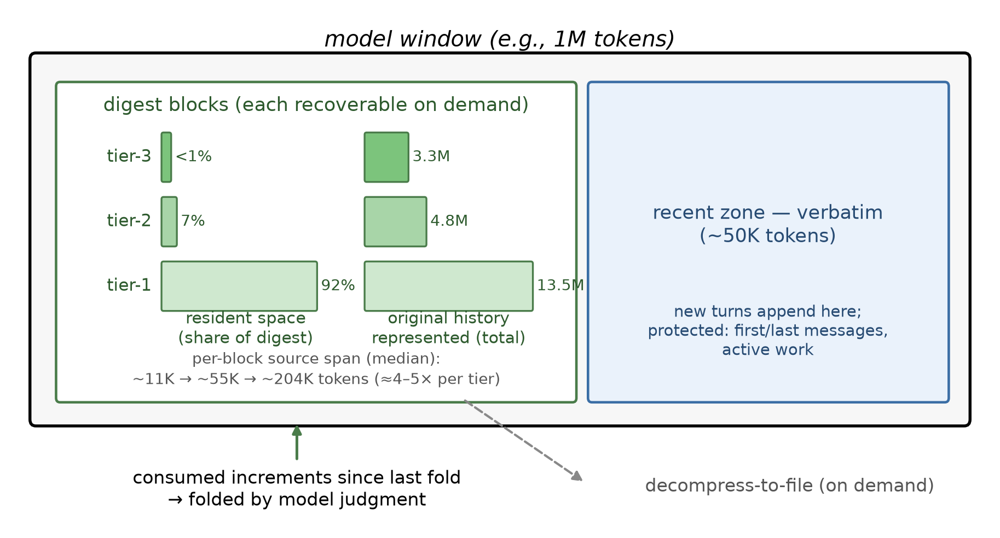
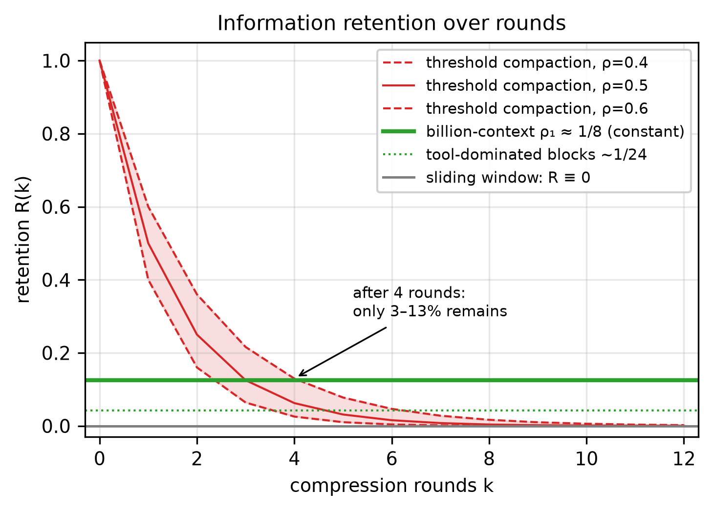
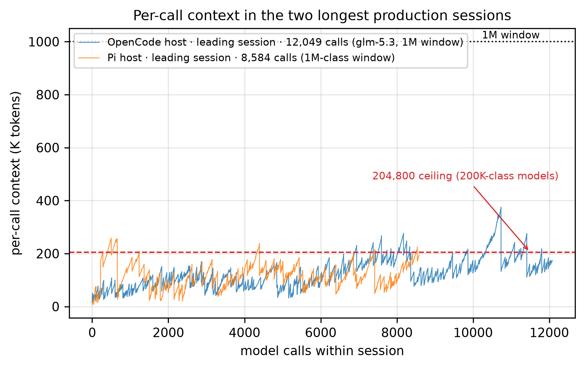
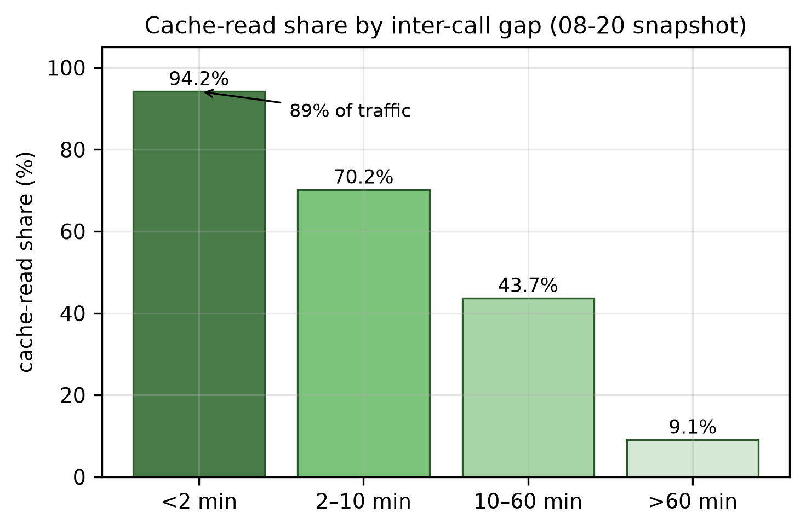
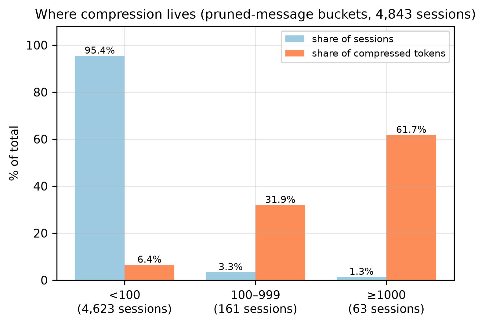
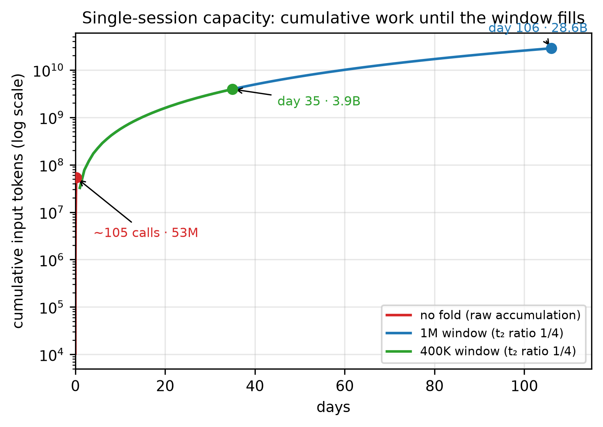

# 模型驱动的分层增量压缩:面向长寿命编码 Agent 的免训练多代上下文管理(中文版)

**Preprint v0.2 —— 2026-09-07。** 证据标记:**[V]** = 已对日志数据验证(生产日志;试点/实验日志处单独标注);**[A]** = 分析/模拟;**[P]** = 计划中实验(剩余 RQ)。作者:Xianglei Ran(冉祥磊)<ranxianglei@gmail.com>。

> **许可与编辑:** 本文与代码一同以 **MIT 许可**开源,是代码库的一部分 —— 这是一份活文档,任何人都可以编辑,欢迎通过 PR 改进。

> 译注:应作者要求,系统统一更名为 **billion-context**(简称 BC);内核仓库名 `acp-kernel`(Active Context Pruning)保留(历史遗留),与 Zed 的 Agent Client Protocol、Linux 基金会的 Agent Communication Protocol 无关,论文中已加脚注澄清。

## 摘要

长寿命编码 agent 会耗尽上下文窗口:工具输出不断累积,直到 harness 截断历史,或用一次性有损摘要将其压缩——此后 agent 再也想不起被丢弃的内容。本文证明:**20 万 token 的有界上下文就够了——无需扩大窗口、增加加速器显存或堆叠检索基础设施,即可支撑高质量、持续数月的任务与万轮调用的会话,并处理数十亿累计输入 token。** 证据来自跨三个宿主、历时四个半月的日常生产使用:在 204,800-token 上下文窗口的模型上,会话上下文从未超出窗口上限;马拉松会话则在不变的约 1M token 窗口上连续运行了数月。实现这一点的系统是 **billion-context(BC)**,一个免训练的上下文管理系统。与传统做法——上下文到达阈值后把全部历史总结成一个不透明大块并丢弃原文(不可逆)——不同,BC 由模型自己主动决定压缩什么、何时压、压多少,依据是当前任务是否还需要该内容,被压缩的内容不丢弃,而是蒸馏成放在会话开头的摘要块,每个块都可单独恢复;最近的工作区(约 50K token)保持原文。我们把这一布局称为**折叠(the fold)**。由此产生三重经济学。**（1）折叠带来长会话与质量:**折叠让总上下文在有界区间内震荡而不是不断增长——每次压缩只是用一份紧凑摘要替换中段历史的一个区间(输出中位仅 185 token,97.5% 不超过 2K),而且只压缩上次压缩以来新增的内容。生产中,重负载会话约 90 万 token 的均值历史(中位 53 万)最终只留下约 13K token 的摘要(常态整体压缩比约 **70×**),会话可以连续运行数月,而每个摘要块始终可单独恢复。质量也不下降,原因有二:一、被压缩的只是任务已经消费过的内容——即自上次压缩以来累积的增量(增速门触发下限 ~50K、有效下限 ~22.5K),以大体量低密度工具输出为主;实测单次压缩实折中位 2.6K(§6.2)——而不是正在使用中的内容;二、压缩瞬间系统向模型注入一份受控提示词,给出待压缩候选区间的精准推荐列表(带真实尺寸)与压缩指导,压缩完成后立即移除该注入,不在上下文中留痕。其结果是,召回探针得分持平的情况下,重读(重新获取已压缩内容)调用减少 63%(2.7×)。**（2）低上下文带来资源节省:**因为历史只追加、压缩只停用后缀区间,KV-cache 前缀从不因压缩失效:活跃节奏下(调用间隔 <2 分钟,占 89% 流量),实测缓存读占比达 **94.2%**;两个带缓存宿主的混合值 88.3–90.7% 之所以偏低,是空闲期间服务商侧缓存过期所致,而非布局问题——对未命中的归因分析显示,仅 16% 的未命中 token 来自新增后缀。在自托管服务栈上,有界上下文还能按比例缩减常驻 KV-cache 显存;而改写式压缩每次都会使整个前缀失效,并要求整个窗口常驻显存。**（3）低上下文提高模型注意力:**前沿模型的注意力在 20 万 token 以下区间最可靠,在长上下文尾部发生退化;折叠把总上下文保持在前者,而不是推向后者。

单个会话可以有多大?以 1M token 窗口为例,理论上最多支持约 286 亿(28.6B)token、长达 106 天的可持续工作(累计输入口径,含缓存重读)**[A:仿真拟合自本语料;超出最大观测会话约 19 倍;tier 比率拟合自 57 个观测 tier-2 事件(流量加权)]**。这是如何做到的?有赖于上下文蒸馏系统:摘要块本身作为原始上下文,递归进入压缩流程,折成 tier-2;tier-2 又可再折成 tier-3,形成罗汉塔效应 —— 每层都比下面一层小得多,摘要体的增长因此逐层衰减,从而能处理巨大的累计上下文输入;按此布局做闭式推导加离散事件仿真(各层保留率按生产压缩数据校准),即可算出上述上界。而没有折叠,同样的会话在约 104 次调用(累计输入约 5,300 万 token,不足一天)内就会撞满窗口。对比传统阈值触发的一次性有损压缩,关键差异在信息留存率随轮数的行为:传统方案每轮把约 80% 窗口的历史重做成 30–50% 窗口的摘要,早期内容每轮被再摘要一次,按 ρ^k 几何衰减(ρ≈0.4–0.6,四轮后仅余 3–13%)渐近于零;我们的折叠每轮只压已消费的增量,tier-1 块中位保留 ~1/8(工具主导块 ~1/24),且每段内容一生只被折一次、之后常驻不变 —— 留存率停在 ~1/8,不随轮数复合衰减(生产中 tier-2 再蒸馏仅 1,711 块中的 60 个)[A]。因此从原理上兼顾了长上下文与质量。这是建模的单会话天花板,与实测多会话语料的统计口径不同,不可并列比较。我们报告了据我们所知首个多月份、多宿主的会话内上下文压缩纵向部署研究(一个并行的接口层系统报告了三个月的生产使用):四个半月的日常生产使用中,4,843 个会话部署了折叠(其中 917 个留有用量记录)、174,327 次模型调用共处理 **187.6 亿累计输入 token**(17.5 亿新鲜 + 170.1 亿缓存读);三宿主合计 **约 247 亿**,这正是 billion-context 之名的由来。在 204,800-token 窗口的模型上,上下文从未溢出;马拉松会话达 8,584–12,049 次调用(累计约 10–15 亿 token,1M 级窗口),平均上下文约 120K;Pi 宿主(OpenCode 侧统计被大型静态 `AGENTS.md` 与宿主提示词大块抬高,Pi 侧测量则不受此影响)实测每调用上下文:均值 88K、中位 72K、p99 218K。生产中共压缩 2.29 亿 token,其中 62% 集中在消息数超千的会话中,而这类会话仅占总数的 1.3%——上下文管理是一种"马拉松现象",短会话基准无法观测。对照实验(对比实质未截断的滑窗保留基线;80% 阈值臂在本试点尺度从未触发、退化为滑窗)显示:BC 配置的计费 token 降低 31–54%(按主表口径),探针得分持平,默认调参下零可测召回损失(激进调参则在阶段结构负载上以召回换成本)。2.7× 的重获取降幅归因于*哲学+布局整体捆绑*:即使一次压缩都不执行的对照组,仅靠哲学文本加消息标签也复现了几乎全部降幅(重获取 −62%,对照头条 −63%);由引擎按固定节奏驱动的确定性压缩臂,重获取同样为 18 次。这个确定性臂在重复性负载上甚至比默认 BC 便宜 37%,但在阶段结构负载上优势反转、默认配置全面占优——代价是跨随机种子的方差更大、摘要不感知当前任务、且不具备折叠机制。我们还公开了压缩哲学与两个延伸方向:面向 ~50K 总上下文的极端压缩档,以及将哲学蒸馏入权重以进一步节省的路径。

## 1. 引言

Agentic 软件工程的决定性约束 [2405.15793][2310.06770] 不是模型能力,而是**上下文寿命**。一个连续数周改代码的 agent,每轮以数千 token 的速度累积工具输出、诊断与决策。主流的每一种补救都是"遗忘"或"外置"的变体:

- *滑动窗口截断*直接丢弃最老的轮次(attention-sink 流式 [2309.17453] 的事实窗口策略),且位置退化侵蚀着即使幸存的内容 [2307.03172]。
- *阈值自动压缩*(商业编码 CLI 的出厂配置[^claudecode])在接近窗口上限时把全部历史总结成一个不透明的大块并丢弃原文 —— 不可逆、单一粒度、且触发时机由一个对任务实际需求视而不见的阈值决定。
- *外部记忆*(向量/图存储)抽取"事实"却丢弃过程性上下文 —— 解释某个修复为何生效的那段 traceback、用户 300 轮之前说过的约束。

近期研究在*方向*上一致 —— agent 应当管理自己的上下文 —— 但其主流路线在机制上收敛于**训练**:AgentFold [2510.24699] 围绕折叠算子微调 30B 模型;Context-ReAct [2605.05191] 从 1 万条合成轨迹蒸馏五个原子上下文算子;ACM [2607.23809] 在外置记忆上后训练编辑工具。这把"自主管理"定价为每个 agent 框架一份定制 checkpoint,并把策略冻结在训练时刻。

我们从一个不同的前提出发:**压缩所需的判断力已经存在于前沿模型之中;缺失的是让这份判断力可执行、且安全落地的脚手架。** billion-context[^name] 以"一个库 + 一部哲学"提供该脚手架:

1. **是内核,不是 harness**(§3)。一个宿主无关的 TypeScript 内核实现完整块生命周期 —— 引用分配、同步、分层蒸馏、剪枝、过滤、提示、紧急截断 —— 组织为 9 阶段逐轮流水线。宿主(系统适配主流 agent:共享内核 + 通用代理 `billion-context` 以代理模式覆盖三种主流模型 API 协议,任何能设置 base URL 的 agent 零适配接入;下游 bili 系列为 Pi、OpenCode 等宿主提供 ~9k 行集成)。同一内核服务 GLM-5.1/5.2/5.3、Qwen、GPT 级模型而无需再训练 **[V:运行级]**。
2. **是哲学,不是 checkpoint**(§4)。我们把压缩判断力编纂为可执行的提示词规约:两种失败模式(过压与欠压)、唯一判据("这段内容当前任务步骤还需要吗?")、保护区、以及摘要的 KEEP/DROP/优先级规则。哲学可检视、有版本,并且 —— 如 §9 所论 —— 可直接用作蒸馏入权重的课程。
3. **多代可逆**(§3.2)。压缩产出*块*;块本身再被压缩(tier-2),再再被压缩(tier-3),每个世代保留对其来源的引用。结果是一棵"摘要的 LSM 树":写放大式的分层作用于上下文,支持逐块解压,以及在不扰动缓存前缀的前提下恢复全部保真度的 to-file 解压模式。

这一布局产生**三重经济学**,也是本文证据的组织骨架(§6)。**（1）折叠带来长会话与质量:**折叠让总上下文在有界区间内震荡而不是不断增长——每次压缩只是用一份紧凑摘要替换中段历史的一个区间(输出中位仅 185 token,97.5% 不超过 2K),而且只压缩上次压缩以来新增的内容。生产中,重负载会话约 90 万 token 的均值历史(中位 53 万)最终只留下约 13K token 的摘要(常态整体压缩比约 **70×**),会话可以连续运行数月,而每个摘要块始终可单独恢复。质量也不下降,原因有二:一、被压缩的只是任务已经消费过的内容——即自上次压缩以来累积的增量(增速门触发下限 ~50K、有效下限 ~22.5K),以大体量低密度工具输出为主;实测单次压缩实折中位 2.6K(§6.2)——而不是正在使用中的内容;二、压缩瞬间系统向模型注入一份受控提示词,给出待压缩候选区间的精准推荐列表(带真实尺寸)与压缩指导,压缩完成后立即移除该注入,不在上下文中留痕。其结果是,召回探针得分持平的情况下,重读(重新获取已压缩内容)调用减少 63%(2.7×)。**（2）低上下文带来资源节省:**因为历史只追加、压缩只停用后缀区间,KV-cache 前缀从不因压缩失效:活跃节奏下(调用间隔 <2 分钟,占 89% 流量),实测缓存读占比达 **94.2%**;两个带缓存宿主的混合值 88.3–90.7% 之所以偏低,是空闲期间服务商侧缓存过期所致,而非布局问题——对未命中的归因分析显示,仅 16% 的未命中 token 来自新增后缀。在自托管服务栈上,有界上下文还能按比例缩减常驻 KV-cache 显存;而改写式压缩每次都会使整个前缀失效,并要求整个窗口常驻显存。**（3）低上下文提高模型注意力:**前沿模型的注意力在 20 万 token 以下区间最可靠,在长上下文尾部发生退化;折叠把总上下文保持在前者,而不是推向后者。这三个命题合起来构成本文的核心主张;以下各章逐一为其提供证据:生产遥测(§6)、单会话容量建模(§7)与受控实验(§8)。

**贡献。** 核心贡献是一个*实证命题*而非某个机制:**20 万 token 的有界上下文就够了 —— 高质量、数月长的任务、数十亿累计输入 token、万轮调用会话 —— 且以折叠方式组织时,无需扩大上下文窗口、增加加速器显存、或堆叠检索基础设施。** 在我们四个半月生产部署观测到的任务组合上,这对每个会话都成立;§9 界定了该命题不适用的任务类别(逐字历史类工作)。底层机制没有一项单独是新的 —— 分页、摘要、保护区、分层皆见于已有工作(§2);新的在于:证明达到这个工作点靠的是折叠这一特定架构而非既有机制的简单叠加、在生产规模上测得该工作点的经济学、以及论证同一硬件可扩展到 286 亿 token 的单会话工作量:

- **C1(充分性,在观测人群上实证)。** 生产流量上,≤20 万窗口从未成为约束:主宿主四个半月(另加 Pi 近六周、ework 12.2 天),204,800-token 模型零违规;干净的 Pi 宿主上每调用上下文均值 88K/中位 72K —— 约为 204,800 档天花板的 35%(大窗口会话按设计跑得更满,§6.1)—— 1M 级窗口上的马拉松会话(8,584–12,049 次调用、~10–15 亿累计)以约 120K 平均上下文完成真实工作。受控实验中,召回探针与实质未截断的保留基线同分,重获取调用少 2.7× —— 这是哲学+布局捆绑的效应(§8.1):我们把"任务需要的不是更大的窗口,而是正确的布局"读作该捆绑证实的假设,而非逐机制归因。
- **C2(不依赖资源的长时能力)。** 折叠把窗口大小从硬上限变成有界区间:会话在*不变*的硬件与窗口上运行数月 —— 无更长上下文、无额外 KV-cache 显存(反而按比例缩减)、无检索服务 —— 校准的层级容量分析把同一资源外推到 286 亿 token / 106 天的单会话工作 **[A:仿真,拟合;~19× 外推]**。
- **C3(使能组合)。** 命题靠折叠机具成立 —— 布局不变式(蒸馏前缀、原文近期区、首末消息保护)、作为带六条交互机制的版本化提示词规约的哲学、"停用+谱系"压缩、增速门控的只压增量触发。每个组件皆见于已有工作;贡献在于折叠这一特定架构的组合方式,以及让模型判断在其中保持安全的交互机制(见"我们不宣称的")。
- **C4(三重经济学的实测 = 资源无关性的验证)。** **① 长会话与质量**:单次输出中位 185 token(97.5% ≤2K)、~70× 常态宏折叠、digest 占窗口个位数百分比、工具块 24×/45×;只压已消费增量 + 压缩瞬间受控提示词(压完即删)使质量不降 —— 探针同分、重获取少 2.7×(静默对照中仅哲学+标签即复现几乎全部降幅:重获取 −62%,对照头条 −63%;§8.1)。**② 资源节省**:活跃节奏 94.2% 缓存读占比、16% 增长归因未命中、KV-cache 显存与有界区间成比例 —— 对照改写式压缩的全窗口驻留与全前缀未命中。**③ 注意力**:总上下文保持在位置退化 [2307.03172] 相对较轻的区间(2023 年证据;当前前沿边界待测,§8.2)。
- **C5(证据与工件)。** 三宿主最长四个半月的生产研究(跨宿主累计输入约 247 亿;仅主宿主:174,327 次调用、2.29 亿 token 被压缩、17,783 块审计(08-20 快照))、四臂加一个调参变体的受控初测、生产压缩实际保留/丢弃什么的语料分析、以及带双宿主适配器的开源内核。

**我们不宣称的。** 模型主动(动态)压缩不是我们的 —— 它始于 MemGPT [2310.08560],且已是 agent 上下文插件标配;search/decompress 工具接口同样是既有技术。训练侧压缩器(流派 a)正交且可组合。逐字历史类任务 —— 审计、合规、取证、约束并集超出任何摘要的同时多约束重构 —— 在有损折叠不产生恢复流量的支持范围之外;我们不宣称覆盖它们(恢复在被指示时有效,但该规模的模型不会自发去用,§8.1)。我们的主张是:有界上下文对我们部署中观测到的编码 agent 任务组合之充分性的实证、达成它的折叠组合、以及纵向证据。

## 2. 背景与设计空间

我们将先前工作组织为六个流派(完整地图见 2026 年 8 月的 survey:`survey-2026-08.md`):

**(a) 训练侧表示压缩。** AutoCompressors [2305.14788]、ICAE [2307.06945]、gist tokens [2304.08467]、LLMLingua [2310.05736]、Cartridges [2506.06266]、以及规模化 encoder–decoder 潜在压缩器 [2606.09659] 在表示层压缩且需要训练;它们与我们正交:billion-context 操作 agent 自己的 token 流,可以叠加其上。免训练的 token 过滤(Selective Context [2304.12102])划定了该流派免训练一角的边界,但在 token 粒度操作、无任务感知判断。

**(b) 外置 agent 记忆。** MemGPT [2310.08560] 为上下文分页(本身免训练且模型主动);Mem0 [2504.19413]、A-MEM [2502.12110]、Zep/Graphiti [2501.13956] 将事实抽取进向量/图存储,处于 agent 记忆的认知架构框架(CoALA [2309.02427]、记忆综述 [2404.13501])与记忆操作系统路线(MemOS [2507.03724]、MIRIX [2507.07957])之中,上溯至 Generative Agents [2304.03442] 与 Reflexion [2303.11366];CAM [2510.05520] 把经验增量聚类为层次摘要;Agent Workflow Memory [2409.07429] 从过往轨迹蒸馏可复用程序,PRO-LONG [2607.20064] 保留完整的结构化交互日志供 agent 驱动检索 —— 这是保留–压缩轴的一个极端,亦见于 agentic 检索文献 [2508.11126]。事实抽取流水线回答*说过什么*却丢弃大量过程性上下文;程序导向变体把程序存到带外,而非作为会话内可恢复的血统;billion-context 把蒸馏物保留*在会话内部*,可浏览、可恢复。

**(c) 训练出的自主管理。** AgentFold [2510.24699](折叠算子,SFT)、Context-ReAct [2605.05191](五算子,完备性证明,SFT)、ACM [2607.23809](编辑工具 + 外置记忆,后训练)、EvoDS [2606.03841](数据科学 agent 的 RL)。HyMem [2608.15703] 按*功能*(规划 vs 执行)而非摘要生成来分层上下文;Paritok-4B [2608.24188] 为编码 agent 轨迹蒸馏抽取式、意图条件压缩器(SWE-bench Lite 上 25.7% 上下文、86.5% 解决率)。精神上最接近;全部需要按框架训练,其检索路径虽可重新浮现存储内容,但没有分层块世代、会话内逐块可逆性或生产数据。

**(d) 引擎管理的无损递归。** LCM [2605.04050] 维护一个带"指向每条原始消息的无损指针"的层次摘要 DAG,由引擎驱动。它与我们有相同的"层次+指针",但以引擎确定性取代模型判断:没有模型决定的目标、没有需求侧(增速门控)触发、没有哲学、没有部署研究。机制对比见 §3.5,实验对比见 RQ1。

**(e) 生产 harness。** 商业编码 CLI 出厂即带阈值自动压缩(摘要器未公开文档)。一项 harness 演化研究 [2607.03691] 表明仅 harness 变更即可测地改变 agent 质量 —— 为 harness 层研究提供动机。OPENDEV [2603.05344] 提及自适应压缩但无机制无评估。Compaction Cliff [2608.22752] 量化了生产 /compact 式摘要的保真度塌方(20 个生产配置下,一轮后安全规则存活 53%、五轮后 10%);MemoryWalker [2609.00865] 在研究训练–推理失配时把生产 harness 的上下文压缩当作工作公理;String OS [2608.28027] 报告了一个接口层 token 节省设计的三个月生产部署。除该报告外,我们未见这些 harness 家族关于*压缩行为*的公开纵向数据(survey §3)。

**(f) 压缩代价评估。** 交互成本分析 [2608.16370] 揭示压缩的隐性重获取代价(即使任务完成率不降,检索调用也急剧上升);TRACE [2608.06503] 与 SWC [2608.11775] 记录执行不稳定与时序性问题塌方。这些塑造了我们的度量设计(交互成本是 RQ1 的一等公民度量)。

**定位。** 我们不宣称发明 agent 自主管理(流派 c),也不宣称发明层次无损指针(流派 d)。本文的主张也并非**性质合取**——把免训练、多代、可逆、生产验证等性质机械地叠加在一起,并不足以达到该工作点(贡献段所述:靠的是折叠这一特定架构)。本文做的是以 §4.2 定义的信息留存率为尺度,剔除长寿命 agent 的既有方法论:在渐近留存率(会话长度→∞ 时早期内容的极限)× 常驻体量两轴下,滑动窗口 R_∞=0(出窗内容不再找回);阈值触发的自动压缩与一次性改写每轮把早期内容再摘要一次,留存率按 ρ^k 几何衰减趋零;外置记忆在写入时刻不可逆(事实被留住,过程性上下文与精确值在离开窗口时即丢失);无损递归(LCM)R_∞=100%,但常驻体量永不衰减。据我们所知,流派 (a)–(f) 中没有系统同时满足渐近留存率 > 0(单折不复合)与常驻亚线性增长——折叠是唯一同时做到两点的组合(C3,留存论证见 §4.2)。正交地,KV-cache 驱逐方法(H2O [2306.14048]、SnapKV [2404.14469])在注意力内部压缩,与上述任何方法兼容。

## 3. billion-context 内核

### 3.1 架构

billion-context 在一条刻意的分界线上切分职责:**模型写摘要;库负责其余一切编排。** 内核(`acp-kernel`,约 10k 行 TypeScript,零宿主依赖,550+ 测试)暴露 `processTurn(state, messages, config) → (state', rendered, effects)`。宿主拥有模型 I/O 与工具分发;内核拥有全部上下文簿记。系统由四个公开项目构成:宿主无关的压缩内核(`acp-kernel`);通用上下文压缩代理(`billion-context`)——以代理模式工作,支持 Anthropic、OpenAI chat、OpenAI Responses 三种主流模型 API 协议,任何能设置 base URL 的 agent 均可零适配代码接入(另为 ACP 系 agent 提供 `bili pi` 等启动器);ACP 原生扩展(`billion-context-pi`,服务 Pi 编码 agent);以及 `opencode-acp` —— 早期独立实现、原理一致,服务 OpenCode 宿主 **[V]**。

逐轮流水线依次为:**assign-refs**(为新消息铸造稳定 `mNNNNN` id)→ **sync-blocks**(将新内容投影到块边界)→ **merge-blocks**(合并相邻可压缩区间)→ **prune**(强制预算不变量)→ **filter**(按角色/内容类型的可见性规则)→ **hide-compress-calls**(从渲染视图移除压缩工具噪声)→ **nudge-inject**(§3.4)→ **emergency-truncate**(最后手段的硬上限)→ **render-refs**(产出带逐消息引用标签的最终消息列表)。每个阶段纯函数且独立测试;宿主从不直接改写历史。

**图 1.** 折叠布局:模型窗口 = 可恢复的摘要块(罗汉塔分层:tier-1/2/3)+ 近期区原文(~50K)。层间比例与每块代表跨度按生产内核语料(116 个有常驻摘要块的会话)实测:tier-1 常驻占比 92%、tier-2 7%、tier-3 <1%;tier-2+3 仅占 8% 常驻却承载 37% 的历史内容,每块代表跨度逐层放大 ≈4–5×(中位 ~11K/~55K/~204K token)。已消费的增量按模型判断折入摘要块,任意块可经 to-file 解压按需恢复。

**图 1.** 折叠布局示意:模型窗口 = 可恢复的摘要块(罗汉塔分层:tier-1/2/3)+ 近期区原文(~50K);已消费的增量按模型判断折入摘要块,任意块可经 to-file 解压按需恢复。

### 3.2 块:多代分层

一个 `CompressionBlock` 携带 {blockId, runId, tier ∈ {1,2,3}, topic, summary, directMessageIds, effectiveMessageIds, directBlockIds, createdAt, survivedCount, generation ∈ {young, old}, active}。tier-1 块总结连续的**消息区间**(通常一次压缩决策一块)。当 tier-1 体量累积起来,tier-2 压缩把*块*折成新块,其 `directBlockIds` 指向来源;tier-3 同理再折 tier-2。结构是一棵"散文上的 LSM 树":年轻世代吸收写入,年老世代保存压实后的历史,压实是增量的而非整史重做。`effectiveMessageIds` 传递性地覆盖一个块所总结的全部原始消息,因此谱系在任意再压缩之后依然存活。这套逐层再蒸馏就是摘要所称的**上下文蒸馏系统**:摘要块本身作为原始上下文递归进入压缩流程(tier-1 → tier-2 → tier-3),形成每层都比下面一层小得多的罗汉塔效应,摘要体的增长因此逐层衰减 —— 它是单会话容量得以亚线性于会话长度增长的直接原因(§7)。

**生命周期。** 块要么 `active`(渲染进上下文),要么被停用(仍留在状态里)。`decompress` 重新激活块的来源并停用该块;**decompress-to-file** 则把完整源文本写到文件系统而非上下文 —— 保住 KV 前缀,同时让模型按需读到全部保真度。`search_context` 提供对块摘要加近期消息的关键词召回;`acp_status` 报告逐轮的构成分解(system / tool / summaries / code / text)与可压缩区间。当后续压缩消费掉一个块时,它作为"已消耗血统"保留 —— 批量解压可还原整个 run。

### 3.3 保护区与过滤器

并非所有内容都可压缩。压缩工具调用本身硬保护(它们含有摘要);近期区(最后约 5 条消息 / 约 5K token —— 内核硬下限;生产中实际的原文区大得多,达数十 K)、最后一条用户消息、以及第一条用户消息(任务意图)始终可见;assistant 消息跳过引用标签注入以防模型回声。这些规则位于 filter 阶段而非提示词里 —— 提示词可以*请求*压缩任何东西,但内核强制执行下限。

### 3.4 需求侧触发:增速门控提示(只压已消费的增量)

先行系统按供给侧信号门控压缩:填充率阈值、固定节奏、或把时机烧进权重的训练策略。billion-context 额外按**需求**触发:当 (i) 上下文超过窗口的下限比例(默认约 0.45)*且* (ii) 上下文自上次压缩以来增长超过门控量(增速门控)时,注入一条提示;tier-1 体量占主导时有分层专属触发。增速门实现一条哲学规则 —— *在任务步与步之间压缩,而非步中* —— 并在每次压缩后重置基线。被触发的压缩因此只针对任务已经消费过的增量(每个触发周期 ≥22.5K 已消费增量:门控阈值 50K、有效下限 22.5K;实测单次压缩实折中位 2.6K,§6.2),而不是正在使用中的内容 —— 这是 §6.2 "质量不降"的第一条机制。生产中这产生与任务阶段边界(而非 token 计数)对齐的压缩节奏 **[V;分布证据见 §6.5 —— 逐阶段节奏对齐仍为定性]**。

### 3.5 与 LCM 的对比

LCM 的引擎确定性地决定递归并保持每条原文可达;billion-context 让模型决定目标、层级与时机,保持块粒度(而非逐消息)的摘要,并补上 LCM 缺的东西:增速门控的需求侧触发、LSM 式逐代晋升、哲学(§4)、decompress-to-file 缓存保护、以及纵向部署数据(§6)。我们初测的引擎策略臂是该类刻意简化的代表 —— 固定节奏、有损、单层、无指针层次(见 §8.1);忠实的无损递归 LCM 实现留作未来工作。

### 3.6 设计决策一:为什么只压增量

**每轮只压缩上次压缩以来新增的内容,从不重写全部历史**——这不是实现细节,而是承重设计,同时是三重经济学(§6)与留存率行为(§4.2)的结构根源:

- **质量**:每轮被压缩的只有自上次压缩以来累积的已消费增量(门控触发下限 50K、有效下限 22.5K;实测单次压缩实折中位 2.6K,§6.2),以大体量低密度的工具输出为主——被丢弃细节的风险因此落在任务已经用完的材料上,而非仍在使用的上下文上(机制见 §4.1;生产中单块压缩输出中位 185 token、97.5% 的块 ≤2K,见 §6.2)。
- **资源**:窗口是 append-only 的——新内容只追加在尾部,压缩只停用被折叠的后缀区间。已建立的 KV-cache 前缀因此永不失效,这是活跃节奏下 94.2% 缓存读占比的结构前提(§6.3)。任何"改写历史"式的压缩都会使全部前缀失效,且要求整窗内容常驻显存。
- **留存**:每段内容一生只被折叠一次,之后作为摘要块常驻不变——信息留存率停在 ~1/8,不随轮数复合衰减;而传统方案每轮把全部历史重新摘要一次,早期内容按 ρ^k 几何衰减至零(§4.2)。
- **成本**:计费 token 跟随所做的工作而非历史的长度——每轮压缩成本 ∝ 当轮增量,会话越长单位成本越低(§8.1:计费 token 减少 31–54%)。

一句话:增量使压缩成为 O(增量) 操作。质量风险、缓存失效、留存衰减、金钱成本都变成"新增工作"的函数,而不是"历史长度"的函数。

### 3.7 设计决策二:为什么模型驱动

**压缩的时机、范围与内容,由模型按任务状态决定,而不是由固定阈值决定。** 传统阈值触发的自动压缩同时具备三个缺陷:模型**不感知**——触发与内容选择由阈值决定,模型不参与决策;**无法拒绝**——触发即强制执行,即使内容对当前任务仍然关键;**无法选择**——单一粒度,整段历史被压成一个不透明的大块。三者同根:决策者对任务状态是盲目的。

billion-context 的"模型驱动"有两层含义:

(a) **压缩发生时**:模型依据"当前任务是否还需要这份内容"决定压什么、压多少,并保留拒绝权——拒绝是一次质量阀,不是失败(增速门控,§3.4)。

(b) **常规轮次中**:压缩哲学常驻系统提示词,因此即使没有任何压缩提示词注入,模型也会主动管理上下文——不仅保持折叠感知(知道窗口里有哪些摘要块、各自可以单独恢复、近期区在哪里、什么内容该被保住),还会自发发起压缩。这一行为在生产日志中可测:一个 5 天窗口的生产日志里,103 次有效压缩中 23 次(22%)发生在引擎明确不注入提示词的轮次(当时增速门报告可压缩量低于阈值或增量低于下限),另有 11 次自发的压缩请求因没有可压缩内容被内核空转处理,分布于 14 个会话 **[V]**。压缩因此不再完全由门控驱动:门控是下限保障,模型判断是常态。

受控实验把"判断内容"与"压缩机制"分离开了(§8.1):静默对照(一次压缩都不执行,只保留哲学文本与消息标签)复现了几乎全部重读减少(对照自身重获取降幅 62%,对照头条 63%)——说明判断内容本身承载了大部分收益;确定性臂(引擎按固定节奏驱动压缩,无模型判断)在重复性负载上比默认配置便宜 37%,但在任务阶段结构化的负载上优势反转,默认配置全面胜出——说明泛化的是任务条件化的时机与范围判断,而不是压缩频率本身。召回探针在默认调优下与不压缩持平:主动性没有拿召回换成本。

主动性也有实测边界:该规模的模型不会自发使用恢复工具——恢复在被明确指示时有效,但模型不会自己想起来调用(§8.1)。这正是 §9 "哲学入权重"路线的动机:把"何时该恢复"的判断内化进模型权重。

## 4. 压缩哲学

哲学是本文的概念核心:一份前沿模型可以零样本执行的**判断力规约** —— 把上下文工程 [2507.13334] 提升为版本化、宿主可配置的工件。它有五个部分(全文见 `acp-kernel/DESIGN-prompts.md`,由 `src/system-prompt.ts` 渲染):

1. **两种失败模式。** 过压摧毁后续需要的细节(任务质量损失);欠压淹没上下文(检索质量损失,继而溢出)。两种错误都不占优;哲学做的是平衡,而不是最小化其中一种。
2. **唯一判据。** 当且仅当内容*不再被当前任务步骤需要*时才压缩。不是"旧",不是"大" —— 是需要与否。这把压缩重新表述为对任务的查询,而非对文本的查询。
3. **受保护内容与区域。** 硬保护:压缩调用本身。软保护:近期区、最后一条用户消息。在内核强制的下限之上,哲学还指示逐字保留用户意图、约束、开放问题。
4. **摘要工艺规则。** KEEP-逐字类(带行号的文件路径;签名与承重代码行;精确错误串;*带理由*的决策;精确数值;目标演化;供日后解压的消息引用)、DROP 类(结果提取后的冗长日志;重复读取;*保留教训*的死胡同探索;通往结论的过程)、以及预算紧张时的优先级序(目标 > 决策+理由 > 工件 > 结论 > 教训)。tier-2/3 蒸馏与 tier-3 凝结逐级放宽保真度。
5. **交互机制。** 六条承重机制让哲学可执行而非说教:**(i) 节流的只压增量请求。** nudge 以 50K token 增长下限触发,但当待压缩体量低于该下限时,有效要求降为下限的 45%(50K 时经 0.45 比率下限 ≈22.5K)—— 压缩被推迟到增量值得总结为止,在质量与节省之间取得平衡,而非强制过早的小折叠。**(ii) 不告知比例。** nudge *从不告诉模型上下文填充比例*:nudge 携带指令与可压缩区间列表,不带百分比。被告知"用了 20%"的模型会把 200K 窗口锚定在"看起来很健康"上而拒绝压缩;隐去比例,判断就扎根于任务,而非一个模型无法用自己的注意力校准的数字。**(iii) 拒绝压缩的权利。** nudge 措辞为保持上下文精简 —— "an efficiency nudge to compress early and keep context lean --- not an overflow warning" —— 而非义务。模型可以在关键节点(调试中途、重构中途)拒绝,稍后经 (i) 再压;拒绝是质量阀,不是失败。**(iv) 对源内容的瞬态注意力。** 摘要利用注意力窗口做动态处理:待压缩区间在 compress 调用期间完整浮现,调用结束后从活动上下文中切除(compress 调用本身在被消费后隐藏)—— 决策在对源内容拥有完整注意力的情况下做出,随后源内容离开工作集。**(v) 推荐列表。** nudge 呈现候选区间及其真实尺寸(token 数、消息数、tool/text 构成)—— *带着*明确尺寸,模型才能选出结构合理的区间;没有尺寸(我们初测中的解析失败臂),模型压缩的是零散低价值区间。推荐列表是内核簿记与模型判断之间的接口。**(vi) 唯一消息编号。** 每条消息携带稳定引用 ID;区间选择、块谱系、解压全部按引用寻址;生产行为显示模型会在区间选择里引用编号,且即使不压缩,稳定的逐消息锚点也能可测地帮助长上下文注意力(与位置退化发现 [2307.03172] 及无损层级中的指针式访问 [2605.04050] 一致)。

哲学与内核一同版本化;提示词层变更像代码一样发布(两个宿主锁定精确内核版本)。近期版本将其暴露为*分层可配置的面*而非冻结文本:Layer 0 在显式 `acknowledgeRisk` 门后开放四条承重压缩规则的宿主覆盖(不 fork 即可定制);Layer 1 提供三态节覆盖(replace/remove/default)与工具描述定制;生产反馈还迭代措辞本身 —— 例如一轮引用保真调优将"复述"列为逐字 KEEP 的显式例外,并把块头改为任务相对("TASK AS OF THIS BLOCK")。**这是流派 (c) SFT 的免训练替代物:策略活在可检视、有版本、宿主可配置的文本里,以天为单位演化而非 GPU 月,且跨模型原样迁移 [V:GLM-5.1/5.2/5.3、Qwen、GPT 级模型生产服务 —— 运行级迁移;受控质量迁移未测]。**

### 4.1 为何质量不降

两条机制共同保证折叠不掉质量。**其一,只压已消费的增量**:增速门控(§3.4)使每次压缩只处理上次压缩以来新增的内容(每个触发周期 ≥22.5K:门控阈值 50K、有效下限 22.5K;实测单次压缩实折中位 2.6K,§6.2)—— 而不是正在使用中的内容;被丢弃细节的风险因此落在任务已经用完的材料上。**其二,压缩瞬间的受控提示词**:nudge 在压缩时刻向模型注入一份精准推荐列表(候选区间的真实尺寸:token 数、消息数、tool/text 构成,机制 v)加压缩指导(本节的判据与 KEEP/DROP 规则),压缩完成后该注入立即从上下文中移除(hide-compress-calls 阶段),不留痕 —— 决策在对源内容拥有完整注意力的情况下做出(机制 iv),而脚手架本身不占用后续轮次的上下文。生产微观证据见 §6.2,受控佐证(召回探针持平、重读调用减少 63%)见 §8.1;原则性指标见 §4.2。

### 4.2 信息留存率:一个原则性的质量指标

**定义。** 对运行于会话上的压缩算法 A,设 H_t 为时刻 t 已处理的全部信息。定义*会话级信息留存率* R_A(t) 为其中在会话内仍可恢复的比例(可恢复 = 原文或等价表示可按需取回)。注意与"常驻占比"的区别:常驻占比度量多少在窗口内,留存率度量多少在需要时取得回。对能主动重读的 agent,后者才是决定质量的量。

**传统阈值触发的一次性有损压缩。** 每轮触发把约 0.8W 历史压成 0.3–0.5W 摘要,单轮不可逆保留率 ρ≈0.4–0.6;下一轮再压"摘要+增量",早期内容每轮复合一次 ρ:R(k)≈ρ^k —— 四轮后仅余 3–13%,八轮后 0.7–1.7% **[A]**。滑动窗口是极端情形:出窗内容 R≡0。

**图 2.** 信息留存率随压缩轮数的行为:传统阈值压缩按 ρ^k 几何衰减(ρ≈0.4–0.6,四轮后仅余 3–13%);折叠恒定在 ρ₁≈1/8(工具主导块 ~1/24);滑动窗口恒为 0。

**billion-context 折叠。** 同一指标下,折叠的每轮保留率为 tier-1 块级 ~1/8(整体中位 7.9×;工具主导块中位 24×、p75 45×)—— 绝对值低于传统的单轮 0.4–0.6,但时间行为不同:增速门使每轮只压已消费的增量,每段内容一生只被折一次,之后作为摘要块常驻不变,早期内容留存率恒为 ~1/8;生产中 tier-2 再蒸馏仅 1,711 块中的 60 个(3.5%),二次损失可忽略。因此 R_∞(BC)=ρ₁>0,而 R_∞(传统)=0。指针链可恢复性(§3.2)是留存率之外的第二道保障,本文暂不将其计入 R。

**沿此轴评价压缩算法。** 两个量足够:渐近留存率 R_∞(会话长度→∞ 的极限行为)与单位恢复成本。沿这两轴,§2 六条路线落在四个位置:滑窗 R_∞=0;阈值自动压缩 R_∞→0(几何衰减);外置记忆路线(事实/图存储)R_∞ 取决于写入时抽取保真度——事实留住了,过程性上下文与精确值在写入时即丢失,属"写入时不可逆";无损递归(LCM)R_∞=100% 但常驻体量不衰减,窗口更快填满、压缩更频繁。billion-context 是唯一同时满足 R_∞>0(恒定 ρ₁)与常驻亚线性增长(罗汉塔效应)的组合。

**适用边界。** 留存率是必要非充分:它度量早期内容的渐近命运(是否被反复压缩几何抹除),而常驻摘要是否留住任务所需由哲学决定(§4.1 KEEP/DROP 规则);ρ₁≈1/8 是块级文本保留率而非信息保真度——被压的是大体量低密度工具输出,KEEP 规则保证高价值信息优先留存。完整的质量命题因此是:留存率定下限(早期内容不被渐近抹除),哲学定上限(常驻内容切中任务),二者共同构成"长上下文与质量兼顾"的原理性基础,§6.2 与 §8.1 提供经验佐证。

## 5. 部署环境

两个生产宿主将 billion-context 作为单个专家用户软件工程实践的日常主力:`billion-context-pi`(Pi 编码 agent;托管本研究 issue 跟踪器的仓库)与 `opencode-acp`(OpenCode)。模型经供应商 API 提供(GLM-5.1 窗口 204,800;GLM-5.2/5.3 更大;偶用 Qwen 与 GPT 级)。OpenCode 宿主数据来自其带逐调用 token 记账的 SQLite 消息库(提取于 2026-09-07);Pi 宿主数据来自其会话日志与结构化 billion-context 日志(2026-07-30 → 09-07,提取于 2026-09-07);ework 宿主数据来自其实时库(2026-08-26 → 09-07)。这是观察性、单用户、日常主力使用 —— 我们主张生态效度,不主张总体代表性 —— 且生产遥测度量的是有界性与成本,*不是*任务质量:充分性只能通过质量失败,而用量日志看不见质量(质量证据限于 §8.1 的受控探针与 §6.5 的语料审计)。Pi 日志 4.5 天的两个安全阀计数(08-20 快照):紧急提示路径(用量 ≥95%)触发 65 次;终末硬截断阶段从未触发。

第三台宿主将部署边界扩展到单用户设定之外:一台常驻 Linux 服务机("ework")以 OpenCode + `opencode-acp` 作为自治 agent 服务的推理引擎(聊天机器人驱动的 agentic 负载,本地 vLLM 供给 Qwen3.8-27B,窗口 262,144)。2026-08-26 → 2026-09-07(12.2 天)间记录 629 个会话、32,733 次模型调用:2.7 亿 input 加 20.4 亿 cache-read token(7.6:1 缓存比,尽管服务栈异构、含一个无前缀缓存的端点);262,144 窗口**零**违规,峰值上下文 229,355(限额的 87.5%);一个马拉松会话横跨 6.2 天、364 次调用 **[V]**。其 OpenCode billion-context 状态库持有 632 个会话状态(用量库 629 —— 状态比用量行轮换稍久,与主宿主同型)、376 个含被剪消息记录 —— 18,866 条被剪消息、2,610 万 token 被蒸馏 **[V]**。同内核、同哲学、同默认配置不变跑在第三宿主;这是 §4 迁移主张的第二次实例化(其测量自 §6.3 起作为证据引用)。

## 6. 生产证据:三重经济学 [V]

本节按摘要的三重经济学组织生产证据:① 长会话(§6.1)与质量(§6.2)、② 资源节省(§6.3)、③ 注意力(§6.4);§6.5 给出语料层面的马拉松现象。建模的单会话容量上界独立为 §7,受控实验为 §8。

### 6.1 ① 长会话:规模、有界性与马拉松

| 指标 | 数值 |
|---|---|
| 观察窗口 | 2026-04-23 → 2026-09-07(约 4.5 个月) |
| billion-context 会话 | 4,843(状态文件口径;用量库留存记录覆盖其中 917 个) |
| 模型调用 | 174,327 |
| 累计 input token | **187.6 亿**(17.5 亿新鲜 + 170.1 亿缓存读;Pi 与 ework 宿主另 +58.9 亿 = 合计约 247 亿:~27 亿新鲜 + ~219 亿缓存读,各宿主观察窗口不同) |
| 每调用平均上下文 | 107,603 token(逐调用行含 cache-write;不能由四舍五入的总量推出) |
| **204,800 窗口模型(GLM-5.1)** | **42,986 次调用,零窗口违规,峰值 198,628** |
| cache 读取 : input 比 | 约 9.7 : 1(append-only 前缀复用) |

*表 1:生产纵向规模(OpenCode 宿主)。*

有界性是按窗口的、非偶然:大窗口会话按设计跑得更满(GLM-5.2 均值约 116K,对应 1M 级限额),因为 billion-context 的阈值随窗口伸缩 —— 系统花掉模型给的预算,同时保证余量。

**干净的逐调用上下文(Pi 宿主实测)。** 上述 OpenCode 侧统计包含宿主特有的大块内容(大型静态 `AGENTS.md` 项目指令;随时间被裁剪的 OpenCode 系统提示词),非均匀地抬高上下文级统计。Pi 宿主提供更干净的测量:其会话日志记录每次调用的精确计费提示词(新鲜输入 + 缓存读 + 缓存写)。2026-07-30 至 09-07 的 380 个会话(排除 ework-daemon 后台流量后 40,574 次调用),实测每调用上下文为 **均值 88,218 / 中位 72,113 / p90 144,909 / p99 217,742** token,对应 204,800–1M 窗口,累计输入 **35.8 亿 token**(6.9 亿新鲜 + 28.9 亿缓存读,80.8% 缓存)、输出 3,200 万;Pi 头名马拉松 8,584 次调用、累计输入 10.1 亿、峰值上下文 257,721。这些水平在一个系统提示词大块不同的独立宿主上确认:折叠把典型工作上下文保持在 10 万以下区间(p90 145K),p99 218K 的调用运行在 ≥262,144 窗口档(204,800 窗口档调用峰值 198,628,零违规)—— 处于长上下文位置退化 [2307.03172] 相对较轻的区间内(按窗口档次的均值不同:204,800 档低于 1M 档)。

| 会话 | 调用 | 总 token | 峰值上下文 |
|---|---|---|---|
| ses_7fb7447… | 12,049 | 15.2 亿 | 374,946 |
| ses_05e4769d… | 9,644 | 12.9 亿 | 246,849 |
| ses_0b89319b… | 8,194 | 11.1 亿 | 699,921 |
| ses_08f2d501… | 5,127 | 6.0 亿 | 727,386 |
| ses_05eb7e4a… | 4,594 | 5.3 亿 | 273,754 |

*表 2:按模型调用数排序的 Top-5 马拉松会话(OpenCode 宿主)。*

**图 3.** 两个最长生产会话的逐调用上下文(实测):数千次调用在有界区间内震荡(约 50–375K),远低于 204,800 上限与 1M 窗口。

OpenCode 头名会话以约 126K 平均上下文维持 12,049 次调用(~15.2 亿 token,1M 窗口模型);Pi 头名会话 8,584 次调用、10.1 亿、峰值 257,721 —— 比流派 (c)/(d) 的基准视野评估高出数个量级,且在无管理的累积下不可能。(两场马拉松均骑在 1M 级窗口上、均值占用约 12%;论题的 ≤20 万条款由表 1 的 204,800 窗口机队单独实证。)

重负载会话(>10 万被压缩 token;n=242)的被压缩体量均值约 91 万(中位 53 万、p90 210 万),而常驻活跃摘要块仅中位 13 个(p90 53;每块摘要量级 ~1K token,见 §6.2)—— **常态宏折叠仍约 70×**,摘要占 204,800 窗口的个位数百分比;摘要不随历史等比增长,tier-2 蒸馏(Pi 宿主语料迄今 1,711 块中 60 块)把旧块世代折入 tier-2,随会话老化封顶前缀体量(§7)。

### 6.2 ① 质量:压的是什么,为何不掉

Pi 宿主日志(日志窗口 2026-07-30 → 08-20):1,657 次已应用压缩,折叠 726 万源 token(每次 ~4.4K),压缩前待压缩体量均值 13.7K(最大 169K)—— 待压缩体量与已折叠 token 是两个不同口径,因为 nudge 列出所有可压缩区间而一次压缩只消费其中合格的。压缩频繁、小粒度、与阶段对齐,而非罕见而慌乱,与增速门控的需求侧触发一致。

**为何质量不降。** 机制见 §4.1,原则性指标见 §4.2,这里给生产侧证据。其一,*只压已消费的增量*:跨 17,783 个生产块(16,436 个含 token 记账;08-20 快照),每次压缩替换一个中段区间(被压缩 token 中位 2.6K、p90 40K)为一份紧凑摘要 —— 输出大小中位 **185** token、p90 1.2K,**97.5% 的压缩输出 ≤2K token**(哲学摘要长度规则强制的上限);增速门(生产默认:50K token 增长下限)使每次压缩只处理自上次压缩以来累积的区间,因此一次压缩的成本随上次以来所做的工作伸缩,而非随历史长度,持续工作期间总上下文在有界区间内震荡(受控初测轨迹保持稳定锯齿;§8.1)而非上行。其二,*压缩瞬间的受控提示词*:nudge 携带精准推荐列表(候选区间真实尺寸)与压缩指导,压缩完成后立即移除、不留痕(§4.1)。逐块压缩比整体中位 7.9×,但工具主导块(覆盖 ≥5 个工具结果;n=7,241)中位 24×(p75 45×,最高逾 3,000×)—— 折叠红利集中在工具输出的大体量上,除哲学刻意的 DROP 类之外,在我们的探针套件上未观察到损失。受控佐证:召回探针得分持平的情况下,重读(重新获取已压缩内容)调用减少 63%(2.7×)(§8.1)。极端压缩分支(§9)收紧同一组门。

内核侧状态(Pi 宿主,116 会话,1,711 块)为哲学提供经验落地:块摘要中位长度 1.6K 字符、总结中位 29 条来源消息(p90 140);KEEP 类标记出现率(08-20 样本:精确值 93%、消息引用 47%、带行号路径 39%、签名 16%)与哲学工艺规则被执行相一致,签名/错误率低反映块主题以过程性为主;块主题与任务阶段对齐("Issue #83 续作 + PR #86 验证");tier-2 块在生产中存在(1,711 中的 60 个,3.5%)—— 级联蒸馏发生但稀少,与其"安全阀而非常规路径"的设计一致。

### 6.3 ② 资源节省:缓存与资源经济学(实测)

由于历史只追加、压缩只停用后缀区间,压缩从不使 KV-cache 前缀失效。实测缓存读占比(缓存读 token / (缓存读 + 新鲜输入))在主宿主混合值为 **90.7%**(四个半月 170.1 亿读 vs 17.5 亿新鲜),在 ework 宿主为 **88.3%**(12.2 天 20.4 亿 vs 2.7 亿,服务栈异构、含一个无前缀缓存端点 —— 剔除该端点 2,560 万未缓存输入后,比值升至 8.4:1)。两个分解表明这些混合值*低估*了该布局。其一,按调用间隔对 32.7 万对连续调用分层(08-20 快照):<2 分钟 → **94.2%** 读占比(占 89% 流量)、2–10 分钟 → 70.2%、10–60 分钟 → 43.7%、>60 分钟 → 9.1% —— 随空闲时间单调衰减,是服务商侧缓存 TTL 过期的特征,而非布局所致。其二,以预期新增后缀增长为基准的未命中归因(同快照):仅 **16% 的未命中 token** 可由上次调用以来追加的 token 解释;其余 84% 带有服务商驱逐特征(过期、重启、缓存粒度)。若未命中仅限于新增部分,读占比将接近 ~98%。改写式压缩(对历史的一次性摘要)则在每次压缩事件都使整个前缀失效。在自托管服务栈上,同样的有界性是*显存*节省:常驻 KV-cache 占用随活跃上下文伸缩,把近期区维持在 ~50–135K 而非贴近窗口峰值,可按比例缩减每会话 GPU 显存、让每张加速器容纳更多并发会话 **[A:比例算术;在 ework 宿主的 vLLM 服务上实测,均值上下文 70K 对应 262K 级窗口]**。在缓存 token 约为新鲜输入 10% 价格的服务商计价下,90–94% 的读占比大致将同等规模未缓存上下文的有效输入成本减半 **[A:依赖计价]**。这也回答了异步压缩的问题:我们公开 issue 跟踪器中有一条外部提案,建议把压缩委托给低成本或免费的带外子 agent[^issue80];但在我们的布局中,压缩调用的提示词几乎全是缓存读(它读的历史就是稳定前缀),输出有界(~2K token;§6.2),因此带内压缩的边际有效成本已接近地板 —— 一个免费的异步压缩器至多打平,还会引入陈旧性与结果插入问题。带内压缩不是需要工程手段消除的成本;它已经近似免费 **[A:分析;依赖计价]**。

**图 4.** 缓存读占比随调用间隔单调衰减(08-20 快照):<2 分钟 → 94.2%(占 89% 流量)、>60 分钟 → 9.1%。

### 6.4 ③ 注意力:留在可靠区间内

前沿模型的注意力在 20 万 token 以下区间最可靠,在长上下文尾部发生退化(位置退化 [2307.03172],2023 年证据;当前前沿模型的确切边界待测,§8.2)。折叠的作用正是把总上下文保持在可靠区间内,而不是推向退化尾部:Pi 干净测量中 p99 218K 的调用运行在 ≥262,144 窗口档(204,800 窗口档调用峰值 198,628,零违规),处于退化相对较轻的区间(按窗口档次的均值不同:204,800 档低于 1M 档);受控实验中,哲学+布局整体捆绑下召回探针与实质未截断的保留基线同分(§8.1)。

### 6.5 马拉松现象:压缩生活在哪里 [V]

跨 4,843 个会话状态文件聚合适配器状态(OpenCode 宿主;用量库留存记录覆盖其中 917 个 —— 状态比用量行轮换稍久):共压缩 2.29 亿 token;**全部压缩活动的 62% 发生在仅占 1.3% 的超千条消息会话**(≥100 条的 4.4% 会话占 93%)。上下文管理是*马拉松现象*:短会话基准 —— 所有已发表流派 (c)/(d) 系统的评估制度 —— 在结构上无法观测压缩真正要紧的区间。头名会话打破纪录:12,049 次调用、6.45M token 被压缩(状态)对峰值上下文 374,946 / 1M 窗口(使用日志)—— 压缩量随会话规模增长而上下文保持有界。

**图 5.** 压缩活动的分布(被剪消息分桶,4,843 个会话):1.3% 的会话(被剪消息 ≥1000)贡献了 61.7% 的压缩量。

## 7. 能走多远:单会话容量 [A]

单个会话可以有多大?以 1M token 窗口为例,理论上最多支持约 286 亿(28.6B)token、长达 106 天的可持续工作(累计输入口径,含缓存重读)**[A:仿真拟合自本语料;超出最大观测会话约 19 倍;tier 比率拟合自 57 个观测 tier-2 事件(流量加权)]**。这是如何做到的?有赖于上下文蒸馏系统(§3.2):摘要块本身作为原始上下文,递归进入压缩流程 —— 被折成 tier-2;tier-2 又可以再次被压缩为 tier-3,如此逐层递缩,形成罗汉塔效应:每一层都只是下面一层的底座,摘要体的增长因此逐层衰减。这正是 billion-context 能处理巨大累计上下文输入的原因。具体地,逐层保留率为:tier-1 块保留其来源的 ~1/45(工具主导块的 p75;全块中位数为 7.9× —— 两者都拟合自本分析所描述的同一生产语料,这一循环性我们明确标注),tier-2 以 ~1/4 蒸馏 tier-1 体量(对 57 个可解析的 tier-2 事件做流量加权拟合 —— 逐事件中位 ~1/3,大批次压缩得更狠),tier-3 以 ~1/3 凝结(未观测;沿用设计值)。以校准到本部署的使用节奏(每天 500 次 API 调用、每次 ~9.6K 新 token —— 新鲜 token 速率;下文容量数字为累计输入口径,含新鲜加缓存重读,与 §6.1 同一口径纪律),原始历史以 ~480 万 token/天累积;tier-1 压实后流入摘要体的净增量约 10.7 万/天,后续各层复合递减。对该生命周期的闭式推导加离散事件仿真(参数与推导见 `opencode-acp` README;脚本已发布)给出上述上界:1M token 窗口首月服务 **30 亿 token,第三月达 211 亿,第 106 天(约 3.5 个月)达 286 亿 token**,此后蒸馏体本身填满窗口;400K 窗口在第 35 天触及 39 亿上限,若放慢到 200 次调用/天则第 86 天达 38 亿。敏感性:容量与 tier-1 保留率成反比 —— 1/60 时升至 ~359 亿(第 137 天),1/30 时降至 ~192 亿(第 71 天),工具主导块 p75 的 1/24 时降至 ~149 亿(第 56 天),全块中位 ρ₁≈1/8(§4.2)时进一步降至 ~56 亿(第 20 天);基线情形 1/45(286 亿/第 106 天)是该区间的乐观端。而没有折叠,同样的会话在 ~104 次调用(~5,300 万 token 累计输入,不足一天)后撞窗 —— 单会话总工作量相差 ~550× **[A:仿真,按生产比率校准]**。这是建模的单会话天花板,与 §6 实测多会话语料的统计口径不同,不可并列比较:286 亿是 1M 窗口下的*建模单会话上限*;§6 的 187.6 亿/约 247 亿是跨宿主跨月份的*实测*多会话语料。与自身拟合语料的一致性只是呈现,不是验证;留出检验(用第 1–2 个月拟合、预测第 3–4 个月轨迹)已在计划中。头名 1M 窗口会话在第 12,049 次调用时累计 15.2 亿 —— 为建模上限的 5.3%,即该模型外推超出任何观测约 19 倍,并假设各层比率不随“摘要的摘要”复合而漂移。

**图 6.** 单会话容量仿真(t₂ 比率重拟合为 1/4):累计输入随天数增长直至窗口填满 —— 1M 窗口第 106 天达 286 亿(28.6B),400K 窗口第 35 天触顶(39 亿);没有折叠则约 104 次调用(~5,300 万 token 累计输入)即撞满。

**基线锯齿统计(自然对照)。** 同一数据库中*没有* billion-context 的会话为基线锯齿统计提供自然对照。窗口受限的非 BC 会话中(峰值 ≥ 150K),均值/峰值上下文 ≈ **0.67**(n=10,GLM-5.2),与"窗口 80% 处压缩、残留 30–50%"一致:基线期望均值 ≈ 0.55–0.7 × 窗口。对头名马拉松会话,0.67 × 1M 锯齿(约 670K 均值)对比观测 126K,得**反事实 input-token 比约 5.3×**;在 200K 窗口上该模型预测 1.2–1.8× —— billion-context 的优势在那里是零违规与无界会话长度,而非原始节省。注意事项:80% 触发与残留是假设(依公开 CLI 文档推得,未在 1M 尺度观测 —— 语料中没有非 billion-context 会话超过 205K);缓存经济学放大未测的节省(基线每次重做摘要都使前缀失效;billion-context 的 9.7:1 读取比是前缀稳定性的证据)。RQ1 把该模型转为受控测量。

## 8. 对照实验

### 8.1 受控初测(v0.1 数字;qwen3.8-27b,温度 0,本地 sglang)

**问题。** 初测用现有证据回答三个问题:*Q1(成本)* —— 折叠能否在同质量下削减计费 token?(表 3 与表 5);*Q2(质量平价)* —— 被压缩的会话能否召回哲学承诺保留的内容?(此处探针套件;§6.5 语料审计);*Q3(归因)* —— 哪个组件买到了重获取效应?(下文静默对照)。完整计划 —— oracle 臂、忠实无损 LCM、多模型 —— 见 §8.2。

**头条。** 初测的核心发现:压缩臂较保留基线削减计费 token **31–54%**(按主表口径:默认 −31.5%、extreme −53.7%;排列重跑 −52%;−58% 的强化探针轮未入表)、重获取调用减少 63%(2.7×)、默认调参下**零可测召回损失**(探针分一致;miss 与臂无关,是模型能力上限,且探针套件接近 85% 饱和,故平价受仪器灵敏度约束)。

**归因。** 2.7× 的重获取降幅归因于*哲学+布局整体捆绑*,而非任务条件压缩本身:所有 billion-context 臂都携带哲学文本加逐消息引用标签,而基线没有;在 128K 窗口(单次运行,同负载同模型)下压缩保持静默 —— 零次压缩执行 —— 仅哲学+标签配置就带来 14% 更少的模型调用与 62% 更少的重获取,探针分相同。该对照完整预测了头条效应:基线 48 次重获取 × 0.38 = 18.2,对比 BC 实测 18 次。组件析因正是 §8.2 的 RQ3。确定性臂(引擎按固定节奏驱动)在重复性负载上甚至比默认 BC 便宜 37%,但在阶段结构负载上优势反转、默认配置全面占优(下文)—— 代价是跨随机种子的方差更大、摘要不感知当前任务、且不具备折叠机制。

负载:*Session Marathon* —— 虚拟 TypeScript 仓库上 18 个串行任务(创建/重构/重命名/测试 + 评分的凭记忆召回探针,其中两个是对会话早期工件的深召回),重复 6 遍(108 次任务执行),使后遍依赖对已压缩/已截断内容的记忆。四臂:滑动窗口;阈值自动压缩(80%,Claude Code 式一次性);确定性引擎策略臂 —— 固定节奏、引擎选最大区间、模型只写摘要 —— 刻意比 LCM 的自适应无损递归简单,作为引擎策略类的代表;以及 billion-context(内核 + 哲学),外加下文引入的全门放宽调参变体("BC-extreme")。窗口 65,536;逐调用上下文以 API usage 为准。三条范围注。(i) 没有任何一轮运行到 tier-2+ 压缩(块体量始终低于晋升阈值;生产中 tier-2 频率为 1,711 块中 60 块,§6.2),因此多代分层的受控证据仍是生产观察性的。(ii)*2.7× 分解。*所有 billion-context 臂都携带哲学文本加逐消息引用标签,而基线没有;在 128K 窗口(单次运行,同负载同模型)下压缩保持静默 —— 零次压缩执行 —— 仅哲学+标签配置就带来 14% 更少的模型调用与 62% 更少的重获取,探针分相同。该对照完整预测了头条效应:基线 48 次重获取 × 0.38 = 18.2,对比 BC 实测 18 次 —— 因此我们把降幅归因于*捆绑*(哲学+标签+布局),而非任务条件压缩本身;组件析因正是 §8.2 的 RQ3。(iii) 滑动臂的最大上下文(53,680)从未越过 65,536 窗口:初测比较的是压缩对*全上下文保留*,而非从截断中恢复。(此处 78–80/84 的探针分是 84 项套件,得分率 92.9–95.2%;"接近 85% 饱和"指表 5 的 252 项排列重跑,85.3–85.7%。)

| 臂 | 调用 | 计费 | 均值 ctx | 峰值 ctx | 压缩 | 重获取 | 探针 |
|---|---|---|---|---|---|---|---|
| sliding | 216 | 5,746,120 | 26,548 | 53,680 | — | 48 | 78/84 |
| auto-compact | 216 | 5,746,120 | 26,548 | 53,680 | 0(从未触发) | 48 | 78/84 |
| deterministic | 199 | **2,475,567** | **13,115** | **20,174** | 13/13 | 18 | 78/84 |
| BC | 194 | 3,936,749 | 21,007 | 40,451 | 5/8 | 18 | 78/84 |
| BC-extreme | 226 | 2,657,705 | 13,724 | 23,657 | 17/38 | 20 | **80/84** |

*表 3:Session Marathon 初测(重复性负载;窗口 65,536;6 遍)。*

臂明细与告诫:(i) 阈值臂在该(窗口,负载长度)点从未触发:其 80% 阈值位于 52.4K,而决策时刻上下文始终低于它(共享 token 估计器少计 ~15%;真值峰值 53.7K 仅在末尾才越线),使该臂逐行等同滑动 —— 这是惰性基线伪影,不是对阈值策略本身的反证;在它确实触发的 16K 窗口下(32 任务:计费 auto-compact 0.39M vs sliding 0.61M vs BC 0.54M),一次性压缩按原始 token 是最便宜的臂,而 billion-context 的 ~2K token 哲学是每次调用 ~25% 的固定开销 —— 这是哲学优先设计在小窗口下的诚实代价,在 ≥64K 窗口哲学摊薄后收回;(ii) 在该*重复性*负载上,*确定性定节奏策略在成本上胜过默认 billion-context 的增速门控*(−37%)。旋钮扫描解释了原因并给出本文最有用的系统教训:**billion-context 的需求侧触发是三门的合取**(上下文下限、自基线增速、最小区间尺寸)。仅放宽下限(0.45→0.15)毫无变化 —— 其他门在卡;三门全放("BC-extreme":下限 0.10、增速 0.02×窗口、区间 0.06×窗口)在*取得全场最佳探针分*的同时恢复确定性策略的成本(7.4% 以内)—— 据我们所知,这是"模型决定的压缩目标在等预算下匹敌或胜过引擎节奏"的首个受控证据。压缩频率是主导旋钮(38 次尝试中 17 次成功的小压缩,对比 8 次中 5 次)。关键的是,下面阶段负载的结果表明这种激进调优在重复负载上的优势*不可迁移*:两种区间对配置的排序相反,两项研究合起来绘制了"哪个旋钮属于哪类负载"的地图。

**阶段结构负载。** 第二个负载交叠一个 6 步迁移,计划只在第 1 步说过一次、此后不再重复 —— 后续步骤只说"继续",因此执行保真度依赖被保留的上下文;一个迁移召回探针加逐步自动评分度量损伤。三个负载顺序种子(表 4):sliding 9.40M ± 1.47M 计费、80.9% 探针、0 执行错误;deterministic 5.07M ± 2.12M、80.3%、1 错;BC-default **4.67M ± 0.12M(较 sliding −50%;全场最低标准差 —— 种子跨两个窗口尺寸,方差比较仅具指示性)、81.6% 探针 —— 全场最佳 —— 1 错**;BC-extreme 5.15M ± 0.89M、75.7%、3 错。三条现已种子稳定的教训:(i) *默认*(保守)调优在阶段负载的每个轴上全胜 —— 质量、成本、可预测性 —— 反转了"确定性节奏占优"的单种子印象;确定性臂 ±2.1M 的方差揭示"压缩最大块"是布局运气而非策略;(ii) extreme 配置的重复负载收益*依负载而变*:其增速门(0.02×窗口 ≈ 1.3K token)恒满足,导致提示过频打断任务 —— 催生"限频提示"为未来工作;(iii) 损失集中于被压缩*琐碎信息*的召回(重命名历史、TTL 历史、首轮测试状态行),而迁移计划内容在所有配置所有种子下幸存 —— 哲学的 KEEP 类决定了压缩*付出什么代价*:压缩不免费,但它的损失是有结构的而非任意的。生产默认(0.45 下限)因此不是未被开发的潜力,而是跨负载的稳健工作点;extreme 调优是重复负载特化。

| 臂 | 计费(均值 ± 标准差) | 探针 | 执行错误 |
|---|---|---|---|
| sliding | 9.40M ± 1.47M | 80.9% | 0 |
| deterministic | 5.07M ± 2.12M | 80.3% | 1 |
| BC-default | **4.67M ± 0.12M** | **81.6%** | 1 |
| BC-extreme | 5.15M ± 0.89M | 75.7% | 3 |

*表 4:阶段结构负载(6 步迁移计划只说一次;三个负载顺序种子;种子 0 在 32K 窗口,种子 1–2 在 64K,因此离散度同时包含窗口敏感性与顺序因素。各臂探针总数因执行错误改变下游探针可用性而不同;百分比按臂计算)。*

**可恢复性。** 将内核真实的搜索与缓存安全解压原语接进 agent 工具集(`search_history` 查块摘要加原始消息;`restore` 在不扰动缓存前缀下返回完整块内容),一个显式恢复检查探针在 6/6 遍中成功执行 搜索→恢复→回答 循环,还原了重命名前的标识符 —— 而有损臂在结构上做不到(其内容在任何 agent 可达之处都不复存在;LCM 之类的无损系统按构造即可恢复 —— 我们的初测未测它们)。伴随两个诚实观察:该模型规模下自发工具采用为零(模型只在被指示时才恢复 —— 与压缩调用可靠性发现一致);重复探针设计会经会话本身泄露答案;两者均作为基准设计教训记录而非隐藏。可靠性数字背后的坏参数失败模式已在内核修复 —— 带诊断的宽松 `parseCompressArgs`、逐区间批量错误归因、已消耗区间的重试引导(≥v0.0.55)—— 而 harness 实验早于这些缓解,因此报告的是未缓解口径。

**稳健性(负载序置换)。** 在三个确定性任务序置换上重复三方比较(sliding / deterministic / BC-extreme,共 252 个评分探针;表 5):sliding 5.27M ± 0.60M 计费,deterministic 2.49M ± 0.09M,BC-extreme 2.55M ± 0.14M;探针 215 / 213 / **216**(满 252)。两条稳定结论:在 n=3 种子上,压缩臂**便宜 52–53%、标准差低 4–7 倍**(指示性,未做检验;有界上下文带来可预测成本 —— 滑动窗口给不了的部署属性),且 BC-extreme 的探针优势(252 中 216 对 213–215 —— 0.4–1.2pp,n=3 下不显著)跨置换保持:在 2.4% 成本差(远低于基线自身 11% 的种子间摆动)下,把"模型决定目标"与"引擎节奏"区分开来的弱证据。

| 臂 | 计费(均值 ± 标准差) | 探针(满 252) |
|---|---|---|
| sliding | 5.27M ± 0.60M | 215 |
| deterministic | 2.49M ± 0.09M | 213 |
| BC-extreme | 2.55M ± 0.14M | **216** |

*表 5:跨三个负载序置换的稳健性(重复性负载)。*

### 8.2 完整评估计划 [P]

- **RQ1(成本)。** 同负载七臂:*oracle* 全上下文臂(不压缩、不截断 —— 确立质量上限);滑动窗口;阈值自动压缩(80%,摘要器对齐);确定性递归;忠实的无损递归 LCM 实现;全保留+搜索(PRO-LONG 式 [2607.20064]);billion-context。度量:累计计费 token、峰值/均值上下文、**前缀命中率**、**交互成本**(重获取调用,依 [2608.16370])。环境:自建 *Session Marathon*(50–200 串行任务,含刻意重访),外加 OOLONG [2511.02817](LCM 与 SWE-Pruner [2607.18213] 亦用)与 SWE-ContextBench [2602.08316]。
- **RQ2(质量)。** 约每 200 轮的远距召回探针(经 decompress-to-file 验证恢复)、任务成功率、时序性问题(依 [2608.11775];对话记忆套件 LoCoMo [2402.17753] 与 LongMemEval [2410.10813] 用于校准远距召回)、对已丢弃内容的幻觉率;探针重新校准到 50–70% oracle 成功率、≥250 项以获得功效充足的配对统计。
- **RQ3(消融)。** −分层(单层)、−搜索、−增速门、−保护区、−to-file 解压、层数 1–4、哲学变体(如去掉 KEEP/DROP 类)。
- **RQ4(语料研究)。** 第一轮已完成 [V](§6.5):4,843 会话压缩 2.29 亿 token;马拉松分布;生产块摘要中哲学 KEEP 类出现率(08-20 样本)。剩余:恢复时延、层分布随会话年龄。

## 9. 讨论:未开发的另一半

两个推进中的延伸表明设计只开发了一半潜力:

**极端压缩(~50K 区间)。** 受控实验已勾出其前沿:重复负载上,全门放宽(下限 0.10、增速 0.02×窗口、区间 0.06×窗口)在默认调优基础上再降计费 32%(2.66M 对 3.94M)、均值上下文降 35%,*无*质量损失 —— 但阶段结构负载上同一配置*劣化*探针(75.7% 对 81.6%)并因提示过频造成执行错误。生产默认(0.45 下限)因此不是未开发潜力而是跨负载稳健点;extreme 调优是面向开发分支 ~50K 均值的负载感知特化 —— 通过更紧的下限、更小的软区、更早的层晋升、以及限频提示(阶段研究所催生的缺失安全阀)。我们假设:哲学的保护类(路径、决策、错误)正是激进预算之所以可存活的原因 —— 迁移计划在所有配置下幸存而琐碎召回退化是直接证据。

**哲学 → 权重。** 哲学在机械上就是一个 (上下文, 任务) 对上的标注函数。已记录的压缩决策(RQ4 语料)加上哲学一致的合成轨迹构成 SFT 课程,可将压缩判断力内化 —— 与流派 (c) 收敛,但锚定在一个已在生产幸存的规约上,并产出一个*无需*脚手架提示即可压缩的模型,省下哲学自身的提示 token。这把哲学重构为可在推理时(提示词)与权重时(SFT)宿主之间移植的东西。

**局限。** 单用户;观察性(部署无随机对照);反事实节省部分为建模;基准 RQ 待做;受控臂在单一评估模型(qwen3.8-27b)温度 0 上运行;探针套件饱和(依套件 85–95%),质量平价受仪器灵敏度约束;阶段负载种子跨两个窗口尺寸(32K/64K);哲学以英语为中心;摘要质量在 RQ2 前未量化。

## 10. 结论

billion-context 证明 agent 上下文管理的价值在于折叠,而不在于任何单一机制:一个保持前缀小的滚动摘要、一个让注意力停留在当前任务且位于模型可靠注意力区间内的原文近期区、一个让缓存前缀存活(活跃节奏下 94% 读占比)且服务占用有界的 append-only 布局、以及成本跟随所做工作而非历史长度的只压增量压缩 —— 一个拥有编排的内核,加一部拥有判断力的哲学,用生产在乎的检验来评估:十亿 token 规模、数月使用、有界上下文 —— 且在可测量的证据范围内,没有丢失任何未被按需恢复的东西(恢复在被指示时得到验证;该规模的模型尚不会自发去用 —— 这本身就是 §9 哲学入权重路线的理由)。哲学以可检视、有版本、宿主可配置的文本形式公开在 `acp-kernel` 仓库中,并指向两个延伸方向:面向 ~50K 总上下文的极端压缩档,以及将哲学蒸馏入权重以进一步节省的路径(§9)。

---

### 附录 A:工件地图

- 内核:https://github.com/ranxianglei/acp-kernel(DESIGN.md、DESIGN-prompts.md、PROVENANCE.md 原创性审计、550+ 测试)
- 通用代理:https://github.com/ranxianglei/billion-context(npm 包 `billion-context`;代理模式,支持三种主流模型 API 协议)
- 宿主:https://github.com/ranxianglei/billion-context-pi(Pi)与 https://github.com/ranxianglei/opencode-acp(OpenCode)
- 数据:宿主机本地存储(OpenCode SQLite 逐调用 token;Pi billion-context 日志);尚未公开 —— 脱敏语料按 RQ4 管线规划中
- 工作区(survey、部署数据摘录、实验 harness、本稿):尚未公开
- 图:`figures/make-figures.py`(从生产数据重生成正文全部 6 张图)

### 附录 B:主张登记册(诚信)

| 主张 | 状态 |
|---|---|
| 4.5 个月 / 4,843 会话(917 有用量记录)/ 174,327 调用 / 187.6 亿累计输入(跨宿主约 247 亿) | [V] §6.1 |
| 均值 107.6K;204,800 窗口零违规;峰值 198,628 | [V] §6.1 |
| 马拉松 8,584–12,049 调用 / 10–15 亿 token | [V] §6.1 |
| 基线均值/峰值 0.67(自然对照;实测比值 —— 建于其上的 5.3× 为 [A]) | [V] §7 |
| 5.3× 反事实(1M 马拉松);200K 窗口 1.2–1.8× | [A] §7,RQ1 待做 |
| 初测:计费降 31–54%(按主表口径)对比保留基线;2.7× 重获取降幅归因于哲学+布局捆绑;重复负载零探针损失(默认配置) | [V: 试点日志] §8.1 |
| 自发压缩:22% 的有效压缩(23/103,5 天日志窗口,14 会话)由模型在门控静默的轮次中自发发起 | [V] §3.7 |
| 第三宿主(ework 自治服务,12.2 天):629 会话 / 32,733 调用 / 7.6:1 缓存 / 对 262,144 零违规 / 6.2 天马拉松 | [V] §5 |
| 哲学 KEEP 类在生产摘要中被经验遵循;tier-2 稀少但存在 | [V] §6.2 |
| 会话级信息留存率:传统 ρ^k→0 vs BC 恒定 ρ₁≈1/8(单折不复合);R_∞×恢复成本两轴评价 | [A] §4.2 |
| 压缩频率是主要旋钮;重复负载上确定性臂比默认配置便宜 37%(单种子,指示性) | [V: 试点日志,单种子] §8.1 |
| 稳健性(重复负载,3 置换):压缩臂便宜 52–53%、标准差低 4–7×(n=3);BC-extreme 探针优势保持(n=3 下不显著) | [V: 试点日志] §8.1 |
| 可恢复性:搜索→恢复经真实内核状态 6/6;该模型规模自发采用为零 | [V: 试点日志] §8.1 |
| 阶段负载(3 种子,窗口混用):默认调优探针最佳(81.6%)且 −50% 成本、方差最低(指示性);extreme 收益依负载;损失集中于琐碎,计划内容全配置幸存 | [V: 试点日志] §8.1 |
| 哲学+标签静默压缩对照(128K,n=1):调用 −14%、重获取 −62%、探针同分 | [V: 试点日志,n=1] §8.1 |
| 单会话容量 286 亿/106 天(1M 窗口;累计输入口径;拟合、~19× 外推、tier-2 比率流量加权拟合自 57 个观测事件、tier-3 未观测沿用设计值) | [A: 仿真] §7 |
| 50K 极端档;哲学入权重 | [P] §9 |
| "无公开记录的已部署 agent…"措辞 + 检索协议 | survey §3(工作区文档) |

## References

- [2607.23809] ACM: Agentic context management. arXiv:2607.23809, 2026. https://arxiv.org/abs/2607.23809
- [2510.24699] AgentFold: proactive context management for long-horizon agents. arXiv:2510.24699, 2025. https://arxiv.org/abs/2510.24699
- [2409.07429] Agent workflow memory. arXiv:2409.07429, 2024. https://arxiv.org/abs/2409.07429
- [2508.11126] A survey of agentic search. arXiv:2508.11126, 2025. https://arxiv.org/abs/2508.11126
- [2502.12110] A-MEM: agentic memory for LLM agents. arXiv:2502.12110, 2025. https://arxiv.org/abs/2502.12110
- [2305.14788] Adapting Language Models to Compress Contexts (AutoCompressors). arXiv:2305.14788, 2023. https://arxiv.org/abs/2305.14788
- [2510.05520] CAM: constructivist agentic memory for LLM agents. arXiv:2510.05520, 2025. NeurIPS 2025. https://arxiv.org/abs/2510.05520
- [2506.06266] Cartridges: portable and extendable KV cache for accurate and flexible LLM context augmentation. arXiv:2506.06266, 2025. https://arxiv.org/abs/2506.06266
- [2309.02427] Cognitive Architectures for Language Agents (CoALA). arXiv:2309.02427, 2023. https://arxiv.org/abs/2309.02427
- [2608.22752] The compaction cliff: fidelity collapse of production context compaction. arXiv:2608.22752, 2026. CIKM 2026. https://arxiv.org/abs/2608.22752
- [2507.13334] A survey of context engineering for large language models. arXiv:2507.13334, 2025. https://arxiv.org/abs/2507.13334
- [2605.05191] Context-ReAct: elastic context orchestration for search agents. arXiv:2605.05191, 2026. https://arxiv.org/abs/2605.05191
- [2606.03841] EvoDS: learned adaptive context compression for data-science agents. arXiv:2606.03841, 2026. KDD 2026. https://arxiv.org/abs/2606.03841
- [2304.03442] Generative agents: interactive simulacra of human behavior. arXiv:2304.03442, 2023. https://arxiv.org/abs/2304.03442
- [2304.08467] Learning to compress prompts with gist tokens. arXiv:2304.08467, 2023. NeurIPS 2023. https://arxiv.org/abs/2304.08467
- [2306.14048] Heavy-hitter oracle (H2O): efficient generative inference of large language models with dynamic KV cache. arXiv:2306.14048, 2023. https://arxiv.org/abs/2306.14048
- [2607.03691] A harness-evolution study of open coding agents. arXiv:2607.03691, 2026. https://arxiv.org/abs/2607.03691
- [2608.15703] HyMem: hierarchical context management for agents. arXiv:2608.15703, 2026. https://arxiv.org/abs/2608.15703
- [2307.06945] In-context autoencoder for context compression in a large language model. arXiv:2307.06945, 2023. https://arxiv.org/abs/2307.06945
- [2608.16370] What does context compression cost an agent? arXiv:2608.16370, 2026. https://arxiv.org/abs/2608.16370
- [2606.09659] End-to-end context compression at scale. arXiv:2606.09659, 2026. https://arxiv.org/abs/2606.09659
- [2605.04050] LCM: lossless context management. arXiv:2605.04050, 2026. https://arxiv.org/abs/2605.04050
- [2310.05736] LLMLingua: compressing prompts for accelerated and enhanced LLM inference. arXiv:2310.05736, 2023. https://arxiv.org/abs/2310.05736
- [2402.17753] Evaluating very long-term conversational memory of LLM agents (LoCoMo). arXiv:2402.17753, 2024. ACL 2024. https://arxiv.org/abs/2402.17753
- [2410.10813] LongMemEval: benchmarking chat assistants on long-term interactive memory. arXiv:2410.10813, 2024. ICLR 2025. https://arxiv.org/abs/2410.10813
- [2307.03172] Lost in the middle: how language models use long contexts. arXiv:2307.03172, 2023. TACL 2024. https://arxiv.org/abs/2307.03172
- [2504.19413] Mem0: building production-ready AI agents with scalable long-term memory. arXiv:2504.19413, 2025. https://arxiv.org/abs/2504.19413
- [2310.08560] MemGPT: towards LLMs as operating systems. arXiv:2310.08560, 2023. https://arxiv.org/abs/2310.08560
- [2404.13501] A survey on the memory mechanism of large language model based agents. arXiv:2404.13501, 2024. https://arxiv.org/abs/2404.13501
- [2507.03724] MemOS: a memory operating system for AI systems. arXiv:2507.03724, 2025. https://arxiv.org/abs/2507.03724
- [2609.00865] MemoryWalker: training under harness compression. arXiv:2609.00865, 2026. https://arxiv.org/abs/2609.00865
- [2507.07957] MIRIX: multi-agent memory system for LLM-based agents. arXiv:2507.07957, 2025. https://arxiv.org/abs/2507.07957
- [2603.05344] OpenDev: an open Rust CLI coding agent. arXiv:2603.05344, 2026. https://arxiv.org/abs/2603.05344
- [2511.02817] OOLONG: a benchmark for long-context reasoning and aggregation. arXiv:2511.02817, 2025. https://arxiv.org/abs/2511.02817
- [2608.24188] Paritok-4B: an extractive intent-conditioned compressor for coding-agent trajectories. arXiv:2608.24188, 2026. https://arxiv.org/abs/2608.24188
- [2607.20064] PRO-LONG: programmatic memory for long-horizon agents. arXiv:2607.20064, 2026. https://arxiv.org/abs/2607.20064
- [2303.11366] Reflexion: language agents with verbal reinforcement learning. arXiv:2303.11366, 2023. https://arxiv.org/abs/2303.11366
- [2304.12102] Selective context: efficient and effective context selection for long-context LLMs. arXiv:2304.12102, 2023. https://arxiv.org/abs/2304.12102
- [2608.11775] The sleeping agent: gist compression and temporal-question collapse. arXiv:2608.11775, 2026. https://arxiv.org/abs/2608.11775
- [2404.14469] SnapKV: LLM knows what you are looking for before generation. arXiv:2404.14469, 2024. https://arxiv.org/abs/2404.14469
- [2608.28027] String OS: an interface layer for token-efficient agents. arXiv:2608.28027, 2026. https://arxiv.org/abs/2608.28027
- [2309.17453] Efficient streaming language models with attention sinks. arXiv:2309.17453, 2023. ICLR 2024. https://arxiv.org/abs/2309.17453
- [2310.06770] SWE-bench: can language models resolve real-world GitHub issues? arXiv:2310.06770, 2023. https://arxiv.org/abs/2310.06770
- [2602.08316] SWE-ContextBench: measuring context reuse in coding agents. arXiv:2602.08316, 2026. https://arxiv.org/abs/2602.08316
- [2405.15793] SWE-agent: agent-computer interfaces enable automated software engineering. arXiv:2405.15793, 2024. https://arxiv.org/abs/2405.15793
- [2607.18213] SWE-Pruner Pro: pruning tool outputs via agent representations. arXiv:2607.18213, 2026. https://arxiv.org/abs/2607.18213
- [2608.06503] TRACE: compression-induced execution instability in agents. arXiv:2608.06503, 2026. https://arxiv.org/abs/2608.06503
- [2501.13956] Zep: a temporal knowledge graph architecture for agent memory. arXiv:2501.13956, 2025. https://arxiv.org/abs/2501.13956

## 脚注

[^name]: 以其公开仓库命名(https://github.com/ranxianglei/billion-context)。内核组件保留历史仓库名 `acp-kernel`(Active Context Pruning),与 Zed 的 Agent Client Protocol 及 Linux 基金会的 Agent Communication Protocol 无关。
[^claudecode]: 如 Claude Code 的 `/compact` 与 auto-compact,依 Anthropic 公开的上下文工程文档(https://anthropic.com/engineering/effective-context-engineering-for-ai-agents,2025)。
[^issue80]: billion-context-pi issue #80(2026 年 8 月),https://github.com/ranxianglei/billion-context-pi/issues/80。
